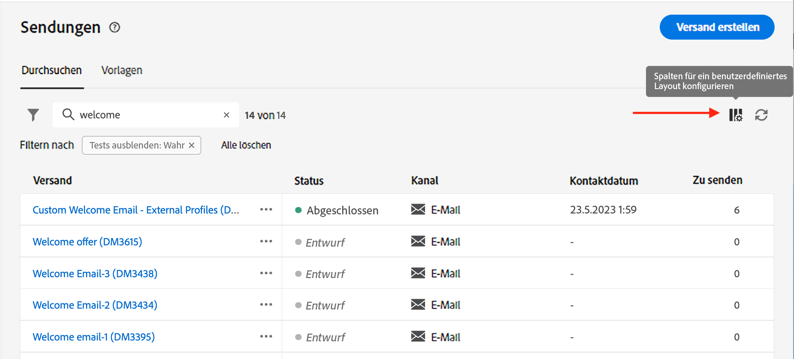
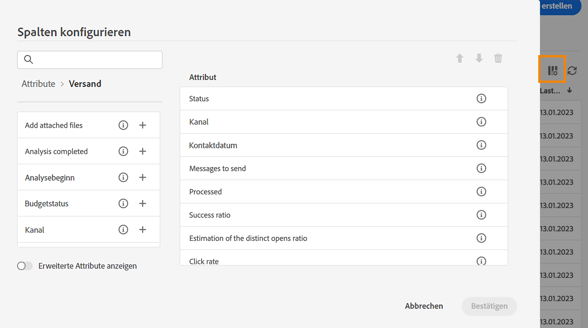
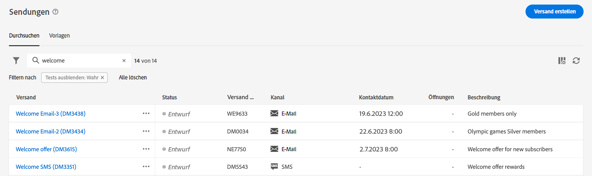
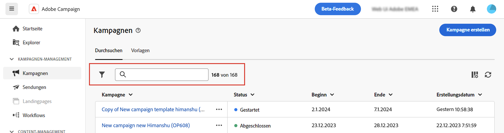
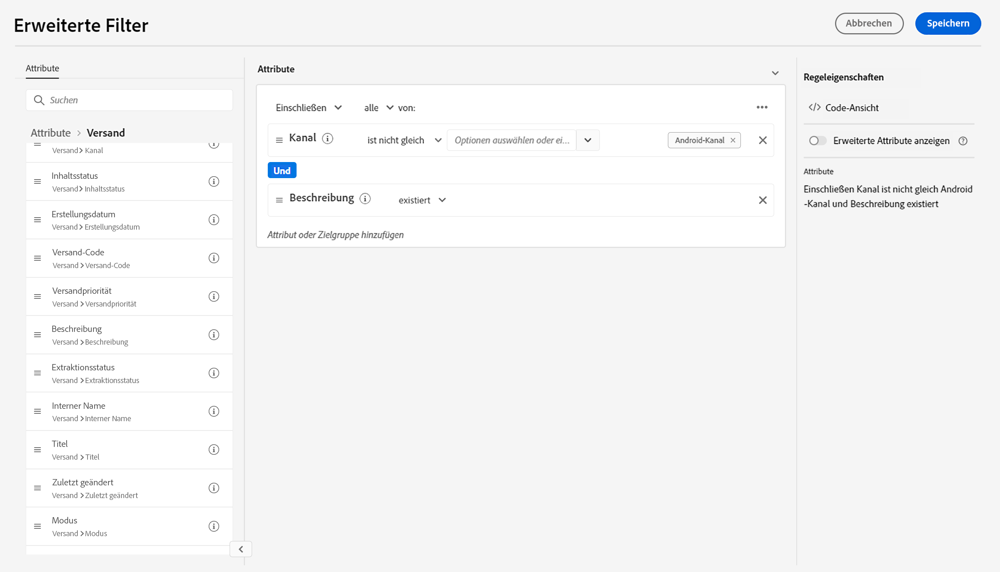

# Listen durchsuchen, durchsuchen und filtern {#list-screens}

Die meisten Links im linken Navigationsmenü zeigen Listen von Objekten an, z. B. die Liste der **Sendungen** oder **Kampagnen**. Einige dieser Listenbildschirme sind schreibgeschützt. Sie können die Listenanzeige anpassen und diese Listen wie unten beschrieben filtern.

Um einen Filter zu entfernen, klicken Sie auf das **Alle löschen** Schaltfläche.

## Anpassen von Listenbildschirmen {#custom-lists}

Listen werden in Spalten angezeigt. Sie können auch zusätzliche Informationen anzeigen, indem Sie die Spaltenkonfiguration ändern. Klicken Sie dazu auf die Schaltfläche **Spalte für ein benutzerdefiniertes Layout konfigurieren** in der oberen rechten Ecke der Liste.

{width="70%" align="left" zoomable="yes"}

Im **Spalten konfigurieren** -Bildschirm anzeigen, Spalten hinzufügen oder entfernen und die Reihenfolge ändern, in der sie angezeigt werden.

Für diese Einstellungen beispielsweise:

{width="70%" align="left" zoomable="yes"}

Die Liste enthält die folgenden Spalten:

{width="70%" align="left" zoomable="yes"}

Verwenden Sie die **Erweiterte Attribute anzeigen** umschalten, um alle Attribute für die aktuelle Liste anzuzeigen. [Weitere Informationen](#adv-attributes)

## Daten sortieren {#sort-lists}

Sie können Elemente in der Liste auch sortieren, indem Sie auf eine beliebige Spaltenüberschrift klicken. Ein Aufwärts- oder Abwärtspfeil zeigt an, dass die Liste in dieser Spalte sortiert ist.

Bei numerischen Spalten oder Datumsspalten wird die **up** Der Pfeil zeigt an, dass die Liste in aufsteigender Reihenfolge sortiert wird, während die Variable **Nach** Der Pfeil zeigt eine absteigende Reihenfolge an. Bei Zeichenfolge- oder alphanumerischen Spalten werden die Werte in alphabetischer Reihenfolge aufgeführt.

## Integrierte Filter {#list-built-in-filters}

Um Elemente schneller zu finden, können Sie die Suchleiste verwenden oder die Liste nach Kontextkriterien filtern.

{width="70%" align="left" zoomable="yes"}

Sie können beispielsweise Sendungen nach Status, Kanal, Kontaktdatum oder Ordner filtern. Sie können auch Tests ausblenden.

## Benutzerdefinierte Filter{#list-custom-filters}

Um benutzerdefinierte Datenfilter zu erstellen, navigieren Sie zum unteren Rand der Filter und klicken Sie auf die Schaltfläche **Regeln hinzufügen** Schaltfläche.

Ziehen Sie Attribute per Drag-and-Drop, um Ihre Filterkriterien in der **Erweiterte Filter** angezeigt.

{width="70%" align="left" zoomable="yes"}

Verwenden Sie die **Erweiterte Attribute anzeigen** umschalten, um alle Attribute für die aktuelle Liste anzuzeigen. [Weitere Informationen](#adv-attributes)

## Erweiterte Attribute verwenden {#adv-attributes}

>[!CONTEXTUALHELP]
>id="acw_attributepicker_advancedfields"
>title="Erweiterte Attribute anzeigen"
>abstract="In der Attributliste werden standardmäßig nur die häufigsten Attribute angezeigt. Verwenden Sie diesen Umschalter, um einen Filter mit erweiterten Attributen zu erstellen."

Standardmäßig werden in den Konfigurationsbildschirmen der Attributliste und der Filter nur die häufigsten Attribute angezeigt. Attribute, die als `advanced` -Attribute im Datenschema sind in den Konfigurationsbildschirmen ausgeblendet.

Aktivieren Sie die **Erweiterte Attribute anzeigen** umschalten, um alle verfügbaren Attribute für die aktuelle Liste anzuzeigen: die Attributliste sofort aktualisiert wird.
