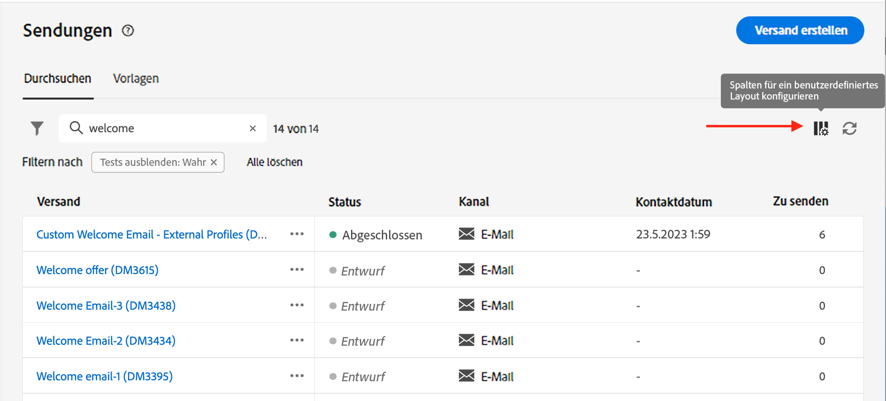
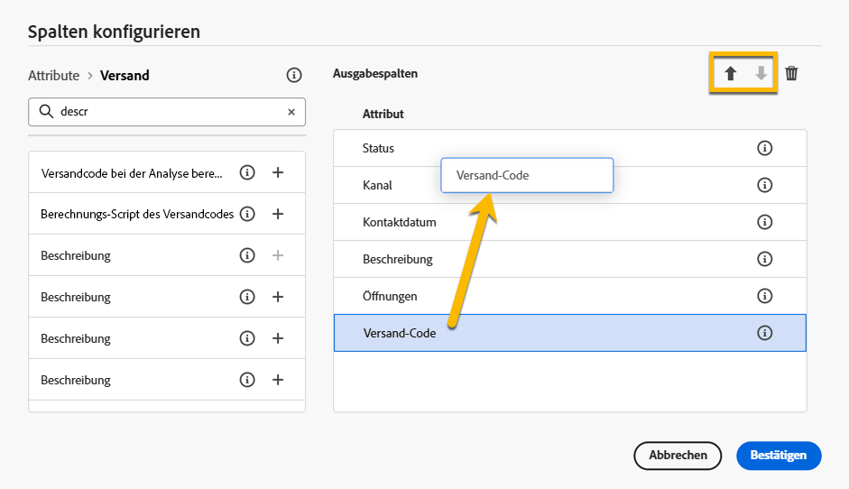
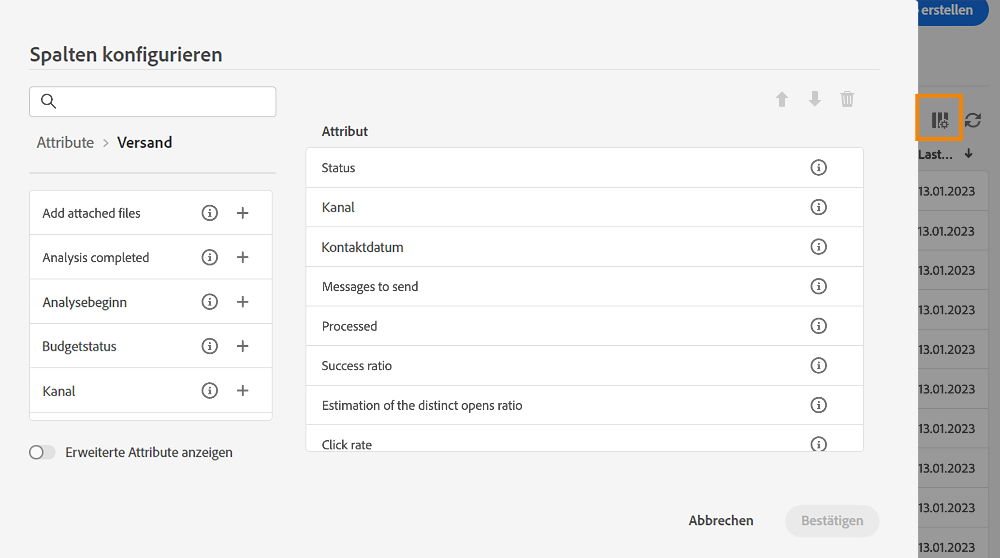
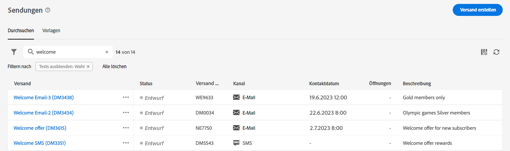
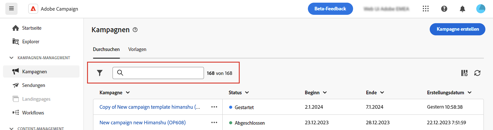

# Durchsuchen und Filtern von Listen {#list-screens}

Die meisten Links aus dem linken Navigationsmenü zeigen Listen von Objekten an, wie z. B. die Liste der **Sendungen** oder **Kampagnen**. Einige dieser Listenbildschirme sind schreibgeschützt. Sie können die Listenanzeige anpassen, diese Listen filtern und Listendaten wie unten beschrieben als CSV-Dateien exportieren.

## Anpassen von Listenbildschirmen {#custom-lists}

Listen werden in Spalten angezeigt. Sie können auch zusätzliche Informationen anzeigen, indem Sie die Spaltenkonfiguration ändern. Klicken Sie dazu auf das Symbol **Spalte für ein benutzerdefiniertes Layout konfigurieren** in der oberen rechten Ecke der Liste.

{zoomable="yes"}{width="70%"}

Im Bildschirm **Spalten konfigurieren** können Sie Spalten hinzufügen oder entfernen und die Reihenfolge ändern, in der sie angezeigt werden.

Sie können die Reihenfolge Ihrer Liste entweder durch **Ziehen und Ablegen** oder durch Verwendung der **Nach-oben- und Nach-unten-Taste** ändern.

{zoomable="yes"}{width="70%"}

Für diese Einstellungen:

{zoomable="yes"}{width="70%" zoomable="yes"}

enthält die Liste beispielsweise die folgenden Spalten:

{zoomable="yes"}{width="70%"}

## Sortieren der Daten {#sort-lists}

Sie können Elemente in der Liste sortieren, indem Sie auf eine beliebige Spaltenüberschrift klicken. Ein Aufwärts- oder Abwärtspfeil zeigt an, dass die Liste anhand dieser Spalte sortiert ist.

Bei numerischen Spalten oder Datumsspalten bedeutet der **Aufwärtspfeil**, dass die Liste in aufsteigender Reihenfolge sortiert ist, während ein **Abwärtspfeil** eine absteigende Reihenfolge kennzeichnet. Bei Zeichenfolge- oder alphanumerischen Spalten werden die Werte in alphabetischer Reihenfolge aufgeführt.

## Filter {#list-built-in-filters}

Um Elemente schneller zu finden, können Sie die Suchleiste verwenden oder die Liste nach Kontextkriterien filtern.

{zoomable="yes"}{width="70%"}

Detaillierte Informationen zur Verwendung von Filtern und zur Erstellung eigener benutzerdefinierter Filter finden Sie in [diesem Abschnitt](../query/filter.md).

## Exportieren von Listendaten {#export-list}

Sie können Daten aus jedem Listenbildschirm einschließlich der Trackinglogs exportieren. Gehen Sie wie folgt vor, um eine Liste zu exportieren:

1. Öffnen Sie die zu exportierende Liste.
1. Passen Sie die angezeigten Spalten an und wenden Sie die gewünschte Suche oder die gewünschten Filter an. Der Export berücksichtigt die auf dem Bildschirm angezeigten Spalten sowie alle aktiven Suchen oder Filter.
1. Scrollen Sie nach unten, um bei Bedarf weitere Zeilen anzuzeigen. Es werden nur die Zeilen exportiert, die aktuell in der Liste geladen sind.
1. Klicken Sie auf die Schaltfläche **Geladene Zeilen als CSV exportieren** über der Liste. Die Datei wird im Standardordner für Downloads Ihres Browsers gespeichert.

{zoomable="yes"}

<!--
## Use advanced attributes {#adv-attributes}

>[!CONTEXTUALHELP]
>id="acw_attributepicker_advancedfields"
>title="Display advanced attributes"
>abstract="Only the most common attributes are displayed by default in the attribute list. Activate the **Display advanced attributes** toggle to see all available attributes for the current list in the left palette of the rule builder, such as nodes, groupings, 1-1 links, 1-N links."

>[!CONTEXTUALHELP]
>id="acw_rulebuilder_advancedfields"
>title="Rule builder advanced fields"
>abstract="Only the most common attributes are displayed by default in the attribute list. Activate the **Display advanced attributes** toggle to see all available attributes for the current list in the left palette of the rule builder, such as nodes, groupings, 1-1 links, 1-N links."

>[!CONTEXTUALHELP]
>id="acw_rulebuilder_properties_advanced"
>title="Rule builder advanced attributes"
>abstract="Only the most common attributes are displayed by default in the attribute list. Activate the **Display advanced attributes** toggle to see all available attributes for the current list in the left palette of the rule builder, such as nodes, groupings, 1-1 links, 1-N links."

Only the most common attributes are displayed by default in the attribute list and filter configuration screens. Attributes set as `advanced` attributes in the data schema are hidden from the configuration screens.

Activate the **Display advanced attributes** toggle to see all available attributes for the current list in the left palette of the rule builder, such as nodes, groupings, 1-1 links, 1-N links. The attribute list updates instantly.

[The screenshot shows the Display advanced attributes toggle used to reveal hidden attributes in the rule builder palette.](assets/adv-toggle.png){zoomable="yes"}{width="70%" zoomable="yes"}
-->