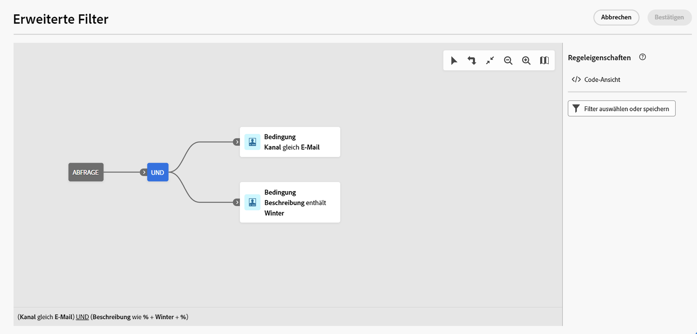

# Durchsuchen, Suchen und Filtern von Listen {#list-screens}

Die meisten Links aus dem linken Navigationsmenü zeigen Listen von Objekten an, wie zum Beispiel die Liste der **Sendungen** oder **Kampagnen**. Einige dieser Listenbildschirme sind schreibgeschützt. Sie können die Listenanzeige anpassen und diese Listen wie unten beschrieben filtern.

Um einen Filter zu entfernen, klicken Sie auf die Schaltfläche **Alle löschen**.

## Anpassen von Listenbildschirmen {#custom-lists}

Die Listen werden in Spalten angezeigt. Sie können auch zusätzliche Informationen anzeigen, indem Sie die Spaltenkonfiguration ändern. Klicken Sie dazu auf das Symbol **Spalte für ein benutzerdefiniertes Layout konfigurieren** in der oberen rechten Ecke der Liste.

{width="70%" align="left" zoomable="yes"}

Im Bildschirm **Spalten konfigurieren** können Sie Spalten hinzufügen oder entfernen und die Reihenfolge ändern, in der sie angezeigt werden.

Für diese Einstellungen:

{width="70%" align="left" zoomable="yes"}

enthält die Liste beispielsweise die folgenden Spalten:

{width="70%" align="left" zoomable="yes"}

## Sortieren der Daten {#sort-lists}

Sie können zudem auch Elemente in der Liste sortieren, indem Sie auf eine beliebige Spaltenüberschrift klicken. Ein Aufwärts- oder Abwärtspfeil zeigt an, dass die Liste in dieser Spalte sortiert ist.

Bei numerischen Spalten oder Datumsspalten bedeutet der **Aufwärtspfeil**, dass die Liste in aufsteigender Reihenfolge sortiert ist, während ein **Abwärtspfeil** eine absteigende Reihenfolge kennzeichnet. Bei Zeichenfolge- oder alphanumerischen Spalten werden die Werte in alphabetischer Reihenfolge aufgeführt.

## Integrierte Filter {#list-built-in-filters}

Um Elemente schneller zu finden, können Sie die Suchleiste verwenden oder die Liste nach kontextuellen Kriterien filtern.

{width="70%" align="left" zoomable="yes"}

Sie können beispielsweise Sendungen nach Status, Kanal, Kontaktdatum oder Ordner filtern. Sie können auch Tests ausblenden.

## Benutzerdefinierte Filter{#list-custom-filters}

Um benutzerdefinierte Datenfilter zu erstellen, navigieren Sie zum unteren Rand der Filter und klicken Sie auf die Schaltfläche **Regeln hinzufügen**, um auf den Regel-Builder zuzugreifen.

Definieren und kombinieren Sie Ihre Filterkriterien im **Erweiterte Filter** angezeigt.

{width="70%" align="left" zoomable="yes"}

Benutzerdefinierte Filter werden mit dem Campaign-Abfragemodell entwickelt. Ausführliche Informationen zur Verwendung finden Sie unter [diesem Abschnitt](../query/query-modeler-overview.md).

<!--
## Use advanced attributes {#adv-attributes}

>[!CONTEXTUALHELP]
>id="acw_attributepicker_advancedfields"
>title="Display advanced attributes"
>abstract="Only the most common attributes are displayed by default in the attribute list. Activate the **Display advanced attributes** toggle to see all available attributes for the current list in the left palette of the rule builder, such as nodes, groupings, 1-1 links, 1-N links."

>[!CONTEXTUALHELP]
>id="acw_rulebuilder_advancedfields"
>title="Rule builder advanced fields"
>abstract="Only the most common attributes are displayed by default in the attribute list. Activate the **Display advanced attributes** toggle to see all available attributes for the current list in the left palette of the rule builder, such as nodes, groupings, 1-1 links, 1-N links."

>[!CONTEXTUALHELP]
>id="acw_rulebuilder_properties_advanced"
>title="Rule builder advanced attributes"
>abstract="Only the most common attributes are displayed by default in the attribute list. Activate the **Display advanced attributes** toggle to see all available attributes for the current list in the left palette of the rule builder, such as nodes, groupings, 1-1 links, 1-N links."

Only most common attributes are displayed by default in the attribute list and filter configuration screens. Attributes which were set as `advanced` attributes in the data schema are hidden from the configuration screens. 

Activate the **Display advanced attributes** toggle to see all available attributes for the current list in the left palette of the rule builder, such as nodes, groupings, 1-1 links, 1-N links. The attribute list is updated instantly.

{width="70%" align="left" zoomable="yes"}
-->