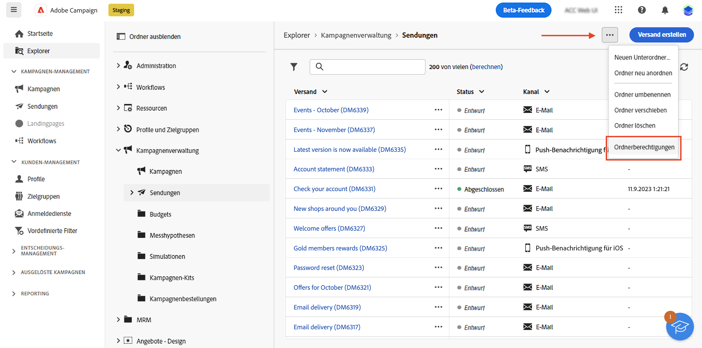
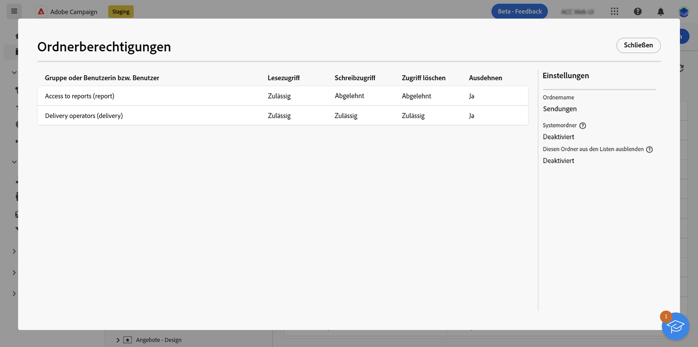
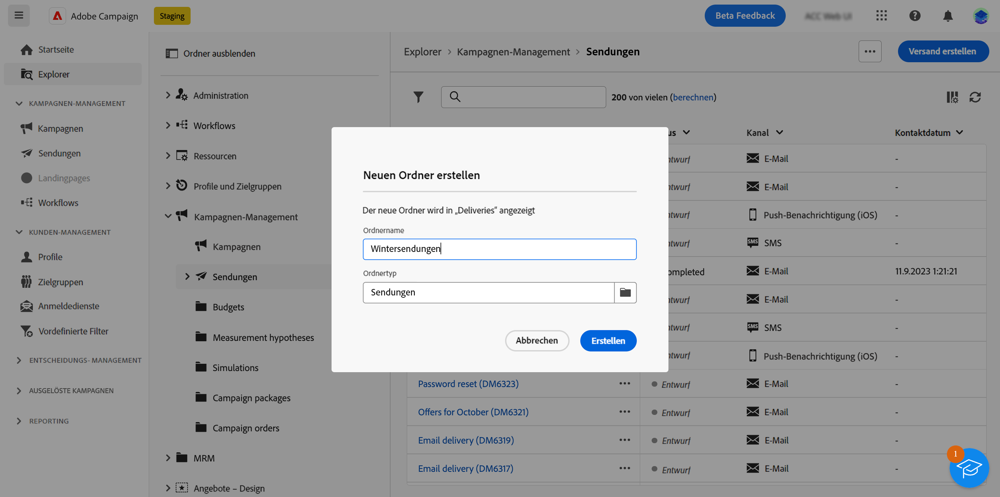
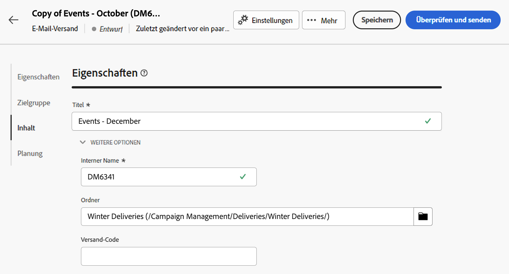

# Zugriff und Berechtigungen {#access-and-permissions}

>[!CONTEXTUALHELP]
>id="acw_explorer_permissions_create"
>title="Berechtigung erforderlich"
>abstract="Ihre Admins müssen Ihnen die Berechtigung erteilen, bevor Sie ein Segment erstellen können."

>[!CONTEXTUALHELP]
>id="acw_audiences_read_only"
>title="Diese Zielgruppe ist schreibgeschützt"
>abstract="Sie haben keine Berechtigungen, diese Zielgruppe zu bearbeiten. Bei Bedarf Admin kontaktieren, um Zugriff zu erhalten."

>[!CONTEXTUALHELP]
>id="acw_subscription_services_read_only"
>title="Dieser Service ist schreibgeschützt"
>abstract="Keine Berechtigung, diesen Service zu bearbeiten. Bei Bedarf Admin kontaktieren, um Zugriff zu erhalten."

>[!CONTEXTUALHELP]
>id="acw_recipients_readonlyprofile"
>title="Empfangende – Schreibgeschütztes Profil"
>abstract="Keine Berechtigung, dieses Profil zu bearbeiten. Bei Bedarf Admin kontaktieren, um Zugriff zu erhalten."

>[!CONTEXTUALHELP]
>id="acw_campaign_read_only"
>title="Diese Kampagne ist schreibgeschützt"
>abstract="Keine Berechtigung, diese Kampagne zu bearbeiten. Bei Bedarf Admin kontaktieren, um Zugriff zu erhalten."

>[!CONTEXTUALHELP]
>id="acw_deliveries_read_only"
>title="Dieser Versand ist schreibgeschützt"
>abstract="Keine Berechtigung, diesen Versand zu bearbeiten. Bei Bedarf Admin kontaktieren, um Zugriff zu erhalten."

>[!CONTEXTUALHELP]
>id="acw_wf_read_only"
>title="Dieser Workflow ist schreibgeschützt"
>abstract="Keine Berechtigung, diesen Workflow zu bearbeiten. Bei Bedarf Admin kontaktieren, um Zugriff zu erhalten."

>[!CONTEXTUALHELP]
>id="acw_wf_read_only_canvas"
>title="Dieser Workflow ist schreibgeschützt"
>abstract="Dieser Workflow kann aufgrund einer nicht unterstützten oder nicht kompatiblen Arbeitsfläche nicht bearbeitet werden."

Die Zugriffskontrolle kann den Zugriff auf Objekte und Daten aus Hauptlisten, wie Sendungen, Empfängerinnen bzw. Empfänger oder Workflows, einschränken. Diese Einschränkungen gelten auch für die **Navigationsstruktur** des Explorers. Darüber hinaus benötigen Sie Berechtigungen zum Erstellen, Löschen, Duplizieren und Bearbeiten von Objekten über die Benutzeroberfläche.

Die Zugriffskontrolle wird in der Client-Konsole von Campaign verwaltet. Alle Berechtigungen in Campaign Web werden mit den Berechtigungen der Campaign-Client-Konsole synchronisiert. Nur Campaign-Admins können Benutzerberechtigungen definieren und ändern. Weitere Informationen zu Benutzerberechtigungen finden Sie in der [Dokumentation zu Campaign v8 (Client-Konsole)](https://experienceleague.adobe.com/docs/campaign/campaign-v8/admin/permissions/gs-permissions.html?lang=de){target="_blank"}.

Wenn Sie die Benutzeroberfläche von Campaign Web durchsuchen, können Sie abhängig von Ihren Berechtigungen auf Daten, Objekte und Funktionen zugreifen. Wenn Sie beispielsweise keine Zugriffsberechtigungen für einen Ordner haben, können Sie ihn nicht sehen. Ihre Berechtigungen wirken sich auch auf die Objekte- und Datenverwaltung aus. Ohne Schreibberechtigungen für einen bestimmten Ordner können Sie einen Versand nicht in diesem Ordner erstellen, selbst wenn er in der Benutzeroberfläche angezeigt wird.

## Anzeigen von Berechtigungen {#view-permissions}

Im **Explorer** können Sie die Berechtigungen für die einzelnen Ordner durchsuchen. Diese Berechtigungen werden in der Client-Konsole festgelegt und zum Organisieren und Steuern des Zugriffs auf Campaign-Daten verwendet.

Gehen Sie wie folgt vor, um Berechtigungen für einen Ordner anzuzeigen:

1. Wählen Sie im linken Navigationsmenü des **Explorers** einen Ordner aus.
1. Klicken Sie auf die drei Punkte oben rechts und wählen Sie **Ordnerberechtigungen** aus.

   {zoomable=&quot;yes&quot;}{width="70%" align="left" zoomable="yes"}

1. Überprüfen Sie die Details im Bildschirm, wie im Folgenden gezeigt:

   {zoomable=&quot;yes&quot;}{width="70%" align="left" zoomable="yes"}

   Eine Gruppe oder eine Benutzerin bzw. ein Benutzer kann Lese-, Schreib- und/oder Löschberechtigungen für Daten erhalten, die im ausgewählten Ordner gespeichert sind.

   Wenn die Variable **Ausdehnen** aktiviert ist, werden alle für einen Ordner definierten Berechtigungen auf alle zugehörigen Unterordner angewendet. Diese Berechtigungen können für jeden Unterordner überschrieben werden.

   Wenn die Option **Systemordner** aktiviert ist, haben alle Benutzenden Zugriff, unabhängig von ihren Berechtigungen.

Weitere Informationen zu Benutzerberechtigungen finden Sie in der [Dokumentation zu Campaign v8 (Client-Konsole)](https://experienceleague.adobe.com/docs/campaign/campaign-v8/admin/permissions/folder-permissions.html?lang=de){target="_blank"}.

## Arbeiten mit Ordnern {#folders}

Sie können Ordner erstellen, umbenennen, neu anordnen und verschieben, um Ihre Komponenten und Daten zu organisieren. Über das gleiche Menü können Sie auch Ordner löschen.

>[!CAUTION]
>
>Beim Löschen eines Ordners werden auch alle im Ordner gespeicherten Daten gelöscht.

Gehen Sie wie folgt vor, um einen Ordner zu erstellen:

1. Wählen Sie im linken Navigationsmenü des **Explorers** einen Ordner aus.
1. Klicken Sie auf die drei Punkte oben rechts und wählen Sie **Neuen Unterordner erstellen** aus.
1. Geben Sie den Namen des Ordners ein und speichern Sie ihn.

   {zoomable=&quot;yes&quot;}{width="70%" align="left" zoomable="yes"}

   Der Ordner wird als Unterordner des aktuellen Ordners hinzugefügt. Navigieren Sie zu diesem neuen Ordner, um Komponenten direkt darin zu erstellen. Sie können auch eine Komponente aus einem Ordner erstellen und sie in dem neuen Ordner speichern, und zwar über den Abschnitt **Zusätzliche Optionen** der Eigenschaften, wie unten für einen Versand dargestellt:

   {zoomable=&quot;yes&quot;}{width="70%" align="left" zoomable="yes"}
