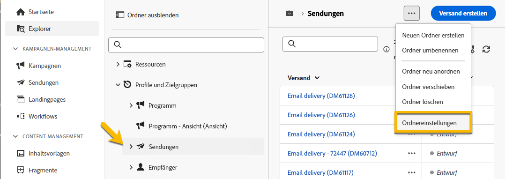
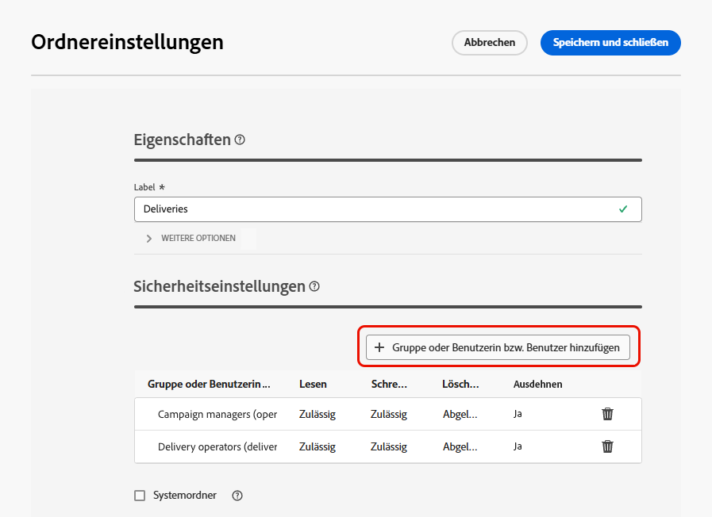
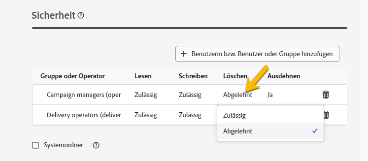

<?xml version="1.0" encoding="UTF-8"?>
<xliff xmlns="urn:oasis:names:tc:xliff:document:1.2" xmlns:okp="okapi-framework:xliff-extensions" xmlns:its="http://www.w3.org/2005/11/its" xmlns:itsxlf="http://www.w3.org/ns/its-xliff/" version="1.2" its:version="2.0">
<file original="help/v8/get-started/permissions.md.mdsc" source-language="en-US" target-language="en-XX" datatype="x-text/markdown">
<body>
<trans-unit id="tu10" xml:space="preserve">
<source xml:lang="en-US">https://experienceleague.adobe.com/de/docs/campaign/campaign-v8/admin/permissions/gs-permissions</source>
<target xml:lang="en-XX">https://experienceleague.adobe.com/de/docs/campaign/campaign-v8/admin/permissions/gs-permissions</target>
</trans-unit>
<trans-unit id="tu26" xml:space="preserve">
<source xml:lang="en-US">https://experienceleague.adobe.com/docs/campaign/campaign-v8/permissions/manage-permissions.html?lang=de#use-named-rights</source>
<target xml:lang="en-XX">https://experienceleague.adobe.com/de/docs/campaign/campaign-v8/permissions/manage-permissions#use-named-rights</target>
</trans-unit>
<trans-unit id="tu1" restype="x-YAML_METADATA_HEADER_VALUE" xml:space="preserve">
<source xml:lang="en-US">Permission management in Campaign Web user interface</source>
<target xml:lang="en-XX">Berechtigungsverwaltung in der Campaign Web-Benutzeroberfläche</target>
</trans-unit>
<trans-unit id="tu2" restype="x-YAML_METADATA_HEADER_VALUE" xml:space="preserve">
<source xml:lang="en-US">Learn more about permissions in Campaign Web user interface</source>
<target xml:lang="en-XX">Erfahren Sie mehr über Berechtigungen in der Campaign Web-Benutzeroberfläche</target>
</trans-unit>
<trans-unit id="tu3" xml:space="preserve">
<source xml:lang="en-US">Permissions</source>
<target xml:lang="en-XX">Berechtigungen</target>
</trans-unit>
<trans-unit id="tu4" xml:space="preserve">
<source xml:lang="en-US">Each user in Adobe Campaign has specific permissions and restrictions in the application. The user can belong to an operators group and inherit the group's permissions.</source>
<target xml:lang="en-XX">Jede Benutzerin und jeder Benutzer in Adobe Campaign hat spezifische Berechtigungen und Einschränkungen in der Anwendung. Benutzerinnen und Benutzer können zu einer Benutzergruppe gehören und die Berechtigungen der Gruppe erben.</target>
</trans-unit>
<trans-unit id="tu5" xml:space="preserve">
<source xml:lang="en-US">Based on their permissions, an operator can:</source>
<target xml:lang="en-XX">Benutzerinnen und Benutzer haben je nach Berechtigung:</target>
</trans-unit>
<trans-unit id="tu6" xml:space="preserve">
<source xml:lang="en-US">Access certain capabilities</source>
<target xml:lang="en-XX">Zugriff auf bestimmte Fähigkeiten</target>
</trans-unit>
<trans-unit id="tu7" xml:space="preserve">
<source xml:lang="en-US">Access certain data</source>
<target xml:lang="en-XX">Zugriff auf bestimmte Daten</target>
</trans-unit>
<trans-unit id="tu8" xml:space="preserve">
<source xml:lang="en-US">Access certain actions (create, modify, delete)</source>
<target xml:lang="en-XX">Zugriff auf bestimmte Aktionen (Erstellen, Ändern, Löschen)</target>
</trans-unit>
<trans-unit id="tu9" xml:space="preserve">
<source xml:lang="en-US">A detailed procedure for setting up permissions in Adobe Campaign is available in <ph id="1" ctype="x-LINK">&lbrack;</ph>Adobe Campaign v8 (console) documentation<ph id="2" ctype="x-LINK">[#$tu10]{target="_blank"}</ph>.</source>
<target xml:lang="en-XX">Detaillierte Anweisungen zum Festlegen von Berechtigungen in Adobe Campaign sind in der <ph id="1" ctype="x-LINK">&lbrack;</ph>Dokumentation zu Adobe Campaign v8 (Konsole)<ph id="2" ctype="x-LINK">[#$tu10]{target="_blank"}</ph> verfügbar.</target>
</trans-unit>
<trans-unit id="tu11" xml:space="preserve">
<source xml:lang="en-US">Permissions on folders</source>
<target xml:lang="en-XX">Berechtigungen für Ordner</target>
</trans-unit>
<trans-unit id="tu12" xml:space="preserve">
<source xml:lang="en-US">Based on your rights, you can view and manage permissions on folders in the <ph id="1" ctype="x-STRONG_EMPHASIS">**[!UICONTROL </ph>Folder settings<ph id="3" ctype="x-LINK_REF">]**</ph>.</source>
<target xml:lang="en-XX">Basierend auf Ihren Berechtigungen können Sie die Berechtigungen für Ordner in den <ph id="1" ctype="x-STRONG_EMPHASIS">**[!UICONTROL </ph>Ordnereinstellungen<ph id="3" ctype="x-LINK_REF">]**</ph> anzeigen und verwalten.</target>
</trans-unit>
<trans-unit id="tu13" xml:space="preserve">
<source xml:lang="en-US">Below is an example of a delivery folder:</source>
<target xml:lang="en-XX">Hier ist ein Beispiel für einen Versandordner:</target>
</trans-unit>
<trans-unit id="tu14" xml:space="preserve">
<source xml:lang="en-US"><ph id="1" ctype="x-IMAGE">{zoomable="yes"}</ph></source>
<target xml:lang="en-XX"><ph id="1" ctype="x-IMAGE">{zoomable="yes"}</ph></target>
</trans-unit>
<trans-unit id="tu15" xml:space="preserve">
<source xml:lang="en-US">In the <ph id="1" ctype="x-STRONG_EMPHASIS">**[!UICONTROL </ph>Security<ph id="3" ctype="x-LINK_REF">]**</ph> section of the <ph id="5" ctype="x-STRONG_EMPHASIS">**[!UICONTROL </ph>Folder settings<ph id="7" ctype="x-LINK_REF">]**</ph>, you can view and manage (add or delete) operators or groups who can access the folder.</source>
<target xml:lang="en-XX">Unter <ph id="5" ctype="x-STRONG_EMPHASIS">**[!UICONTROL </ph>Ordnereinstellungen<ph id="7" ctype="x-LINK_REF">]**</ph> können Sie im Abschnitt <ph id="1" ctype="x-STRONG_EMPHASIS">**[!UICONTROL </ph>Sicherheit<ph id="3" ctype="x-LINK_REF">]**</ph> Benutzende oder Gruppen, die Zugriff auf den Ordner haben, anzeigen und verwalten (hinzufügen oder löschen).</target>
</trans-unit>
<trans-unit id="tu16" xml:space="preserve">
<source xml:lang="en-US"><ph id="1" ctype="x-IMAGE">{zoomable="yes"}</ph></source>
<target xml:lang="en-XX"><ph id="1" ctype="x-IMAGE">{zoomable="yes"}</ph></target>
</trans-unit>
<trans-unit id="tu17" xml:space="preserve">
<source xml:lang="en-US">You can directly click on the permissions and change them to either <ph id="1" ctype="x-STRONG_EMPHASIS">**[!UICONTROL </ph>Allowed<ph id="3" ctype="x-LINK_REF">]**</ph> or <ph id="5" ctype="x-STRONG_EMPHASIS">**[!UICONTROL </ph>Denied<ph id="7" ctype="x-LINK_REF">]**</ph>.</source>
<target xml:lang="en-XX">Sie können direkt auf die Berechtigungen klicken und sie entweder in <ph id="1" ctype="x-STRONG_EMPHASIS">**[!UICONTROL </ph>Zulässig<ph id="3" ctype="x-LINK_REF">]**</ph> oder <ph id="5" ctype="x-STRONG_EMPHASIS">**[!UICONTROL </ph>Abgelehnt<ph id="7" ctype="x-LINK_REF">]**</ph> ändern.</target>
</trans-unit>
<trans-unit id="tu18" xml:space="preserve">
<source xml:lang="en-US"><ph id="1" ctype="x-IMAGE">{zoomable="yes"}</ph></source>
<target xml:lang="en-XX"><ph id="1" ctype="x-IMAGE">{zoomable="yes"}</ph></target>
</trans-unit>
<trans-unit id="tu19" xml:space="preserve">
<source xml:lang="en-US"><ph id="1" ctype="x-regxph" equiv-text="&lbrack;!NOTE">[!NOTE]</ph></source>
<target xml:lang="en-XX"><ph id="1" ctype="x-regxph" equiv-text="&lbrack;!NOTE">[!NOTE]</ph></target>
</trans-unit>
<trans-unit id="tu20" xml:space="preserve">
<source xml:lang="en-US">You should not be able to create an object for which you do not have at least one folder with writing rights.</source>
<target xml:lang="en-XX">Sie sollten kein Objekt erstellen können, für das Sie nicht über mindestens einen Ordner mit Schreibrechten verfügen.</target>
</trans-unit>
<trans-unit id="tu21" xml:space="preserve">
<source xml:lang="en-US">You do not need to be an admin to create fragments, but you must have writing rights on at least one "Content visual fragment" folder. Otherwise, you won't be able to create a visual fragment.</source>
<target xml:lang="en-XX">Sie müssen nicht Teil des Admin-Teams sein, um Fragmente zu erstellen, benötigen aber Schreibrechte für mindestens einen Ordner „Inhalt – Visuelle Fragmente“. Andernfalls können Sie kein visuelles Fragment erstellen.</target>
</trans-unit>
<trans-unit id="tu22" xml:space="preserve">
<source xml:lang="en-US">If the <ph id="1" ctype="x-STRONG_EMPHASIS">**[!UICONTROL </ph>Propagate<ph id="3" ctype="x-LINK_REF">]**</ph> option is enabled, all permissions defined for a folder apply to all its sub-folders. These permissions can be overridden for each sub-folder.</source>
<target xml:lang="en-XX">Wenn die Option <ph id="1" ctype="x-STRONG_EMPHASIS">**[!UICONTROL </ph>Ausdehnen<ph id="3" ctype="x-LINK_REF">]**</ph> aktiviert ist, werden alle für einen Ordner definierten Berechtigungen auf alle zugehörigen Unterordner angewendet. Diese Berechtigungen können für jeden Unterordner überschrieben werden.</target>
</trans-unit>
<trans-unit id="tu23" xml:space="preserve">
<source xml:lang="en-US">If the <ph id="1" ctype="x-STRONG_EMPHASIS">**[!UICONTROL </ph>System folder<ph id="3" ctype="x-LINK_REF">]**</ph> option is selected, access is allowed to all operators, regardless of their permissions.</source>
<target xml:lang="en-XX">Wenn die Option <ph id="1" ctype="x-STRONG_EMPHASIS">**[!UICONTROL </ph>Systemordner<ph id="3" ctype="x-LINK_REF">]**</ph> aktiviert ist, haben alle Benutzenden unabhängig von ihren Berechtigungen Zugriff.</target>
</trans-unit>
<trans-unit id="tu24" xml:space="preserve">
<source xml:lang="en-US">See this <ph id="1" ctype="x-LINK">[</ph>section<ph id="2" ctype="x-LINK">](work-with-folders.md#folder-access-rights)</ph> to learn how these rights affect the actions available to you on a folder.</source>
<target xml:lang="en-XX">In diesem <ph id="1" ctype="x-LINK">[</ph>Abschnitt<ph id="2" ctype="x-LINK">](work-with-folders.md#folder-access-rights)</ph> erfahren Sie, wie sich diese Rechte auf die Aktionen auswirken, die Sie für einen Ordner ausführen können.</target>
</trans-unit>
<trans-unit id="tu25" xml:space="preserve">
<source xml:lang="en-US">Named rights also determine which folder actions are available to an operator. Refer to the <ph id="1" ctype="x-LINK">&lbrack;</ph>Campaign v8 documentation<ph id="2" ctype="x-LINK">[#$tu26]{target="_blank"}</ph>.</source>
<target xml:lang="en-XX">Mit spezifischen Berechtigungen wird auch festgelegt, welche Ordneraktionen einer Benutzerin bzw. einem Benutzer zur Verfügung stehen. Weitere Informationen finden Sie in der <ph id="1" ctype="x-LINK">&lbrack;</ph>Dokumentation zu Campaign v8<ph id="2" ctype="x-LINK">[#$tu26]{target="_blank"}</ph>.</target>
</trans-unit>
<trans-unit id="tu27" xml:space="preserve">
<source xml:lang="en-US">All permissions in the Campaign Web user interface synchronize with Campaign Client Console permissions.</source>
<target xml:lang="en-XX">Alle Berechtigungen in der Benutzeroberfläche von Campaign Web werden mit den Berechtigungen der Campaign-Client-Konsole synchronisiert.</target>
</trans-unit>
</body>
</file>
</xliff>