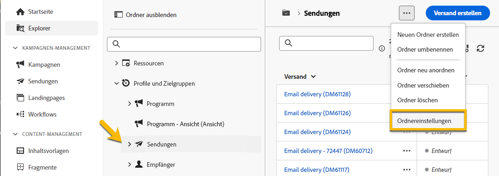

# Berechtigungen {#permissions}

Jede Benutzerin und jeder Benutzer in Adobe Campaign hat spezifische Berechtigungen und Einschränkungen in der Anwendung. Benutzerinnen und Benutzer können zu einer Benutzergruppe gehören und die Berechtigungen der Gruppe erben.

Benutzerinnen und Benutzer haben je nach Berechtigung:

* Zugriff auf bestimmte Fähigkeiten
* Zugriff auf bestimmte Daten
* Zugriff auf bestimmte Aktionen (Erstellen, Ändern, Löschen)

Detaillierte Anweisungen zum Festlegen von Berechtigungen in Adobe Campaign sind in der [Dokumentation zu Adobe Campaign v8 (Konsole)](https://experienceleague.adobe.com/de/docs/campaign/campaign-v8/admin/permissions/gs-permissions){target="_blank"} verfügbar.

## Berechtigungen für Ordner {#folder-permissions}

Basierend auf Ihren Berechtigungen können Sie die Berechtigungen für Ordner in den **[!UICONTROL Ordnereinstellungen]** anzeigen und verwalten.

Hier ist ein Beispiel für einen Versandordner:

{zoomable="yes"}

Unter **[!UICONTROL Ordnereinstellungen]** können Sie im Abschnitt **[!UICONTROL Sicherheit]** Benutzende oder Gruppen, die Zugriff auf den Ordner haben, anzeigen und verwalten (hinzufügen oder löschen).

{zoomable="yes"}

Sie können direkt auf die Berechtigungen klicken und sie entweder in **[!UICONTROL Zulässig]** oder **[!UICONTROL Abgelehnt]** ändern.

{zoomable="yes"}

Wenn die Option **[!UICONTROL Ausdehnen]** aktiviert ist, werden alle für einen Ordner definierten Berechtigungen auf alle zugehörigen Unterordner angewendet. Diese Berechtigungen können für jeden Unterordner überschrieben werden.

Wenn die Option **[!UICONTROL Systemordner]** aktiviert ist, haben alle Benutzenden unabhängig von ihren Berechtigungen Zugriff.

Sie können auch [die Berechtigungen für Ordner in der Adobe Campaign-Konsole verwalten](https://experienceleague.adobe.com/de/docs/campaign/campaign-v8/admin/permissions/folder-permissions){target="_blank"}.

Alle Berechtigungen in der Benutzeroberfläche von Campaign Web werden mit den Berechtigungen der Campaign-Client-Konsole synchronisiert.