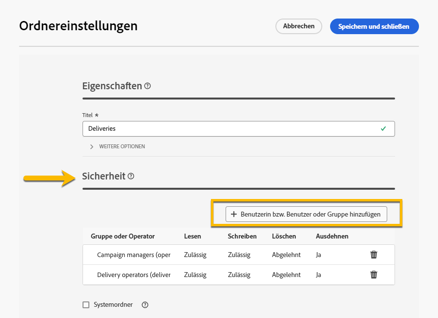

# Berechtigungen {#permissions}

Jeder Benutzer in Adobe Campaign hat seine eigenen Berechtigungen und Einschränkungen in der Anwendung.

Der Benutzer kann Teil der Benutzergruppe sein und erbt die Berechtigungen der Gruppe.

Je nach Berechtigung kann ein Benutzer:

* Zugriff auf bestimmte Fähigkeiten
* Zugriff auf bestimmte Daten
* Zugriff auf bestimmte Aktionen (Erstellen, Ändern, Löschen)

## Berechtigungen für Ordner {#folder-permissions}

Gemäß Ihren Berechtigungen können Sie die Berechtigungen für Ordner in den **[!UICONTROL Ordnereinstellungen]** anzeigen und verwalten.
Nachfolgend finden Sie ein Beispiel für einen Versandordner.

{zoomable="yes"}

Im Abschnitt **[!UICONTROL Sicherheit]** der **[!UICONTROL Ordnereinstellungen]** können Sie Benutzer oder Gruppen, die Zugriff auf den Ordner haben, anzeigen und verwalten (hinzufügen oder löschen).

{zoomable="yes"}

Sie können direkt auf die Berechtigungen klicken und sie entweder **[!UICONTROL Zulässig]** oder **[!UICONTROL Verweigert]** ändern.

{zoomable="yes"}

Wenn die Variable **[!UICONTROL Ausdehnen]** aktiviert ist, werden alle für einen Ordner definierten Berechtigungen auf alle zugehörigen Unterordner angewendet. Diese Berechtigungen können für jeden Unterordner überschrieben werden.

Wenn die Option **[!UICONTROL Systemordner]** aktiviert ist, ist der Zugriff für alle Benutzer unabhängig von ihren Berechtigungen zulässig.

Sie können auch [die Berechtigungen für Ordner in der Adobe Campaign-Konsole verwalten](https://experienceleague.adobe.com/de/docs/campaign/campaign-v8/admin/permissions/folder-permissions).
Alle Berechtigungen in der Campaign-Web-Benutzeroberfläche werden mit den Berechtigungen der Campaign Client Console synchronisiert.
