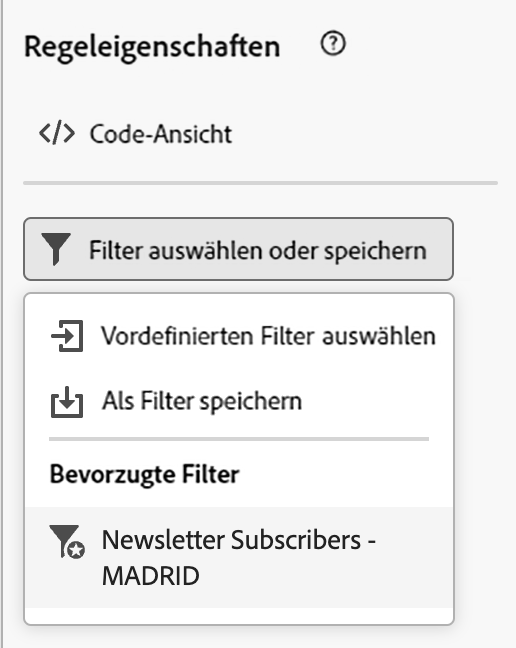
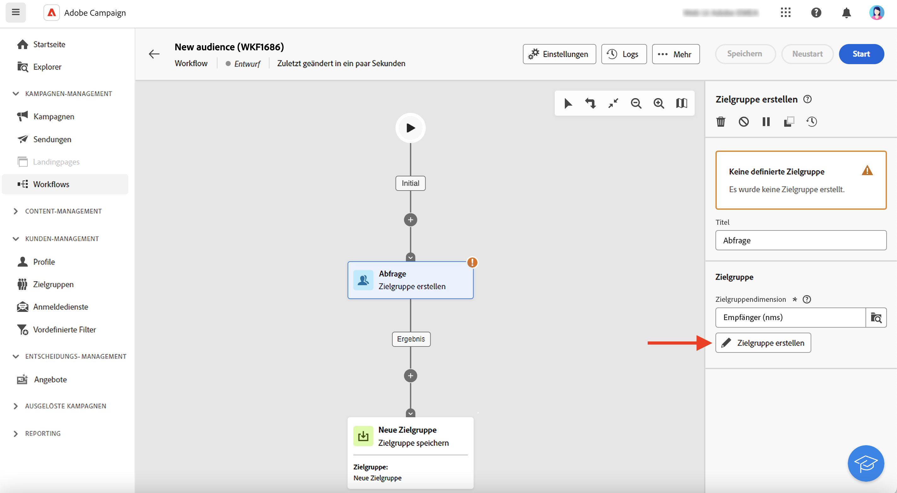

# Arbeiten mit vordefinierten Filtern {#predefined-filters}

>[!CONTEXTUALHELP]
>id="acw_homepage_card4"
>title="Verwaltung von vordefinierten Filtern"
>abstract="Campaign Web bietet jetzt eine benutzerfreundliche Oberfläche, mit der man vordefinierte Filter mühelos verwalten und an Ihre spezifischen Anforderungen anpassen kann. Filter einmal erstellen und für zukünftige Verwendungen speichern."

>[!CONTEXTUALHELP]
>id="acw_predefined-filters-dashboard"
>title="Vordefinierte Filter"
>abstract="Campaign Web bietet jetzt eine benutzerfreundliche Oberfläche, mit der man vordefinierte Filter mühelos verwalten und an Ihre spezifischen Anforderungen anpassen kann. Filter einmal erstellen und für zukünftige Verwendungen speichern."

Vordefinierte Filter sind benutzerdefinierte Filter, die für zukünftige Verwendungen erstellt und gespeichert werden. Sie können bei allen Filtervorgängen mit dem Abfragemodell als Verknüpfungen verwendet werden, z. B. beim Filtern einer Datenliste oder beim Erstellen der Zielgruppe eines Versands.

Sie können vorhandene integrierte Filter verwenden, um auf einen bestimmten Teil Ihrer Daten zuzugreifen, oder eigene vordefinierte Filter erstellen und speichern.

>[!IMPORTANT]
>
>In dieser Produktversion sind beim Erstellen von Regeln, beim Auswählen der Zielgruppe eines Versands oder beim Erstellen einer Zielgruppe in einem Workflow einige vordefinierte Filter nicht in der Benutzeroberfläche verfügbar. Sie können sie dennoch verwenden. [Weitere Informationen](guardrails.md#predefined-filters-filters-guardrails-limitations)

## Erstellen eines vordefinierten Filters {#create-predefined-filter}

>[!CONTEXTUALHELP]
>id="acw_predefined-filters-creation"
>title="Erstellen eines vordefinierten Filters"
>abstract="Geben Sie eine Kennzeichnung für den vordefinierten Filter ein und wählen Sie die Tabelle aus, auf die er angewendet werden soll. Öffnen Sie die zusätzlichen Optionen, um eine Beschreibung hinzuzufügen und diesen Filter als Favoriten festzulegen. Definieren Sie dann mithilfe der Schaltfläche „Regel erstellen“ die Filterbedingungen."

>[!CONTEXTUALHELP]
>id="acw_predefined-filters-rules"
>title="Erstellen der vordefinierten Filterregeln"
>abstract="Um die Filterbedingungen Ihres benutzerspezifischen Filters zu definieren, klicken Sie auf die Schaltfläche „Regel erstellen“."

### Erstellen eines Filters aus dem Abfragemodell {#create-from-rule-builder}

Sie können einen benutzerdefinierten Filter aus dem [Abfragemodellierung](../query/query-modeler-overview.md) , um es für die zukünftige Verwendung verfügbar zu machen. Führen Sie folgende Schritte aus:

1. Öffnen Sie das Abfragemodell und definieren Sie Ihre Filterbedingungen. Im folgenden Beispiel filtern Sie Empfänger, die in Madrid leben und einen Newsletter abonniert haben.
1. Klicken Sie auf die Schaltfläche **Filter auswählen oder speichern** und wählen Sie **Als Filter speichern**.

   

1. Wählen Sie **Neuen Filter erstellen** und geben Sie einen Namen und eine Beschreibung für diesen Filter ein.

   

   Sie können den Filter bei Bedarf als Favorit speichern. Weiterführende Informationen finden Sie in [diesem Abschnitt](#fav-filter).

1. Klicken Sie auf **Bestätigen**, um Ihre Änderungen zu speichern.

Ihr benutzerdefinierter Filter ist jetzt in der Liste der **vordefinierten Filter** verfügbar und für alle Campaign-Benutzenden zugänglich.

### Erstellen eines Filters in der Filterliste {#create-filter-from-list}

Sie können einen Filter im Eintrag **Vordefinierte Filter** im linken Menü erstellen. Gehen Sie dazu wie folgt vor:

1. Navigieren Sie zum Eintrag **Vordefinierte Filter** im linken Menü.
1. Klicken Sie auf die Schaltfläche **Erstellen**.
1. Geben Sie den Namen des Filters ein und wählen Sie im Feld **Dokumenttyp** das Schema aus, auf das er angewendet wird. Das Standardschema lautet `Recipients(nms)`.

1. Definieren Sie die Regel für den Filter. Zum Beispiel Profile, die älter als 30 sind.

   

1. Speichern Sie Ihre Änderungen.

   

Der Filter wird der vordefinierten Filterliste hinzugefügt. Sie können den Filter bei Bedarf als Favorit speichern. Weiterführende Informationen finden Sie in [diesem Abschnitt](#fav-filter).

## Speichern des Filters als Favorit {#fav-filter}

Bei der Erstellung eines vordefinierten Filters können Sie die Option **Als Favorit speichern** aktivieren, wenn Sie diesen vordefinierten Filter in Ihren Favoriten sehen möchten.

Wenn ein Filter als Favorit gespeichert wird, steht er allen Benutzenden im Abschnitt **Favoritenfilter** der Filtererstellungsliste zur Verfügung, wie unten dargestellt:

{width="30%" align="left"}

## Verwenden eines vordefinierten Filters {#use-predefined-filter}

Vordefinierte Filter sind beim Definieren von Regeleigenschaften verfügbar. Um auf vordefinierte Filter zuzugreifen, wählen Sie die Option **Benutzerspezifischen Filter auswählen** in der Dropdown-Liste des Regel-Builders.

Sie können dann auf die vollständige Liste der für den aktuellen Kontext verfügbaren vordefinierten Filter zugreifen.

Sie können auch die Filterabkürzungen im Abschnitt **Favoritenfilter** des Dropdown-Menüs verwenden. Weitere Informationen zu Favoriten finden Sie in [diesem Abschnitt](#fav-filter).

Gehen Sie wie folgt vor, um beispielsweise eine Zielgruppe aus einem vordefinierten Filter zu erstellen:

1. Navigieren Sie zum Eintrag **Zielgruppen** im linken Menü.
1. Klicken Sie auf die Schaltfläche **Zielgruppe erstellen**.
1. Geben Sie den Namen der Zielgruppe ein und klicken Sie auf die Schaltfläche **Zielgruppe erstellen**.
1. Wählen Sie die **Abfrage**-Aktivität und klicken Sie im rechten Fenster auf die Schaltfläche **Zielgruppe erstellen**.

   

1. Wählen Sie aus der **Schaltfläche zum Auswählen oder Speichern von Filtern** die Option **Benutzerdefinierten Filter auswählen**.

   

1. Navigieren Sie zum vordefinierten Filter, der zum Erstellen der Zielgruppe verwendet werden soll, wählen Sie ihn aus und bestätigen Sie die Wahl.

   

1. Überprüfen Sie die Regeleigenschaften für diesen Filter und bestätigen Sie sie.

   Der Filter wird jetzt als Abfrage in der **Abfrage**-Aktivität genutzt.

   

1. Speichern Sie Ihre Änderungen und klicken Sie auf die Schaltfläche **Starten**, um die Zielgruppe zu erstellen und in der Zielgruppenliste verfügbar zu machen.

## Verwalten Ihrer vordefinierten Filter {#manage-predefined-filter}

Die vordefinierten Filter werden alle im dedizierten Eintrag des linken Navigationsmenüs gruppiert.

Von dieser Liste ausgehend können Sie einen neuen Filter erstellen, wie oben beschrieben, und:

* einen vorhandenen Filter bearbeiten und seine Regeln und Eigenschaften ändern
* einen vordefinierten Filter duplizieren
* einen vordefinierten Filter löschen

Sie können beim Erstellen Ihrer Zielgruppen einen vordefinierten Filter als Favoriten für einen schnellen Zugriff hinzufügen. Weiterführende Informationen finden Sie in [diesem Abschnitt](#fav-filter).

<!--
## Built-in predefined filters {#ootb-predefined-filter}

Campaign comes with a set of predefined filters, built from the client console. These filters can be used to define your audiences, and rules. They must not be modified.
-->
