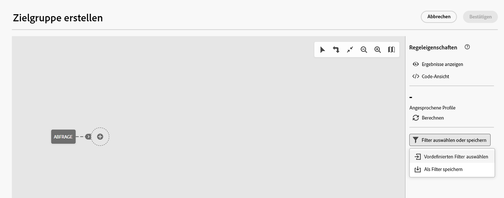

# Arbeiten mit vordefinierten Filtern {#predefined-filters}

>[!CONTEXTUALHELP]
>id="acw_homepage_card3"
>title="Vordefinierte Filterverwaltung"
>abstract="Campaign Web bietet Ihnen jetzt eine benutzerfreundliche Oberfläche, mit der Sie vordefinierte Filter mühelos verwalten und an Ihre spezifischen Anforderungen anpassen können. Erstellen Sie einmal und speichern Sie für die zukünftige Verwendung."

>[!CONTEXTUALHELP]
>id="acw_predefined-filters-dashboard"
>title="Vordefinierte Filter"
>abstract="Campaign Web bietet Ihnen jetzt eine benutzerfreundliche Oberfläche, mit der Sie vordefinierte Filter mühelos verwalten und an Ihre spezifischen Anforderungen anpassen können. Erstellen Sie einmal und speichern Sie für die zukünftige Verwendung."

Vordefinierte Filter sind benutzerdefinierte Filter, die erstellt und gespeichert werden und für die zukünftige Verwendung verfügbar sind. Sie können bei allen Filtervorgängen mit dem Regel-Builder als Verknüpfungen verwendet werden, z. B. beim Filtern einer Datenliste oder beim Erstellen der Zielgruppe eines Versands.

Sie können vorhandene integrierte Filter verwenden, um auf einen bestimmten Teil Ihrer Daten zuzugreifen, oder eigene vordefinierte Filter erstellen und speichern.

## Vordefinierten Filter erstellen {#create-predefined-filter}

>[!CONTEXTUALHELP]
>id="acw_predefined-filters-creation"
>title="Vordefinierten Filter erstellen"
>abstract="Geben Sie einen Titel für den vordefinierten Filter ein und wählen Sie die Tabelle aus, auf die er angewendet werden soll. Öffnen Sie die zusätzlichen Optionen, um eine Beschreibung hinzuzufügen und diesen Filter als Favoriten festzulegen. Definieren Sie dann mithilfe der Schaltfläche &#39;Regel erstellen&#39; die Filterbedingungen."

>[!CONTEXTUALHELP]
>id="acw_predefined-filters-rules"
>title="Vordefinierte Filterregeln erstellen"
>abstract="Um die Filterbedingungen Ihres benutzerspezifischen Filters zu definieren, wählen Sie die Schaltfläche &#39;Regel erstellen&#39; aus."

### Erstellen eines Filters aus dem Regel-Builder {#create-from-rule-builder}

Sie können einen benutzerdefinierten Filter aus dem Regel-Builder speichern, damit er für die zukünftige Verwendung verfügbar ist. Führen Sie folgende Schritte aus:

1. Öffnen Sie den Regel-Builder und definieren Sie Ihre Filterbedingungen. Im folgenden Beispiel filtern Sie die Empfänger, die in Madrid leben.
1. Klicken Sie auf **Filter auswählen oder speichern** und wählen Sie **Als Filter speichern**.

   

1. Auswählen **Neuen Filter erstellen** und geben Sie einen Namen und eine Beschreibung für diesen Filter ein.

   

   Sie können den Filter bei Bedarf als Favoriten speichern. Weiterführende Informationen finden Sie in [diesem Abschnitt](#fav-filter).

1. Klicken Sie auf **Bestätigen**, um Ihre Änderungen zu speichern.

Ihr benutzerdefinierter Filter ist jetzt im **Vordefinierte Filter** und für alle Campaign-Benutzer zugänglich sein.

### Filter aus der Filterliste erstellen {#create-filter-from-list}

Sie können einen Filter aus dem **Vordefinierte Filter** im linken Menü. Gehen Sie dazu wie folgt vor:

1. Navigieren Sie zum **Vordefinierte Filter** im linken Menü.
1. Klicken Sie auf **Filter erstellen** Schaltfläche.
1. Geben Sie den Namen des Filters ein und wählen Sie im **Dokumenttyp** -Feld das Schema auswählen, auf das es angewendet wird. Das Standardschema lautet `Recipients(nms)`.

   Sie können den Filter bei Bedarf als Favoriten speichern. Weiterführende Informationen finden Sie in [diesem Abschnitt](#fav-filter).

1. Definieren Sie die Regel für den Filter. Profile, die älter als 30 sind.

   

1. Speichern Sie Ihre Änderungen. Der Filter wird der vordefinierten Filterliste hinzugefügt.

## Filter als Favoriten speichern {#fav-filter}

Bei der Erstellung eines vordefinierten Filters können Sie die **Als Favoriten speichern** auswählen, wenn Sie diesen vordefinierten Filter in Ihren Favoriten sehen möchten.

Wenn ein Filter als Favorit gespeichert wird, steht er allen Benutzern im **Favoritenfilter** -Abschnitt der Filtererstellungsliste, wie unten dargestellt:

{width="70%" align="left"}

## Vordefinierten Filter verwenden {#use-predefined-filter}

Vordefinierte Filter sind beim Definieren von Regeleigenschaften verfügbar. Um auf vordefinierte Filter zuzugreifen, wählen Sie die **Benutzerspezifischen Filter auswählen** in der Dropdown-Liste des Regel-Builders.

Sie können dann auf die vollständige Liste der für den aktuellen Kontext verfügbaren vordefinierten Filter zugreifen.

Sie können auch die im Abschnitt **Favoritenfilter** des Dropdown-Menüs aus. Weitere Informationen zu Favoriten finden Sie in [diesem Abschnitt](#fav-filter).

Gehen Sie wie folgt vor, um beispielsweise eine Audience aus einem vordefinierten Filter zu erstellen:

1. Navigieren Sie zum **Zielgruppen** im linken Menü.
1. Klicken Sie auf **Zielgruppe erstellen** Schaltfläche.
1. Geben Sie den Namen der Audience ein und klicken Sie auf **Zielgruppe erstellen** Schaltfläche.
1. Wählen Sie die **Abfrage** und klicken Sie im rechten Bereich auf **Erstellen einer Zielgruppe** Schaltfläche.

   

1. Aus dem **Schaltfläche zum Auswählen oder Speichern von Filtern**, wählen Sie die **Benutzerspezifischen Filter auswählen** -Option.

   

1. Navigieren Sie zum vordefinierten Filter, der zum Erstellen der Audience verwendet werden soll, wählen Sie ihn aus und bestätigen Sie ihn.

   

1. Überprüfen Sie die Regeleigenschaften für diesen Filter und bestätigen Sie.

   

   Der Filter wird jetzt als Abfrage im **Abfrage** -Aktivität.

   

1. Speichern Sie Ihre Änderungen und klicken Sie auf das **Starten** -Schaltfläche, um die Audience zu erstellen und in der Audience-Liste verfügbar zu machen.

## Vordefinierte Filter verwalten {#manage-predefined-filter}

Vordefinierte Filter werden alle im dedizierten Eintrag des linken Navigationsmenüs gruppiert.

Aus dieser Liste können Sie einen neuen Filter erstellen, wie oben beschrieben, und:

* Bearbeiten eines vorhandenen Filters und Ändern dieser Regeln und Eigenschaften
* Vordefinierten Filter duplizieren
* Löschen eines vordefinierten Filters

Sie können beim Erstellen Ihrer Regeln einen vordefinierten Filter als Favoriten für einen schnellen Zugriff hinzufügen. Weiterführende Informationen finden Sie in [diesem Abschnitt](#fav-filter).

## Vordefinierte Filter {#ootb-predefined-filter}

Campaign verfügt über eine Reihe vordefinierter Filter, die über die Clientkonsole erstellt werden. Mit diesen Filtern können Sie Ihre Zielgruppen und Regeln definieren. Sie dürfen nicht geändert werden.
