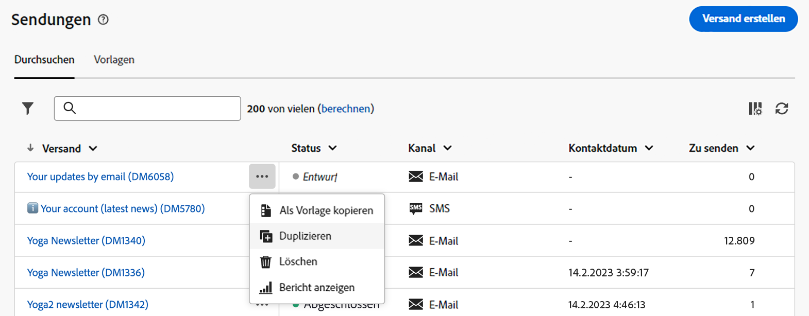

# Erkunden der Benutzeroberfläche {#user-interface}

>[!CONTEXTUALHELP]
>id="acw_homepage_learnmore"
>title="Erkunden der Benutzeroberfläche"
>abstract="Die neue Campaign v8 Web-Benutzeroberfläche bietet ein integriertes, intuitives und konsistentes Anwendererlebnis."

Die neue Web-Oberfläche von Campaign v8 bietet ein modernes und intuitives Benutzererlebnis, das die Gestaltung und den Versand von Marketingkampagnen vereinfacht. Diese neue Benutzeroberfläche ist in Adobe Experience Platform integriert.

<!--
Key concepts when browsing the user interface are common with Adobe Experience Platform. Refer to [Adobe Experience Platform documentation](https://experienceleague.adobe.com/docs/experience-platform/landing/platform-ui/ui-guide.html#adobe-experience-platform-ui-guide) for more details.
-->

>[!NOTE]
>
>Die vorliegende Dokumentation wird entsprechend den neuesten Änderungen an der Benutzeroberfläche des Produkts regelmäßig aktualisiert. Manche Screenshots können jedoch geringfügig von Ihrer Benutzeroberfläche abweichen.

<!--
* console + web interface (overview, why use each of them)
* web UI made up of read-only lists that can be configured, show how to add columns
-->

## Linkes Navigationsmenü

Mithilfe der Links auf der linken Seite können Sie auf die Campaign v8 Web-Funktionen zugreifen. Mehrere Links zeigen Listen von Objekten an, die sortiert und gefiltert werden können. Sie können auch Spalten so konfigurieren, dass alle benötigten Informationen angezeigt werden. Weitere Informationen finden Sie in [diesem Abschnitt](#list-screens). Alle Listenbildschirme mit Ausnahme der E-Mail-Versandliste sind schreibgeschützt. Das Klicken auf ein Listenelement zur Bearbeitung/Anzeige ist in Alpha nicht verfügbar. In künftigen Versionen werden alle Listen bearbeitbar sein. Welche Elemente im linken Navigationsmenü angezeigt werden, hängt von Ihren Benutzerberechtigungen ab.

### Startseite

Dieser Bildschirm enthält wichtige Links und Ressourcen für den Schnellzugriff auf die wichtigsten Campaign v8 Web-Funktionen. Die Liste **Zuletzt ausgewertet** enthält Verknüpfungen zu den kürzlich erstellten und geänderten Sendungen. In dieser Liste finden Sie auch das jeweilige Erstellungs- und Änderungsdatum sowie den Status dieser Sendungen.

<!--
* Banner
* KPIs on email channel (cross-deliveries): open rate, delivery rate, etc
* Recent items
* Learning cards
-->

Wichtige Hilfeseiten zu Campaign v8 Web können Sie unten auf der Startseite aufrufen.

<!--
show global KPIs, recent items + left menu to access features)
CONTROL PANEL not alpha
Global report not alpha
-->

### Explorer

>[!CONTEXTUALHELP]
>id="acw_explorer"
>title="Explorer"
>abstract="Das **Explorer**-Menü zeigt die gleiche Ordnerhierarchie wie in der Client-Konsole an. Durchsuchen Sie alle Komponenten, Ordner und Schemata von Campaign v8. Alle Listenbildschirme mit Ausnahme der E-Mail-Versandliste sind schreibgeschützt."

Das **Explorer**-Menü zeigt die gleiche Ordnerhierarchie wie in der Client-Konsole an. Durchsuchen Sie alle Komponenten, Ordner und Schemata von Campaign v8. Alle Listenbildschirme mit Ausnahme der E-Mail-Versandliste sind schreibgeschützt.

Welche Elemente im Explorer angezeigt werden, hängt von Ihren Benutzerberechtigungen ab.

Wie bei jedem Listenbildschirm können Sie die Spalten so konfigurieren, dass alle von Ihnen benötigten Informationen angezeigt werden. Weitere Informationen finden Sie in [diesem Abschnitt](#list-screens).

Weitere Informationen zu Campaign-Explorer finden Sie in dieser [Dokumentation](https://experienceleague.adobe.com/docs/campaign/campaign-v8/new/ac-ui/campaign-ui.html?lang=de#ac-explorer-ui){target="_blank"}.
<!--
Explorer' menu in web UI to navigate through console content: console navtree second view in addition to the left menu lists with filters. The Explorer gives the real folder hierarchy from the console. Make sure you find your deliveries in sub-folders. All lists can be accessed in read-only. No Create/Edit. You can configure lists (colums). All schema fields, linked tables are available. 

If you need to view your lists of recipients (age, gender), transactions or live transactional messages. To view each/edit -> console.

Navtree view depends on permissions (same as console).
-->

### Kampagnen-Management

>[!CONTEXTUALHELP]
>id="acw_campaigns_list"
>title="Kampagnen"
>abstract="Dies ist die Liste Ihrer Kampagnen. Sie können nützliche Informationen wie das Anfangsdatum/Enddatum/Datum der letzten Änderung sowie ihren Status anzeigen. Sie können die Liste nach Status oder Anfangsdatum/Enddatum filtern. Darüber hinaus stehen Kampagnenvorlagen zur Verfügung. Diese Listen sind schreibgeschützt."

>[!CONTEXTUALHELP]
>id="acw_deliveries_list"
>title="Sendungen"
>abstract="Durchsuchen Sie Ihre Sendungenliste. Sie können ihren Status, das Datum der letzten Änderung sowie wichtige KPIs anzeigen. Sie können die Liste nach Status, Kontaktdatum oder Kanal filtern. Klicken Sie auf einen E-Mail-Versand, um das zugehörige Dashboard zu öffnen. Andere Elemente sind schreibgeschützt. Darüber hinaus stehen Versandvorlagen zur Verfügung."

* **Kampagnen**: Dies ist die Liste Ihrer Kampagnen. Standardmäßig können Sie nützliche Informationen wie das Anfangsdatum/Enddatum/Datum der letzten Änderung sowie ihren Status sehen. Sie können die Liste nach Status oder Anfangsdatum/Enddatum filtern. Darüber hinaus stehen Kampagnenvorlagen zur Verfügung. Diese Listen sind schreibgeschützt.

* **Sendungen**: Durchsuchen Sie Ihre Sendungenliste. Standardmäßig können Sie ihren Status, das Datum der letzten Änderung sowie wichtige KPIs sehen. Sie können die Liste nach Status, Kontaktdatum oder Kanal filtern. Klicken Sie auf einen E-Mail-Versand, um sein Dashboard zu öffnen und sich einen Überblick über die Versanddetails zu verschaffen. Sendungen über andere Kanäle sind schreibgeschützt. Versandvorlagen sind auch im schreibgeschützten Modus verfügbar. Sie können sie über die Client-Konsole bearbeiten. Weitere Informationen finden Sie in dieser [Dokumentation](https://experienceleague.adobe.com/docs/campaign/campaign-v8/campaigns/send/create-templates.html?lang=de){target="_blank"}.

   Verwenden Sie die Schaltfläche **Mehr Aktionen**, um einen Versand zu löschen oder zu duplizieren.

   {width="70%" align="left"}

### Kunden-Management

>[!CONTEXTUALHELP]
>id="acw_recipients_list"
>title="Empfänger"
>abstract="Greifen Sie auf Ihre Empfängerdatenbank zu. Sie können nützliche Informationen wie die E-Mail-Adresse, den Vornamen und den Nachnamen der Empfänger anzeigen. Diese Liste ist schreibgeschützt."

>[!CONTEXTUALHELP]
>id="acw_audiences_list"
>title="Audiences"
>abstract="Dies ist die Liste Ihrer Audiences. Sie können den Typ, die Herkunft, das Erstellungsdatum/Datum der letzten Änderung und das Label anzeigen. Sie können die Liste nach Herkunft filtern. Diese Liste ist schreibgeschützt."

>[!CONTEXTUALHELP]
>id="acw_subscriptions_list"
>title="Abonnementlisten"
>abstract="Durchsuchen Sie Ihre Abonnementlisten. Sie können ihren Typ, Modus und ihre Beschriftung anzeigen. Diese Liste ist schreibgeschützt."

>[!CONTEXTUALHELP]
>id="acw_targeting_workflow_list"
>title="Zielgruppenbestimmungs-Workflows"
>abstract="Greifen Sie auf Ihre Liste der Kampagnen-Workflows zu. Sie können den Status, das letzte/nächste Verarbeitungsdatum und die Umgebung anzeigen. Sie können die Liste nach Status, Datum der letzten Verarbeitung und Workflow-Typ filtern. Auch Workflow-Vorlagen sind verfügbar. Diese Listen sind schreibgeschützt."

* **Empfänger**: Greifen Sie auf Ihre Empfängerdatenbank zu. Standardmäßig können Sie die E-Mail-Adresse sowie den Vor- und Nachnamen sehen. Diese Liste ist schreibgeschützt.
* **Audiences**: Dies ist die Liste Ihrer Zielgruppen. Standardmäßig können Sie den Typ, die Herkunft, das Erstellungsdatum/Datum der letzten Änderung und die Kennzeichnung sehen. Sie können die Liste nach Herkunft filtern. Diese Liste ist schreibgeschützt.
* **Abonnementlisten**: Durchsuchen Sie Ihre Abonnementlisten. Standardmäßig können Sie den Typ, den Modus und die Kennzeichnung sehen. Diese Liste ist schreibgeschützt.
* **Zielgruppenbestimmungs-Workflows**: Greifen Sie auf Ihre Liste der Kampagnen-Workflows zu. Standardmäßig können Sie den Status, das letzte/nächste Verarbeitungsdatum und die Umgebung sehen. Sie können die Liste nach Status, Datum der letzten Verarbeitung und Workflow-Typ filtern. Auch Workflow-Vorlagen sind verfügbar. Diese Listen sind schreibgeschützt.

### Entscheidungs-Management

>[!CONTEXTUALHELP]
>id="acw_offers_list"
>title="Angebote"
>abstract="Durchsuchen Sie Ihre Liste von Interaktionsangeboten. Standardmäßig können Sie den Status, das Start-/Enddatum und die Umgebung sehen. Sie können die Liste nach Status und Start-/Enddatum filtern. Angebotsvorlagen sind ebenfalls verfügbar. Diese Listen sind schreibgeschützt."

* **Angebote**: Durchsuchen Sie Ihre Liste von Interaktionsangeboten. Standardmäßig können Sie den Status, das Start-/Enddatum und die Umgebung sehen. Sie können die Liste nach Status und Start-/Enddatum filtern. Angebotsvorlagen sind ebenfalls verfügbar. Diese Listen sind schreibgeschützt.

## Obere Symbolleiste

In der oberen Leiste der Benutzeroberfläche haben Sie folgende Möglichkeiten:

* Ihr Feedback als Alpha-Testerin oder -Tester teilen
* zwischen Organisationen und Instanzen wechseln
* zwischen Adobe Experience Cloud-Anwendungen wechseln
* auf Hilfeseiten zugreifen, den Support kontaktieren und Feedback geben. Sie können Hilfe-Artikel und Videos mithilfe des Suchfelds suchen.

{width="70%" align="left"}
<!--
Org / Sub-org switcher to switch between instances. Only one for Alpha. Later: intermerdiate screen with Control Panel (beta). if v8 + ACS with one card per ACS instance. Maybe quickly explain the menu for Alpha?
-->

## Konfigurieren von Listenbildschirmen {#list-screens}

Verschiedene Links aus dem linken Navigationsmenü, z. B. **Sendungen** oder **Kampagnen**, zeigen Listen von Objekten an. Alle Listenbildschirme sind mit Ausnahme der E-Mail-Versandliste schreibgeschützt.

Um Elemente schneller zu finden, können Sie die Suchleiste verwenden oder die Liste nach kontextuellen Kriterien filtern.

{width="70%" align="left"}

Listen werden in Spalten angezeigt. Sie können auch zusätzliche Informationen anzeigen, indem Sie die Spaltenkonfiguration ändern. Klicken Sie dazu auf das Symbol oben rechts in der Liste. Sie können Spalten hinzufügen oder entfernen und die Reihenfolge ändern, in der sie angezeigt werden.

{width="70%" align="left"}

Sie können Elemente in der Liste sortieren, indem Sie auf eine beliebige Spaltenüberschrift klicken. Ein Aufwärts- oder Abwärtspfeil zeigt an, dass die Liste in dieser Spalte sortiert ist. Bei numerischen Spalten oder Datumsspalten bedeutet der Aufwärtspfeil, dass die Liste in aufsteigender Reihenfolge sortiert ist, während ein Abwärtspfeil eine absteigende Reihenfolge kennzeichnet. Bei Zeichenfolge- oder alphanumerischen Spalten werden die Werte in alphabetischer Reihenfolge aufgeführt.

## Kontextuelle Hilfe und Onboarding-Handbuch

Eine kontextuelle Hilfe ist in der Benutzeroberfläche verfügbar. Sofern verfügbar, auf das Symbol **?** klicken, um Hilfeinformationen und Links zur zugehörigen Dokumentation anzuzeigen.

{width="70%" align="left"}

Darüber hinaus ist ein Onboarding-Handbuch verfügbar, das Ihnen bei den ersten Schritten mit Campaign v8 Web hilft. Klicken Sie auf das Symbol unten rechts, wählen Sie eines der verfügbaren schrittweisen Szenarien aus und befolgen Sie einfach die Anweisungen.

{width="70%" align="left"}

## Unterstützte Browser {#browsers}

Campaign v8 Web ist so konzipiert, dass es mit den neuesten Versionen von Google Chrome, Safari und Microsoft Edge optimal funktioniert. Bei der Verwendung bestimmter Funktionen in älteren Versionen oder anderen Browsern können Probleme auftreten.

## Sprachvoreinstellungen {#language-pref}

Campaign v8 Web ist derzeit in den folgenden Sprachen verfügbar:

<table>
<tr>
<td>

Englisch (US) – EN-US

Französisch – FR

Deutsch – DE

Italienisch – IT

</td>
<td>

Spanisch – ES

Portugiesisch (Brasilianisch) – PTBR

Japanisch – JP

</td>
<td>

Koreanisch – KR

Vereinfachtes Chinesisch – CHS

Traditionelles Chinesisch – CHT

</td>
</tr>
</table>

Die Standardsprache der Benutzeroberfläche wird von der in Ihrem Benutzerprofil angegebenen bevorzugten Sprache bestimmt.

So ändern Sie Ihre Sprache:

1. Klicken Sie auf das Profilsymbol oben rechts und wählen Sie dann **Voreinstellungen**.

   {width="70%" align="left"}

1. Klicken Sie dann auf die Sprache, die unter Ihrer E-Mail-Adresse angezeigt wird.

   

1. Wählen Sie Ihre bevorzugte Sprache aus und klicken Sie auf **Speichern**. Sie können eine zweite Sprache auswählen, falls die von Ihnen verwendete Komponente nicht in Ihrer gewählten Sprache lokalisiert ist.

   

<!--
## Supported browsers {#browsers}

Adobe Campaign interface is designed to work optimally in the latest version of Google Chrome. You might have trouble using certain features on older versions or other browsers.
-->

<!--
######## This part stores the contextualHelp definition for WebUI BETA ###########
######## These blocks should be dispatched in the appropriate pages when available ###########
######## PLEASE DO NOT DELETE ###########
-->

>[!CONTEXTUALHELP]
>id="acw_sms_report_overview"
>title="Zusammenfassung des SMS-Berichts"
>abstract="Noch nicht definiert"

>[!CONTEXTUALHELP]
>id="acw_push_report_overview"
>title="Zusammenfassung des Push-Berichts"
>abstract="Noch nicht definiert"

>[!CONTEXTUALHELP]
>id="acw_import_from_a_file"
>title="Import einer Audience aus einer Datei"
>abstract="Noch nicht definiert"

>[!CONTEXTUALHELP]
>id="acw_import_from_a_file_formatting"
>title="Formateinstellungen"
>abstract="Noch nicht definiert"

>[!CONTEXTUALHELP]
>id="acw_import_from_a_file_columns"
>title="Spalteneinstellungen"
>abstract="Noch nicht definiert"

>[!CONTEXTUALHELP]
>id="acw_push_notification_template"
>title="Vorlage für Push-Benachrichtigungen"
>abstract="Noch nicht definiert"

>[!CONTEXTUALHELP]
>id="acw_campaign_creation_properties"
>title="Eigenschaften zur Kampagnenerstellung"
>abstract="Noch nicht definiert"

>[!CONTEXTUALHELP]
>id="acw_campaign_creation_schedule"
>title="Kampagnenerstellungsplan"
>abstract="Noch nicht definiert"

>[!CONTEXTUALHELP]
>id="acw_rulebuilder_properties_advanced"
>title="Erweiterte Attribute von Rule Builder"
>abstract="Noch nicht definiert"

>[!CONTEXTUALHELP]
>id="acw_deliveries_email_metrics_sent"
>title="Gesendete Metriken"
>abstract="Noch nicht definiert"

>[!CONTEXTUALHELP]
>id="acw_deliveries_email_metrics_errors"
>title="Fehlermetriken"
>abstract="Noch nicht definiert"
