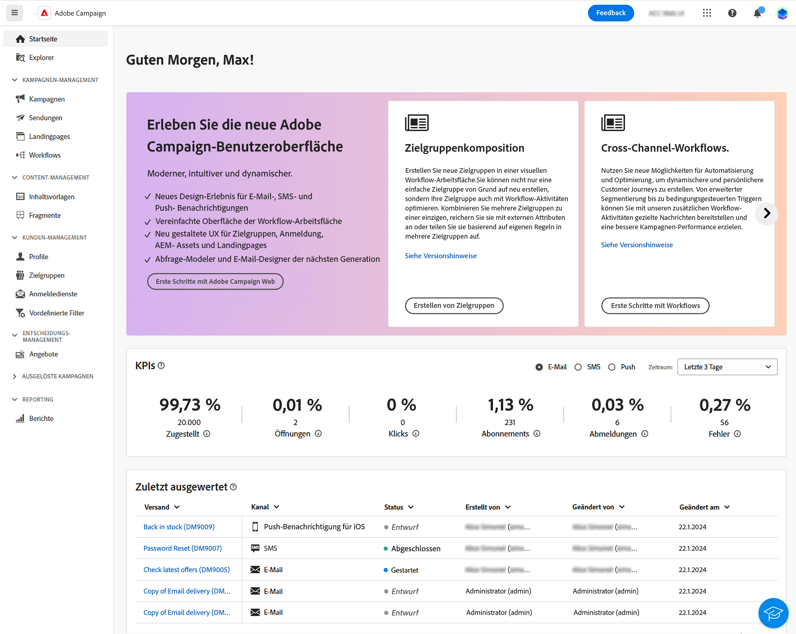

# Erkunden der Benutzeroberfläche {#user-interface}

Die neue Oberfläche von Adobe Campaign Web bietet ein modernes und intuitives Anwendererlebnis, das die Gestaltung und den Versand von Marketing-Kampagnen vereinfacht. Diese neue Benutzeroberfläche ist in Adobe Experience Cloud-Apps und -Lösungen integriert.

[In diesem Artikel](connect-to-campaign.md) erfahren Sie, wie Sie eine Verbindung zu Adobe Campaign herstellen und Grundlagen der Navigation in Experience Cloud kennenlernen.

>[!NOTE]
>
>Die vorliegende Dokumentation wird entsprechend den neuesten Änderungen an der Benutzeroberfläche des Produkts regelmäßig aktualisiert. Manche Screenshots können jedoch geringfügig von Ihrer Benutzeroberfläche abweichen.

## Campaign-Startseite {#user-interface-home}

>[!CONTEXTUALHELP]
>id="acw_homepage_recent"
>title="Zuletzt ausgewertet"
>abstract="Die Liste **Zuletzt ausgewertet** enthält Verknüpfungen zu den kürzlich erstellten und geänderten Sendungen. Diese Liste zeigt den Kanal, den Status, die Besitzerin bzw. den Besitzer sowie das Erstellungs- und Änderungsdatum."

Auf der Campaign-Startseite können Sie schnell und einfach die wichtigsten Ressourcen, Indikatoren und Komponenten durchsuchen.

Im oberen Abschnitt der Startseite finden Sie Informationen zu den neuesten Updates und Funktionen des Produkts sowie einen Link zu Versionshinweisen und der ausführlichen Dokumentation. Verwenden Sie den Pfeil nach links, um durch die Funktionskarten zu blättern.

{zoomable=&quot;yes&quot;}

Die **wichtigen Performance-Indikatoren** ermöglichen es Ihnen, die Effektivität Ihrer Plattform mithilfe gängiger KPIs zu überprüfen. Weitere Informationen über diese KPIs finden Sie auf [dieser Seite](../reporting/kpis.md).

Die Liste **Zuletzt ausgewertet** enthält Verknüpfungen zu den kürzlich erstellten und geänderten Sendungen. Diese Liste zeigt den Kanal, den Status, die Besitzerin bzw. den Besitzer sowie das Erstellungs- und Änderungsdatum. Klicken Sie auf den Link **Mehr anzeigen**, um weitere Sendungen zu laden.

Greifen Sie zusätzlich über den Abschnitt **Lernen** der Seite auf die wichtigsten Hilfeseiten zu Adobe Campaign Web zu.

## Linkes Navigationsmenü {#user-interface-left-nav}

Mithilfe der Links auf der linken Seite können Sie auf die Adobe Campaign Web-Funktionen zugreifen. Mehrere Links zeigen Listen von Objekten an, die sortiert und gefiltert werden können. Sie können auch Spalten so konfigurieren, dass alle benötigten Informationen angezeigt werden. Weitere Informationen finden Sie in diesem [Abschnitt](#list-screens). Einige Listenbildschirme sind schreibgeschützt. Welche Elemente im linken Navigationsmenü und in den Listen angezeigt werden, hängt von Ihren Benutzerberechtigungen ab. Weiterführende Informationen zu Berechtigungen finden Sie in [diesem Abschnitt](permissions.md).

### Explorer {#user-interface-explorer}

>[!CONTEXTUALHELP]
>id="acw_explorer"
>title="Explorer"
>abstract="Das Menü **Explorer** zeigt alle Campaign-Komponenten und -Objekte mit derselben Ordnerhierarchie wie in der Client-Konsole an. Durchsuchen Sie alle Komponenten, Ordner und Schemata in Campaign v8, überprüfen Sie die zugehörigen Berechtigungen und erstellen Sie Ordner und Unterordner über dieses Menü."

Das Menü **Explorer** zeigt alle Campaign-Ressourcen und -Objekte mit derselben Ordnerhierarchie an wie in der Client-Konsole. Durchsuchen Sie alle Ihre Komponenten, Ordner und Schemata in Campaign v8 und erstellen Sie Sendungen, Workflows und Kampagnen.

Welche Elemente im **Explorer** angezeigt werden, hängt von Ihren Benutzerberechtigungen ab. Wenn Sie über entsprechende Berechtigungen verfügen, können Sie auch Ordner und Unterordner hinzufügen. Weiterführende Informationen zu Berechtigungen finden Sie in [diesem Abschnitt](permissions.md).

Sie können Spalten konfigurieren, um die Anzeige anzupassen und so alle benötigten Informationen anzuzeigen. Weitere Informationen finden Sie in diesem [Abschnitt](#list-screens). Sie können auch Ordner und Unterordner hinzufügen, wie in [diesem Abschnitt](permissions.md#folders) ausführlich beschrieben wird.

Weitere Informationen zum Campaign-Explorer, zur Ordnerhierarchie und zu den Ressourcen finden Sie in dieser [Dokumentation zu Campaign v8 (Konsole)](https://experienceleague.adobe.com/docs/campaign/campaign-v8/new/campaign-ui.html?lang=de#ac-explorer-ui){target="_blank"}.

### Kampagnen-Management {#user-interface-campaign-management}

Im Abschnitt KAMPAGNEN-MANAGEMENT haben Sie Zugriff auf Marketing-Kampagnen, Sendungen und Workflows.

* **Kampagnen** – Dies ist die Liste Ihrer Kampagnen und Kampagnenvorlagen. Standardmäßig können Sie für jede Kampagne die Datumsangaben für Start, Ende, Erstellung und letzte Änderung, den aktuellen Status und den Namen der Campaign-Benutzerin bzw. des -Benutzers anzeigen, die bzw. der die Kampagne erstellt hat. Sie können die Liste nach Status, Start-/Enddatum oder Ordner filtern oder einen erweiterten Filter erstellen, um eigene Filterkriterien zu definieren. Weiterführende Informationen zu Marketing-Kampagnen finden Sie in [diesem Abschnitt](../campaigns/gs-campaigns.md).

* **Sendungen**: Durchsuchen Sie Ihre Sendungenliste. Standardmäßig können Sie ihren Status, das Datum der letzten Änderung sowie wichtige KPIs sehen. Sie können die Liste nach Status, Kontaktdatum oder Kanal filtern. Klicken Sie auf einen E-Mail-Versand, um sein Dashboard zu öffnen und sich einen Überblick über die Versanddetails zu verschaffen. Sendungen über andere Kanäle sind schreibgeschützt. Weitere Informationen zu Sendungen finden Sie in [diesem Abschnitt](../msg/gs-messages.md).

  Verwenden Sie die Schaltfläche **Mehr Aktionen**, um einen Versand zu löschen oder zu duplizieren.

  {zoomable=&quot;yes&quot;}{width="70%" align="left"}

* **Workflows** – Auf diesem Bildschirm können Sie auf die vollständige Liste der Workflows und Workflow-Vorlagen zugreifen. Sie können den Status und das letzte bzw. nächste Ausführungsdatum überprüfen und einen neuen Workflow oder eine neue Workflow-Vorlage erstellen. Sie können die Liste nach denselben Kriterien filtern wie für andere Objekte. Darüber hinaus können Sie Workflows filtern, die zu einer Kampagne gehören oder nicht. Weiterführende Informationen zu Workflows finden Sie [in diesem Abschnitt](../workflows/gs-workflows.md).

### Content-Management {#user-interface-content-management}

Im Abschnitt „CONTENT MANAGEMENT“ können Sie Ihre Inhaltsvorlagen und -fragmente einsehen.

* **Inhaltsvorlagen**: Sie können eigenständige Vorlagen erstellen, um den Design-Prozess zu beschleunigen und zu verbessern und benutzerdefinierte Inhalte problemlos in allen Bereichen von [!DNL Adobe Campaign] wiederzuverwenden. Diese nur für E-Mails verfügbare Funktion ermöglicht es inhaltsorientierten Benutzenden, an eigenständigen Vorlagen zu arbeiten, sodass Anwenderinnen und Anwender von Marketing diese in ihren E-Mail-Kampagnen wiederverwenden und anpassen können. Weiterführende Informationen finden Sie in [diesem Abschnitt](../email/create-email-templates.md).

<!--
* **Fragments** -
-->

### Kunden-Management {#user-interface-customer-management}

Im Abschnitt „KUNDEN-MANAGEMENT“ können Sie Ihre Profile, Zielgruppen und Abonnements einsehen. Diese Listen sind schreibgeschützt.

* **Profile**: Erstellen und verwalten Sie Profile, und greifen Sie auf Ihre Empfängerdatenbank zu. Standardmäßig können Sie die E-Mail-Adresse sowie den Vor- und Nachnamen sehen. Weitere Informationen zu Profile finden Sie in [diesem Abschnitt](../audience/about-recipients.md).
* **Zielgruppen**: Dies ist die Liste Ihrer Zielgruppen. Standardmäßig können Sie den Typ, die Herkunft, das Erstellungsdatum/Datum der letzten Änderung und die Kennzeichnung sehen. Die Liste kann nach Herkunft gefiltert werden. Weitere Informationen zu Zielgruppen und Listen finden Sie in [diesem Abschnitt](../audience/about-recipients.md).
* **Abonnements**: Durchsuchen Sie Ihre Abonnementlisten. Standardmäßig können Sie den Typ, den Modus und die Kennzeichnung sehen. Erfahren Sie mehr über die Verwaltung von Abonnements und Abmeldungen in der [Dokumentation zu Adobe Campaign v8 (Konsole)](https://experienceleague.adobe.com/docs/campaign/campaign-v8/campaigns/send/subscriptions.html?lang=de){target="_blank"}.
* **Vordefinierte Filter**: Vordefinierte Filter sind benutzerdefinierte Filter, die erstellt und gespeichert werden, um für eine spätere Verwendung zur Verfügung zu stehen. Sie können als Verknüpfungen bei allen Filtervorgängen mit dem Abfrage-Modeller verwendet werden, zum Beispiel beim Filtern einer Liste von Daten oder beim Erstellen der Zielgruppe eines Versands. Weiterführende Informationen finden Sie in [diesem Abschnitt](predefined-filters.md).

### Entscheidungs-Management {#decision-management}

>[!CONTEXTUALHELP]
>id="acw_offers_list"
>title="Angebote"
>abstract="Durchsuchen Sie die Listen mit Angeboten und Angebotsvorlagen, die in der Konsole erstellt wurden, mithilfe des Moduls **Interaktion**. Diese Listen sind schreibgeschützt."
>additional-url="https://experienceleague.adobe.com/docs/campaign-web/v8/msg/offers.html?lang=de" text="Hinzufügen von Angeboten zu einem Versand"

Im Abschnitt ENTSCHEIDUNGS-MANAGEMENT können Sie die Angebote und Angebotsvorlagen anzeigen. Diese Listen sind schreibgeschützt.

* **Angebote** – Durchsuchen Sie die Liste der Angebote und Angebotsvorlagen, die in der Konsole erstellt wurden, mithilfe des Moduls **Interaktion**. Standardmäßig können Sie den Status, das Start-/Enddatum und die Umgebung sehen. Sie können die Liste nach Status oder Start-/Enddatum filtern. Angebotsvorlagen sind ebenfalls verfügbar.

Erfahren Sie, wie Sie in E-Mails und SMS Angebote erstellen und senden, in [diesem Abschnitt](../msg/offers.md).

### Reporting {#left-nav-reporting}

* **Berichte**: Der Eintrag **Bericht** bietet eine konsolidierte Zusammenfassung von Traffic- und Interaktionsmetriken für jeden Kanal innerhalb Ihrer Campaign-Umgebungen. Diese Berichte bestehen aus verschiedenen Widgets, von denen jedes eine andere Perspektive auf Ihre Kampagnen- oder Versandleistung bietet. Weiterführende Informationen finden Sie in [diesem Abschnitt](../reporting/global-reports.md).

## Kontextuelle Hilfe {#user-interface-help}

Eine kontextuelle Hilfe ist in der Benutzeroberfläche verfügbar. Wenn verfügbar, klicken Sie auf das `?`-Symbol, um Hilfeinformationen und zugehörige Dokumentations-Links anzuzeigen.

{zoomable=&quot;yes&quot;}{width="40%" align="left"}

In der aktuell verfügbaren Beta-Version der neuen Campaign Web-Benutzeroberfläche revolutioniert der **KI-gestützte Wissensassistent**, der in der kontextuellen Hilfe eingebettet ist, die Suche nach Dokumentationen und die Beantwortung von Fragen zur Vorgehensweise, indem er mühelos riesige Dokumentationsbestände durchforstet und die benötigten Informationen sofort auffindbar macht.

Dank der Funktionen der generativen KI von Campaign verwandelt dieser Assistent Ihr Erlebnis völlig und macht das Abrufen von Informationen und die Problembehebung zu einem Kinderspiel. Unser Wissensassistent mit generativer KI ist Ihr ultimativer Begleiter bei Fragen zu komplexen Aufgaben oder zur Navigation in umfangreichen Dokumenten und bietet Ihnen bei jeder Interaktion höchste Effizienz und Genauigkeit.

Weiterführende Informationen finden Sie in [diesem Abschnitt](using-ai.md).

## Weitere Informationen {#learn-more}

Erfahren Sie [auf dieser Seite](list-filters.md), wie Sie in Ihrer Campaign-Umgebung verfügbare Listen lesen, durchsuchen und filtern können.

<!--
######## This part stores the contextualHelp definition for WebUI BETA ###########
######## These blocks should be dispatched in the appropriate pages when available ###########
######## PLEASE DO NOT DELETE ###########
REFER TO 
https://wiki.corp.adobe.com/pages/viewpage.action?spaceKey=neolane&title=v8+WebUI+Contextual+Help+%3CALPHA%3E-+Official+list
-->

>[!CONTEXTUALHELP]
>id="acw_push_permission_for_segment"
>title="Berechtigung erforderlich"
>abstract="Ihre Admins müssen Ihnen die Berechtigung erteilen, bevor Sie ein Segment erstellen können."

>[!CONTEXTUALHELP]
>id="acw_push_overview_edit"
>title="Berechtigung erforderlich"
>abstract="Ihre Admins müssen Ihnen die Berechtigung erteilen, bevor Sie ein Segment erstellen können."

<!-- delivery template settings-->

>[!CONTEXTUALHELP]
>id="acw_global_reporting_sending"
>title="Senden von globalen Berichten"
>abstract="Auf diesem Bildschirm werden Tracking-Berichtsmetriken angezeigt"

>[!CONTEXTUALHELP]
>id="acw_global_reporting_tracking"
>title="Tracking globaler Berichte"
>abstract="Auf diesem Bildschirm werden Tracking-Berichtsmetriken angezeigt"

<!-- FOR BETA (alignment) -->
<!--https://wiki.corp.adobe.com/display/neolane/v8+WebUI+Contextual+Help+%3CBETA%3E-+Official+list-->

<!-- FOR GA -->
<!-- Aligned with https://wiki.corp.adobe.com/display/neolane/v8+WebUI+Contextual+Help+%3CGA%3E-+Official+list -->

>[!CONTEXTUALHELP]
>id="acw_recipients_creation_list"
>title="Empfänger – Erstellung"
>abstract="Empfänger – Erstellung"

>[!CONTEXTUALHELP]
>id="acw_recipients_creation_cardoverview"
>title="Empfängerkarte – Übersicht"
>abstract="Empfängerkarte – Übersicht"

>[!CONTEXTUALHELP]
>id="acw_recipients_creation_touchpoints"
>title="Empfänger – Touchpoints"
>abstract="Empfänger – Touchpoints"

>[!CONTEXTUALHELP]
>id="acw_recipients_subscription_selection"
>title="Empfänger – Abonnementauswahl"
>abstract="Empfänger – Abonnementauswahl"

>[!CONTEXTUALHELP]
>id="acw_recipients_offers_eligible_list"
>title="Empfängerangebote – Liste geeigneter Angebote"
>abstract="Empfängerangebote – Liste geeigneter Angebote"

>[!CONTEXTUALHELP]
>id="acw_recipients_offers_preview_proposition"
>title="Empfängerangebote – Vorschau"
>abstract="Empfängerangebote – Vorschau"

>[!CONTEXTUALHELP]
>id="acw_fragments_menu"
>title="Fragmente"
>abstract="Fragmente"

>[!CONTEXTUALHELP]
>id="acw_fragments_save"
>title="Fragmente – Speichern"
>abstract="Fragmente – Speichern"

>[!CONTEXTUALHELP]
>id="acw_fragments_create"
>title="Fragmente – Erstellung"
>abstract="Fragmente – Erstellung"

>[!CONTEXTUALHELP]
>id="acw_fragments_properties"
>title="Fragmente – Eigenschaften"
>abstract="Fragmente – Eigenschaften"

>[!CONTEXTUALHELP]
>id="acw_fragments_type"
>title="Fragmente – Typ"
>abstract="Fragmente – Typ"

>[!CONTEXTUALHELP]
>id="acw_fragments_list"
>title="Fragmente – Liste"
>abstract="Fragmente – Liste"

>[!CONTEXTUALHELP]
>id="acw_fragments_details"
>title="Fragmente – Details"
>abstract="Fragmente – Details"

>[!CONTEXTUALHELP]
>id="acw_conditionalcontent_savefilter"
>title="Bedingter Inhalt – Filter speichern"
>abstract="Bedingter Inhalt – Filter speichern"

>[!CONTEXTUALHELP]
>id="acw_conditionalcontent_selectfilter"
>title="Bedingter Inhalt – Filter auswählen"
>abstract="Bedingter Inhalt – Filter auswählen"

>[!CONTEXTUALHELP]
>id="acw_conditionalcontent_subjectline"
>title="Bedingter Inhalt in Betreffzeile"
>abstract="Bedingter Inhalt in Betreffzeile"

>[!CONTEXTUALHELP]
>id="acw_conditionalcontent_subjectlinecondition"
>title="Bedingter Inhalt – Betreffzeilenbedingung"
>abstract="Bedingter Inhalt – Betreffzeilenbedingung"

>[!CONTEXTUALHELP]
>id="acw_deliveries_simulate_testprofiles"
>title="Testprofile simulieren"
>abstract="Testprofile simulieren"

<!--ML: not visible in UI-->

>[!CONTEXTUALHELP]
>id="acw_deliveries_simulate_profiles_selection"
>title="Testprofile simulieren – Auswahl"
>abstract="Testprofile simulieren – Auswahl"

<!-- ML: beta wiki page - not visible in UI-->

>[!CONTEXTUALHELP]
>id="acw_deliveries_simulate_send_testprofiles"
>title="Testprofile simulieren – Versand"
>abstract="Testprofile simulieren – Versand"

<!-- ML: beta wiki page - not visible in UI-->

>[!CONTEXTUALHELP]
>id="acw_deliveries_simulate_email_log"
>title="E-Mail-Protokoll simulieren"
>abstract="E-Mail-Protokoll simulieren"

<!-- ML: beta wiki page - not visible in UI-->

<!-- FOR POST-GA -->

<!--
Deprecated IDs - to remove in GA: -->

>[!CONTEXTUALHELP]
>id="acw_attributepicker_advancedfields"
>title="Anzeigen von erweiterten Attributen"
>abstract="In der Attributliste werden standardmäßig nur die häufigsten Attribute angezeigt. Aktivieren Sie den Umschalter **Erweiterte Attribute anzeigen**, um alle verfügbaren Attribute für die aktuelle Liste in der linken Palette des Regel-Builders anzuzeigen, z. B. Knoten, Gruppierungen, 1:1-Links und 1:n-Links."

>[!CONTEXTUALHELP]
>id="acw_rulebuilder_advancedfields"
>title="Erweiterte Felder des Regel-Builders"
>abstract="In der Attributliste werden standardmäßig nur die häufigsten Attribute angezeigt. Aktivieren Sie den Umschalter **Erweiterte Attribute anzeigen**, um alle verfügbaren Attribute für die aktuelle Liste in der linken Palette des Regel-Builders anzuzeigen, z. B. Knoten, Gruppierungen, 1:1-Links und 1:n-Links."

>[!CONTEXTUALHELP]
>id="acw_rulebuilder_properties_advanced"
>title="Erweiterte Attribute des Regel-Builders"
>abstract="In der Attributliste werden standardmäßig nur die häufigsten Attribute angezeigt. Aktivieren Sie den Umschalter **Erweiterte Attribute anzeigen**, um alle verfügbaren Attribute für die aktuelle Liste in der linken Palette des Regel-Builders anzuzeigen, z. B. Knoten, Gruppierungen, 1:1-Links und 1:n-Links."

>[!CONTEXTUALHELP]
>id="acw_contenttemplate_readonlymode"
>title="Diese Vorlage ist schreibgeschützt"
>abstract="Sie sind nicht berechtigt, diese Vorlage zu bearbeiten. Bei Bedarf Admin kontaktieren, um Zugriff zu erhalten."

<!-- Subscription activity-->

>[!CONTEXTUALHELP]
>id="acw_subscriptions_defaultlp"
>title="Standard-Landingpage"
>abstract="Wählen Sie die mit diesem Abonnement-Dienst verknüpfte Standard-Landingpage aus."

>[!CONTEXTUALHELP]
>id="acw_orchestration_subscription"
>title="An-/Abmeldedienst"
>abstract="Adobe Campaign verwenden, um Dienste wie z. B. Newsletter zu erstellen und zu überwachen und die An- und Abmeldungen für diese Dienste zu überprüfen. Abonnements gelten nur für den E-Mail- und SMS-Versand."

>[!CONTEXTUALHELP]
>id="acw_orchestration_subscription_general"
>title="Parameter des Anmeldedienstes"
>abstract="Wählen Sie die Einstellungen für den Abonnementdienst aus und bestätigen Sie sie."

>[!CONTEXTUALHELP]
>id="acw_orchestration_subscription_outboundtransition"
>title="Ausgehende Transition von Abonnementdiensten"
>abstract="Umschalten zwischen **Ausgehende Transition erzeugen** -Option, um eine Transition nach der Aktivität hinzuzufügen."

<!--Update file-->

>[!CONTEXTUALHELP]
>id="acw_orchestration_updatedata"
>title="Aktualisieren von Daten"
>abstract="Die **Daten-Update**-Aktivität ermöglicht eine gebündelte Aktualisierung von Datenbankfeldern."

>[!CONTEXTUALHELP]
>id="acw_orchestration_updatedata_operationtype"
>title="Auswählen, wie Daten aktualisiert werden"
>abstract="Die **Aktionstyp** Wählen Sie im Feld aus, welcher Vorgang auf die Daten der Datenbank angewendet werden soll. Wählen Sie die erste Option aus, um Daten hinzuzufügen oder zu aktualisieren (falls sie bereits hinzugefügt wurden). Sie können auch nur Daten hinzufügen, nur Daten aktualisieren oder Daten löschen. Wählen Sie die **Kollektionen aktualisieren und zusammenführen** , um einen primären Datensatz auszuwählen, mit dem Duplikate verknüpft werden sollen, und diese Duplikate sicher zu löschen."

>[!CONTEXTUALHELP]
>id="acw_orchestration_updatedata_recordid"
>title="Datensatz-Identifizierung"
>abstract="Spezifizieren Sie, wie die Datensätze der Datenbank identifiziert werden können: Wenn sich die Daten auf eine existierende Zielgruppendimension beziehen, wählen Sie die **Zielgruppendimension verwenden** und wählen Sie die Zielgruppendimension sowie die zu aktualisierenden Felder aus. Geben Sie andernfalls einen oder mehrere benutzerspezifische Links an, um die Daten in der Datenbank zu identifizieren, oder verwenden Sie die Abstimmschlüssel direkt."

>[!CONTEXTUALHELP]
>id="acw_orchestration_updatedata_fieldsupdate"
>title="Zu aktualisierende Felder auswählen"
>abstract="Wählen Sie die zu aktualisierenden Felder und Abstimmungseinstellungen aus. Sie können die **Automatische Zuordnung** zur automatischen Identifizierung der zu aktualisierenden Felder."

>[!CONTEXTUALHELP]
>id="acw_orchestration_updatedata_advancedoptions"
>title="Erweiterte Optionen zum Aktualisieren von Daten"
>abstract="Die **Erweiterte Optionen** können Sie zusätzliche Einstellungen zum Verwalten von Daten und Duplikaten festlegen."

>[!CONTEXTUALHELP]
>id="acw_orchestration_updatedata_outboundtransition"
>title="Ausgehende Transition erzeugen"
>abstract="Umschalten zwischen **Ausgehende Transition erzeugen** Option zum Hinzufügen einer ausgehenden Transition, die am Ende der Ausführung der **Daten aktualisieren** -Aktivität. Die Aktualisierung markiert im Allgemeinen das Ende eines Zielgruppen-Workflows, weshalb die Option nicht standardmäßig aktiviert ist."

>[!CONTEXTUALHELP]
>id="acw_orchestration_updatedata_outboundtransition_rejects"
>title="Ausgehende Transition für Zurückweisungen erzeugen"
>abstract="Umschalten zwischen **Ausgehende Transition für Zurückweisungen erzeugen** -Option, um eine ausgehende Transition mit Datensätzen hinzuzufügen, die nach der Aktualisierung nicht korrekt verarbeitet wurden (z. B. bei Duplikaten). Die Aktualisierung markiert im Allgemeinen das Ende eines Zielgruppen-Workflows, weshalb die Option nicht standardmäßig aktiviert ist."

<!--External Signal End-->

>[!CONTEXTUALHELP]
>id="acw_orchestration_externalsignal"
>title="Externes Signal"
>abstract="TBC"

>[!CONTEXTUALHELP]
>id="acw_orchestration_externalsignal_parameters"
>title="Parameter von externen Signalen"
>abstract="TBC"

>[!CONTEXTUALHELP]
>id="acw_orchestration_end_trigger"
>title="Trigger beenden"
>abstract="TBC"

<!--Javascript-->

>[!CONTEXTUALHELP]
>id="acw_orchestration_javascript"
>title="JavaScript-Code"
>abstract="TBC"

>[!CONTEXTUALHELP]
>id="acw_orchestration_javascript_snippet"
>title="JavaScript-Snippet"
>abstract="TBC"

>[!CONTEXTUALHELP]
>id="acw_orchestration_javascript_execution"
>title="JavaScript-Ausführung"
>abstract="TBC"

>[!CONTEXTUALHELP]
>id="acw_orchestration_javascript_transition"
>title="JavaScript-Übergang"
>abstract="TBC"

<!--ExtractFile-->

>[!CONTEXTUALHELP]
>id="acw_orchestration_extractfile"
>title="Dateiextraktion"
>abstract="TBC"

>[!CONTEXTUALHELP]
>id="acw_orchestration_extractfile_file"
>title="Zu extrahierende Datei"
>abstract="TBC"

>[!CONTEXTUALHELP]
>id="acw_orchestration_extractfile_destinationformat"
>title="Zielformat"
>abstract="TBC"

>[!CONTEXTUALHELP]
>id="acw_orchestration_extractfile_postprocessing"
>title="Nachbearbeitung"
>abstract="TBC"

>[!CONTEXTUALHELP]
>id="acw_orchestration_extractfile_outbound"
>title="Ausgehende Transition"
>abstract="TBC"

>[!CONTEXTUALHELP]
>id="acw_orchestration_extractfile_error"
>title="Verarbeitungsfehler"
>abstract="TBC"