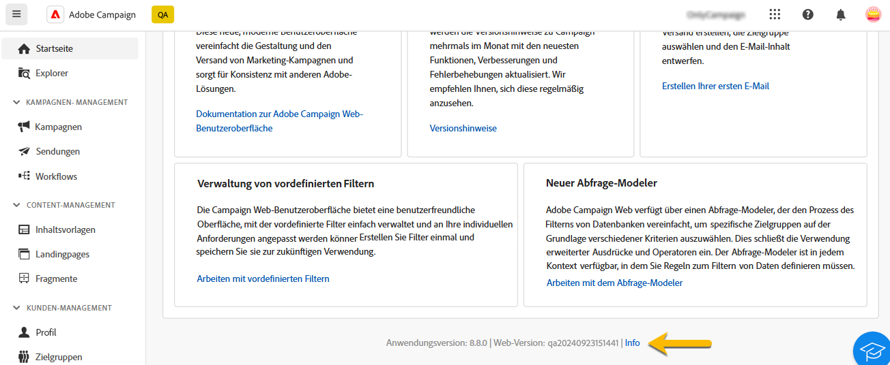
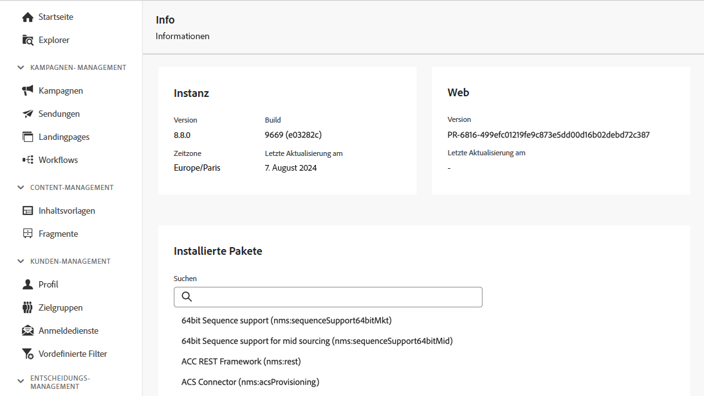

# Erkunden der Benutzeroberfläche {#user-interface}

Die neue Oberfläche von Adobe Campaign Web bietet ein modernes und intuitives Anwendererlebnis, das die Gestaltung und den Versand von Marketing-Kampagnen vereinfacht. Diese neue Benutzeroberfläche ist in Adobe Experience Cloud-Apps und -Lösungen integriert.

[In diesem Artikel](connect-to-campaign.md) erfahren Sie, wie Sie eine Verbindung zu Adobe Campaign herstellen und Grundlagen der Navigation in Experience Cloud kennenlernen.

>[!NOTE]
>
>Die vorliegende Dokumentation wird entsprechend den neuesten Änderungen an der Benutzeroberfläche des Produkts regelmäßig aktualisiert. Manche Screenshots können jedoch geringfügig von Ihrer Benutzeroberfläche abweichen.

## Campaign-Startseite {#user-interface-home}

>[!CONTEXTUALHELP]
>id="acw_homepage_recent"
>title="Zuletzt ausgewertet"
>abstract="Die Liste **Zuletzt ausgewertet** enthält Verknüpfungen zu den kürzlich erstellten und geänderten Sendungen. Diese Liste zeigt den Kanal, den Status, die Besitzerin bzw. den Besitzer sowie das Erstellungs- und Änderungsdatum."

Auf der Campaign-Startseite können Sie schnell und einfach die wichtigsten Ressourcen, Indikatoren und Komponenten durchsuchen.

Im oberen Abschnitt der Startseite finden Sie Informationen zu den neuesten Updates und Funktionen des Produkts sowie einen Link zu Versionshinweisen und der ausführlichen Dokumentation. Verwenden Sie den Pfeil nach links, um durch die Funktionskarten zu blättern.

{zoomable="yes"}

Die **wichtigen Performance-Indikatoren** ermöglichen es Ihnen, die Effektivität Ihrer Plattform mithilfe gängiger KPIs zu überprüfen. Weitere Informationen über diese KPIs finden Sie auf [dieser Seite](../reporting/kpis.md).

Die Liste **Zuletzt ausgewertet** enthält Verknüpfungen zu den kürzlich erstellten und geänderten Sendungen. Diese Liste zeigt den Kanal, den Status, die Besitzerin bzw. den Besitzer sowie das Erstellungs- und Änderungsdatum. Klicken Sie auf den Link **Mehr anzeigen**, um weitere Sendungen zu laden.

Greifen Sie zusätzlich über den Abschnitt **Lernen** der Seite auf die wichtigsten Hilfeseiten zu Adobe Campaign Web zu.

### Link „Info“ {#user-interface-about}

>[!CONTEXTUALHELP]
>id="acw_about"
>title="Seite „Info“"
>abstract="Auf der Seite „Info“ finden Sie Details zu Ihrer Adobe Campaign-Instanz."

>[!CONTEXTUALHELP]
>id="acw_about_instance"
>title="Informationen zu Instanzen"
>abstract="Der Abschnitt „Instanz“ enthält wichtige Informationen zu Ihrem Konsolen-Client, einschließlich der Version und der zugehörigen Build-Nummer."

>[!CONTEXTUALHELP]
>id="acw_about_web"
>title="Informationen zum Web"
>abstract="Im Abschnitt „Web“ wird die Version der Campaign Web-Benutzeroberfläche mit dem Datum der letzten Aktualisierung angezeigt, sofern verfügbar."

>[!CONTEXTUALHELP]
>id="acw_about_packages"
>title="Informationen zu installierten Paketen"
>abstract="Im Abschnitt „Installierte Pakete“ werden alle Module, Funktionen und Integrationen aufgelistet, die in Ihrer Instanz vorhanden sind."

Unten auf der Seite liefert der Link **[!UICONTROL Info]** Details zu Ihrer Adobe Campaign-Instanz. Diese Informationen sind schreibgeschützt.

{zoomable="yes"}

Der Abschnitt **Instanz** enthält wichtige Informationen zu Ihrem Konsolen-Client, einschließlich der **Version** und der zugehörigen **Build**-Nummer.

* Die **Version** bezieht sich auf die offizielle Version, die Sie verwenden.
* Der **Build** bezieht sich auf eine bestimmte Iteration dieser Version.

Sowohl die Versions- als auch die Build-Nummer sind für die Fehlerbehebung von entscheidender Bedeutung. Denn anhand dieser Informationen lässt sich genau bestimmen, welche Funktionen und Fehlerbehebungen in Ihrer Umgebung vorhanden sind.

Im Abschnitt **Web** wird die Version der Campaign Web-Benutzeroberfläche mit dem Datum der letzten Aktualisierung angezeigt, sofern verfügbar. So können Änderungen oder Verbesserungen an der Campaign Web-Benutzeroberfläche verfolgt werden.

Im Abschnitt **Installierte Pakete** werden alle Module, Funktionen und Integrationen aufgelistet, die in Ihrer Instanz vorhanden sind. Diese Pakete erweitern die Funktionalität von Adobe Campaign und ermöglichen es, spezielle Aufgaben durchzuführen, wie die Integration mit anderen Adobe-Lösungen oder die Aktivierung bestimmter Workflows. Angesichts der großen Anzahl von Paketen können Sie in diesem Abschnitt schnell überprüfen, ob ein bestimmtes Modul in Ihrer Instanz installiert ist.

{zoomable="yes"}

## Linkes Navigationsmenü {#user-interface-left-nav}

Mithilfe der Links auf der linken Seite können Sie auf die Adobe Campaign Web-Funktionen zugreifen. Mehrere Links zeigen Listen von Objekten an, die sortiert und gefiltert werden können. Sie können auch Spalten so konfigurieren, dass alle benötigten Informationen angezeigt werden. Weitere Informationen finden Sie in diesem [Abschnitt](#list-screens). Einige Listenbildschirme sind schreibgeschützt. Welche Elemente im linken Navigationsmenü und in den Listen angezeigt werden, hängt von Ihren Benutzerberechtigungen ab. Weiterführende Informationen zu Berechtigungen finden Sie in [diesem Abschnitt](permissions.md).

### Explorer {#user-interface-explorer}

>[!CONTEXTUALHELP]
>id="acw_explorer"
>title="Explorer"
>abstract="Das Menü **Explorer** zeigt alle Campaign-Komponenten und -Objekte mit derselben Ordnerhierarchie wie in der Client-Konsole an. Durchsuchen Sie alle Komponenten, Ordner und Schemata in Campaign v8, überprüfen Sie die zugehörigen Berechtigungen und erstellen Sie Ordner und Unterordner über dieses Menü."

Das Menü **Explorer** zeigt alle Campaign-Ressourcen und -Objekte mit derselben Ordnerhierarchie an wie in der Client-Konsole. Durchsuchen Sie alle Ihre Komponenten, Ordner und Schemata in Campaign v8 und erstellen Sie Sendungen, Workflows und Kampagnen.

Welche Elemente im **Explorer** angezeigt werden, hängt von Ihren Benutzerberechtigungen ab. Wenn Sie über entsprechende Berechtigungen verfügen, können Sie auch Ordner und Unterordner hinzufügen. Weiterführende Informationen zu Berechtigungen finden Sie in [diesem Abschnitt](permissions.md).

Sie können Spalten konfigurieren, um die Anzeige anzupassen und so alle benötigten Informationen anzuzeigen. Weitere Informationen finden Sie in diesem [Abschnitt](#list-screens). Sie können auch Ordner und Unterordner hinzufügen, wie in [diesem Abschnitt](permissions.md#folders) ausführlich beschrieben wird.

Weitere Informationen zum Campaign-Explorer, zur Ordnerhierarchie und zu den Ressourcen finden Sie in dieser [Dokumentation zu Campaign v8 (Konsole)](https://experienceleague.adobe.com/docs/campaign/campaign-v8/new/campaign-ui.html?lang=de#ac-explorer-ui){target="_blank"}.

### Kampagnen-Management {#user-interface-campaign-management}

Im Abschnitt KAMPAGNEN-MANAGEMENT haben Sie Zugriff auf Marketing-Kampagnen, Sendungen und Workflows.

* **Kampagnen** – Dies ist die Liste Ihrer Kampagnen und Kampagnenvorlagen. Standardmäßig können Sie für jede Kampagne die Datumsangaben für Start, Ende, Erstellung und letzte Änderung, den aktuellen Status und den Namen der Campaign-Benutzerin bzw. des -Benutzers anzeigen, die bzw. der die Kampagne erstellt hat. Sie können die Liste nach Status, Start-/Enddatum oder Ordner filtern oder einen erweiterten Filter erstellen, um eigene Filterkriterien zu definieren. Weiterführende Informationen zu Marketing-Kampagnen finden Sie in [diesem Abschnitt](../campaigns/gs-campaigns.md).

* **Sendungen**: Durchsuchen Sie Ihre Sendungenliste. Standardmäßig können Sie ihren Status, das Datum der letzten Änderung sowie wichtige KPIs sehen. Sie können die Liste nach Status, Kontaktdatum oder Kanal filtern. Klicken Sie auf einen E-Mail-Versand, um sein Dashboard zu öffnen und sich einen Überblick über die Versanddetails zu verschaffen. Sendungen über andere Kanäle sind schreibgeschützt. Weitere Informationen zu Sendungen finden Sie in [diesem Abschnitt](../msg/gs-messages.md).

  Verwenden Sie die Schaltfläche **Mehr Aktionen**, um einen Versand zu löschen oder zu duplizieren.

  {zoomable="yes"}{width="70%" align="left"}

* **Workflows** – Auf diesem Bildschirm können Sie auf die vollständige Liste der Workflows und Workflow-Vorlagen zugreifen. Sie können den Status und das letzte bzw. nächste Ausführungsdatum überprüfen und einen neuen Workflow oder eine neue Workflow-Vorlage erstellen. Sie können die Liste nach denselben Kriterien filtern wie für andere Objekte. Darüber hinaus können Sie Workflows filtern, die zu einer Kampagne gehören oder nicht. Weiterführende Informationen zu Workflows finden Sie [in diesem Abschnitt](../workflows/gs-workflows.md).

### Content-Management {#user-interface-content-management}

Im Abschnitt „CONTENT MANAGEMENT“ können Sie Ihre Inhaltsvorlagen und -fragmente einsehen.

* **Inhaltsvorlagen**: Sie können eigenständige Vorlagen erstellen, um den Design-Prozess zu beschleunigen und zu verbessern und benutzerdefinierte Inhalte problemlos in allen Bereichen von [!DNL Adobe Campaign] wiederzuverwenden. Diese nur für E-Mails verfügbare Funktion ermöglicht es inhaltsorientierten Benutzenden, an eigenständigen Vorlagen zu arbeiten, sodass Anwenderinnen und Anwender von Marketing diese in ihren E-Mail-Kampagnen wiederverwenden und anpassen können. Weiterführende Informationen finden Sie in [diesem Abschnitt](../email/create-email-templates.md).

* **Fragmente**: Ein Fragment ist eine wiederverwendbare Komponente, die kampagnenübergreifend in einer oder mehreren Sendungen referenziert werden kann. Wenn Sie ein Fragment ändern, wird jeder Inhalt, der dieses Fragment verwendet, aktualisiert. [Erfahren Sie, wie Sie mit Fragmenten arbeiten.](../content/fragments.md)

Diese Funktionalität ermöglicht es, mehrere benutzerdefinierte Inhaltsbausteine vorab zu erstellen, die anschließend von Benutzenden aus dem Bereich Marketing verwendet werden können, um E-Mail-Inhalte in einem verbesserten Designprozess schnell zusammenzustellen.

### Kunden-Management {#user-interface-customer-management}

Im Abschnitt „KUNDEN-MANAGEMENT“ können Sie Ihre Profile, Zielgruppen und Abonnements einsehen. Diese Listen sind schreibgeschützt.

* **Profile**: Erstellen und verwalten Sie Profile, und greifen Sie auf Ihre Empfängerdatenbank zu. Standardmäßig können Sie die E-Mail-Adresse sowie den Vor- und Nachnamen sehen. Weitere Informationen zu Profile finden Sie in [diesem Abschnitt](../audience/about-recipients.md).
* **Zielgruppen**: Dies ist die Liste Ihrer Zielgruppen. Standardmäßig können Sie den Typ, die Herkunft, das Erstellungsdatum/Datum der letzten Änderung und die Kennzeichnung sehen. Die Liste kann nach Herkunft gefiltert werden. Weitere Informationen zu Zielgruppen und Listen finden Sie in [diesem Abschnitt](../audience/about-recipients.md).
* **Abonnements**: Durchsuchen Sie Ihre Abonnementlisten. Standardmäßig können Sie den Typ, den Modus und die Kennzeichnung sehen. Erfahren Sie mehr über die Verwaltung von Abonnements und Abmeldungen in der [Dokumentation zu Adobe Campaign v8 (Konsole)](https://experienceleague.adobe.com/docs/campaign/campaign-v8/campaigns/send/subscriptions.html?lang=de){target="_blank"}.
* **Vordefinierte Filter**: Vordefinierte Filter sind benutzerdefinierte Filter, die erstellt und gespeichert werden, um für eine spätere Verwendung zur Verfügung zu stehen. Sie können als Verknüpfungen bei allen Filtervorgängen mit dem Abfrage-Modeller verwendet werden, zum Beispiel beim Filtern einer Liste von Daten oder beim Erstellen der Zielgruppe eines Versands. Weiterführende Informationen finden Sie in [diesem Abschnitt](predefined-filters.md).

### Entscheidungs-Management {#decision-management}

>[!CONTEXTUALHELP]
>id="acw_offers_list"
>title="Angebote"
>abstract="Durchsuchen Sie die Listen mit Angeboten und Angebotsvorlagen, die in der Konsole erstellt wurden, mithilfe des Moduls **Interaktion**. Diese Listen sind schreibgeschützt."
>additional-url="https://experienceleague.adobe.com/docs/campaign-web/v8/msg/offers.html?lang=de" text="Hinzufügen von Angeboten zu einem Versand"

Im Abschnitt ENTSCHEIDUNGS-MANAGEMENT können Sie die Angebote und Angebotsvorlagen anzeigen. Diese Listen sind schreibgeschützt.

* **Angebote** – Durchsuchen Sie die Liste der Angebote und Angebotsvorlagen, die in der Konsole erstellt wurden, mithilfe des Moduls **Interaktion**. Standardmäßig können Sie den Status, das Start-/Enddatum und die Umgebung sehen. Sie können die Liste nach Status oder Start-/Enddatum filtern. Angebotsvorlagen sind ebenfalls verfügbar.

Erfahren Sie, wie Sie in E-Mails und SMS Angebote erstellen und senden, in [diesem Abschnitt](../msg/offers.md).

### Reporting {#left-nav-reporting}

* **Berichte**: Der Eintrag **Bericht** bietet eine konsolidierte Zusammenfassung von Traffic- und Interaktionsmetriken für jeden Kanal innerhalb Ihrer Campaign-Umgebungen. Diese Berichte bestehen aus verschiedenen Widgets, von denen jedes eine andere Perspektive auf Ihre Kampagnen- oder Versandleistung bietet. Weiterführende Informationen finden Sie in [diesem Abschnitt](../reporting/global-reports.md).

### Administration {#left-nav-admin}

* **Audit-Protokoll**: Der Eintrag **Audit-Protokoll** bietet Benutzerinnen und Benutzern vollständige Einsicht in alle Änderungen, die an wichtigen Entitäten in Ihrer Instanz vorgenommen wurden. Dies sind typischerweise Änderungen, die den reibungslosen Betrieb der Instanz wesentlich beeinflussen. [Weitere Informationen](../reporting/audit-trail.md)

* **Externe Konten**: Erstellen Sie mithilfe der Web-Benutzeroberfläche neue externe Konten, um Ihre spezifischen Anforderungen zu erfüllen und eine nahtlose Datenübertragung zu gewährleisten. [Weitere Informationen](../administration/external-account.md)

* **Schemata**: Benutzerdefinierte Felder sind zusätzliche Attribute, die über die Adobe Campaign-Konsole zu nativen Schemata hinzugefügt werden. [Weitere Informationen](../administration/custom-fields.md)

* **Versandwarnung**: Bei Versandwarnungen handelt es sich um ein System zum Warnungs-Management, über das Benutzergruppen automatisch E-Mail-Benachrichtigungen mit Informationen zu ihren Versandausführungen erhalten.  [Weitere Informationen](../msg/delivery-alerting.md)

<!--
## Contextual Help {#user-interface-help} 

A contextual help is available in the interface. When available, click on the `?` icon to display help information and related documentation links. 

{zoomable="yes"}{width="40%" align="left"}

Currently released as a Beta version within the new Campaign Web user interface, the **AI-powered Knowledge Assistant** embedded within contextual help revolutionizes documentation searching and answering how-to questions with effortlessly sifting through vast documentation repositories, instantly pinpointing the precise information you need.

Thanks to Campaign Gen AI's capabilities, this assistant transforms your experience, making information retrieval and problem-solving a breeze. Whether you're seeking guidance in a complex task or navigating extensive documents, our AI-powered Knowledge Assistant is your ultimate companion, providing unmatched efficiency and accuracy in every interaction.

Learn more in [this section](using-ai.md).

-->

## Weitere Informationen {#learn-more}

Erfahren Sie [auf dieser Seite](list-filters.md), wie Sie in Ihrer Campaign-Umgebung verfügbare Listen lesen, durchsuchen und filtern können.

<!--
######## This part stores the contextualHelp definition for WebUI BETA ###########
######## These blocks should be dispatched in the appropriate pages when available ###########
######## PLEASE DO NOT DELETE ###########
REFER TO 
https://wiki.corp.adobe.com/pages/viewpage.action?spaceKey=neolane&title=v8+WebUI+Contextual+Help+%3CALPHA%3E-+Official+list
-->

>[!CONTEXTUALHELP]
>id="acw_push_permission_for_segment"
>title="Berechtigung erforderlich"
>abstract="Ihre Admins müssen Ihnen die Berechtigung erteilen, bevor Sie ein Segment erstellen können."

>[!CONTEXTUALHELP]
>id="acw_push_overview_edit"
>title="Berechtigung erforderlich"
>abstract="Ihre Admins müssen Ihnen die Berechtigung erteilen, bevor Sie ein Segment erstellen können."

<!-- delivery template settings-->

>[!CONTEXTUALHELP]
>id="acw_global_reporting_sending"
>title="Senden von globalen Berichten"
>abstract="Auf diesem Bildschirm werden Tracking-Berichtsmetriken angezeigt"

>[!CONTEXTUALHELP]
>id="acw_global_reporting_tracking"
>title="Tracking globaler Berichte"
>abstract="Auf diesem Bildschirm werden Tracking-Berichtsmetriken angezeigt"

<!-- FOR BETA (alignment) -->
<!--https://wiki.corp.adobe.com/display/neolane/v8+WebUI+Contextual+Help+%3CBETA%3E-+Official+list-->

<!-- FOR GA -->
<!-- Aligned with https://wiki.corp.adobe.com/display/neolane/v8+WebUI+Contextual+Help+%3CGA%3E-+Official+list -->

>[!CONTEXTUALHELP]
>id="acw_recipients_creation_cardoverview"
>title="Empfängerkarte – Übersicht"
>abstract="Empfängerkarte – Übersicht"

>[!CONTEXTUALHELP]
>id="acw_recipients_creation_touchpoints"
>title="Empfänger – Touchpoints"
>abstract="Empfänger – Touchpoints"

>[!CONTEXTUALHELP]
>id="acw_recipients_subscription_selection"
>title="Empfänger – Abonnementauswahl"
>abstract="Empfänger – Abonnementauswahl"

>[!CONTEXTUALHELP]
>id="acw_recipients_offers_eligible_list"
>title="Empfängerangebote – Liste geeigneter Angebote"
>abstract="Empfängerangebote – Liste geeigneter Angebote"

>[!CONTEXTUALHELP]
>id="acw_recipients_offers_preview_proposition"
>title="Empfängerangebote – Vorschau"
>abstract="Empfängerangebote – Vorschau"

>[!CONTEXTUALHELP]
>id="acw_conditionalcontent_savefilter"
>title="Bedingter Inhalt – Filter speichern"
>abstract="Bedingter Inhalt – Filter speichern"

>[!CONTEXTUALHELP]
>id="acw_conditionalcontent_selectfilter"
>title="Bedingter Inhalt – Filter auswählen"
>abstract="Bedingter Inhalt – Filter auswählen"

>[!CONTEXTUALHELP]
>id="acw_conditionalcontent_subjectline"
>title="Bedingter Inhalt in Betreffzeile"
>abstract="Bedingter Inhalt in Betreffzeile"

>[!CONTEXTUALHELP]
>id="acw_conditionalcontent_subjectlinecondition"
>title="Bedingter Inhalt – Betreffzeilenbedingung"
>abstract="Bedingter Inhalt – Betreffzeilenbedingung"

>[!CONTEXTUALHELP]
>id="acw_deliveries_simulate_testprofiles"
>title="Testprofile simulieren"
>abstract="Testprofile simulieren"

<!--ML: not visible in UI-->

>[!CONTEXTUALHELP]
>id="acw_deliveries_simulate_profiles_selection"
>title="Testprofile simulieren – Auswahl"
>abstract="Testprofile simulieren – Auswahl"

<!-- ML: beta wiki page - not visible in UI-->

>[!CONTEXTUALHELP]
>id="acw_deliveries_simulate_send_testprofiles"
>title="Testprofile simulieren – Versand"
>abstract="Testprofile simulieren – Versand"

<!-- ML: beta wiki page - not visible in UI-->

>[!CONTEXTUALHELP]
>id="acw_deliveries_simulate_email_log"
>title="E-Mail-Protokoll simulieren"
>abstract="E-Mail-Protokoll simulieren"

<!-- ML: beta wiki page - not visible in UI-->

<!-- FOR POST-GA -->

<!--Update file-->

>[!CONTEXTUALHELP]
>id="acw_orchestration_updatedata"
>title="Daten-Update"
>abstract="Die Aktivität **Daten-Update** ermöglicht eine gebündelte Aktualisierung von Datenbankfeldern."

>[!CONTEXTUALHELP]
>id="acw_orchestration_updatedata_operationtype"
>title="Festlegen der Aktualisierungsweise von Daten"
>abstract="Geben Sie im Feld **Typ des Vorgangs** an, wie mit den Daten in der Datenbank verfahren werden soll. Wählen Sie die erste Option aus, um neue Daten hinzuzufügen oder existierende Daten zu aktualisieren. Sie können auch nur Daten hinzufügen, nur Daten aktualisieren oder Daten löschen. Wählen Sie **Sammlungen aktualisieren und fusionieren** aus, um einen Primäreintrag auszuwählen, mit dem Duplikate verknüpft werden, und um diese Duplikate sicher zu löschen."

>[!CONTEXTUALHELP]
>id="acw_orchestration_updatedata_recordid"
>title="  Identifizierung von Einträgen"
>abstract="Legen Sie fest, wie die Einträge in der Datenbank identifiziert werden sollen: Wenn sich die Daten auf eine vorhandene Zielgruppendimension beziehen, wählen Sie die Option **Über die Zielgruppendimension** und dann die Zielgruppendimension und Felder aus, die aktualisiert werden sollen. Geben Sie andernfalls eine oder mehrere benutzerdefinierte Relationen an, die die Identifizierung der Daten in der Datenbank ermöglichen, oder verwenden Sie Abstimmschlüssel."

>[!CONTEXTUALHELP]
>id="acw_orchestration_updatedata_fieldsupdate"
>title="Auswählen der zu aktualisierenden Felder"
>abstract="Wählen Sie die zu aktualisierenden Felder und die Einstellungen für die Abstimmung aus. Sie können die Option **Automatische Zuordnung** verwenden, um die zu aktualisierenden Felder automatisch zu identifizieren."

>[!CONTEXTUALHELP]
>id="acw_orchestration_updatedata_advancedoptions"
>title="Erweiterte Optionen zur Datenaktualisierung"
>abstract="Im Abschnitt **Erweiterte Optionen** können Sie zusätzliche Einstellungen für die Verwaltung von Daten und Dubletten festlegen."

>[!CONTEXTUALHELP]
>id="acw_orchestration_updatedata_outboundtransition"
>title="Ausgehende Transition erzeugen"
>abstract="Schalten Sie die Option **Ausgehende Transition erzeugen** ein, um eine ausgehende Transition hinzuzufügen, die am Ende der Ausführung der Aktivität **Daten-Update** aktiviert wird. Die Aktualisierung markiert in der Regel das Ende eines Zielgruppenbestimmungs-Workflows. Daher ist die Option standardmäßig nicht aktiviert."

>[!CONTEXTUALHELP]
>id="acw_orchestration_updatedata_outboundtransition_rejects"
>title="Erzeugen Sie eine ausgehende Transition für Zurückweisungen."
>abstract="Schalten Sie die Option **Ausgehende Transition für Zurückweisungen erzeugen** ein, um eine ausgehende Transition hinzuzufügen, die Einträge enthält, die nach der Aktualisierung nicht korrekt verarbeitet wurden (z. B. wenn es eine Dublette gibt). Die Aktualisierung markiert in der Regel das Ende eines Zielgruppenbestimmungs-Workflows. Daher ist die Option standardmäßig nicht aktiviert."

<!-- Workflow settings -->

>[!CONTEXTUALHELP]
>id="acw_workflow_settings_initscript"
>title="Initialisierungsskript"
>abstract="Initialisierungsskript"

>[!CONTEXTUALHELP]
>id="acw_workflow_settings_execution_properties"
>title="Ausführungseigenschaften"
>abstract="Ausführungseigenschaften"

>[!CONTEXTUALHELP]
>id="acw_workflow_settings_execution_error"
>title="Ausführungsfehler"
>abstract="Ausführungsfehler"

>[!CONTEXTUALHELP]
>id="acw_workflow_settings_execution_initscript"
>title="Skript für die Ausführungsinitialisierung"
>abstract="Skript für die Ausführungsinitialisierung"

<!-- Schema creation -->

>[!CONTEXTUALHELP]
>id="acw_schema_type"
>title="Schematypen"
>abstract="Schematypen"

>[!CONTEXTUALHELP]
>id="acw_schema_properties"
>title="Schemaeigenschaften"
>abstract="Schema"

>[!CONTEXTUALHELP]
>id="acw_schema_existing"
>title="Vorhandenes Schema auswählen"
>abstract="Schema"

>[!CONTEXTUALHELP]
>id="acw_schema_external"
>title="Externe Datenbank auswählen"
>abstract="Schema"

>[!CONTEXTUALHELP]
>id="acw_schema_add_tables"
>title="Tabellen hinzufügen"
>abstract="Schema"

>[!CONTEXTUALHELP]
>id="acw_schema_logs_tasks"
>title="Workflow-Logs und -Aufgaben"
>abstract="Schema"

>[!CONTEXTUALHELP]
>id="acw_schema_update"
>title="Datenbank aktualisieren"
>abstract="Schema"

>[!CONTEXTUALHELP]
>id="acw_schema_update_script"
>title="Skript aktualisieren"
>abstract="Schema"

>[!CONTEXTUALHELP]
>id="acw_schema_start_update"
>title="Datenbank-Aktualisierung starten"
>abstract="Schema"
