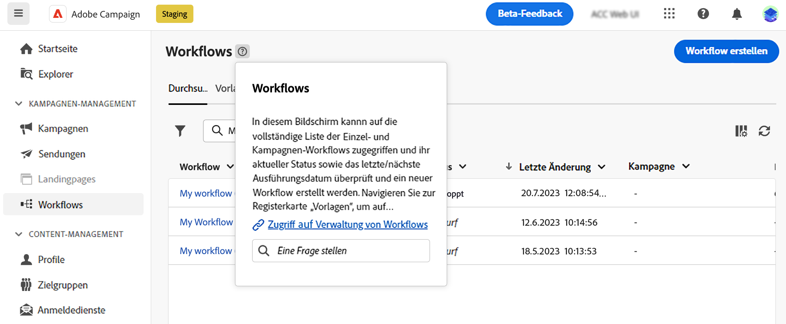

# Verwenden des KI-gestützten Knowledge Assistant {#using-ai}

Mit dem KI-gestützten Knowkedge-Assistenten erhalten Sie auf der Basis der Produktdokumentation und Ihres aktuellen Produktkontexts schnelle und KI-generierte Antworten, die in den kontextbezogenen Hilfefeldern des Produkts verfügbar sind.

>[!AVAILABILITY]
>
>Diese Funktion wird Anfang Oktober verfügbar sein.

Die **Knowledge Assistant bei Gen AI** eingebettet in die kontextuelle Hilfe revolutioniert die Dokumentationssuche und Beantwortung von Fragen durch mühelose Durchblättern von umfangreichen Dokumentations-Repositorys und zeigt sofort die benötigten Informationen an.

Dank der Funktionen von Campaign Gen AI verändert dieser Assistent Ihr Erlebnis, indem er Informationen abruft und Probleme löst. Unsere Wissensassistentin mit Gen AI ist Ihr ultimativer Begleiter für komplexe Aufgaben oder für die Navigation in umfangreichen Dokumenten. Sie bietet Ihnen dabei höchste Effizienz und Genauigkeit in jeder Interaktion.

{width="70%" align="left"}

<!--
## Consent {#consent-ai}

Campaign knowledge assistant embeeded in the contextual help boxes uses AI. Your use of this capability constitutes consent that the information you provide in your session will be collected, used, disclosed, and retained by Adobe in accordance with the terms of Adobe's Customer Feedback Program. Please do not provide any personal information about yourself or other parties (including your name or contact information) in the knowledge assistant.

## Privacy {#privacy-ai}

Your data is encrypted and private following our standard data protection practices. Learn more about [Adobe Privacy Policies](https://www.adobe.com/privacy/policy.html){target="_blank"}.

The knowledge assistant AI capability does not use your data to train our models. We do not allow any partners or 3rd parties to use your data for training their models or any other purpose.

For information specific to Adobe AI policies in Experience Cloud apps and solutions, refer to [this page](https://business.adobe.com/products/sensei/adobe-sensei.html){target="_blank"}.
-->

## Antworten {#answers-ai}

Antworten können ungenau oder irreführend sein. Infolgedessen kann ein Adobe-Wissensassistent falsche Informationen ausgeben. Überprüfen Sie die Produktdokumentation, die in jedem Hilfesystem verknüpft ist.

Künstliche Intelligenz und Modelle des maschinellen Lernens werden im Laufe der Zeit verbessert, um bestimmte Anwendungsfälle besser anzugehen. Kampagnen-KI-gestützte Wissensassistent wird in den kommenden Monaten weiter besser werden. Wir empfehlen Ihnen dringend, das ?? ?? Schaltflächen immer wenn Sie eine Antwort lesen, um unangemessene Antworten auf unsere Ingenieure zu kennzeichnen.

## Empfehlungen  {#recommendations-ai}

Bei der Frage im KI-gestützten Knowledge Assistant wird der aktuelle Produktkontext, d. h. der Kampagnenbildschirm, in dem Sie sich befinden, berücksichtigt.

Wenn Sie eine Frage stellen, empfehlen wir Ihnen Folgendes, um das Beste aus der KI-gestützten Knowledge Assistant zu erhalten:

* So präzise und spezifisch wie möglich sein und Unklarheiten vermeiden. Die Antwort wird genauer und hilfreicher sein.
* Um den KI-gestützten Wissensassistenten bei der Suche nach den richtigen Informationen zu unterstützen, fügen Sie so viele Details wie möglich zu dem hinzu, was Sie versuchen zu lernen.
* Nehmen Sie Ihre Fragen neu auf und verfeinern Sie sie, um bessere Antworten zu erhalten. Wenn die Antwort nicht präzise oder nützlich ist, versuchen Sie verschiedene Ansätze und fügen Sie Kontext hinzu, um bessere Ergebnisse zu erzielen.
* Verwenden Sie geeignete Begriffe und Formulierungen mit einem neutralen Ton.
* Bewerten Sie die Antworten und geben Sie Feedback, damit unsere Ingenieure aus Ihren Erfahrungen lernen und die Ergebnisse verbessern können.

