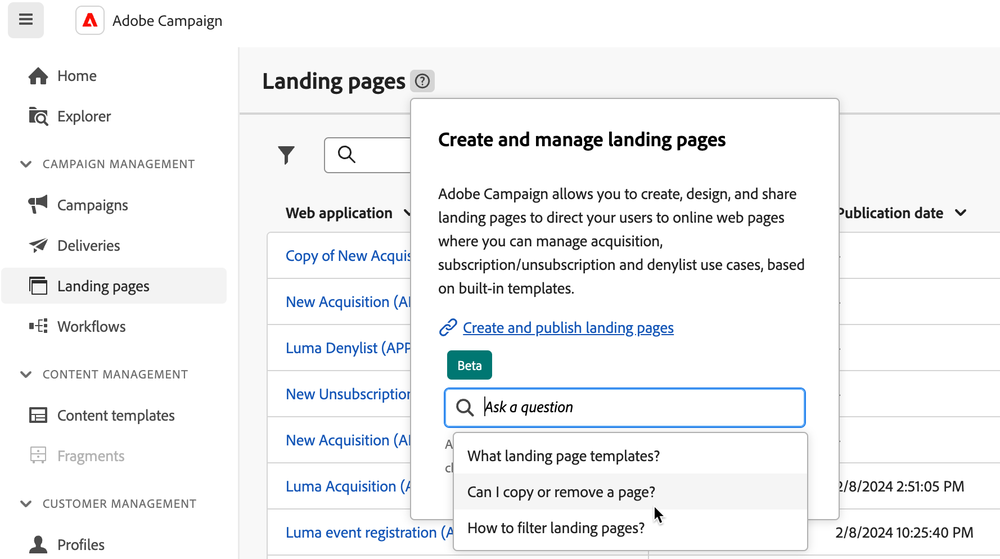

# KI-gestützte Kontexthilfe {#using-ai}

Die KI-gestützte F&amp;A-Kontexthilfe in den Produkt-Kontexthilfefeldern liefert Ihnen schnelle KI-gestützte Antworten auf Grundlage der Produktdokumentation und Ihres aktuellen Produktkontexts.

Die in die Kontexthilfe integrierte **Kontexthilfe mit Gen AI** revolutioniert die Durchsuchung von Dokumenten und Beantwortung von Fragen, indem sie riesige Dokumentations-Repositorys mühelos durchsucht und die gewünschten Informationen unverzüglich anzeigt.

Dank der Funktionen von Campaign Gen AI verwandelt diese Komponente Ihr Erlebnis völlig und macht das Abrufen von Informationen und die Problembehebung zu einem Kinderspiel. Ob Sie Hilfe bei einer komplexen Aufgabe oder beim Navigieren durch umfangreiche Dokumente brauchen – unsere KI-gestützte Kontexthilfe ist Ihr ultimativer Begleiter und bietet Ihnen bei jeder Interaktion höchste Effizienz und Präzision.

>[!AVAILABILITY]
>
>* Die KI-gestützte Kontexthilfe ist als Beta-Version verfügbar und kann ohne vorherige Ankündigung geändert werden.
>
>* Diese Funktion ist nur auf **Englisch** verfügbar. Andere Sprachen werden in dieser Version nicht unterstützt. Vergewissern Sie sich deshalb, dass [Ihre bevorzugte Sprache](connect-to-campaign.md#language-pref) auf Englisch eingestellt ist, bevor Sie diese Funktion nutzen.
>
>* Die KI-gestützte Kontexthilfe ist derzeit im E-Mail-Designer von Campaign nicht verfügbar.

<!--
## Consent {#consent-ai}

Campaign knowledge assistant embeeded in the contextual help boxes uses AI. Your use of this capability constitutes consent that the information you provide in your session will be collected, used, disclosed, and retained by Adobe in accordance with the terms of Adobe's Customer Feedback Program. Please do not provide any personal information about yourself or other parties (including your name or contact information) in the knowledge assistant.

## Privacy {#privacy-ai}

Your data is encrypted and private following our standard data protection practices. Learn more about [Adobe Privacy Policies](https://www.adobe.com/privacy/policy.html){target="_blank"}.

The knowledge assistant AI capability does not use your data to train our models. We do not allow any partners or 3rd parties to use your data for training their models or any other purpose.

For information specific to Adobe AI policies in Experience Cloud apps and solutions, refer to [this page](https://business.adobe.com/products/sensei/adobe-sensei.html){target="_blank"}.
-->

## Vorgeschlagene Fragen {#questions-ai}

Im Eingabefeld bietet die KI-gestützte Kontexthilfe von Adobe Campaign drei Fragen. Diese Fragen werden von KI generiert und beziehen sich auf das Hilfefeld und den aktuellen Produktkontext. Wählen Sie eine Frage aus, um die Antwort zu erhalten.

{width="600" align="left"}{zoomable="yes"}

## Antworten {#answers-ai}

Die KI-gestützte Kontexthilfe von Adobe Campaign bietet Unterstützung, aber Sie sollten dennoch die Fakten überprüfen. Er kann falsche Informationen, ungenaue oder irreführende Antworten ausgeben. Überprüfen Sie die Produktdokumentation, die in jedem Hilfefeld verlinkt ist.

Sie können eine Antwort mithilfe des Symbols **Kopieren** am unteren Rand des Hilfe-Popups in die Zwischenablage kopieren.

{width="600" align="left"}{zoomable="yes"}

## Feedback {#feedback-ai}

Künstliche Intelligenz und Modelle des maschinellen Lernens werden im Laufe der Zeit verbessert, um besser auf bestimmte Anwendungsfälle einzugehen. Die KI-gestützte Kontexthilfe von Campaign wird in den kommenden Monaten immer besser werden. Wir empfehlen Ihnen dringend, jedes Mal die -Schaltflächen zu verwenden, wenn Sie eine Antwort lesen, um unser technisches Personal auf unangemessene Antworten hinzuweisen.

## Empfehlungen  {#recommendations-ai}

Wenn Sie in der KI-gestützten Kontexthilfe eine Frage stellen, werden der aktuelle Produktkontext, d. h. der Bildschirm, auf dem Sie sich befinden, und der Inhalt des aktuellen Hilfefelds berücksichtigt.

Daher lautet die Best Practice, Fragen in Bezug auf den Kontext der Benutzeroberfläche zu stellen. Wenn Sie beispielsweise erfahren wollen, wie Sie einen Push-Versand in einem Workflow senden, navigieren Sie zum **Workflow**-Menüeintrag links und verwenden Sie in diesem Kontext ein kontextbezogenes Hilfefeld. Um mehr über Berichtsmetriken zu erfahren, navigieren Sie zu den Kampagnen- oder Versandberichten und beginnen Sie von dort aus.

Um das Beste aus der KI-gestützten Kontexthilfe herauszuholen, empfehlen wir Ihnen außerdem, bei Fragen Folgendes zu beachten:

* Seien Sie so präzise und spezifisch wie möglich und vermeiden Sie Zweideutigkeiten. Die Antwort wird genauer und hilfreicher.
* Um die KI-gestützte Kontexthilfe bei der Suche nach den richtigen Informationen zu unterstützen, fügen Sie so viele Details wie möglich über das hinzu, was Sie lernen wollen.
* Formulieren Sie Ihre Fragen neu und spezifizieren Sie sie, um bessere Antworten zu erhalten. Wenn die Antwort nicht präzise oder nützlich ist, versuchen Sie verschiedene Ansätze und fügen Sie mehr Kontext hinzu, um bessere Ergebnisse zu erzielen.
* Verwenden Sie geeignete Begriffe und Formulierungen mit neutralem Ton.
* Bewerten Sie die Antworten und geben Sie Feedback, damit unsere Ingenieure und Ingenieurinnen aus Ihren Erfahrungen lernen und die Ergebnisse verbessern können.
