<?xml version="1.0" encoding="UTF-8"?>
<xliff xmlns="urn:oasis:names:tc:xliff:document:1.2" xmlns:okp="okapi-framework:xliff-extensions" xmlns:its="http://www.w3.org/2005/11/its" xmlns:itsxlf="http://www.w3.org/ns/its-xliff/" version="1.2" its:version="2.0">
<file original="help/v8/get-started/work-with-folders.md.mdsc" source-language="en-US" target-language="en-XX" datatype="x-text/markdown">
<body>
<trans-unit id="tu22" xml:space="preserve">
<source xml:lang="en-US">https://experienceleague.adobe.com/docs/campaign/campaign-v8/permissions/manage-permissions.html#use-named-rights</source>
<target xml:lang="en-XX">https://experienceleague.adobe.com/de/docs/campaign/campaign-v8/permissions/manage-permissions#use-named-rights</target>
</trans-unit>
<trans-unit id="tu34" xml:space="preserve">
<source xml:lang="en-US">https://experienceleague.adobe.com/en/docs/campaign/campaign-v8/config/configuration/folders-and-views</source>
<target xml:lang="en-XX">https://experienceleague.adobe.com/de/docs/campaign/campaign-v8/config/configuration/folders-and-views</target>
</trans-unit>
<trans-unit id="tu1" restype="x-YAML_METADATA_HEADER_VALUE" xml:space="preserve">
<source xml:lang="en-US">Work with Folders</source>
<target xml:lang="en-XX">Arbeiten mit Ordnern</target>
</trans-unit>
<trans-unit id="tu2" restype="x-YAML_METADATA_HEADER_VALUE" xml:space="preserve">
<source xml:lang="en-US">Learn how to manage a folder in Adobe Campaign</source>
<target xml:lang="en-XX">Erfahren Sie, wie Sie in Adobe Campaign einen Ordner verwalten.</target>
</trans-unit>
<trans-unit id="tu3" xml:space="preserve">
<source xml:lang="en-US">Work with folders</source>
<target xml:lang="en-XX">Arbeiten mit Ordnern</target>
</trans-unit>
<trans-unit id="tu4" xml:space="preserve">
<source xml:lang="en-US">Folder properties</source>
<target xml:lang="en-XX">Ordnereigenschaften</target>
</trans-unit>
<trans-unit id="tu5" xml:space="preserve">
<source xml:lang="en-US">Folder properties</source>
<target xml:lang="en-XX">Ordnereigenschaften</target>
</trans-unit>
<trans-unit id="tu6" xml:space="preserve">
<source xml:lang="en-US">Folder security</source>
<target xml:lang="en-XX">Ordnersicherheit</target>
</trans-unit>
<trans-unit id="tu7" xml:space="preserve">
<source xml:lang="en-US">Folder security</source>
<target xml:lang="en-XX">Ordnersicherheit</target>
</trans-unit>
<trans-unit id="tu8" xml:space="preserve">
<source xml:lang="en-US">Folder schedule</source>
<target xml:lang="en-XX">Ordnerzeitplan</target>
</trans-unit>
<trans-unit id="tu9" xml:space="preserve">
<source xml:lang="en-US">Folder schedule</source>
<target xml:lang="en-XX">Ordnerzeitplan</target>
</trans-unit>
<trans-unit id="tu10" xml:space="preserve">
<source xml:lang="en-US">About folders</source>
<target xml:lang="en-XX">Über Ordner</target>
</trans-unit>
<trans-unit id="tu11" xml:space="preserve">
<source xml:lang="en-US">Folders are objects in Adobe Campaign that allow you to organize your components and data.</source>
<target xml:lang="en-XX">Ordner sind Objekte in Adobe Campaign zur Organisation Ihrer Komponenten und Daten.</target>
</trans-unit>
<trans-unit id="tu12" xml:space="preserve">
<source xml:lang="en-US">You can create, rename, reorder, and move folders in the navigation tree. You can also delete them based on your rights.</source>
<target xml:lang="en-XX">Sie können Ordner im Navigationsbaum erstellen, umbenennen, neu anordnen und verschieben. Sie können sie auch basierend auf Ihren Bedürfnissen löschen.</target>
</trans-unit>
<trans-unit id="tu13" xml:space="preserve">
<source xml:lang="en-US"><ph id="1" ctype="x-IMAGE">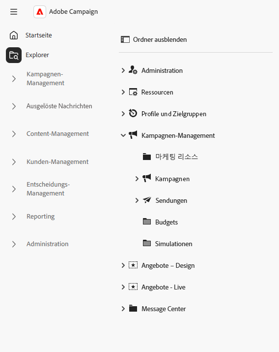{zoomable="yes"}</ph></source>
<target xml:lang="en-XX"><ph id="1" ctype="x-IMAGE">{zoomable="yes"}</ph></target>
</trans-unit>
<trans-unit id="tu14" xml:space="preserve">
<source xml:lang="en-US">You can set up a folder type. For example, a folder of deliveries. The folder icon changes according to its type.</source>
<target xml:lang="en-XX">Sie können einen Ordnertyp einrichten. Zum Beispiel einen Ordner mit Sendungen. Das Ordnersymbol ändert sich je nach Typ.</target>
</trans-unit>
<trans-unit id="tu15" xml:space="preserve">
<source xml:lang="en-US">Folder restrictions</source>
<target xml:lang="en-XX">Ordnereinschränkungen</target>
</trans-unit>
<trans-unit id="tu16" xml:space="preserve">
<source xml:lang="en-US">The folders Objects created automatically and Technical workflows are restricted, and cannot be viewed on the left side panel.</source>
<target xml:lang="en-XX">Die Ordner „Automatisch erstellte Objekte“ und „Technische Workflows“ sind eingeschränkt und können im linken Seiten-Panel nicht angezeigt werden.</target>
</trans-unit>
<trans-unit id="tu17" xml:space="preserve">
<source xml:lang="en-US"><ph id="1" ctype="x-regxph" equiv-text="[!IMPORTANT">[!IMPORTANT]</ph></source>
<target xml:lang="en-XX"><ph id="1" ctype="x-regxph" equiv-text="[!IMPORTANT">[!IMPORTANT]</ph></target>
</trans-unit>
<trans-unit id="tu18" xml:space="preserve">
<source xml:lang="en-US">The folders <ph id="1" ctype="x-STRONG_EMPHASIS">**[!UICONTROL </ph>Objects created automatically<ph id="3" ctype="x-LINK_REF">]**</ph> and <ph id="5" ctype="x-STRONG_EMPHASIS">**[!UICONTROL </ph>Technical workflows<ph id="7" ctype="x-LINK_REF">]**</ph> are restricted, and cannot be viewed on the left side panel.</source>
<target xml:lang="en-XX">Die Ordner <ph id="1" ctype="x-STRONG_EMPHASIS">**[!UICONTROL </ph>Automatisch erstellte Objekte<ph id="3" ctype="x-LINK_REF">]**</ph> und <ph id="5" ctype="x-STRONG_EMPHASIS">**[!UICONTROL </ph>Technische Workflows<ph id="7" ctype="x-LINK_REF">]**</ph> sind eingeschränkt und können im linken Seiten-Panel nicht angezeigt werden.</target>
</trans-unit>
<trans-unit id="tu19" xml:space="preserve">
<source xml:lang="en-US">The actions available to you on a folder depend on the rights you have been granted on it. The <ph id="1" ctype="x-STRONG_EMPHASIS">**[!UICONTROL </ph>Folder settings<ph id="3" ctype="x-LINK_REF">]**</ph> dialog may open in <ph id="5" ctype="x-STRONG_EMPHASIS">**</ph>read-only mode<ph id="6" ctype="x-STRONG_EMPHASIS">**</ph>, and some actions or sections may not be available, depending on your rights.</source>
<target xml:lang="en-XX">Welche Aktionen Ihnen für einen Ordner zur Verfügung stehen, hängt davon ab, welche Berechtigungen Ihnen dafür gewährt wurden. Je nach Ihren Berechtigungen wird das Dialogfeld <ph id="1" ctype="x-STRONG_EMPHASIS">**[!UICONTROL </ph>Ordnereinstellungen<ph id="3" ctype="x-LINK_REF">]**</ph> möglicherweise im <ph id="5" ctype="x-STRONG_EMPHASIS">**</ph>schreibgeschützten Modus<ph id="6" ctype="x-STRONG_EMPHASIS">**</ph> geöffnet und einige Aktionen oder Abschnitte sind vielleicht nicht verfügbar.</target>
</trans-unit>
<trans-unit id="tu20" xml:space="preserve">
<source xml:lang="en-US">Contact your administrator if you are missing rights on a folder. Refer to this <ph id="1" ctype="x-LINK">[</ph>section<ph id="2" ctype="x-LINK">](permissions.md#folder-permissions)</ph> to learn how folder permissions are managed.</source>
<target xml:lang="en-XX">Wenden Sie sich an Ihre bzw. Ihren Admin, wenn Ihnen Berechtigungen für einen Ordner fehlen. In diesem <ph id="1" ctype="x-LINK">[</ph>Abschnitt<ph id="2" ctype="x-LINK">](permissions.md#folder-permissions)</ph> erfahren Sie, wie Ordnerberechtigungen verwaltet werden.</target>
</trans-unit>
<trans-unit id="tu21" xml:space="preserve">
<source xml:lang="en-US">Named rights such as <ph id="1" ctype="x-STRONG_EMPHASIS">**[!UICONTROL </ph>Insert Folders<ph id="3" ctype="x-LINK_REF">]**</ph>, <ph id="5" ctype="x-STRONG_EMPHASIS">**[!UICONTROL </ph>Edit Folders<ph id="7" ctype="x-LINK_REF">]**</ph>, and <ph id="9" ctype="x-STRONG_EMPHASIS">**[!UICONTROL </ph>Delete Folder<ph id="11" ctype="x-LINK_REF">]**</ph> also determine which folder actions are available to an operator. Refer to the <ph id="13" ctype="x-LINK">[</ph>Campaign v8 documentation<ph id="14" ctype="x-LINK">[#$tu22]{target="_blank"}</ph>.</source>
<target xml:lang="en-XX">Spezifische Berechtigungen wie <ph id="1" ctype="x-STRONG_EMPHASIS">**[!UICONTROL </ph>Ordner einfügen<ph id="3" ctype="x-LINK_REF">]**</ph>, <ph id="5" ctype="x-STRONG_EMPHASIS">**[!UICONTROL </ph>Ordner bearbeiten<ph id="7" ctype="x-LINK_REF">]**</ph> und <ph id="9" ctype="x-STRONG_EMPHASIS">**[!UICONTROL </ph>Ordner löschen<ph id="11" ctype="x-LINK_REF">]**</ph> bestimmen auch, welche Ordneraktionen einer Benutzerin bzw. einem Benutzer zur Verfügung stehen. Weitere Informationen finden Sie in der <ph id="13" ctype="x-LINK">[</ph>Dokumentation zu Campaign v8<ph id="14" ctype="x-LINK">[#$tu22]{target="_blank"}</ph>.</target>
</trans-unit>
<trans-unit id="tu23" xml:space="preserve">
<source xml:lang="en-US">Create a new folder</source>
<target xml:lang="en-XX">Erstellen eines neuen Ordners</target>
</trans-unit>
<trans-unit id="tu24" xml:space="preserve">
<source xml:lang="en-US">To create a new folder in Adobe Campaign Web UI, follow these steps:</source>
<target xml:lang="en-XX">Gehen Sie wie folgt vor, um in der Adobe Campaign Web-Benutzeroberfläche einen neuen Ordner zu erstellen:</target>
</trans-unit>
<trans-unit id="tu25" xml:space="preserve">
<source xml:lang="en-US">In <ph id="1" ctype="x-STRONG_EMPHASIS">**[!UICONTROL </ph>Explorer<ph id="3" ctype="x-LINK_REF">]**</ph>, go to the folder where you want to create your new folder. Under the <ph id="5" ctype="x-STRONG_EMPHASIS">**[!UICONTROL </ph>...<ph id="7" ctype="x-LINK_REF">]**</ph> menu, select <ph id="9" ctype="x-STRONG_EMPHASIS">**[!UICONTROL </ph>Create new folder<ph id="11" ctype="x-LINK_REF">]**</ph>.</source>
<target xml:lang="en-XX">Navigieren Sie dazu im <ph id="1" ctype="x-STRONG_EMPHASIS">**[!UICONTROL </ph>Explorer<ph id="3" ctype="x-LINK_REF">]**</ph> zu dem Ordner, in dem Sie Ihren neuen Ordner erstellen möchten. Wählen Sie im Menü <ph id="5" ctype="x-STRONG_EMPHASIS">**[!UICONTROL </ph>…<ph id="7" ctype="x-LINK_REF">]**</ph> die Option <ph id="9" ctype="x-STRONG_EMPHASIS">**[!UICONTROL </ph>Neuen Ordner erstellen<ph id="11" ctype="x-LINK_REF">]**</ph> aus.</target>
</trans-unit>
<trans-unit id="tu26" xml:space="preserve">
<source xml:lang="en-US"><ph id="1" ctype="x-IMAGE">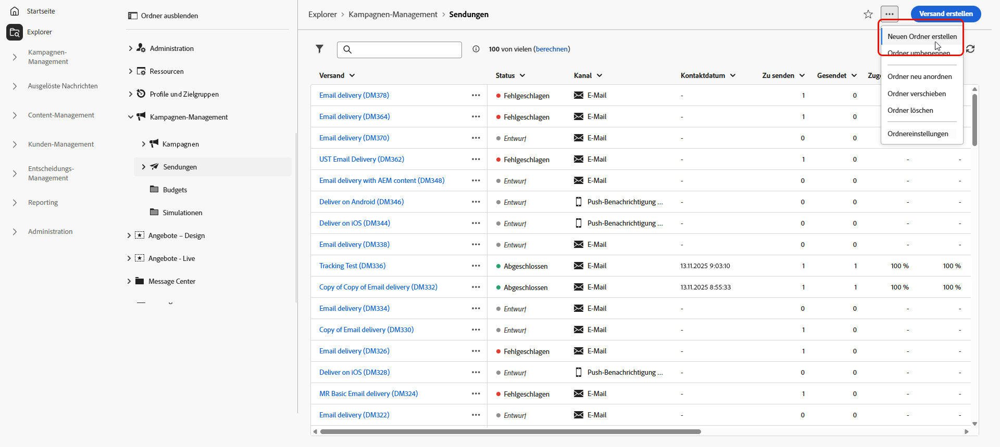{zoomable="yes"}</ph></source>
<target xml:lang="en-XX"><ph id="1" ctype="x-IMAGE">{zoomable="yes"}</ph></target>
</trans-unit>
<trans-unit id="tu27" xml:space="preserve">
<source xml:lang="en-US">When you create a new folder, the folder type defaults to the type of the parent folder. In this example, a folder is created in the <ph id="1" ctype="x-STRONG_EMPHASIS">**[!UICONTROL </ph>Deliveries<ph id="3" ctype="x-LINK_REF">]**</ph> folder.</source>
<target xml:lang="en-XX">Wenn Sie einen neuen Ordner erstellen, ist der Ordnertyp standardmäßig vom selben Typ wie der übergeordnete Ordner. In diesem Beispiel wird ein Ordner im Ordner <ph id="1" ctype="x-STRONG_EMPHASIS">**[!UICONTROL </ph>Sendungen<ph id="3" ctype="x-LINK_REF">]**</ph> erstellt.</target>
</trans-unit>
<trans-unit id="tu28" xml:space="preserve">
<source xml:lang="en-US"><ph id="1" ctype="x-IMAGE">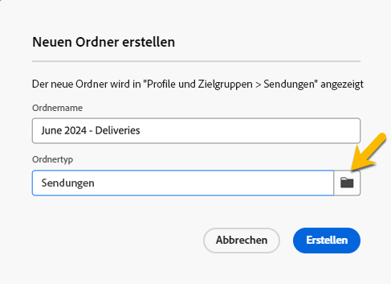{zoomable="yes"}</ph></source>
<target xml:lang="en-XX"><ph id="1" ctype="x-IMAGE">{zoomable="yes"}</ph></target>
</trans-unit>
<trans-unit id="tu29" xml:space="preserve">
<source xml:lang="en-US">Change the folder type by clicking on the folder type icon if needed, and select the desired type from the list presented, as shown below:</source>
<target xml:lang="en-XX">Ändern Sie bei Bedarf den Typ des Ordners, indem Sie auf das Symbol des Ordnertyps klicken, und wählen Sie den gewünschten Typ in der angezeigten Liste aus, wie unten dargestellt:</target>
</trans-unit>
<trans-unit id="tu30" xml:space="preserve">
<source xml:lang="en-US"><ph id="1" ctype="x-IMAGE">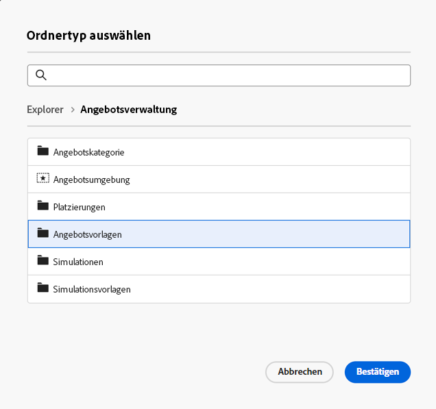{zoomable="yes"}</ph></source>
<target xml:lang="en-XX"><ph id="1" ctype="x-IMAGE">{zoomable="yes"}</ph></target>
</trans-unit>
<trans-unit id="tu31" xml:space="preserve">
<source xml:lang="en-US">Set up the folder type by clicking the <ph id="1" ctype="x-STRONG_EMPHASIS">**[!UICONTROL </ph>Confirm<ph id="3" ctype="x-LINK_REF">]**</ph> button.</source>
<target xml:lang="en-XX">Richten Sie den Ordnertyp ein, indem Sie auf die Schaltfläche <ph id="1" ctype="x-STRONG_EMPHASIS">**[!UICONTROL </ph>Bestätigen<ph id="3" ctype="x-LINK_REF">]**</ph> klicken.</target>
</trans-unit>
<trans-unit id="tu32" xml:space="preserve">
<source xml:lang="en-US">If you want to create a folder with no specific type, select the <ph id="1" ctype="x-STRONG_EMPHASIS">**[!UICONTROL </ph>Generic Folder<ph id="3" ctype="x-LINK_REF">]**</ph> type.</source>
<target xml:lang="en-XX">Wenn Sie einen Ordner ohne bestimmten Typ erstellen möchten, wählen Sie den Typ <ph id="1" ctype="x-STRONG_EMPHASIS">**[!UICONTROL </ph>Allgemeiner Ordner<ph id="3" ctype="x-LINK_REF">]**</ph> aus.</target>
</trans-unit>
<trans-unit id="tu33" xml:space="preserve">
<source xml:lang="en-US">You can also <ph id="1" ctype="x-LINK">[</ph>create and manage folders in Adobe Campaign console<ph id="2" ctype="x-LINK">[#$tu34]</ph>.</source>
<target xml:lang="en-XX">Sie können auch <ph id="1" ctype="x-LINK">[</ph>Ordner in der Adobe Campaign-Konsole erstellen und verwalten<ph id="2" ctype="x-LINK">[#$tu34]</ph>.</target>
</trans-unit>
<trans-unit id="tu35" xml:space="preserve">
<source xml:lang="en-US">Reorder folders</source>
<target xml:lang="en-XX">Neuanordnen von Ordner</target>
</trans-unit>
<trans-unit id="tu36" xml:space="preserve">
<source xml:lang="en-US">You can reorder folders based on your needs. To do so, click on <ph id="1" ctype="x-STRONG_EMPHASIS">**[!UICONTROL </ph>Reorder folders<ph id="3" ctype="x-LINK_REF">]**</ph>, as shown below.</source>
<target xml:lang="en-XX">Sie können die Ordner Ihren Bedürfnissen entsprechend neu anordnen. Klicken Sie dazu auf <ph id="1" ctype="x-STRONG_EMPHASIS">**[!UICONTROL </ph>Ordner neu anordnen<ph id="3" ctype="x-LINK_REF">]**</ph>, wie unten dargestellt.</target>
</trans-unit>
<trans-unit id="tu37" xml:space="preserve">
<source xml:lang="en-US">In this example, the <ph id="1" ctype="x-STRONG_EMPHASIS">**</ph>Deliveries<ph id="2" ctype="x-STRONG_EMPHASIS">**</ph> folder contains four subfolders.</source>
<target xml:lang="en-XX">In diesem Beispiel enthält der Ordner <ph id="1" ctype="x-STRONG_EMPHASIS">**</ph>Sendungen<ph id="2" ctype="x-STRONG_EMPHASIS">**</ph> vier Unterordner.</target>
</trans-unit>
<trans-unit id="tu38" xml:space="preserve">
<source xml:lang="en-US"><ph id="1" ctype="x-IMAGE">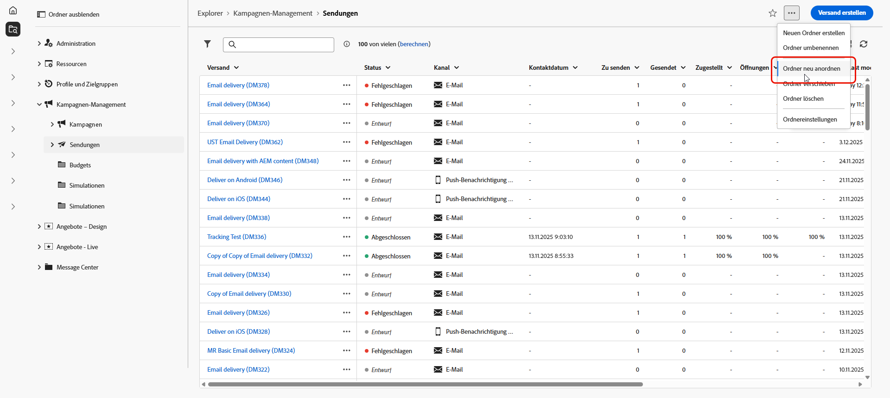{zoomable="yes"}</ph></source>
<target xml:lang="en-XX"><ph id="1" ctype="x-IMAGE">{zoomable="yes"}</ph></target>
</trans-unit>
<trans-unit id="tu39" xml:space="preserve">
<source xml:lang="en-US">You can change the order of folders either by <ph id="1" ctype="x-STRONG_EMPHASIS">**</ph>drag and drop<ph id="2" ctype="x-STRONG_EMPHASIS">**</ph> or by using <ph id="3" ctype="x-STRONG_EMPHASIS">**</ph>up and down arrows<ph id="4" ctype="x-STRONG_EMPHASIS">**</ph>.</source>
<target xml:lang="en-XX">Sie können die Reihenfolge der Ordner entweder durch <ph id="1" ctype="x-STRONG_EMPHASIS">**</ph>Ziehen und Ablegen<ph id="2" ctype="x-STRONG_EMPHASIS">**</ph> oder durch Verwendung der <ph id="3" ctype="x-STRONG_EMPHASIS">**</ph>Nach-oben- und Nach-unten-Taste<ph id="4" ctype="x-STRONG_EMPHASIS">**</ph> ändern.</target>
</trans-unit>
<trans-unit id="tu40" xml:space="preserve">
<source xml:lang="en-US"><ph id="1" ctype="x-IMAGE">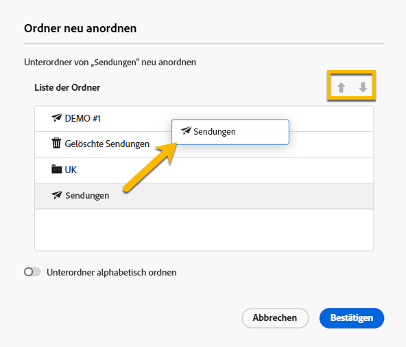{zoomable="yes"}</ph></source>
<target xml:lang="en-XX"><ph id="1" ctype="x-IMAGE">{zoomable="yes"}</ph></target>
</trans-unit>
<trans-unit id="tu41" xml:space="preserve">
<source xml:lang="en-US">Favorite folders</source>
<target xml:lang="en-XX">Favoritenordner</target>
</trans-unit>
<trans-unit id="tu42" xml:space="preserve">
<source xml:lang="en-US">Favorites</source>
<target xml:lang="en-XX">Favoriten</target>
</trans-unit>
<trans-unit id="tu43" xml:space="preserve">
<source xml:lang="en-US">Your favorite folders will be displayed at the top of the left tab.</source>
<target xml:lang="en-XX">Ihre Favoritenordner werden oben auf der linken Registerkarte angezeigt.</target>
</trans-unit>
<trans-unit id="tu44" xml:space="preserve">
<source xml:lang="en-US">The folders that have been marked as "Favorite" will always be shown at the top of the left tab.</source>
<target xml:lang="en-XX">Die als „Favorit“ gekennzeichneten Ordner werden immer oben auf der linken Registerkarte angezeigt.</target>
</trans-unit>
<trans-unit id="tu45" xml:space="preserve">
<source xml:lang="en-US">You can add folders as favorite by clicking on the star button at the top-right corner when viewing a folder.</source>
<target xml:lang="en-XX">Sie können Ordner zu den Favoriten hinzufügen, indem Sie beim Anzeigen eines Ordners auf die Sternschaltfläche oben rechts klicken.</target>
</trans-unit>
<trans-unit id="tu46" xml:space="preserve">
<source xml:lang="en-US"><ph id="1" ctype="x-IMAGE">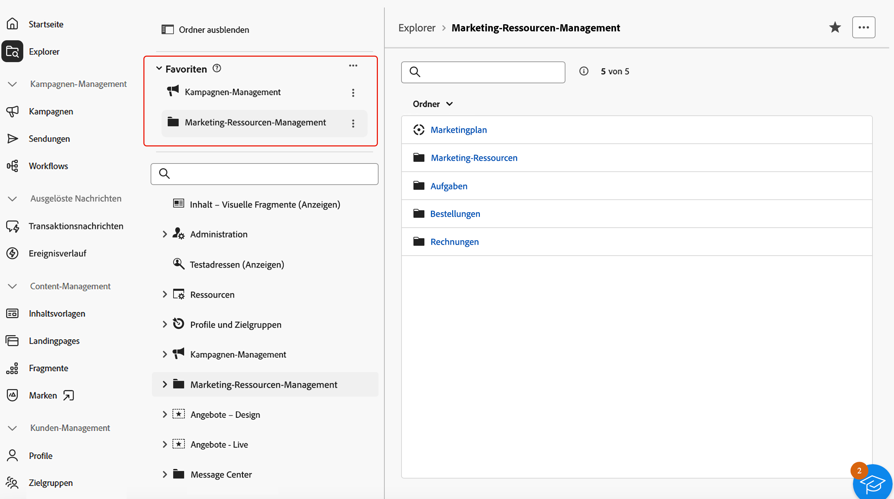{zoomable="yes"}</ph></source>
<target xml:lang="en-XX"><ph id="1" ctype="x-IMAGE">{zoomable="yes"}</ph></target>
</trans-unit>
<trans-unit id="tu47" xml:space="preserve">
<source xml:lang="en-US">Delete a folder</source>
<target xml:lang="en-XX">Löschen eines Ordners</target>
</trans-unit>
<trans-unit id="tu48" xml:space="preserve">
<source xml:lang="en-US"><ph id="1" ctype="x-regxph" equiv-text="[!CAUTION">[!CAUTION]</ph></source>
<target xml:lang="en-XX"><ph id="1" ctype="x-regxph" equiv-text="[!CAUTION">[!CAUTION]</ph></target>
</trans-unit>
<trans-unit id="tu49" xml:space="preserve">
<source xml:lang="en-US">When deleting a folder, all data stored in the folder is also deleted.</source>
<target xml:lang="en-XX">Beim Löschen eines Ordners werden auch alle im Ordner gespeicherten Daten gelöscht.</target>
</trans-unit>
<trans-unit id="tu50" xml:space="preserve">
<source xml:lang="en-US">To delete a folder, select it in your <ph id="1" ctype="x-STRONG_EMPHASIS">**[!UICONTROL </ph>Explorer<ph id="3" ctype="x-LINK_REF">]**</ph> tree, and click on the <ph id="5" ctype="x-STRONG_EMPHASIS">**[!UICONTROL </ph>...<ph id="7" ctype="x-LINK_REF">]**</ph> menu. Choose <ph id="9" ctype="x-STRONG_EMPHASIS">**[!UICONTROL </ph>Delete folder<ph id="11" ctype="x-LINK_REF">]**</ph>.</source>
<target xml:lang="en-XX">Um einen Ordner zu löschen, wählen Sie ihn im <ph id="1" ctype="x-STRONG_EMPHASIS">**[!UICONTROL </ph>Explorer<ph id="3" ctype="x-LINK_REF">]**</ph>-Baum aus und klicken Sie auf das Menü <ph id="5" ctype="x-STRONG_EMPHASIS">**[!UICONTROL </ph>…<ph id="7" ctype="x-LINK_REF">]**</ph>. Wählen Sie <ph id="9" ctype="x-STRONG_EMPHASIS">**[!UICONTROL </ph>Ordner löschen<ph id="11" ctype="x-LINK_REF">]**</ph> aus.</target>
</trans-unit>
<trans-unit id="tu51" xml:space="preserve">
<source xml:lang="en-US"><ph id="1" ctype="x-IMAGE">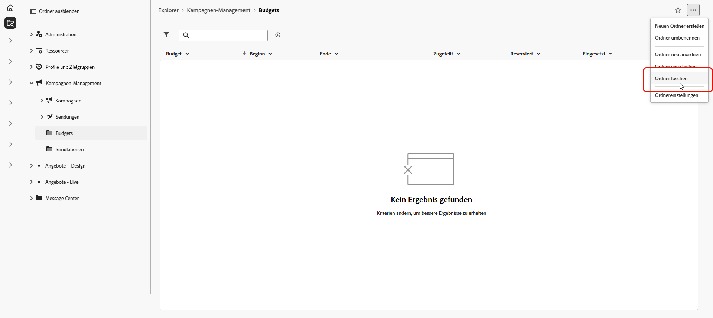{zoomable="yes"}</ph></source>
<target xml:lang="en-XX"><ph id="1" ctype="x-IMAGE">{zoomable="yes"}</ph></target>
</trans-unit>
<trans-unit id="tu52" xml:space="preserve">
<source xml:lang="en-US">Distribution of values in a folder</source>
<target xml:lang="en-XX">Werteverteilung in einem Ordner</target>
</trans-unit>
<trans-unit id="tu53" xml:space="preserve">
<source xml:lang="en-US">The distribution of values helps you understand the percentage of a value in a column within a table.</source>
<target xml:lang="en-XX">Die Werteverteilung hilft dabei, den Prozentsatz eines Werts in einer Spalte innerhalb einer Tabelle zu ermitteln.</target>
</trans-unit>
<trans-unit id="tu54" xml:space="preserve">
<source xml:lang="en-US">To view the distribution of values in a folder, proceed as explained below.</source>
<target xml:lang="en-XX">Um die Wertverteilung in einem Ordner anzuzeigen, gehen Sie wie folgt vor:</target>
</trans-unit>
<trans-unit id="tu55" xml:space="preserve">
<source xml:lang="en-US">For example, among the deliveries, you may want to know the distribution of values in the <ph id="1" ctype="x-STRONG_EMPHASIS">**</ph>Channel<ph id="2" ctype="x-STRONG_EMPHASIS">**</ph> column.</source>
<target xml:lang="en-XX">Sie möchten beispielsweise die Werteverteilung der Spalte <ph id="1" ctype="x-STRONG_EMPHASIS">**</ph>Kanal<ph id="2" ctype="x-STRONG_EMPHASIS">**</ph> unter den Sendungen ermitteln.</target>
</trans-unit>
<trans-unit id="tu56" xml:space="preserve">
<source xml:lang="en-US">To get this information, go to the <ph id="1" ctype="x-STRONG_EMPHASIS">**[!UICONTROL </ph>Deliveries<ph id="3" ctype="x-LINK_REF">]**</ph> folder and click the <ph id="5" ctype="x-STRONG_EMPHASIS">**[!UICONTROL </ph>Configure columns<ph id="7" ctype="x-LINK_REF">]**</ph> icon.</source>
<target xml:lang="en-XX">Um diese Informationen zu erhalten, gehen Sie zum Ordner <ph id="1" ctype="x-STRONG_EMPHASIS">**[!UICONTROL </ph>Sendungen<ph id="3" ctype="x-LINK_REF">]**</ph> und klicken Sie auf das Symbol <ph id="5" ctype="x-STRONG_EMPHASIS">**[!UICONTROL </ph>Spalten konfigurieren<ph id="7" ctype="x-LINK_REF">]**</ph>.</target>
</trans-unit>
<trans-unit id="tu57" xml:space="preserve">
<source xml:lang="en-US">In the <ph id="1" ctype="x-STRONG_EMPHASIS">**[!UICONTROL </ph>Configure columns<ph id="3" ctype="x-LINK_REF">]**</ph> window, click the <ph id="5" ctype="x-STRONG_EMPHASIS">**[!UICONTROL </ph>Information<ph id="7" ctype="x-LINK_REF">]**</ph> icon related to the column you want to analyze. Then, click on the <ph id="9" ctype="x-STRONG_EMPHASIS">**[!UICONTROL </ph>Distribution of values<ph id="11" ctype="x-LINK_REF">]**</ph> button.</source>
<target xml:lang="en-XX">Klicken Sie im Fenster <ph id="1" ctype="x-STRONG_EMPHASIS">**[!UICONTROL </ph>Spalten konfigurieren<ph id="3" ctype="x-LINK_REF">]**</ph> auf das Symbol <ph id="5" ctype="x-STRONG_EMPHASIS">**[!UICONTROL </ph>Informationen<ph id="7" ctype="x-LINK_REF">]**</ph> der Spalte, die Sie analysieren möchten. Klicken Sie dann auf die Schaltfläche <ph id="9" ctype="x-STRONG_EMPHASIS">**[!UICONTROL </ph>Werteverteilung<ph id="11" ctype="x-LINK_REF">]**</ph>.</target>
</trans-unit>
<trans-unit id="tu58" xml:space="preserve">
<source xml:lang="en-US"><ph id="1" ctype="x-IMAGE">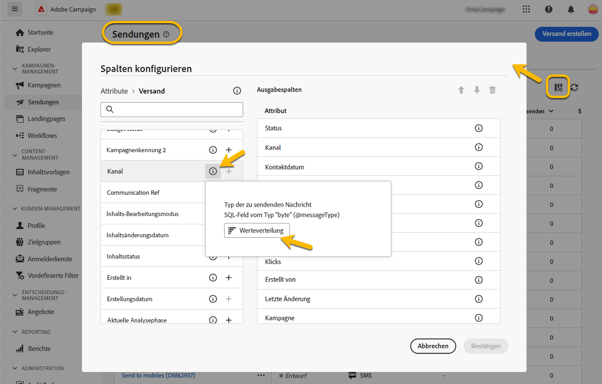{zoomable="yes"}</ph></source>
<target xml:lang="en-XX"><ph id="1" ctype="x-IMAGE">{zoomable="yes"}</ph></target>
</trans-unit>
<trans-unit id="tu59" xml:space="preserve">
<source xml:lang="en-US">You will see the percentage of values in the <ph id="1" ctype="x-STRONG_EMPHASIS">**[!UICONTROL </ph>Channel<ph id="3" ctype="x-LINK_REF">]**</ph> column.</source>
<target xml:lang="en-XX">Sie erhalten den Prozentsatz der Werte in der Spalte <ph id="1" ctype="x-STRONG_EMPHASIS">**[!UICONTROL </ph>Kanal<ph id="3" ctype="x-LINK_REF">]**</ph>.</target>
</trans-unit>
<trans-unit id="tu60" xml:space="preserve">
<source xml:lang="en-US"><ph id="1" ctype="x-IMAGE">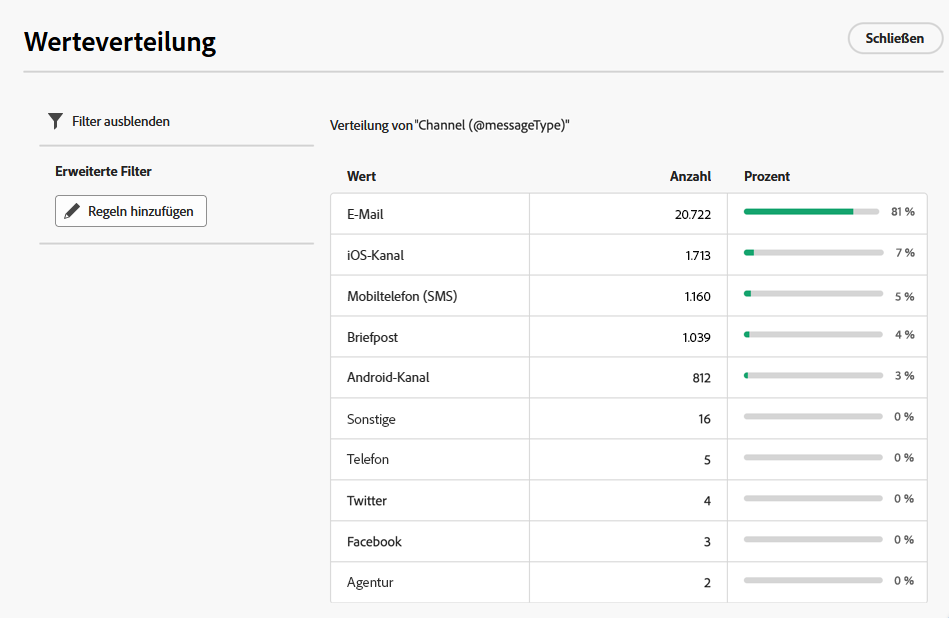{zoomable="yes"}</ph></source>
<target xml:lang="en-XX"><ph id="1" ctype="x-IMAGE">{zoomable="yes"}</ph></target>
</trans-unit>
<trans-unit id="tu61" xml:space="preserve">
<source xml:lang="en-US"><ph id="1" ctype="x-regxph" equiv-text="[!NOTE">[!NOTE]</ph></source>
<target xml:lang="en-XX"><ph id="1" ctype="x-regxph" equiv-text="[!NOTE">[!NOTE]</ph></target>
</trans-unit>
<trans-unit id="tu62" xml:space="preserve">
<source xml:lang="en-US">For columns with many values, only the first twenty values are displayed. A notification <ph id="1" ctype="x-STRONG_EMPHASIS">**[!UICONTROL </ph>Partial load<ph id="3" ctype="x-LINK_REF">]**</ph> warns you.</source>
<target xml:lang="en-XX">Bei Spalten mit vielen Werten werden nur die ersten zwanzig Werte angezeigt. Sie werden durch die Benachrichtigung <ph id="1" ctype="x-STRONG_EMPHASIS">**[!UICONTROL </ph>Teilladung<ph id="3" ctype="x-LINK_REF">]**</ph> gewarnt.</target>
</trans-unit>
<trans-unit id="tu63" xml:space="preserve">
<source xml:lang="en-US">You can also view the distribution of values for a link.</source>
<target xml:lang="en-XX">Sie können auch die Werteverteilung eines Links anzeigen.</target>
</trans-unit>
<trans-unit id="tu64" xml:space="preserve">
<source xml:lang="en-US">In the attributes list, click the <ph id="1" ctype="x-STRONG_EMPHASIS">**</ph>+<ph id="2" ctype="x-STRONG_EMPHASIS">**</ph> button next to the desired link, as shown below. This adds the link to the <ph id="3" ctype="x-STRONG_EMPHASIS">**[!UICONTROL </ph>Output columns<ph id="5" ctype="x-LINK_REF">]**</ph>. You can now access the <ph id="7" ctype="x-STRONG_EMPHASIS">**[!UICONTROL </ph>Information<ph id="9" ctype="x-LINK_REF">]**</ph> icon, allowing you to view the distribution of its values. If you do not want to keep the link in the <ph id="11" ctype="x-STRONG_EMPHASIS">**[!UICONTROL </ph>Output columns<ph id="13" ctype="x-LINK_REF">]**</ph>, click the <ph id="15" ctype="x-STRONG_EMPHASIS">**[!UICONTROL </ph>Cancel<ph id="17" ctype="x-LINK_REF">]**</ph> button.</source>
<target xml:lang="en-XX">Klicken Sie in der Attributliste auf die Schaltfläche <ph id="1" ctype="x-STRONG_EMPHASIS">**</ph>+<ph id="2" ctype="x-STRONG_EMPHASIS">**</ph> neben dem gewünschten Link, wie unten dargestellt. Dadurch wird der Link zu den <ph id="3" ctype="x-STRONG_EMPHASIS">**[!UICONTROL </ph>Ausgabespalten<ph id="5" ctype="x-LINK_REF">]**</ph> hinzugefügt. Jetzt können Sie auf das Symbol <ph id="7" ctype="x-STRONG_EMPHASIS">**[!UICONTROL </ph>Informationen<ph id="9" ctype="x-LINK_REF">]**</ph> zugreifen, über das Sie die Verteilung der Werte anzeigen können. Wenn Sie den Link nicht in den <ph id="11" ctype="x-STRONG_EMPHASIS">**[!UICONTROL </ph>Ausgabespalten<ph id="13" ctype="x-LINK_REF">]**</ph> beibehalten möchten, klicken Sie auf die Schaltfläche <ph id="15" ctype="x-STRONG_EMPHASIS">**[!UICONTROL </ph>Abbrechen<ph id="17" ctype="x-LINK_REF">]**</ph>.</target>
</trans-unit>
<trans-unit id="tu65" xml:space="preserve">
<source xml:lang="en-US"><ph id="1" ctype="x-IMAGE">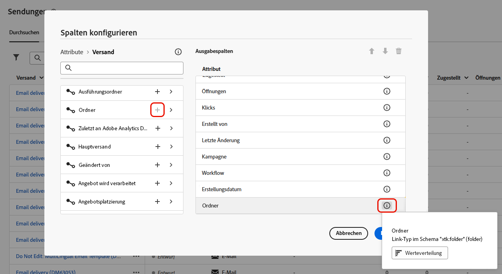{zoomable="yes"}</ph></source>
<target xml:lang="en-XX"><ph id="1" ctype="x-IMAGE">{zoomable="yes"}</ph></target>
</trans-unit>
<trans-unit id="tu66" xml:space="preserve">
<source xml:lang="en-US">It is also possible to view the distribution of values in a query modeler. <ph id="1" ctype="x-LINK">[</ph>Learn more here<ph id="2" ctype="x-LINK">](../query/build-query.md#distribution-of-values-in-a-query)</ph>.</source>
<target xml:lang="en-XX">Es ist auch möglich, die Werteverteilung in einem Abfrage-Modeler anzuzeigen. <ph id="1" ctype="x-LINK">[</ph>Weitere Informationen finden Sie hier<ph id="2" ctype="x-LINK">](../query/build-query.md#distribution-of-values-in-a-query)</ph>.</target>
</trans-unit>
<trans-unit id="tu67" xml:space="preserve">
<source xml:lang="en-US">Filter the values</source>
<target xml:lang="en-XX">Filtern der Werte</target>
</trans-unit>
<trans-unit id="tu68" xml:space="preserve">
<source xml:lang="en-US">By using the <ph id="1" ctype="x-STRONG_EMPHASIS">**[!UICONTROL </ph>Advanced filters<ph id="3" ctype="x-LINK_REF">]**</ph> in the distribution of values window, you can filter results based on specified conditions.</source>
<target xml:lang="en-XX">Mithilfe der <ph id="1" ctype="x-STRONG_EMPHASIS">**[!UICONTROL </ph>erweiterten Filter<ph id="3" ctype="x-LINK_REF">]**</ph> im Fenster „Werteverteilung“ können Sie Ergebnisse nach bestimmten Bedingungen filtern.</target>
</trans-unit>
<trans-unit id="tu69" xml:space="preserve">
<source xml:lang="en-US">In the example of the delivery list above, which shows the distribution per channel, you can filter it to display only deliveries with a status of <ph id="1" ctype="x-STRONG_EMPHASIS">**</ph>Finished<ph id="2" ctype="x-STRONG_EMPHASIS">**</ph>.</source>
<target xml:lang="en-XX">Im obigen Beispiel der Versandliste, in der die Verteilung nach Kanal erfolgt, können Sie sie so filtern, dass nur die Sendungen angezeigt werden, deren Status <ph id="1" ctype="x-STRONG_EMPHASIS">**</ph>Abgeschlossen<ph id="2" ctype="x-STRONG_EMPHASIS">**</ph> ist.</target>
</trans-unit>
<trans-unit id="tu70" xml:space="preserve">
<source xml:lang="en-US"><ph id="1" ctype="x-IMAGE">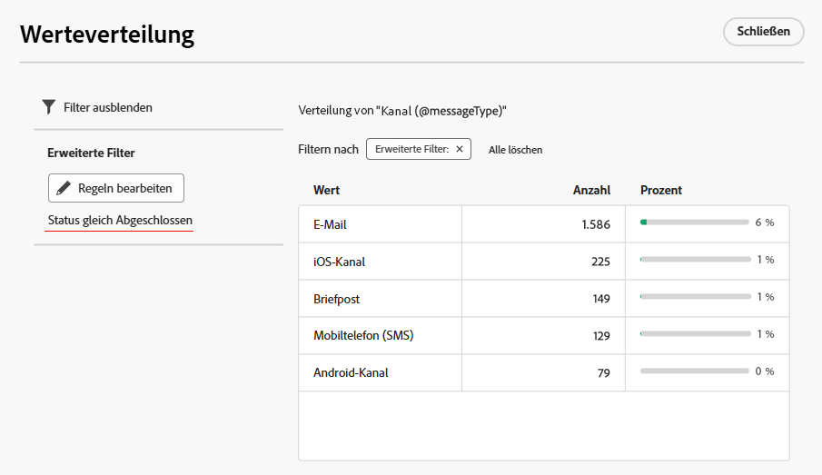{zoomable="yes"}</ph></source>
<target xml:lang="en-XX"><ph id="1" ctype="x-IMAGE">{zoomable="yes"}</ph></target>
</trans-unit>
</body>
</file>
</xliff>