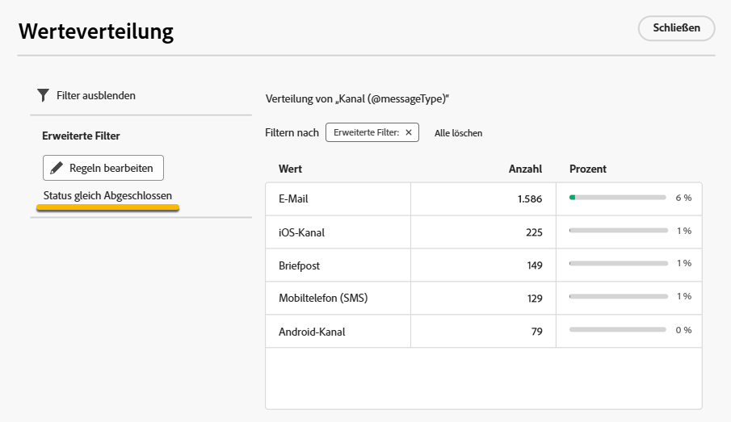

# Arbeiten mit Ordnern {#folders}

>[!CONTEXTUALHELP]
>id="acw_folder_properties"
>title="Ordnereigenschaften"
>abstract="Ordnereigenschaften"

>[!CONTEXTUALHELP]
>id="acw_folder_security"
>title="Ordnersicherheit"
>abstract="Ordnersicherheit"

>[!CONTEXTUALHELP]
>id="acw_folder_schedule"
>title="Ordnerzeitplan"
>abstract="Ordnerzeitplan"

## Über Ordner {#about-folders}

Ordner sind Objekte in Adobe Campaign zur Organisation Ihrer Komponenten und Daten.

Sie können Ordner im Navigationsbaum erstellen, umbenennen, neu anordnen und verschieben. Sie können sie auch basierend auf Ihren Bedürfnissen löschen.

{zoomable="yes"}

Sie können einen Ordnertyp einrichten. Zum Beispiel einen Ordner mit Sendungen. Das Ordnersymbol ändert sich je nach Typ.

>[!CONTEXTUALHELP]
>id="acw_folder_restrictions"
>title="Ordnereinschränkungen"
>abstract="Die Ordner „Automatisch erstellte Objekte“ und „Technische Workflows“ sind eingeschränkt und können im linken Seiten-Panel nicht angezeigt werden."

>[!IMPORTANT]
>
>Die Ordner **[!UICONTROL Automatisch erstellte Objekte]** und **[!UICONTROL Technische Workflows]** sind eingeschränkt und können im linken Seiten-Panel nicht angezeigt werden.

## Erstellen eines neuen Ordners {#create-a-folder}

Gehen Sie wie folgt vor, um in der Adobe Campaign Web-Benutzeroberfläche einen neuen Ordner zu erstellen:

1. Navigieren Sie dazu im **[!UICONTROL Explorer]** zu dem Ordner, in dem Sie Ihren neuen Ordner erstellen möchten. Wählen Sie im Menü **[!UICONTROL …]** die Option **[!UICONTROL Neuen Ordner erstellen]** aus.

{zoomable="yes"}

Wenn Sie einen neuen Ordner erstellen, ist der Ordnertyp standardmäßig vom selben Typ wie der übergeordnete Ordner.  In diesem Beispiel wird ein Ordner im Ordner **[!UICONTROL Sendungen]** erstellt.

{zoomable="yes"}

1. Ändern Sie bei Bedarf den Typ des Ordners, indem Sie auf das Symbol des Ordnertyps klicken, und wählen Sie den gewünschten Typ in der angezeigten Liste aus, wie unten dargestellt:

{zoomable="yes"}

Richten Sie den Ordnertyp ein, indem Sie auf die Schaltfläche **[!UICONTROL Bestätigen]** klicken.

Wenn Sie einen Ordner ohne bestimmten Typ erstellen möchten, wählen Sie den Typ **[!UICONTROL Allgemeiner Ordner]** aus.

Sie können auch [Ordner in der Adobe Campaign-Konsole erstellen und verwalten](https://experienceleague.adobe.com/de/docs/campaign/campaign-v8/config/configuration/folders-and-views).

## Neuanordnen von Ordner {#reorder-folders}

Sie können die Ordner Ihren Bedürfnissen entsprechend neu anordnen. Klicken Sie dazu auf **[!UICONTROL Ordner neu anordnen]**, wie unten dargestellt.

In diesem Beispiel enthält der Ordner **Sendungen** vier Unterordner.

{zoomable="yes"}

Sie können die Reihenfolge der Ordner entweder durch **Ziehen und Ablegen** oder durch Verwendung der **Nach-oben- und Nach-unten-Taste** ändern.

{zoomable="yes"}

### Favoritenordner {#favorite-folders}

>[!CONTEXTUALHELP]
>id="acw_folder_favorites"
>title="Favoriten"
>abstract="Ihre Favoritenordner werden oben auf der linken Registerkarte angezeigt."

Die als „Favorit“ gekennzeichneten Ordner werden immer oben auf der linken Registerkarte angezeigt.

Sie können Ordner zu den Favoriten hinzufügen, indem Sie beim Anzeigen eines Ordners auf die Sternschaltfläche oben rechts klicken.

{zoomable="yes"}

## Löschen eines Ordners {#delete-a-folder}

>[!CAUTION]
>
>Beim Löschen eines Ordners werden auch alle im Ordner gespeicherten Daten gelöscht.

Um einen Ordner zu löschen, wählen Sie ihn im **[!UICONTROL Explorer]**-Baum aus und klicken Sie auf das Menü **[!UICONTROL …]**. Wählen Sie **[!UICONTROL Ordner löschen]** aus.

{zoomable="yes"}

## Werteverteilung in einem Ordner {#distribution-values-folder}

Die Werteverteilung hilft dabei, den Prozentsatz eines Werts in einer Spalte innerhalb einer Tabelle zu ermitteln.

Um die Wertverteilung in einem Ordner anzuzeigen, gehen Sie wie folgt vor:

Sie möchten beispielsweise die Werteverteilung der Spalte **Kanal** unter den Sendungen ermitteln.

Um diese Informationen zu erhalten, gehen Sie zum Ordner **[!UICONTROL Sendungen]** und klicken Sie auf das Symbol **[!UICONTROL Spalten konfigurieren]**.

Klicken Sie im Fenster **[!UICONTROL Spalten konfigurieren]** auf das Symbol **[!UICONTROL Informationen]** der Spalte, die Sie analysieren möchten. Klicken Sie dann auf die Schaltfläche **[!UICONTROL Werteverteilung]**.

{zoomable="yes"}

Sie erhalten den Prozentsatz der Werte in der Spalte **[!UICONTROL Kanal]**.

{zoomable="yes"}

>[!NOTE]
>
>Bei Spalten mit vielen Werten werden nur die ersten zwanzig Werte angezeigt. Sie werden durch die Benachrichtigung **[!UICONTROL Teilladung]** gewarnt.

Sie können auch die Werteverteilung eines Links anzeigen.

Klicken Sie in der Attributliste auf die Schaltfläche **+** neben dem gewünschten Link, wie unten dargestellt. Dadurch wird der Link zu den **[!UICONTROL Ausgabespalten]** hinzugefügt. Jetzt können Sie auf das Symbol **[!UICONTROL Informationen]** zugreifen, über das Sie die Verteilung der Werte anzeigen können. Wenn Sie den Link nicht in den **[!UICONTROL Ausgabespalten]** beibehalten möchten, klicken Sie auf die Schaltfläche **[!UICONTROL Abbrechen]**.

{zoomable="yes"}

Es ist auch möglich, die Werteverteilung in einem Abfrage-Modeler anzuzeigen. [Weitere Informationen finden Sie hier](../query/build-query.md#distribution-of-values-in-a-query).

### Filtern der Werte {#filter-values}

Mithilfe der **[!UICONTROL erweiterten Filter]** im Fenster „Werteverteilung“ können Sie Ergebnisse nach bestimmten Bedingungen filtern.

Im obigen Beispiel der Versandliste, in der die Verteilung nach Kanal erfolgt, können Sie sie so filtern, dass nur die Sendungen angezeigt werden, deren Status **Abgeschlossen** ist.

{zoomable="yes"}