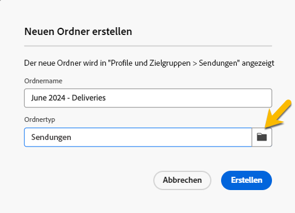
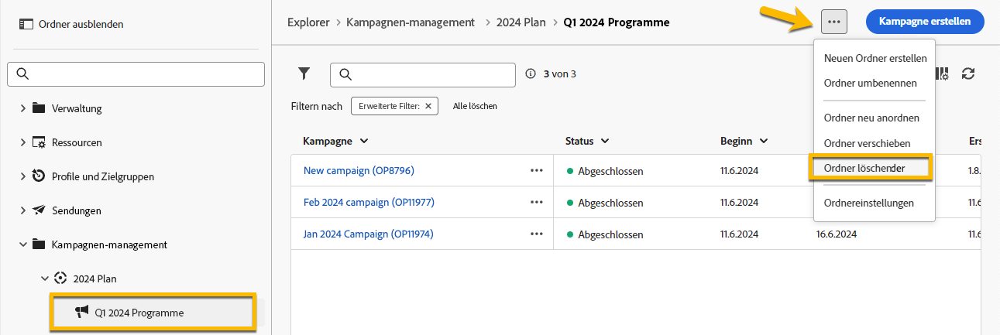

# Arbeiten mit Ordnern {#folders}

>[!CONTEXTUALHELP]
>id="acw_folder_properties"
>title="Ordnereigenschaften"
>abstract="Ordnereigenschaften"

>[!CONTEXTUALHELP]
>id="acw_folder_security"
>title="Ordnersicherheit"
>abstract="Ordnersicherheit"

>[!CONTEXTUALHELP]
>id="acw_folder_restrictions"
>title="Ordnereinschränkungen"
>abstract="Ordnereinschränkungen"

>[!CONTEXTUALHELP]
>id="acw_folder_schedule"
>title="Ordnerzeitplan"
>abstract="Ordnerzeitplan"

## Über Ordner

Ordner sind Objekte in Adobe Campaign, mit denen Sie Ihre Komponenten und Daten organisieren können.

Sie können Ordner in der Navigationsstruktur erstellen, umbenennen, neu anordnen und verschieben. Sie können sie auch entsprechend Ihren Berechtigungen löschen.

{zoomable="yes"}

Sie können einen Ordnertyp einrichten. Beispiel: ein Ordner mit Sendungen.
Das Ordnersymbol ändert sich entsprechend diesem Typ.

## Neuen Ordner erstellen

Gehen Sie wie folgt vor, um in der Adobe Campaign-Web-Benutzeroberfläche einen neuen Ordner zu erstellen:

1. Wechseln Sie in **[!UICONTROL Explorer]** zum Ordner, in dem Sie den neuen Ordner erstellen möchten.
Unter dem Menü **[!UICONTROL ..]** befindet sich **[!UICONTROL Neuen Ordner erstellen]**.

{zoomable="yes"}

Wenn Sie einen neuen Ordner erstellen, ist der Ordner standardmäßig vom gleichen Typ wie der übergeordnete Ordner.
In unserem Beispiel erstellen wir einen Ordner im Ordner **[!UICONTROL Sendungen]**.

{zoomable="yes"}

1. Ändern Sie den Ordnertyp, indem Sie auf das Symbol vom Typ Ordner klicken, falls erforderlich, und wählen Sie ihn wie unten gezeigt in der Liste aus:

{zoomable="yes"}

Richten Sie den Ordnertyp durch Klicken auf die Schaltfläche **[!UICONTROL Bestätigen]** ein.

Wenn Sie einen Ordner ohne bestimmten Typ erstellen möchten, wählen Sie den Typ **[!UICONTROL Allgemeiner Ordner]** aus.

Sie können auch [Ordner in der Adobe Campaign-Konsole erstellen und verwalten](https://experienceleague.adobe.com/de/docs/campaign/campaign-v8/config/configuration/folders-and-views).

## Ordner löschen

>[!CAUTION]
>
>Beim Löschen eines Ordners werden auch alle im Ordner gespeicherten Daten gelöscht.

Um einen Ordner zu löschen, wählen Sie ihn in Ihrem Baum **[!UICONTROL Explorer]** aus und klicken Sie auf das Menü **[!UICONTROL ...]** .
Wählen Sie &quot;**[!UICONTROL Ordner löschen]**&quot;.

{zoomable="yes"}
