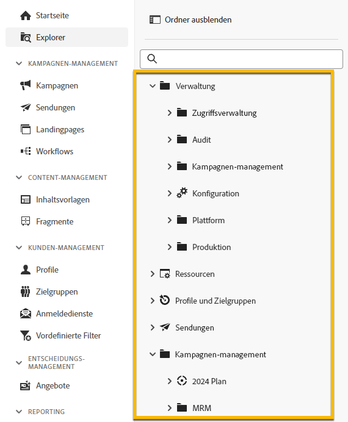
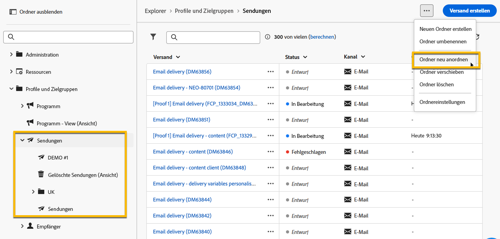

# Arbeiten mit Ordnern {#folders}

>[!CONTEXTUALHELP]
>id="acw_folder_properties"
>title="Ordnereigenschaften"
>abstract="Ordnereigenschaften"

>[!CONTEXTUALHELP]
>id="acw_folder_security"
>title="Ordnersicherheit"
>abstract="Ordnersicherheit"

>[!CONTEXTUALHELP]
>id="acw_folder_restrictions"
>title="Ordnereinschränkungen"
>abstract="Ordnereinschränkungen"

>[!CONTEXTUALHELP]
>id="acw_folder_schedule"
>title="Ordnerzeitplan"
>abstract="Ordnerzeitplan"

## Über Ordner {#about-folders}

Ordner sind Objekte in Adobe Campaign zur Organisation Ihrer Komponenten und Daten.

Sie können Ordner im Navigationsbaum erstellen, umbenennen, neu anordnen und verschieben. Sie können sie auch auf Grundlage Ihrer Rechte löschen.

{zoomable="yes"}

Sie können einen Ordnertyp einrichten. Beispiel: ein Versandordner. Das Ordnersymbol ändert sich je nach Typ.

## Erstellen eines neuen Ordners {#create-a-folder}

Gehen Sie wie folgt vor, um in der Adobe Campaign Web-Benutzeroberfläche einen neuen Ordner zu erstellen:

1. Wechseln **[!UICONTROL Explorer]** in den Ordner, in dem Sie den neuen Ordner erstellen möchten. Wählen Sie im Menü **[!UICONTROL …]** die Option **[!UICONTROL Neuen Ordner erstellen]**.

{zoomable="yes"}

Wenn Sie einen neuen Ordner erstellen, ist der Ordnertyp standardmäßig auf den Typ des übergeordneten Ordners eingestellt. In diesem Beispiel wird ein Ordner im Ordner **[!UICONTROL Sendungen]** erstellt.

{zoomable="yes"}

1. Ändern Sie den Ordnertyp, indem Sie bei Bedarf auf das Symbol Ordnertyp klicken und wählen Sie den gewünschten Ordnertyp aus der angezeigten Liste aus, wie unten dargestellt:

{zoomable="yes"}

Legen Sie den Ordnertyp fest, indem Sie auf die Schaltfläche **[!UICONTROL Bestätigen]** klicken.

Wenn Sie einen Ordner ohne bestimmten Typ erstellen möchten, wählen Sie den Typ **[!UICONTROL Generischer Ordner]** aus.

Sie können auch [Ordner in der Adobe Campaign-Konsole erstellen und verwalten](https://experienceleague.adobe.com/de/docs/campaign/campaign-v8/config/configuration/folders-and-views).

## Neuanordnen von Ordner {#reorder-folders}

Sie können Ordner je nach Bedarf neu anordnen. Klicken Sie dazu auf **[!UICONTROL Ordner neu anordnen]**, wie unten dargestellt.

In diesem Beispiel enthält der Ordner **Sendungen** vier Unterordner.

{zoomable="yes"}

Sie können die Reihenfolge der Ordner ändern, indem Sie entweder **Drag-and-Drop** oder die Pfeile nach **und unten**.

{zoomable="yes"}

## Löschen eines Ordners {#delete-a-folder}

>[!CAUTION]
>
>Beim Löschen eines Ordners werden auch alle im Ordner gespeicherten Daten gelöscht.

Um einen Ordner zu löschen, wählen Sie ihn in Ihrer **[!UICONTROL Explorer]**-Struktur aus und klicken Sie auf das Menü **[!UICONTROL …]**. Wählen Sie **[!UICONTROL Ordner löschen]** aus.

{zoomable="yes"}

## Werteverteilung in einem Ordner {#distribution-values-folder}

Die Werteverteilung hilft Ihnen, den Prozentsatz eines Werts in einer Spalte innerhalb einer Tabelle zu verstehen.

Um die Werteverteilung in einem Ordner anzuzeigen, gehen Sie wie unten beschrieben vor.

Beispielsweise möchten Sie vielleicht über die Verteilung der Werte in der Spalte &quot;**&quot;**.

Rufen Sie diese Informationen im Ordner **[!UICONTROL Sendungen]** ab und klicken Sie auf das Symbol **[!UICONTROL Spalten konfigurieren]**.

Klicken Sie **[!UICONTROL Fenster „Spalten konfigurieren]** auf das Symbol **[!UICONTROL Informationen]** für die Spalte, die Sie analysieren möchten. Klicken Sie dann auf die Schaltfläche **[!UICONTROL Werteverteilung]**.

{zoomable="yes"}

Der Prozentsatz der Werte wird in der Spalte **[!UICONTROL Kanal]** angezeigt.

{zoomable="yes"}

>[!NOTE]
>
>Bei Spalten mit vielen Werten werden nur die ersten zwanzig Werte angezeigt. Eine Benachrichtigung **[!UICONTROL Teillast]** warnt Sie.

Sie können auch die Werteverteilung für einen Link anzeigen.

Klicken Sie in der Attributliste auf die Schaltfläche **+** neben dem gewünschten Link, wie unten dargestellt. Dadurch wird der Link zu den **[!UICONTROL Ausgabespalten]** hinzugefügt. Sie können jetzt auf das Symbol **[!UICONTROL Informationen]** zugreifen, über das Sie die Verteilung der Werte anzeigen können. Wenn Sie den Link nicht in den „Ausgabespalten **[!UICONTROL beibehalten möchten,]** Sie auf die Schaltfläche **[!UICONTROL Abbrechen]**.

{zoomable="yes"}

Es ist auch möglich, die Werteverteilung in einem Abfrage-Modellierer anzuzeigen. [Weitere Informationen finden Sie hier](../query/build-query.md#distribution-of-values-in-a-query).

### Filtern der Werte {#filter-values}

Mithilfe der **[!UICONTROL Erweiterten Filter]** im Fenster Werteverteilung können Sie die Ergebnisse anhand der angegebenen Bedingungen filtern.

Im Beispiel der Versandliste oben, das die Verteilung nach Kanal zeigt, können Sie sie so filtern, dass nur Sendungen mit dem Status **Abgeschlossen“** werden.

{zoomable="yes"}