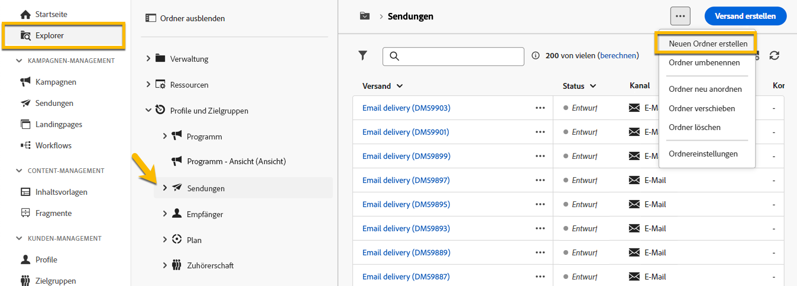
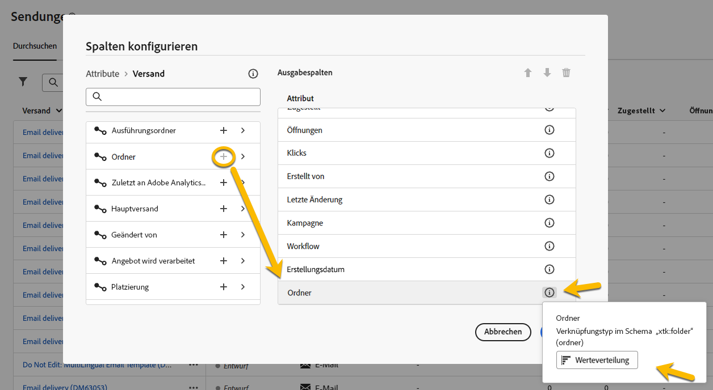

# Arbeiten mit Ordnern {#folders}

>[!CONTEXTUALHELP]
>id="acw_folder_properties"
>title="Ordnereigenschaften"
>abstract="Ordnereigenschaften"

>[!CONTEXTUALHELP]
>id="acw_folder_security"
>title="Ordnersicherheit"
>abstract="Ordnersicherheit"

>[!CONTEXTUALHELP]
>id="acw_folder_restrictions"
>title="Ordnereinschränkungen"
>abstract="Ordnereinschränkungen"

>[!CONTEXTUALHELP]
>id="acw_folder_schedule"
>title="Ordnerzeitplan"
>abstract="Ordnerzeitplan"

## Über Ordner {#about-folders}

Ordner sind Objekte in Adobe Campaign zur Organisation Ihrer Komponenten und Daten.

Sie können Ordner im Navigationsbaum erstellen, umbenennen, neu anordnen und verschieben. Sie können sie auch Ihren Bedürfnissen entsprechend löschen.

{zoomable="yes"}

Sie können einen Ordnertyp einrichten. Zum Beispiel: ein Ordner mit Sendungen.
Das Symbol des Ordners ändert sich je nach Typ.

## Erstellen eines neuen Ordners {#create-a-folder}

Gehen Sie wie folgt vor, um in der Adobe Campaign Web-Benutzeroberfläche einen neuen Ordner zu erstellen:

1. Navigieren Sie dazu in **[!UICONTROL Explorer]** zu dem Ordner, in dem Sie Ihren neuen Ordner erstellen möchten.
Im Menü **[!UICONTROL …]** finden Sie die Option **[!UICONTROL Neuen Ordner erstellen]**.

{zoomable="yes"}

Wenn Sie einen neuen Ordner erstellen, ist der Ordner standardmäßig vom selben Typ wie der übergeordnete Ordner.  In unserem Beispiel erstellen wir einen Ordner im Ordner **[!UICONTROL Sendungen]**.

{zoomable="yes"}

1. Ändern Sie bei Bedarf den Typ des Ordners, indem Sie auf das Symbol des Ordnertyps klicken, und wählen Sie ihn in der angezeigten Liste aus, wie unten dargestellt:

{zoomable="yes"}

Richten Sie den Ordnertyp ein, indem Sie auf die Schaltfläche **[!UICONTROL Bestätigen]** klicken.

Wenn Sie einen Ordner ohne bestimmten Typ erstellen möchten, wählen Sie den Typ **[!UICONTROL Allgemeiner Ordner]** aus.

Sie können auch [Ordner in der Adobe Campaign-Konsole erstellen und verwalten](https://experienceleague.adobe.com/de/docs/campaign/campaign-v8/config/configuration/folders-and-views).

## Neuanordnen von Ordner {#reorder-folders}

Sie können die Ordner Ihren Bedürfnissen entsprechend neu anordnen. Klicken Sie dazu auf **[!UICONTROL Ordner neu anordnen]**, wie unten dargestellt.

In unserem Beispiel enthält der Ordner **Sendungen** vier Ordner.

{zoomable="yes"}

Sie können die Reihenfolge Ihrer Ordner entweder durch **Ziehen und Ablegen** oder durch Verwendung der **Nach-oben- und Nach-unten-Taste** ändern.

{zoomable="yes"}

## Löschen eines Ordners {#delete-a-folder}

>[!CAUTION]
>
>Beim Löschen eines Ordners werden auch alle im Ordner gespeicherten Daten gelöscht.

Um einen Ordner zu löschen, wählen Sie ihn im Baum **[!UICONTROL Explorer]** aus und klicken Sie auf das Menü **[!UICONTROL ...]**.
Wählen Sie **[!UICONTROL Ordner löschen]** aus.

{zoomable="yes"}

## Werteverteilung in einem Ordner {#distribution-values-folder}

Die Werteverteilung hilft dabei, den Prozentsatz eines Werts in einer Spalte innerhalb einer Tabelle zu ermitteln.

Um die Wertverteilung in einem Ordner zu ermitteln, gehen Sie wie folgt vor:

Wir möchten beispielsweise die Werteverteilung der Spalte **Kanal** unter den Sendungen ermitteln.

Um diese Informationen zu erhalten, gehen Sie zum Ordner **[!UICONTROL Sendungen]** und klicken Sie auf das Symbol **[!UICONTROL Spalten konfigurieren]**.

Klicken Sie im Fenster **[!UICONTROL Spalten konfigurieren]** auf das Symbol **[!UICONTROL Informationen]** der Spalte, deren Informationen Sie ermitteln möchten. Klicken Sie dann auf die Schaltfläche **[!UICONTROL Werteverteilung]**.

{zoomable="yes"}

Sie erhalten den Prozentsatz der Werte in der Spalte **[!UICONTROL Kanal]**.

{zoomable="yes"}

>[!NOTE]
>
> Bei Spalten mit vielen Werten werden nur die ersten zwanzig Werte angezeigt. Sie werden durch die Benachrichtigung **[!UICONTROL Teilladung]** gewarnt.

Sie können auch die Werteverteilung eines Links ermitteln.

Klicken Sie in der Attributliste auf die Schaltfläche **+** neben dem gewünschten Link, wie unten dargestellt. Dadurch wird der Link zu den **[!UICONTROL Ausgabespalten]** hinzugefügt. Jetzt können Sie über das Symbol **[!UICONTROL Informationen]** verfügen, über das Sie die Verteilung der Werte anzeigen können. Wenn Sie den Link nicht in den **[!UICONTROL Ausgabespalten]** beibehalten möchten, klicken Sie auf die Schaltfläche **[!UICONTROL Abbrechen]**.

{zoomable="yes"}

Es ist auch möglich, die Werteverteilung in einem Abfrage-Modeler zu ermitteln. [Weitere Informationen finden Sie hier](../query/build-query.md#distribution-of-values-in-a-query).

### Filtern der Werte {#filter-values}

Mithilfe der **[!UICONTROL erweiterten Filter]** im Fenster „Werteverteilung“ können Sie Ihre Ergebnisse nach bestimmten Bedingungen filtern.

Im obigen Beispiel der Versandliste, in der die Verteilung nach Kanal dargestellt wird, können Sie sie beispielsweise so filtern, dass nur die Sendungen angezeigt werden, deren Status **Abgeschlossen** ist.

{zoomable="yes"}
