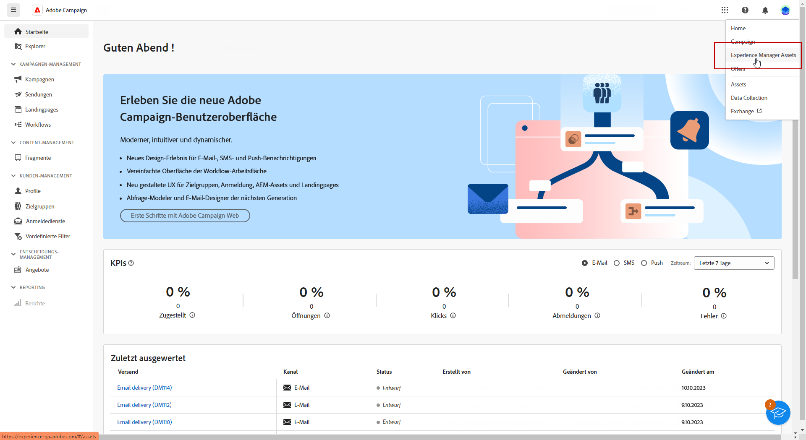
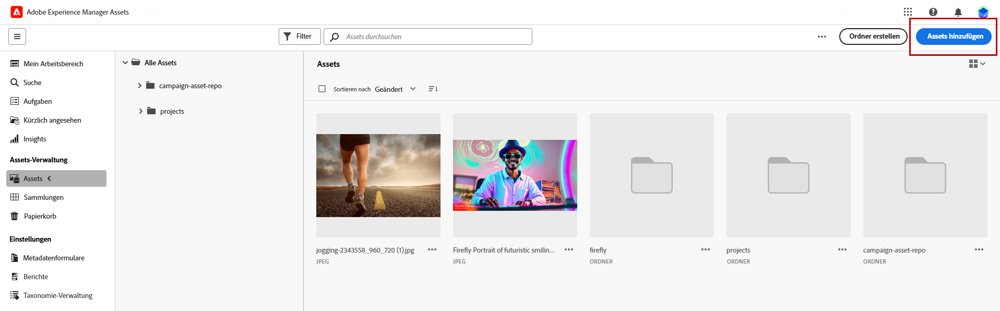
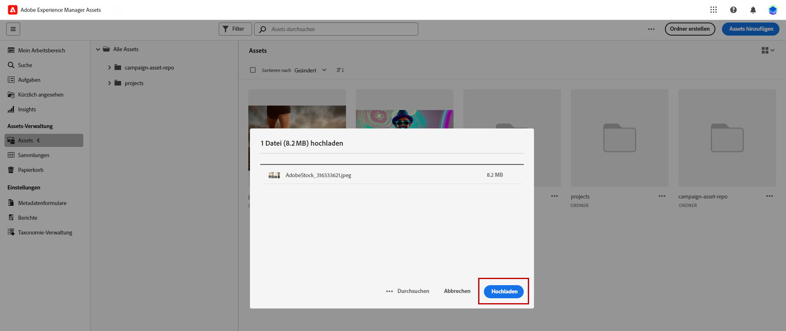
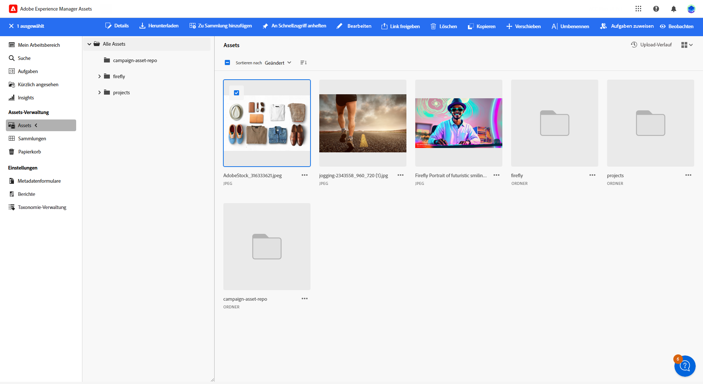
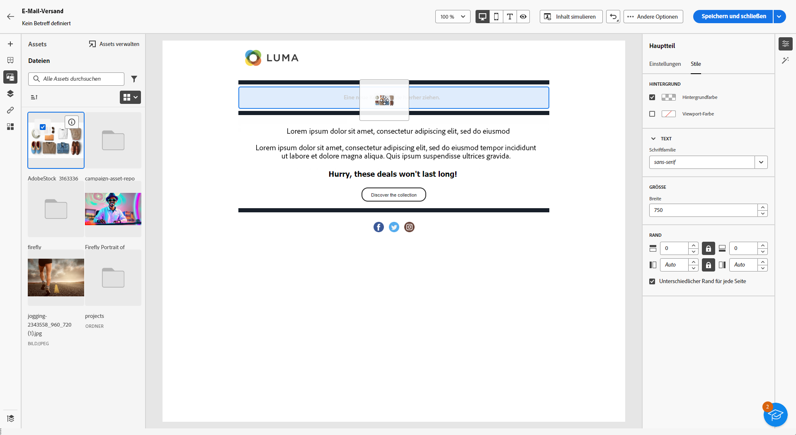
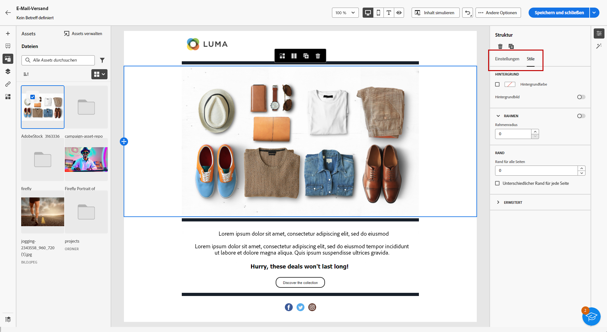

# Verwalten von Assets mit [!DNL Adobe Experience Manager Assets as a Cloud Service]{#aem-assets}

## Erste Schritte mit [!DNL Adobe Experience Manager Assets as a Cloud Service] {#get-started-assets-essentials}

[!DNL Adobe Experience Manager Assets as a Cloud Service] ist eine integrierte, kollaborative Plattform, die dazu dient, Ihre kreativen Workflows zu optimieren und digitale Assets für einen nahtlosen Versand von Erlebnissen zu zentralisieren. Sie vereinfacht die Organisation, das Tagging und den Abruf genehmigter Produktions-Assets und gewährleistet so die Markenkonsistenz in allen Teams. Mit einer benutzerfreundlichen Benutzeroberfläche ermöglicht Ihnen [!DNL Assets as Cloud Service] den sofortigen Zugriff auf und die Freigabe von Assets in Ihren Adobe Creative- und Experience Cloud-Anwendungen.

Weitere Informationen finden Sie in der [Dokumentation zu Adobe Experience Manager Assets as a Cloud Service](https://experienceleague.adobe.com/docs/experience-manager-cloud-service/content/assets/home.html?lang=de){target="_blank"}.

## Hochladen und Einfügen von Assets{#add-asset}

Um Dateien in [!DNL Assets as Cloud Service] zu importieren, müssen Sie den Ordner suchen oder erstellen, in dem diese Dateien gespeichert werden sollen. Fügen Sie sie dann in Ihren E-Mail-Inhalt ein.

Weitere Informationen zum Hochladen von Assets finden Sie in der [Dokumentation zu Adobe Experience Manager Assets as a Cloud Service](https://experienceleague.adobe.com/docs/experience-manager-cloud-service/content/assets/assets-view/add-delete-assets-view.html?lang=de){target="_blank"}.

1. Rufen Sie von Ihrer Startseite aus das erweiterte Menü auf und wählen Sie [!DNL Experience Manager Assets].

   {zoomable="yes"}

1. Navigieren Sie zu **Assets-Verwaltung**, klicken Sie auf **Assets** und wählen Sie das Repository für Ihre Assets in Adobe Campaign aus.

1. Klicken Sie auf einen Ordner im mittleren Abschnitt oder in der Baumansicht, um ihn zu öffnen.

   Sie können auch **[!UICONTROL Ordner erstellen]** wählen, um einen neuen Ordner zu erstellen.

1. Klicken Sie im ausgewählten oder erstellten Ordner auf **[!UICONTROL Assets hinzufügen]**, um ein neues Asset in Ihren Ordner hochzuladen.

   {zoomable="yes"}

1. Klicken Sie im Menü **[!UICONTROL Dateien hochladen]** auf **[!UICONTROL Durchsuchen]** und wählen Sie aus, ob Sie **[!UICONTROL Dateien durchsuchen]** oder **[!UICONTROL Ordner durchsuchen]** möchten.

1. Wählen Sie die Datei aus, die Sie hochladen möchten. Klicken Sie abschließend auf **[!UICONTROL Upload]**.

   {zoomable="yes"}

1. Wählen Sie das soeben hochgeladene Asset aus, um auf das erweiterte Menü für das Asset-Management zuzugreifen.

   Weitere Informationen zum Verwalten von Assets finden Sie auf dieser [Seite](https://experienceleague.adobe.com/docs/experience-manager-cloud-service/content/assets/assets-view/manage-organize-assets-view.html?lang=de).

   {zoomable="yes"}

1. Um Ihre Assets mit Adobe Photoshop Express weiter zu bearbeiten, doppelklicken Sie auf das Asset. Klicken Sie dann im Menü auf der rechten Seite auf das Symbol für den **[!UICONTROL Bearbeitungsmodus]**. [Weitere Informationen](https://experienceleague.adobe.com/docs/experience-manager-cloud-service/content/assets/assets-view/edit-images-assets-view.html?lang=de#edit-using-express){target="_blank"}.

1. Wählen Sie unter [!DNL Adobe Campaign] das Menü **[!UICONTROL Asset-Auswahl]** im linken Bereich des E-Mail-Designers aus.

   {zoomable="yes"}

1. Wählen Sie Ihren zuvor erstellten **[!UICONTROL Assets]**-Ordner aus. Sie können auch in der Suchleiste nach Ihrem Asset oder Ordner suchen.

   Klicken Sie bei Bedarf auf **[!UICONTROL Assets verwalten]**, um direkt auf Ihren Arbeitsbereich in [!DNL Adobe Experience Manager Assets] zuzugreifen.

1. Ziehen Sie Ihr Asset per Drag-and-Drop in den E-Mail-Inhalt.

   {zoomable="yes"}

1. Passen Sie können Ihre Assets weiter an, z. B. indem Sie einen externen Link oder einen Text über die Registerkarten **[!UICONTROL Einstellungen]** und **[!UICONTROL Stile]** hinzufügen. [Erfahren Sie mehr über Komponenteneinstellungen](../email/content-components.md).

   {zoomable="yes"}