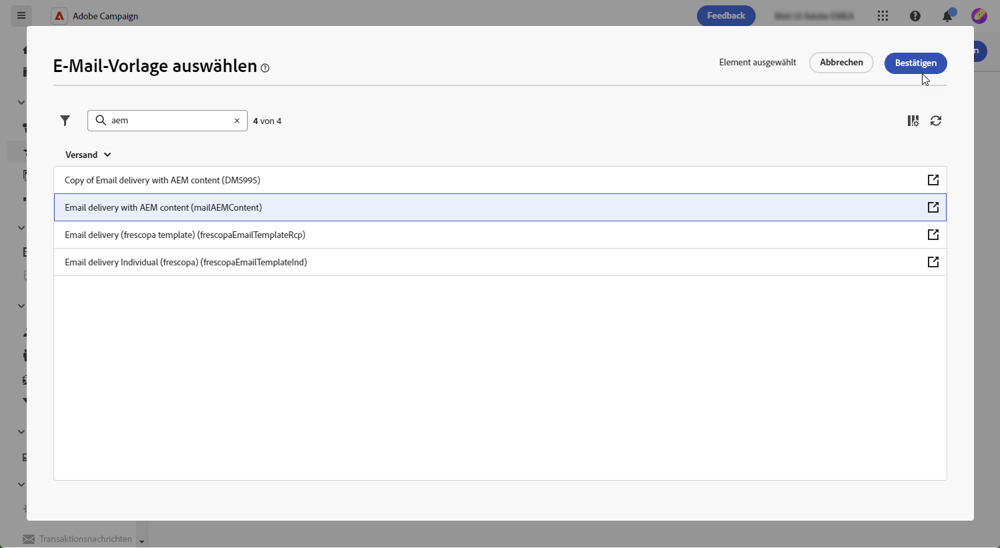
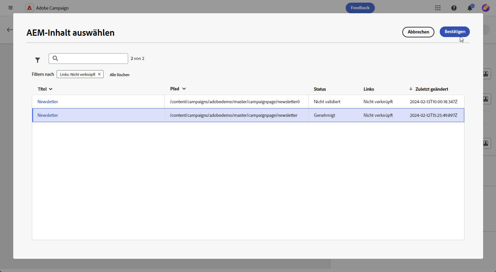
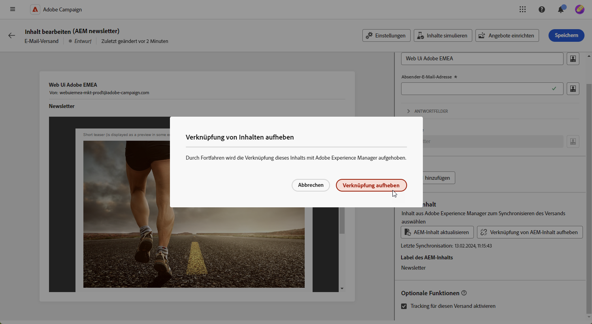

# Verwalten von Vorlagen mit [!DNL Adobe Experience Manager as a Cloud Service]{#aem-assets}

## Erste Schritte mit [!DNL Adobe Experience Manager as a Cloud Service]{#create-aem}

Die Integration der Adobe Campaign-Web-Oberfläche in Adobe Experience Manager ermöglicht eine optimierte Verwaltung von E-Mail-Versandinhalten und Formularen direkt auf der Adobe Experience Manager-Plattform.

[Weitere Informationen zu Adobe Experience Manager as a Cloud Service](https://experienceleague.adobe.com/docs/experience-manager-cloud-service/content/sites/authoring/getting-started/quick-start.html?lang=de)

## Erstellen einer Vorlage in [!DNL Adobe Experience Manager as a Cloud Service]{#create-aem-template}

1. Navigieren Sie zu Ihrer [!DNL Adobe Experience Manager]-Autoreninstanz und klicken Sie oben links auf der Seite auf „Adobe Experience“. Wählen im Menü die Option **[!UICONTROL Sites]** aus.

1. Rufen Sie **[!UICONTROL Kampagnen > Name Ihrer Marke > Hauptbereich > Name Ihrer Seite]** auf.

1. Klicken Sie auf **[!UICONTROL Erstellen]** und wählen Sie im Dropdown-Menü die Option **[!UICONTROL Seite]** aus.

   

1. Wählen Sie die Vorlage **[!UICONTROL Adobe Campaign-E-Mail]** aus und benennen Sie Ihren Newsletter.

   

1. Passen Sie den E-Mail-Inhalt an, indem Sie Komponenten hinzufügen, z. B. Personalisierungsfelder aus Adobe Campaign. [Weitere Informationen](https://experienceleague.adobe.com/docs/experience-manager-65/content/sites/authoring/aem-adobe-campaign/campaign.html?lang=de#editing-email-content)

1. Wenn Ihre E-Mail fertig ist, navigieren Sie zum Menü **[!UICONTROL Seiteninformationen]** und klicken Sie auf **[!UICONTROL Workflow starten]**.

   

1. Wählen Sie in der ersten Dropdown-Liste als Workflow-Modell **[!UICONTROL Adobe Campaign genehmigen]** aus und klicken Sie auf **[!UICONTROL Workflow starten]**.

1. Oben auf Ihrer Seite erscheint ein Haftungsausschluss mit folgendem Inhalt: `This page is subject to the workflow Approve for Adobe Campaign`. Klicken Sie neben dem Haftungsausschluss auf **[!UICONTROL Fertig]**, um die Überprüfung zu bestätigen, und klicken Sie dann auf **[!UICONTROL Ok]**.

   

1. Klicken Sie erneut auf **[!UICONTROL Fertig]** und wählen Sie danach **[!UICONTROL Newsletter-Genehmigung]** in der Dropdown-Liste **[!UICONTROL Nächster Schritt]**.

Ihr Newsletter ist jetzt fertig und in Adobe Campaign synchronisiert.

## Importieren einer Adobe Experience Manager as a Cloud Service-Vorlage{#aem-templates-perso}

Sobald die Experience Manager-Vorlage im Adobe Campaign Web als Inhaltsvorlage verfügbar ist, können Sie den für die E-Mail erforderlichen Inhalt einschließlich Personalisierung identifizieren und integrieren.

1. Klicken Sie im Menü **[!UICONTROL Sendungen]** auf **[!UICONTROL Versand erstellen]**. 

1. Wählen Sie im Fenster der E-Mail-Vorlage die integrierte Vorlage **[!UICONTROL E-Mail-Versand mit AEM Inhalt]** aus.

   

1. Geben Sie einen **[!UICONTROL Titel]** für den Versand ein und konfigurieren Sie zusätzliche Optionen entsprechend Ihren Anforderungen:

   * **[!UICONTROL Interner Name]**: Weisen Sie dem Versand eine eindeutige Kennung zu.

   * **[!UICONTROL Ordner]**: Speichern Sie den Versand in einem bestimmten Ordner.

   * **[!UICONTROL Versand-Code]**: Verwenden Sie dieses Feld, um Ihre Sendungen basierend auf Ihrer eigenen Namenskonvention zu organisieren.

   * **[!UICONTROL Beschreibung]**: Geben Sie eine Beschreibung für den Versand an.

   * **[!UICONTROL Art]**: Geben Sie zu Klassifizierungszwecken die Art der E-Mail an.

1. Definieren Sie eine **[!UICONTROL Zielgruppe]** für Ihre E-Mail. [Weitere Informationen](../email/create-email.md#define-audience)

1. Klicken Sie auf **[!UICONTROL Inhalt bearbeiten]**.

1. Klicken Sie im Menü **[!UICONTROL Inhalt bearbeiten]** auf **[!UICONTROL AEM-Inhalt auswählen]**.

   

1. Durchsuchen Sie Ihre AEM-Vorlagen und wählen Sie diejenige aus, die Sie in Campaign Web importieren möchten.

   

1. Beachten Sie, dass Inhalte nicht automatisch synchronisiert werden. Wenn direkt in Adobe Experience Manager Änderungen an Ihren Vorlagen vorgenommen werden, wählen Sie einfach **[!UICONTROL AEM-Inhalt aktualisieren]**, um die neueste Version Ihrer Vorlage zu erhalten.

1. Um die Verknüpfung zwischen Experience Manager und Campaign zu entfernen oder Ihre Experience Manager-Vorlage in E-Mail-Designer weiter zu personalisieren, klicken Sie auf **[!UICONTROL Verknüpfung des AEM-Inhalts aufheben]**.

   

1. Wenn Sie Ihrer Experience Manager-Vorlage personalisierten Inhalt hinzugefügt haben, klicken Sie auf **[!UICONTROL Inhalt simulieren]**, um mithilfe von Testprofilen eine Vorschau des Nachrichteninhalts anzuzeigen.

[Erfahren Sie mehr über die Vorschau und Testprofile](../preview-test/preview-content.md)

1. Bei der Anzeige der Nachrichtenvorschau werden alle personalisierten Elemente automatisch durch die entsprechenden Daten aus dem ausgewählten Testprofil ersetzt.

   Bei Bedarf können über die Schaltfläche **[!UICONTROL Testprofile verwalten]** weitere Testprofile hinzugefügt werden.

Ihre Nachricht ist jetzt bereit für den Versand.
