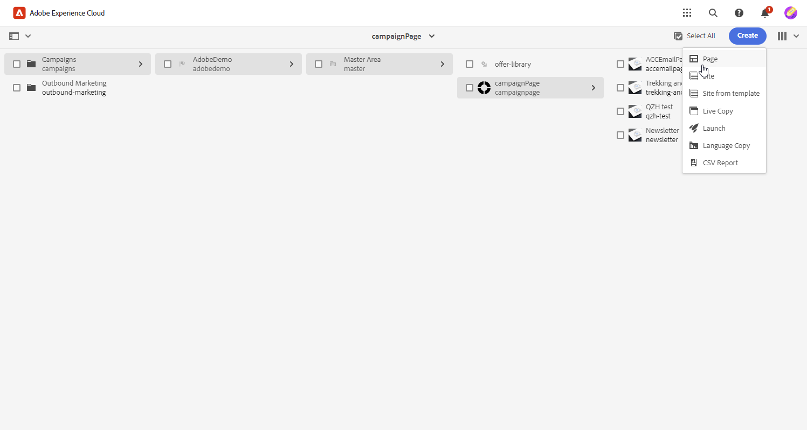

# Verwalten von Vorlagen mit [!DNL Adobe Experience Manager as a Cloud service]{#aem-assets}

## Erste Schritte mit [!DNL Adobe Experience Manager as a Cloud service]{#create-aem}

Die Integration der Adobe Campaign-Webschnittstelle in Adobe Experience Manager erleichtert die optimierte Verwaltung von E-Mail-Versandinhalten und -Formularen direkt auf der Adobe Experience Manager-Plattform.

[Weitere Informationen zu Adobe Experience Manager as a Cloud Service](https://experienceleague.adobe.com/docs/experience-manager-cloud-service/content/sites/authoring/getting-started/quick-start.html?lang=en)

## Erstellen Sie eine Vorlage in [!DNL Adobe Experience Manager as a Cloud service]{#create-aem-template}

1. Navigieren Sie zu Ihrer [!DNL Adobe Experience Manager] Autoreninstanz erstellen, und klicken Sie oben links auf der Seite auf Adobe Erlebnis . Auswählen **[!UICONTROL Sites]** aus dem Menü.

1. Zugriff **[!UICONTROL Kampagnen > Name Ihrer Marke > Hauptbereich > Name Ihrer Seite]**.

1. Klicks **[!UICONTROL Erstellen]** und wählen **[!UICONTROL Seite]** aus dem Dropdown-Menü aus.

   

1. Wählen Sie die **[!UICONTROL Adobe Campaign Email]** und benennen Sie Ihren Newsletter.

   

1. Passen Sie Ihren E-Mail-Inhalt an, indem Sie Komponenten wie Personalisierungsfelder aus Adobe Campaign hinzufügen. [Weitere Informationen](https://experienceleague.adobe.com/docs/experience-manager-65/content/sites/authoring/aem-adobe-campaign/campaign.html?lang=en#editing-email-content)

1. Sobald Ihre E-Mail fertig ist, navigieren Sie zur **[!UICONTROL Seiteninformationen]** Menü und klicken Sie **[!UICONTROL Workflow starten]**.

   

1. Wählen Sie aus der ersten Dropdown-Liste **[!UICONTROL Genehmigen von Adobe Campaign]** als Workflow-Modell und klicken Sie auf **[!UICONTROL Workflow starten]**.

1. Oben auf Ihrer Seite erscheint ein Haftungsausschluss mit folgenden Angaben: `This page is subject to the workflow Approve for Adobe Campaign`. Klicks **[!UICONTROL Fertig]** neben dem Haftungsausschluss klicken, um die Überprüfung zu bestätigen, und **[!UICONTROL Ok]**.

   

1. Klicks **[!UICONTROL Fertig]** erneut auswählen **[!UICONTROL Newsletter-Validierung]** im **[!UICONTROL Nächster Schritt]** angezeigt.

Ihr Newsletter ist jetzt fertig und in Adobe Campaign synchronisiert.

## Importieren einer Adobe Experience Manager as a Cloud Service-Vorlage{#aem-templates-perso}

Sobald die Inhaltsvorlage im Adobe Campaign Web als Inhaltsvorlage verfügbar ist, können Sie den für die E-Mail erforderlichen Experience Manager, einschließlich Personalisierung, identifizieren und integrieren.

1. In Campaign Web über die **[!UICONTROL Sendungen]** Menü, klicken **[!UICONTROL Versand erstellen]**.

1. Wählen Sie im Fenster der E-Mail-Vorlage die integrierte **[!UICONTROL E-Mail-Versand mit AEM Inhalt]** Vorlage.

   

1. Geben Sie einen **[!UICONTROL Titel]** für den Versand zu konfigurieren und zusätzliche Optionen entsprechend Ihren Anforderungen zu konfigurieren:

   * **[!UICONTROL Interner Name]**: Weisen Sie dem Versand eine eindeutige Kennung zu.

   * **[!UICONTROL Ordner]**: Speichern Sie den Versand in einem bestimmten Ordner.

   * **[!UICONTROL Versand-Code]**: Verwenden Sie dieses Feld, um Ihre Sendungen basierend auf Ihrer eigenen Namenskonvention zu organisieren.

   * **[!UICONTROL Beschreibung]**: Geben Sie eine Beschreibung für den Versand an.

   * **[!UICONTROL Natur]**: Spezifizieren Sie die Art der E-Mail zu Classification-Zwecken.

1. Definieren Sie eine **[!UICONTROL Zielgruppe]** zu Ihrer E-Mail hinzufügen. [Weitere Informationen](../email/create-email.md#define-audience)

1. Klicks **[!UICONTROL Inhalt bearbeiten]**.

1. Aus dem **[!UICONTROL Inhalt bearbeiten]** Menü, klicken **[!UICONTROL AEM Inhalt auswählen]**.

   

1. Durchsuchen Sie Ihre AEM Vorlage und wählen Sie die Vorlage aus, die Sie in Campaign Web importieren möchten.

   

1. Beachten Sie, dass Inhalte nicht automatisch synchronisiert werden. Wenn Änderungen an Ihren Vorlagen direkt in Adobe Experience Manager vorgenommen werden, wählen Sie einfach **[!UICONTROL AEM Inhalt aktualisieren]** , um die neueste Version Ihrer Vorlage zu erhalten.

1. Um die Verknüpfung zwischen Experience Manager und Campaign zu entfernen oder Ihre Experience Manager-Vorlage in Email Designer weiter zu personalisieren, klicken Sie auf **[!UICONTROL Verknüpfung AEM Inhalts aufheben]**.

   

1. Wenn Sie Ihrer Experience Manager-Vorlage personalisierten  hinzugefügt haben, klicken Sie auf **[!UICONTROL Inhalt simulieren]** , um mithilfe von Testprofilen eine Vorschau des Nachrichteninhalts anzuzeigen.

[Weitere Informationen zu Vorschau- und Testprofilen](../preview-test/preview-content.md)

1. Bei der Anzeige der Nachrichtenvorschau werden alle personalisierten Elemente automatisch durch die entsprechenden Daten aus dem ausgewählten Testprofil ersetzt.

   Bei Bedarf können weitere Testprofile über die **[!UICONTROL Testprofile verwalten]** Schaltfläche.

Ihr Versand kann jetzt durchgeführt werden.
