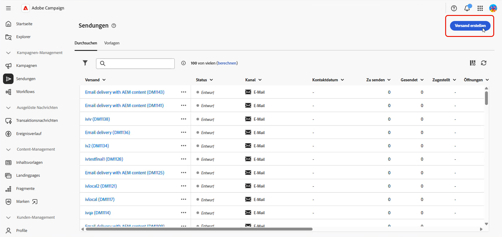
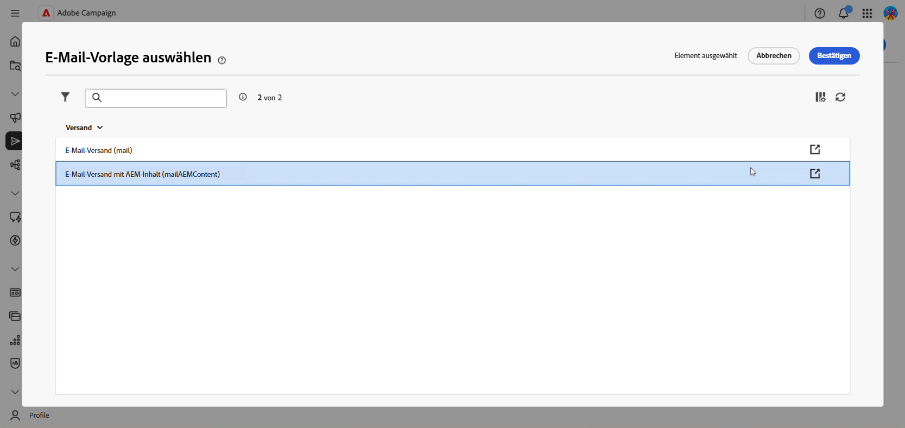
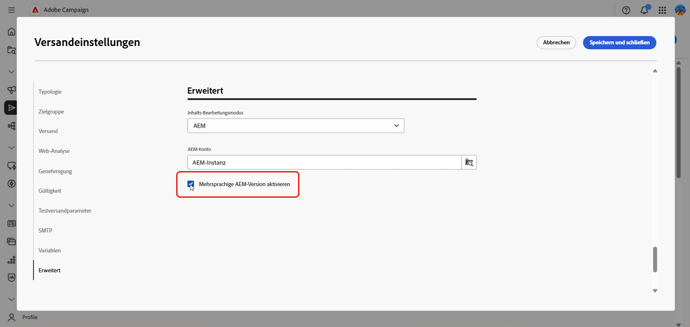
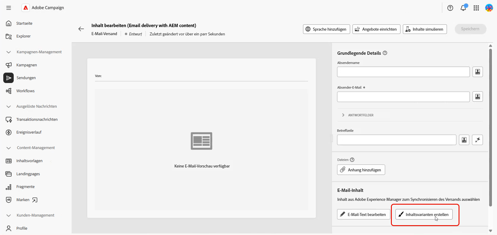
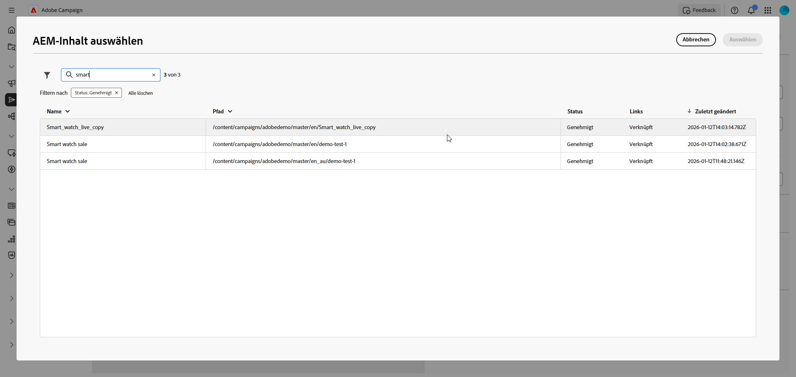
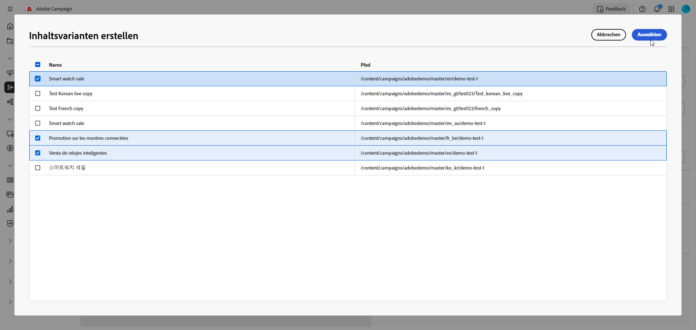
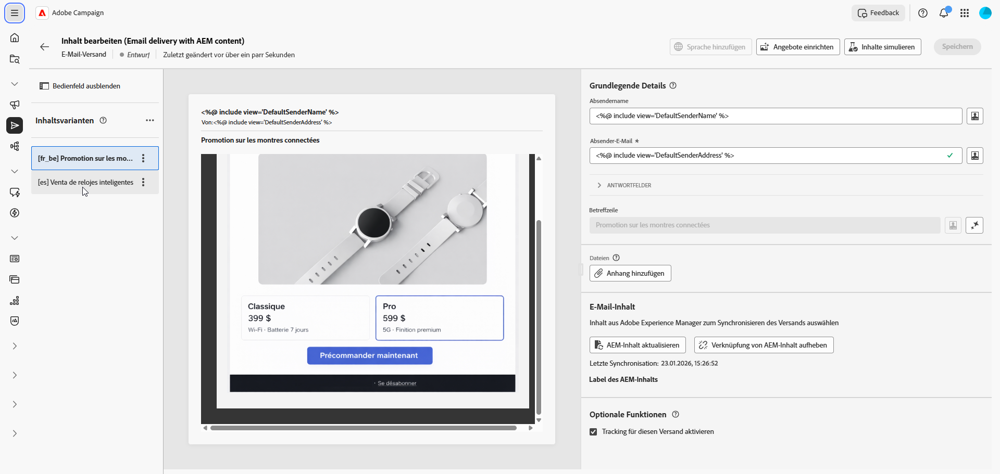
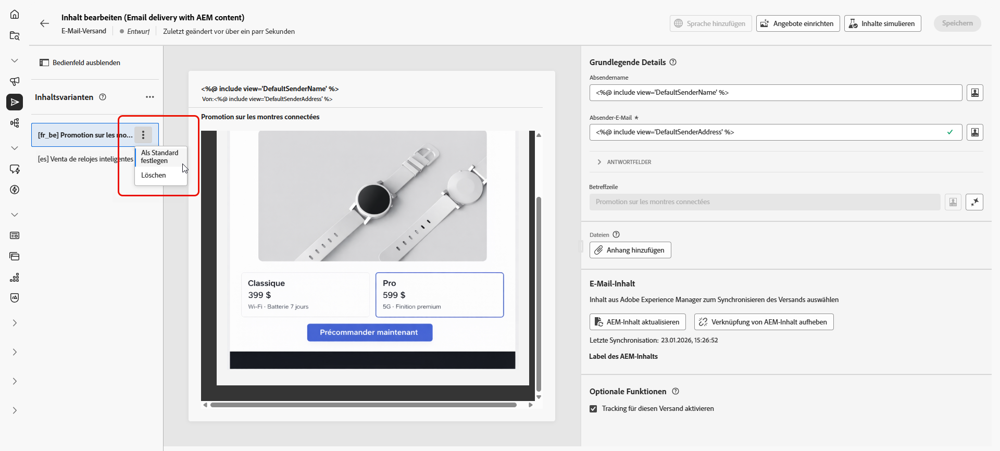
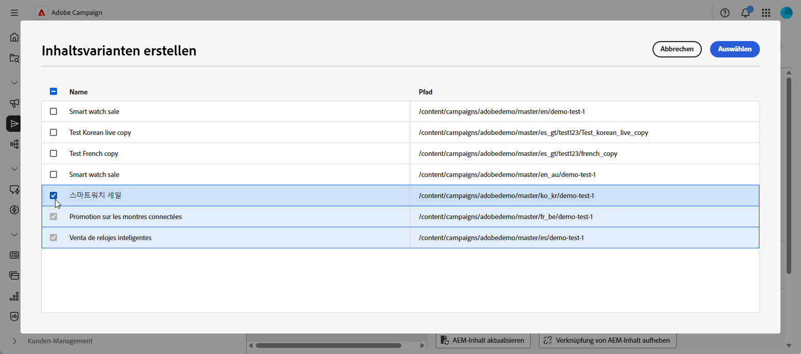
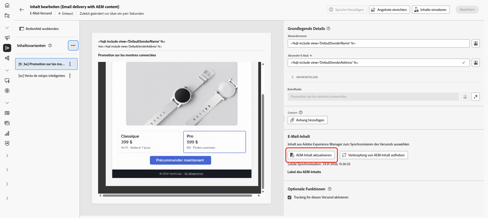

# Erstellen mehrsprachiger E-Mails mit Adobe Experience Manager {#aem-multilingual}

Die Adobe Experience Manager-Integration ermöglicht es Ihnen, mehrsprachige E-Mail-Sendungen mithilfe von Adobe Experience Manager-Sprachkopien zu erstellen. Auf diese Weise können Sie Inhaltsvarianten in verschiedenen Sprachen verwalten und basierend auf den Voreinstellungen der Empfängersprache personalisierte E-Mails versenden.

## Voraussetzungen {#prerequisites}

Bevor Sie einen mehrsprachigen E-Mail-Versand erstellen, stellen Sie Folgendes sicher:

* Zugriff auf eine Adobe Experience Manager-Instanz, die für die Adobe Campaign-Web-Schnittstellenintegration konfiguriert ist.
* Adobe Experience Manager-Inhalte mit Sprachkopien wurden bereits erstellt und genehmigt. Weitere Informationen zum Sprachkopie-Assistenten finden Sie in der Dokumentation zu [Adobe Experience Manager](https://experienceleague.adobe.com/de/docs/experience-manager-cloud-service/content/sites/administering/reusing-content/translation/wizard)
* E-Mail-Versandvorlage für den Empfang von Adobe Experience Manager-Inhalten konfiguriert. Siehe die Schritte, die im Abschnitt [Mehrsprachigen Modus aktivieren](#enable-multilingual) beschrieben sind.

## Erstellen eines mehrsprachigen Versands

Um einen mehrsprachigen E-Mail-Versand zu erstellen, müssen Sie zunächst die Option Mehrsprachig in Ihren Versandeinstellungen aktivieren. Das System erkennt automatisch verfügbare Sprachkopien und ermöglicht die Auswahl der hinzuzufügenden Sprachkopien.

### Mehrsprachigen Modus aktivieren {#enable-multilingual}

Erstellen Sie einen neuen Versand und aktivieren Sie die Option Mehrsprachig in den erweiterten Einstellungen.

1. Klicken Sie **[!UICONTROL Menü]** Sendungen **[!UICONTROL auf Versand erstellen]**.

   

1. Wählen Sie die Vorlage **[!UICONTROL E-Mail-Versand mit AEM]** und klicken Sie auf **[!UICONTROL Versand erstellen]**.

   

1. Geben Sie einen Titel für den Versand ein und konfigurieren Sie Ihre Audience. [Weitere Informationen](../email/create-email.md)

1. Rufen Sie Ihren Versand **[!UICONTROL Einstellungen]** auf und navigieren Sie dann zum Abschnitt **[!UICONTROL Erweitert]**.

1. Aktivieren Sie die **[!UICONTROL Mehrsprachige AEM aktivieren]**.

   

1. Stellen Sie sicher, dass:

   * **[!UICONTROL Inhaltsbearbeitungsmodus]** ist auf **[!UICONTROL AEM&quot;]**.
   * Das richtige Adobe Experience Manager **[!UICONTROL Externes Konto]** ist ausgewählt.

1. Klicken Sie **[!UICONTROL Speichern und schließen]**.

### Inhaltsvarianten erstellen {#create-variants}

Wählen Sie Ihre Adobe Experience Manager-Inhalte und die Sprachvarianten aus, die in den Versand aufgenommen werden sollen.

1. Klicken Sie auf **[!UICONTROL Inhalt bearbeiten]**.

1. Wählen **[!UICONTROL Inhaltsvariante erstellen]** aus.

   

1. Wählen Sie Ihren Adobe Experience Manager-Inhalt aus der Liste aus.

   

1. Das System erkennt alle Sprachkopien, die mit dem ausgewählten Inhalt verknüpft sind (Beziehung zwischen über- und untergeordneten Elementen), z. B. wenn Ihr Adobe Experience Manager-Inhalt Varianten auf Französisch, Deutsch und Italienisch aufweist, können alle Varianten ausgewählt werden.

   Wählen Sie die Sprachvarianten aus, die Sie in Ihren Versand aufnehmen möchten.

   

1. Klicken Sie auf **[!UICONTROL Speichern]**.

1. Überprüfen Sie Ihre Sprachvarianten im Inhaltseditor. Sie können jetzt [jede Variante einzeln verwalten](#manage-variants) oder mit dem [Versand) &#x200B;](../monitor/prepare-send.md).

   

## Verwalten von Sprachvarianten {#manage-variants}

Nachdem Sie Inhaltsvarianten erstellt haben, können Sie sie direkt im Versand verwalten:

1. Um eine Standardsprache festzulegen, rufen Sie das erweiterte Menü für Ihre ausgewählte Variante auf und wählen Sie **[!UICONTROL Als Standard festlegen]** aus. Die Standardsprache wird verwendet, wenn die Spracheinstellung eines Profils nicht festgelegt ist oder mit keiner verfügbaren Variante übereinstimmt.

   Klicken Sie **[!UICONTROL Löschen]**, um alle Varianten aus Ihrem Versand zu entfernen.

   

1. Klicken Sie im erweiterten Menü Inhaltsvarianten auf **[!UICONTROL Gebietsschemata verwalten]**, um weitere Gebietsschemata zu Ihrem Versand hinzuzufügen.

   

1. Wählen Sie zusätzliche Sprachkopien aus, um weitere Varianten einzuschließen, und klicken Sie auf **[!UICONTROL Speichern]**.

   

1. Wenn der Inhalt in Adobe Experience Manager aktualisiert wird, klicken Sie auf **[!UICONTROL AEM-Inhalt aktualisieren]**, um alle Varianten mit der neuesten Version zu synchronisieren.

   

1. Klicken Sie **[!UICONTROL Verknüpfung zu AEM-]** aufheben), wenn Sie Inhalte direkt in Campaign bearbeiten oder den Link mit Adobe Experience Manager aufheben möchten.

   >[!CAUTION]
   >
   >Nach dem Aufheben der Verknüpfung können Sie Inhalte nicht mehr aus Adobe Experience Manager aktualisieren oder neue Varianten erstellen. Der Inhalt wird unabhängig von Adobe Experience Manager.
