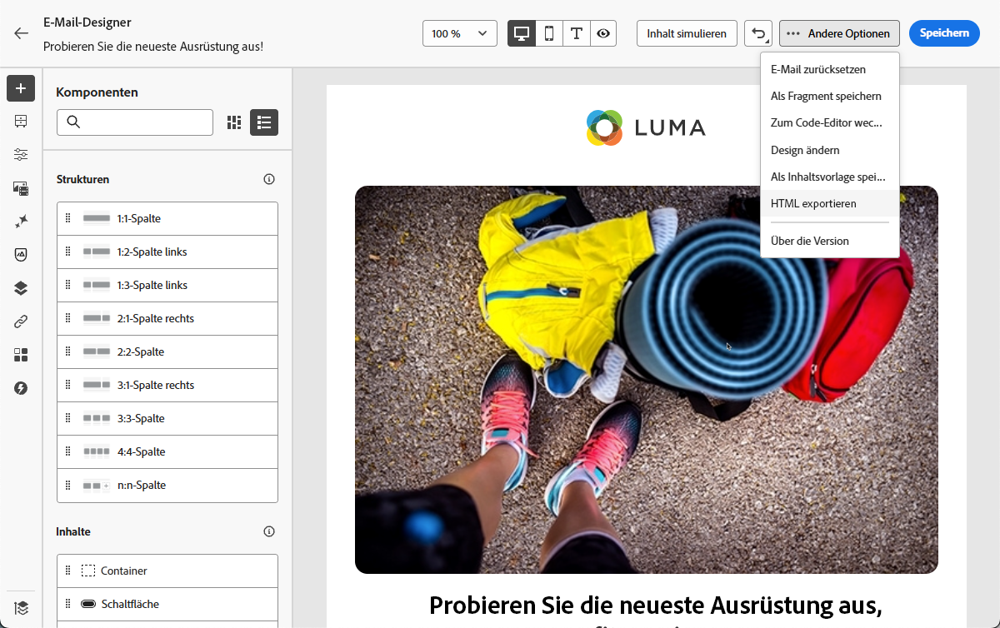
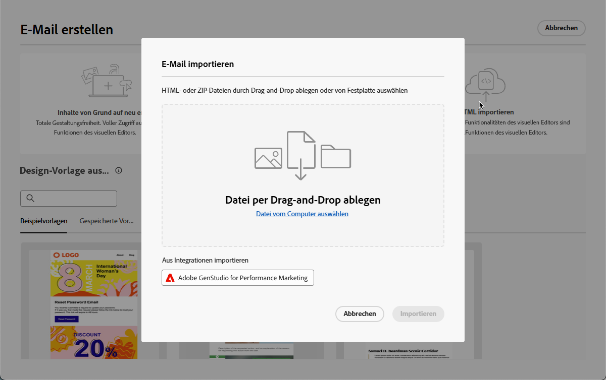
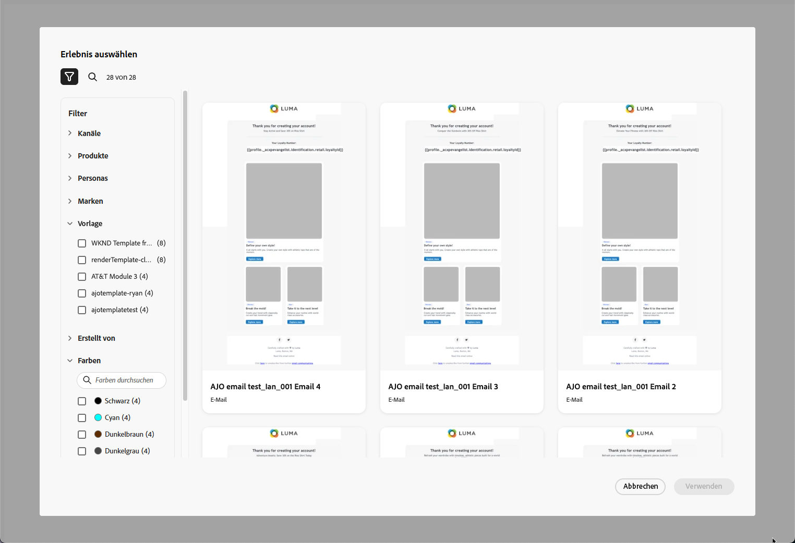
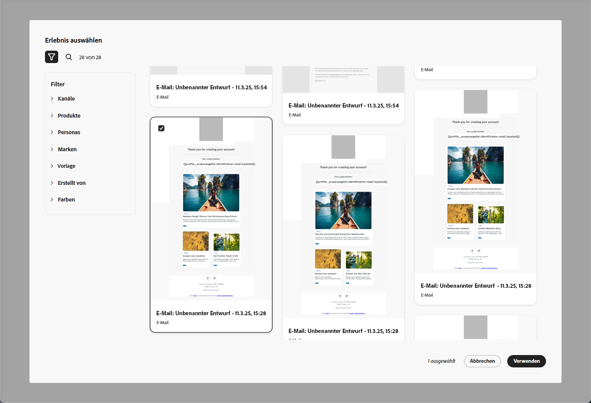
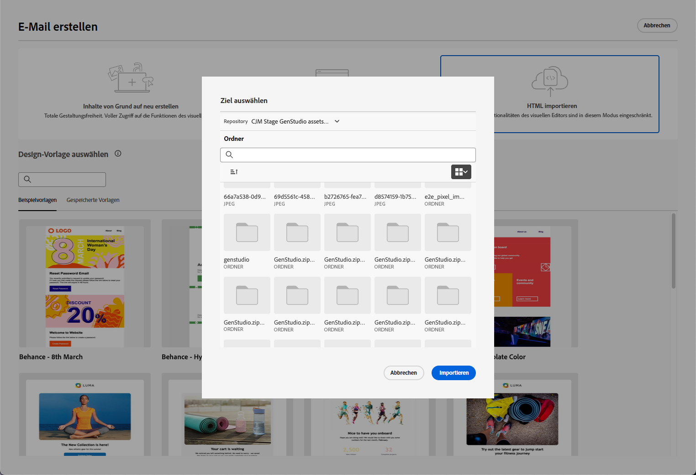
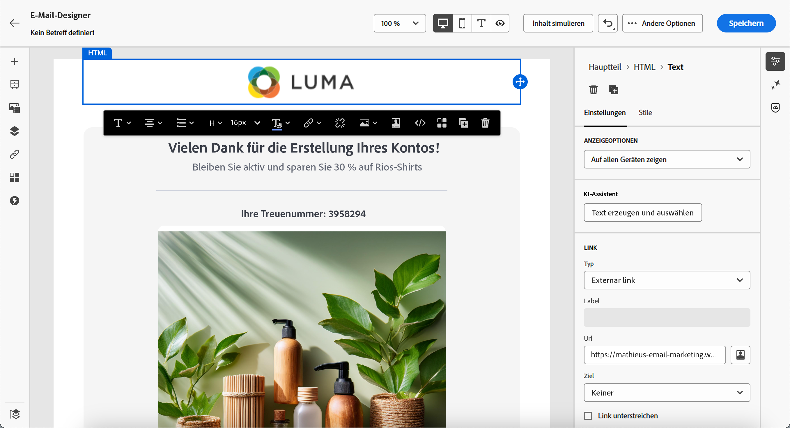

# Arbeiten mit GenStudio for Performance Marketing {#genstudio}

>[!CONTEXTUALHELP]
>id="ac_genstudio_button"
>title="Verwenden einer mit GenStudio erstellten Vorlage"
>abstract="Dank der nahtlosen Integration mit Adobe GenStudio for Performance Marketing können Sie eine mit KI-Technologie von Adobe erweiterte GenStudio-Vorlage einfach importieren."

## Erste Schritte mit GenStudio {#gs-genstudio}

[Adobe GenStudio for Performance Marketing](https://experienceleague.adobe.com/en/docs/genstudio-for-performance-marketing/user-guide/home){target="_blank"} ist eine generative KI-First-Anwendung, mit der Marketing-Teams ihre eigenen Anzeigen und E-Mails erstellen können, um wirkungsvolle, personalisierte Marketing-Kampagnen zu fördern, die Ihren Markenstandards entsprechen und Ihren Unternehmensrichtlinien entsprechen. Durch die Nutzung der KI-Technologie von Adobe bietet diese eine umfassende Palette an Tools, die die komplexe Erstellung und Verwaltung von Inhalten vereinfachen, sodass sich Kreative auf Innovationen konzentrieren können.

>[!AVAILABILITY]
>
>Diese Funktion ist nur für den E-Mail-Kanal verfügbar.

Um die Marketing-Effizienz zu steigern und die Markenkonsistenz zu wahren, können Sie [!DNL **GenStudio for Performance Marketing**]-Erlebnisse nahtlos mit [!DNL **Adobe Campaign**] integrieren. Auf diese Weise können Sie die KI-gestützte Inhaltserstellung von [!DNL GenStudio] zusammen mit den erweiterten Orchestrierungsfunktionen von [!DNL Adobe Campaign] nutzen.

>[!INFO]
>
>Weitere Informationen finden Sie in dieser [Übersicht](https://business.adobe.com/products/genstudio-for-performance-marketing.html#watch-overview){target="_blank"} und einer [Demo](https://business.adobe.com/products/genstudio-for-performance-marketing.html#demo){target="_blank"} von [!DNL Adobe GenStudio for Performance Marketing].

## Verwenden von GenStudio-Funktionen in Adobe Campaign {#use-genstudio}

Durch die Integration von [!DNL GenStudio for Performance Marketing] und [!DNL Adobe Campaign] können Marketing-Fachleute in Ihrem Unternehmen besser zusammenarbeiten, um Prozesse zu optimieren.

Ein technischer Marketing-Experte, der [!DNL Adobe Campaign] zum Entwickeln und Automatisieren von E-Mail-Kampagnen verwendet, kann beispielsweise mit einem Performance-Marketing-Experten zusammenarbeiten, der Inhalte mithilfe von [!DNL GenStudio] erstellt.

Mit dieser Integration können beide zusammenarbeiten, um markeninterne Inhalte von [!DNL GenStudio] einfach in [!DNL Adobe Campaign] zu integrieren und ansprechende E-Mails zu versenden, die auf bestimmte Kundensegmente zugeschnitten sind und den Umsatz steigern.

### Exportieren einer HTML-Vorlage von Adobe Campaign nach GenStudio {#export-from-campaign-to-genstudio}

Zunächst können Sie eine [!DNL Adobe Campaign] HTML-Vorlage mit den Richtlinien Ihrer Marke nach [!DNL GenStudio for Performance Marketing] exportieren. Gehen Sie dazu wie folgt vor.

1. Greifen Sie [!DNL Adobe Campaign] auf den Inhalt Ihrer E-Mail zu. [Weitere Informationen](../email/create-email.md#create-content)

1. Wählen Sie in der E-Mail-Designer **[!UICONTROL HTML exportieren]** über die Schaltfläche **[!UICONTROL Mehr]** aus.

   {zoomable="yes"}

1. Laden Sie diese exportierte HTML-Vorlage in [!DNL GenStudio for Performance Marketing] hoch. <!--Make sure you detect the fields that the generative AI uses to insert content in order to create an actionable template.-->

   >[!NOTE]
   >
   >Wie Sie eine HTML-Vorlage in [!DNL GenStudio] hochladen, erfahren Sie im [Adobe GenStudio for Performance Marketing-Benutzerhandbuch](https://experienceleague.adobe.com/en/docs/genstudio-for-performance-marketing/user-guide/content/templates/use-templates#templates-from-ajo-and-marketo){target="_blank"} Abschnitt.<!--GenStudio doc to be updated with Campaign-->

1. Verwenden Sie in GenStudio diese Vorlage, um mehrere E-Mail-Varianten mit KI-Eingabeaufforderungen zu erstellen und zu speichern.

   >[!NOTE]
   >
   >Wie Sie E-Mail-Erlebnisse erstellen, erfahren Sie im entsprechenden Abschnitt [&#x200B; GenStudio](https://experienceleague.adobe.com/en/docs/genstudio-for-performance-marketing/user-guide/create/create-email-experience){target="_blank"}.

### GenStudio-Erlebnisse in Adobe Campaign nutzen {#leverage-genstudio-experiences}

Gehen Sie wie folgt vor, um die [!DNL GenStudio] E-Mail-Varianten zu nutzen, die Sie soeben durch Importieren in [!DNL Adobe Campaign] erstellt haben.

1. Erstellen Sie [!DNL Adobe Campaign] [E-Mail-Versand](../email/create-email.md).

1. Klicken Sie im Dashboard des E-Mail-Versands auf die Schaltfläche **[!UICONTROL Inhalt bearbeiten]**. [Weitere Informationen](../email/create-email.md#create-content)

1. Wählen Sie auf der Startseite von E-Mail-Designer **[!UICONTROL HTML importieren]** und klicken Sie auf die Schaltfläche **[!UICONTROL Adobe GenStudio for Performance Marketing]**.

   {zoomable="yes"}

1. Durchsuchen Sie die GenStudio-Erlebnisse, um mit der Erstellung Ihrer Inhalte zu beginnen. Sie können die Erlebnisse nach verschiedenen Kriterien filtern, z. B. nach Produkten, Rollen, Marken oder sogar Farben.

   <!--{zoomable="yes"}-->

1. Wählen Sie ein Erlebnis aus und klicken Sie auf **[!UICONTROL Verwenden]**.

   {zoomable="yes"}

1. Wählen Sie den Ordner aus, in den Sie das GenStudio-Erlebnis importieren möchten.

   {zoomable="yes"}

1. Der ausgewählte Inhalt wird in der E-Mail-Designer angezeigt.

   {zoomable="yes"}

   >[!NOTE]
   >
   >GenStudio-Erlebnisse [erstellt aus einer  [!DNL Adobe Campaign] -Vorlage](#export-from-ajo-to-genstudio) werden direkt in die E-Mail-Designer importiert. GenStudio-Erlebnisse, die ohne [!DNL Adobe Campaign] erstellt wurden, werden in den [Kompatibilitätsmodus“ &#x200B;](../email/existing-content.md).

   Verwenden Sie die [Tools zur Bearbeitung von E](../email/create-email-content.md)Mail-Inhalten und [Personalisierungsfelder](../personalization/personalize.md), um Ihre E-Mail nach Bedarf zu bearbeiten. Speichern Sie Ihren Inhalt.

<!--Detail a use case with A/B testing to import other GenStudio variations and track how your tratments are performing.-->

<!--
## How-to video {#video}

Discover the process of exporting an email template from Adobe Campaign to GenStudio for Performance Marketing, crafting brand-compliant emails using the template in GenStudio, and importing them seamlessly back into Adobe Campaign.

>[!VIDEO](https://video.tv.adobe.com/v/3456038/?quality=12)
TO REPLACE WITH CAMPAIGN VIDEO WHEN/IF RELEASED
-->