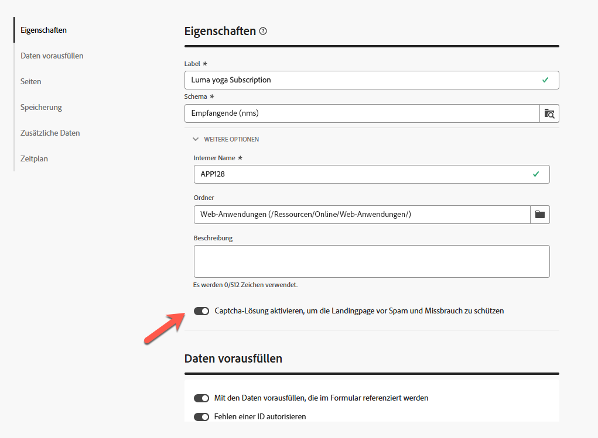

# Erstellen und Veröffentlichen von Landingpages {#create-lp}

>[!CONTEXTUALHELP]
>id="acw_landingpages_menu"
>title="Erstellen und Verwalten von Landingpages"
>abstract="Mit Adobe Campaign können Sie sofort Landingpages erstellen, entwerfen und teilen, um Benutzende auf Online-Web-Seiten weiterzuleiten, auf denen Sie anhand integrierter Vorlagen die Anwendungsszenarien für Akquise, Abonnement/Abmeldung und Blockierungslisten verwalten können."

Über die Campaign Web-Benutzeroberfläche können Sie Landingpages erstellen, entwerfen und veröffentlichen. Nach der Veröffentlichung können Sie einen Link zu Ihrem Formular in einem Versand einfügen. Nachdem die Empfängerinnen und Empfänger auf diesen Link geklickt haben, werden sie zur entsprechenden Landingpage weitergeleitet.

[!DNL Adobe Campaign] enthält vier Vorlagen für die folgenden Anwendungsfälle: **Akquise**, **Abonnement**, **Abmeldung** und **Blockierungsliste**. [Weitere Informationen](lp-use-cases.md)

## Zugreifen auf Landingpages {#access-landing-pages}

Um auf die Liste der Landingpages zuzugreifen, wählen Sie im Menü links **[!UICONTROL Kampagnen-Management]** > **[!UICONTROL Landingpages]** aus.

{zoomable="yes"}

Das Inventar der **[!UICONTROL Landingpages]** zeigt alle erstellten Elemente an. Sie können sie mithilfe der Schaltfläche **[!UICONTROL Filter zeigen]** filtern. 

* Sie können nach den von Ihnen erstellten oder geänderten Elementen filtern.
* Sie können die Ergebnisse über die Dropdown-Liste auf einen bestimmten [Ordner](../get-started/permissions.md#folders) beschränken oder mithilfe des [Abfrage-Modelers](../query/query-modeler-overview.md) Regeln hinzufügen.

{zoomable="yes"}

<!--From this list, you can access the [landing page Live report](../reports/lp-report-live.md) or [landing page Global report](../reports/lp-report-global.md) for published items.-->

>[!CAUTION]
>
>Landingpages, die über die Client-Konsole (Web-Formulare) erstellt wurden, können nicht in der Campaign Web-Benutzeroberfläche angezeigt oder bearbeitet werden. Weitere Informationen finden Sie in der [Dokumentation zur Campaign-Konsole](https://experienceleague.adobe.com/docs/campaign/campaign-v8/content/webapps.html?lang=de){target="_blank"}.

<!--If you unpublish a landing page which is referenced in a message, the link to the landing page will be broken and an error page will be displayed. You cannot delete a published landing page. To delete it, you must first unpublish it.-->

Sie können eine Landingpage duplizieren oder löschen. Klicken Sie auf die Auslassungspunkte neben einer Landingpage, um die gewünschte Aktion auszuwählen.

## Erstellen einer Landingpage {#create-landing-page}

>[!CONTEXTUALHELP]
>id="acw_landingpages_properties"
>title="Definieren der Eigenschaften der Landingpage"
>abstract="Füllen Sie die Eigenschaftenfelder wie den Titel aus und ändern Sie bei Bedarf das Schema. Darüber hinaus können Sie den internen Namen bearbeiten, den Ordner ändern, in dem die Landingpage gespeichert ist, und eine Beschreibung angeben."

>[!CONTEXTUALHELP]
>id="acw_landingpages_pages_list"
>title="Definieren des Inhalts jeder Seite"
>abstract="Passen Sie den Inhalt jeder Seite an, die Teil dieser Landingpage ist, z. B. das Formular selbst, die Bestätigungsseite, die beim Senden des Formulars angezeigt wird, oder die Seite, auf die Benutzende bei einem Fehler weitergeleitet werden."

>[!CONTEXTUALHELP]
>id="acw_landingpages_schedule"
>title="Zeitliches Planen der Landingpage"
>abstract="Legen Sie ein Start- und ein Enddatum für Ihre Landingpage fest. Wenn die Seite das Ende des Gültigkeitszeitraums erreicht, ist das Formular nicht mehr verfügbar. Stattdessen wird die Seite **Gültigkeit** angezeigt."

>[!CONTEXTUALHELP]
>id="acw_landingpages_preload"
>title="Definieren von Optionen zum Vorausfüllen"
>abstract="Bei aktivierter Option **Mit den Daten vorausfüllen, die im Formular referenziert werden** werden die Profilinformationen automatisch im Formular vorausgefüllt, wenn Besuchende der Landingpage mit einem Profil aus der Datenbank übereinstimmen. Wenn die Option **Fehlende ID zulassen** ausgewählt ist, kann eine beliebige Person, einschließlich anonymer Benutzender, auf die Landingpage zugreifen."

<!--With the **Skip preloading if no ID** option selected, each profile entered will be added to the database after approval of the form."-->

>[!CONTEXTUALHELP]
>id="acw_landingpages_storage"
>title="Definieren von Speicheroptionen"
>abstract="Im Abschnitt „Vorausfüllen“ können Sie angeben, wie der zu aktualisierenden Eintrag in der Datenbank gesucht werden soll."

<!--The main steps to create landing pages are as follows:

{zoomable="yes"}-->

Gehen Sie wie folgt vor, um eine Landingpage zu erstellen:

1. Klicken Sie im Inventar der **[!UICONTROL Landingpages]** auf **[!UICONTROL Landingpage erstellen]**.

   {zoomable="yes"}

1. Wählen Sie eine Vorlage aus:
   * **[!UICONTROL Akquise]**: Dies ist die Standardvorlage für Landingpages, mit der Sie Profildaten erfassen und aktualisieren können.
   * **[!UICONTROL Anmeldung]**: Verwenden Sie diese Vorlage, damit sich Benutzende für einen bestimmten [Dienst](../audience/manage-services.md) anmelden können.
   * **[!UICONTROL Abmeldung]**: Diese Vorlage kann in einem Versand an Abonnierende eines Dienstes verwendet werden, sodass sie sich von diesem [Dienst](../audience/manage-services.md) abmelden können.
   * **[!UICONTROL Blockierungsliste]**: Diese Vorlage sollte verwendet werden, wenn ein Profil in einem Versand auf einen Abmelde-Link klickt und nicht mehr kontaktiert werden möchte.

   {zoomable="yes"}

   >[!NOTE]
   >
   >Auf [dieser Seite](lp-use-cases.md) erfahren Sie, wie Sie die verschiedenen Anwendungsfälle für die jeweiligen Vorlagen implementieren können.

1. Klicken Sie auf **[!UICONTROL Erstellen]**.

1. Füllen Sie die Felder **[!UICONTROL Eigenschaften]** aus, z. B. „Titel“. 

   Standardmäßig werden Landingpages im Ordner **[!UICONTROL Web-Anwendungen]** gespeichert. Sie können dies ändern, indem Sie unter **[!UICONTROL Zusätzliche Optionen]** zum gewünschten Speicherort wechseln. [Erfahren Sie, wie Sie mit Ordnern arbeiten](../get-started/permissions.md#folders).

   Sie können das Captcha auch einrichten, um Ihre Landingpage zu schützen. [Weitere Informationen finden Sie hier](#captcha).

   {zoomable="yes"}

1. Im Abschnitt **[!UICONTROL Daten vorausfüllen]** sind die beiden folgenden Optionen verfügbar:

   * Bei aktivierter Option **[!UICONTROL Mit den Daten vorausfüllen, die im Formular referenziert werden]** werden die Profilinformationen automatisch im Formular vorausgefüllt, wenn Besuchende der Landingpage mit einem Profil aus der Datenbank übereinstimmen. Die Benutzerin oder der Benutzer muss nur die fehlenden Felder ausfüllen und bei Bedarf die vorhandenen Werte aktualisieren. Auf diese Weise können Daten für vorhandene Profile zusammengeführt werden, anstatt Duplikate zu erstellen.

     >[!NOTE]
     >
     >Diese Option ist standardmäßig für alle Landingpage-Vorlagen ausgewählt.

   * Die Option **[!UICONTROL Fehlende ID zulassen]** ermöglicht allen Besuchenden den Zugriff auf die Landingpage. Durch das Deaktivieren dieser Option wird verhindert, dass sie von anonymen Besuchenden verwendet wird. Dies bedeutet, dass nur identifizierte Personen auf das Formular zugreifen und es senden können.

     Diese Option ist für die Vorlagen **[!UICONTROL Akquise]** und **[!UICONTROL Abonnement]** standardmäßig aktiviert. Diese Option ist für die Vorlagen **[!UICONTROL Abmeldung]** und **[!UICONTROL Blockierungsliste]** standardmäßig deaktiviert und kann nicht geändert werden.

1. Eine Landingpage kann über nachfolgende Seiten verfügen. Um Seiten hinzuzufügen, navigieren Sie zum Abschnitt **[!UICONTROL Seiten]**. Klicken Sie dann für jede Seite, die für diese Landingpage entworfen werden soll, auf die Schaltfläche **[!UICONTROL Inhalt bearbeiten]**. Der Inhalt jeder Seite ist bereits vorausgefüllt. Bearbeiten Sie ihn nach Bedarf. [Weitere Informationen](lp-content.md).

   {zoomable="yes"}

1. Die Option **[!UICONTROL Vorausgefüllten Eintrag aktualisieren]** im Abschnitt **[!UICONTROL Speicher]** ist standardmäßig ausgewählt. Dadurch können die in der Datenbank gespeicherten Profile über die Landingpage aktualisiert werden. Mit der Option zum Vorausfüllen können Sie angeben, wie der zu aktualisierende Eintrag in der Datenbank gesucht werden soll. 

   Sie können außerdem aus den Feldern im aktuellen Kontext der Landingpage auswählen. Anhand dieser Felder wird das entsprechende Profil in der Datenbank gesucht. Deaktivieren Sie hierzu die Option **[!UICONTROL Vorausgefüllten Eintrag aktualisieren]** und aktivieren Sie die gewünschten Felder unter **[!UICONTROL Abstimmoptionen]**.

   {zoomable="yes"}

1. Erstellen Sie **[!UICONTROL Zusatzdaten]**, um interne Daten beim Senden der Landingpage zu speichern. Die Daten sind für Besucherinnen und Besucher der Seite nicht sichtbar.  Nur konstante Werte werden berücksichtigt.

   {zoomable="yes"}

1. Sie können ein Start- und ein Enddatum für Ihre Landingpage definieren. Wählen Sie **[!UICONTROL Zeitplanung aktivieren]** aus und legen Sie die Daten fest. 

   {zoomable="yes"}

   * Die Landingpage wird automatisch am angegebenen Startdatum/zur festgelegten Startzeit veröffentlicht.

     >[!NOTE]
     >
     >Wenn kein Startdatum definiert ist, wird die Landingpage sofort nach der Veröffentlichung live geschaltet.

   * Wenn die Seite das Enddatum erreicht, ist das Formular nicht mehr verfügbar. Stattdessen wird die Seite **[!UICONTROL Gültigkeit]** angezeigt.

     >[!NOTE]
     >
     >Aus Gründen der Sicherheit und der Plattformleistung empfiehlt Adobe, ein Enddatum festzulegen.

1. Klicken Sie auf **[!UICONTROL Überprüfen und veröffentlichen]**.

Nachdem Sie alle Einstellungen definiert und alle Seiten [entworfen](lp-content.md) haben, können Sie Ihre Landingpage wie unten beschrieben [testen](#test-landing-page) und [veröffentlichen](#publish-landing-page).

## Sichern Ihrer Landingpage mit einem Captcha {#captcha}

Durch das Einrichten eines Captcha können Sie Ihre Landingpage vor Spam und Missbrauch schützen.

Um es zu verwenden, navigieren Sie zu den **[!UICONTROL Eigenschaften]** Ihrer Landingpage.
Sie finden es auch in den **[!UICONTROL zusätzlichen Optionen]**. Aktivieren Sie den Umschalter **[!UICONTROL Captcha-Lösung zusätzlich aktivieren]**.

{zoomable="yes"}

Um die Captcha-Einstellungen zu überprüfen, klicken Sie auf die Schaltfläche **[!UICONTROL Überprüfen und veröffentlichen]** und auf **[!UICONTROL Inhalte simulieren]**. Beim Senden des Formulars sehen Sie, wie das Captcha-Widget während der Validierung funktioniert, wie unten dargestellt.

{zoomable="yes"}

>[!NOTE]
>
>Das Captcha-Widget in Adobe Campaign v8 ist ALTCHA, das im unverankerten Modus arbeitet. Es wird während der Validierung angezeigt und verschwindet nach Abschluss des Prozesses.

## Testen der Landingpage {#test-landing-page}

>[!CONTEXTUALHELP]
>id="acw_landingpages_simulate"
>title="Simulation der Landingpage"
>abstract="Sie können eine Vorschau Ihrer Landingpage in der Campaign Web-Benutzeroberfläche anzeigen oder sie in einer neuen Registerkarte des Webbrowsers öffnen."

>[!CONTEXTUALHELP]
>id="ac_preview_lp_profiles"
>title="Erstellen einer Vorschau und Testen der Landingpage"
>abstract="Nachdem Sie die Einstellungen und den Inhalt Ihrer Landingpage definiert haben, können Sie sie mit Testprofilen in der Vorschau anzeigen."

Nachdem Sie die Einstellungen und den Inhalt Ihrer Landingpage definiert haben, können Sie sie mit Testprofilen in der Vorschau anzeigen. Bei Verwendung von [personalisierten Inhalten](../personalization/gs-personalization.md) können Sie prüfen, wie diese Inhalte auf der Landingpage angezeigt werden, und dabei Daten von Testprofilen nutzen.

>[!CAUTION]
>
>Um Ihre Nachrichten in der Vorschau darzustellen und einen Testversand durchzuführen, benötigen Sie verfügbare Testprofile. [Weitere Informationen zu Testprofilen](../audience/test-profiles.md)

Gehen Sie wie folgt vor, um Ihre Landingpage zu testen:

1. Nachdem Sie auf **[!UICONTROL Überprüfen und veröffentlichen]** geklickt haben, wählen Sie im Landingpage-Dashboard die Schaltfläche **[!UICONTROL Inhalte simulieren]** aus, um auf die Testprofilauswahl zuzugreifen.

   {zoomable="yes"}

1. Wählen Sie auf dem Bildschirm **[!UICONTROL Simulieren]** ein oder mehrere Testprofile aus.

   Die Schritte zum Auswählen von Testprofilen sind mit denen beim Testen einer Nachricht identisch. Sie werden im Abschnitt [Vorschau und Testen](../preview-test/preview-test.md) beschrieben.

1. Beim Testen einer dynamischen Landingpage (und wenn die Option **[!UICONTROL Dienst über URL]** ausgewählt ist – [Weitere Informationen](../landing-pages/create-lp.md#define-actions-on-form-submission)

1. Wählen Sie **[!UICONTROL Vorschau öffnen]** aus, um Ihre Landingpage zu testen.

   {zoomable="yes"}

1. Die Vorschau Ihrer Landingpage wird in einer neuen Registerkarte geöffnet. Personalisierte Elemente werden durch die ausgewählten Testprofildaten ersetzt.

   Wenn Sie in den Landingpage-Einstellungen die Option **[!UICONTROL Mit den Daten vorausfüllen, die im Formular referenziert werden]** ausgewählt haben, werden die Formularfelder automatisch mit den entsprechenden Testprofildaten vorausgefüllt.<!--TBC-->

   {zoomable="yes"}

1. Wählen Sie weitere Testprofile aus, um das Rendering für jede Variante Ihrer Landingpage in der Vorschau anzuzeigen.

<!--Can you preview Confirmation/Error/Expiration pages?-->

## Veröffentlichen der Landingpage {#publish-landing-page}

Veröffentlichen Sie Ihre Landingpage, sobald sie fertig und validiert ist, um sie für die Verwendung in einem Versand über die entsprechende Schaltfläche verfügbar zu machen.

Nach der Veröffentlichung:

* Die Landingpage wird mit dem Status **[!UICONTROL Veröffentlicht]** zur Liste der Landingpages hinzugefügt. Sie ist jetzt live und kann in Ihren Inhalten referenziert werden.

* Sie können die **[!UICONTROL Landingpage-URL]**, die oben auf der Seite angezeigt wird, in einen Webbrowser kopieren, um eine Vorschau Ihrer Landingpage anzuzeigen.

>[!CAUTION]
>
>Sie können diesen Link nicht direkt in einen Webbrowser oder in Ihre Sendungen kopieren und einfügen, um Ihre Landingpage vollständig zu testen oder zu nutzen. Verwenden Sie stattdessen zum Testen die Funktion [Inhalt simulieren](#test-landing-page) und führen Sie die in [diesem Abschnitt](lp-use-cases.md) beschriebenen Schritte aus, damit Ihre Landingpage ordnungsgemäß verwendet werden kann.

{zoomable="yes"}

Sie können die Wirkung Ihrer Landingpage über Protokolle<!--and specific reports--> überwachen.  Klicken Sie auf die Schaltfläche **[!UICONTROL Protokolle]**.