# Definieren des Inhalts für die Landingpage {#lp-content}

>[!CONTEXTUALHELP]
>id="ac_lp_components"
>title="Verwenden von Inhaltskomponenten"
>abstract="Inhaltskomponenten sind leere Platzhalter für Inhalte, mit denen Sie das Layout einer Landingpage gestalten können. Verwenden Sie die Formularkomponente, um bestimmte Inhalte zu definieren, über die Benutzerinnen und Benutzer ihre Auswahl auswählen und übermitteln können."

>[!CONTEXTUALHELP]
>id="acw_landingpages_primarypage"
>title="Definieren der primären Seiteneinstellungen"
>abstract="Die primäre Seite wird den Benutzenden sofort angezeigt, nachdem sie auf den Link zu Ihrer Landingpage geklickt haben, z. B. über eine E-Mail oder eine Website."

Sie können den Inhalt einer beliebigen Seite Ihrer Landingpage bearbeiten.

Die erste Seite, die den Benutzenden sofort angezeigt wird, nachdem sie auf den Link zu Ihrer Landingpage geklickt haben, ist bereits mit der [Landingpage-spezifischen Formularkomponente](#use-form-component) für die ausgewählte Vorlage vorausgefüllt<!-- to enable users to select and submit their choices-->.

Der Inhalt der Seiten **[!UICONTROL Bestätigung]**, **[!UICONTROL Fehler]** und **[!UICONTROL Ablauf]** ist ebenfalls vorausgefüllt. Bearbeiten Sie den Inhalt nach Bedarf. 

Sie können auch [Stile für Ihre Landingpage](#lp-form-styles) definieren.

So gestalten Sie den Inhalt Ihrer Landingpage weitergehend:

* Sie können dieselben Komponenten wie für E-Mail-Entwürfe verwenden. [Weitere Informationen](../email/content-components.md#add-content-components)

* Sie können Ihren Landingpages bedingte Inhalte so wie bei E-Mails hinzufügen. [Weitere Informationen](../personalization/conditions.md#condition-condition-builder)

  >[!AVAILABILITY]
  >
  >Diese Funktion ist nur eingeschränkt verfügbar. Sie ist Kundinnen und Kunden vorbehalten, die **von Adobe Campaign Standard zu Adobe Campaign v8** migrieren, und kann nicht in anderen Umgebungen bereitgestellt werden.

## Verwenden von Formularkomponenten {#use-form-component}

>[!CONTEXTUALHELP]
>id="ac_lp_formfield"
>title="Festlegen der Formularkomponentenfelder"
>abstract="Definieren Sie, wie die Empfängerinnen und Empfänger ihre Auswahl auf Ihrer Landingpage sehen und übermitteln."

>[!CONTEXTUALHELP]
>id="acw_landingpages_calltoaction"
>title="Was passiert, wenn auf die Schaltfläche geklickt wird"
>abstract="Definieren Sie, was passieren soll, wenn Benutzende das Landingpage-Formular übermitteln."

Um bestimmte Inhalte zu definieren, mit denen Benutzende ihre Auswahl auf Ihrer Landingpage festlegen und übermitteln können, bearbeiten Sie die **[!UICONTROL Formularkomponente]**. Gehen Sie dazu wie folgt vor.

1. Die Landingpage-spezifische **[!UICONTROL Formularkomponente]** wird bereits auf der Arbeitsfläche für die ausgewählte Vorlage angezeigt.

   >[!NOTE]
   >
   >Die **[!UICONTROL Formularkomponente]** kann nur einmal auf derselben Seite verwendet werden.

1. Wählen Sie sie aus. Die Registerkarte **[!UICONTROL Formularinhalt]** in der rechten Palette wird angezeigt, damit Sie die verschiedenen Felder des Formulars bearbeiten können.

   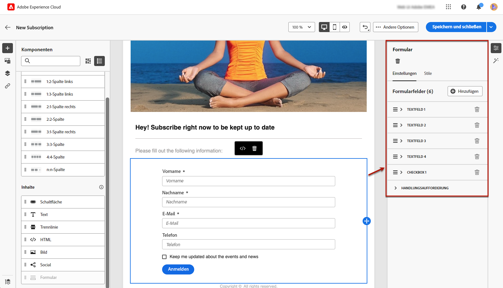{zoomable="yes"}

   >[!NOTE]
   >
   >Sie können jederzeit zur Registerkarte **[!UICONTROL Stile]** wechseln, um die Stile Ihres Formularkomponenteninhalts zu bearbeiten. [Weitere Informationen](#lp-form-styles)

1. Erweitern Sie das erste Textfeld, falls vorhanden, oder fügen Sie eines mithilfe der Schaltfläche **[!UICONTROL Hinzufügen]** hinzu. Sie können im Abschnitt **[!UICONTROL Textfeld 1]** den Feldtyp, das zu aktualisierende Datenbankfeld, den Titel und den Text bearbeiten, der im Feld angezeigt wird, bevor Benutzende einen Wert eingeben.

   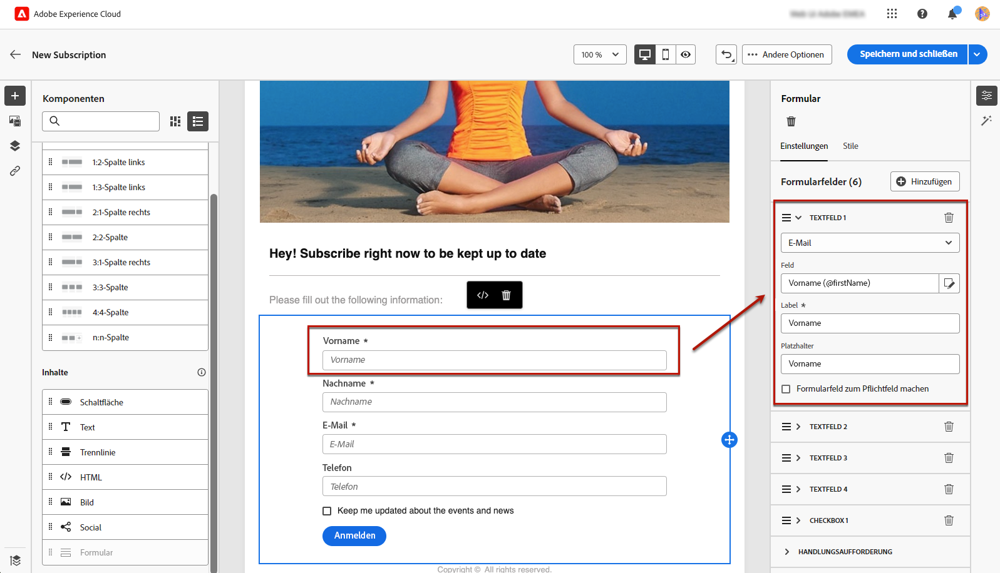{zoomable="yes"}

1. Aktivieren Sie bei Bedarf die Option **[!UICONTROL Formularfeld zum Pflichtfeld machen]**. In diesem Fall kann das Formular der Landingpage nur gesendet werden, wenn der Benutzer dieses Feld ausgefüllt hat.

   >[!NOTE]
   >
   >Wenn ein Pflichtfeld nicht ausgefüllt wurde, erscheint eine Fehlermeldung, wenn der Benutzer das Formular sendet.

1. Erweitern Sie das Kontrollkästchen, falls vorhanden, oder fügen Sie eines mithilfe der Schaltfläche **[!UICONTROL Hinzufügen]** hinzu. Wählen Sie aus, ob mit diesem Kontrollkästchen ein Dienst oder ein Feld aus der Datenbank aktualisiert werden soll.

   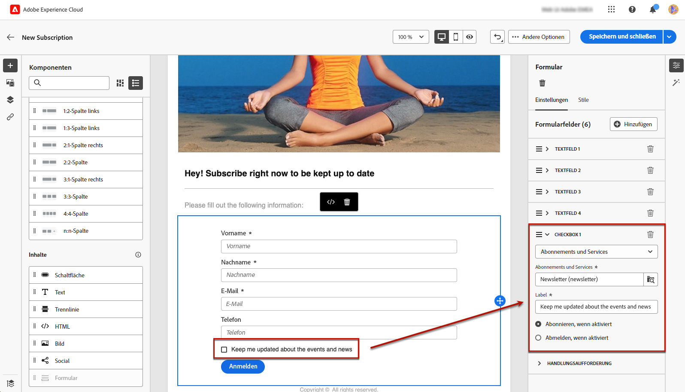{zoomable="yes"}

   Wenn Sie **[!UICONTROL Abonnements und Services]** auswählen, wählen Sie einen [Dienst](../audience/manage-services.md) aus der Liste aus und legen Sie eine der beiden folgenden Optionen fest:

   * **[!UICONTROL Anmelden wenn aktiviert]**: Benutzende müssen das Kontrollkästchen zum Einverständnis aktivieren (Opt-in).
   * **[!UICONTROL Abmelden wenn aktiviert]**: Benutzende müssen das Kontrollkästchen aktivieren, um ihr Einverständnis zu entfernen (Opt-out).

   Wenn Sie **[!UICONTROL Feld]** auswählen, wählen Sie ein Feld aus der Attributliste aus und legen Sie eine der beiden folgenden Optionen fest:

   * **[!UICONTROL Ja, wenn aktiviert]**.<!--TBC-->

   * **[!UICONTROL Nein, wenn aktiviert]**.<!--TBC-->

1. Sie können so viele Felder (z. B. Textfelder, Optionsfelder, Kontrollkästchen, Dropdown-Listen usw.) löschen und hinzufügen wie nötig.

1. Nachdem alle Felder hinzugefügt oder aktualisiert wurden, klicken Sie auf **[!UICONTROL Handlungsaufforderung]**, um den entsprechenden Abschnitt zu erweitern. Damit können Sie das Verhalten der Schaltfläche in der **[!UICONTROL Formularkomponente]** festlegen. [Weitere Informationen dazu](#define-actions-on-form-submission)

   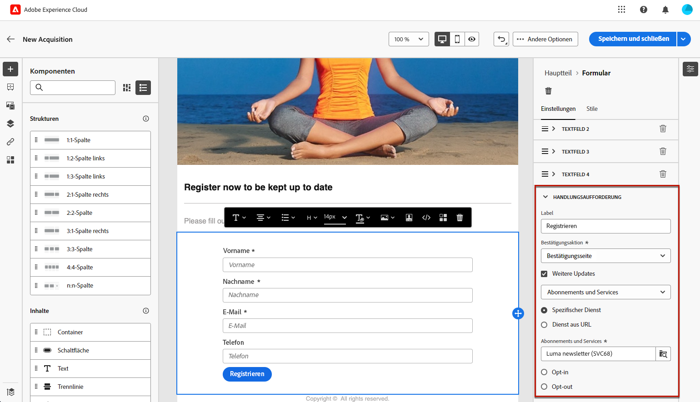{zoomable="yes"}

1. Speichern Sie den Inhalt, um zu den [Eigenschaften der Landingpage](create-lp.md#create-landing-page) zurückzukehren.

### Definieren von Aktionen bei der Formularübermittlung {#define-actions-on-form-submission}

1. Definieren Sie, was beim Klicken auf die Schaltfläche passieren soll:

   * **[!UICONTROL Bestätigungsseite]**: Die Benutzenden werden standardmäßig zur **[!UICONTROL Bestätigungsseite]** umgeleitet, die für die aktuelle Landingpage festgelegt ist.

   * **[!UICONTROL Umleitungs-URL]**: Geben Sie die URL der Seite ein, zu der die Benutzenden umgeleitet werden sollen.

   * **[!UICONTROL Landingpage]**: Sie können eine andere Landingpage auswählen, zu der Benutzende umgeleitet werden sollen. Konfigurieren Sie die ausgewählte Landingpage entsprechend.

1. Wenn Sie beim Senden des Formulars zusätzliche Aktualisierungen vornehmen möchten, wählen Sie **[!UICONTROL Zusätzliche Aktualisierungen]** aus und wählen Sie dann das Element aus, das Sie aktualisieren möchten:
   * [Abonnement-Dienst](../audience/manage-services.md): Definieren Sie in diesem Fall, ob Benutzende bei der Formularübermittlung angemeldet oder abgemeldet werden sollen. Wenn Sie beim Entwerfen einer E-Mail einen Link vom Typ **[!UICONTROL Landingpage]** zu dieser Landingpage definieren, wird der ausgewählte Dienst automatisch verwendet. [Weitere Informationen zum Einfügen von Links](../email/message-tracking.md)

     >[!NOTE]
     >
     >Wenn Sie für diese Landingpage mehrere Dienste verwenden möchten, verwenden Sie die nachstehend beschriebene Option **[!UICONTROL Dienst über URL]**.

   * Kanal: Die beim Ausfüllen des Formulars verwendete E-Mail-Adresse.
   * Alle Kanäle: Beim Senden des Formulars werden die Benutzenden (je nach ausgewählter Vorlage) für alle Nachrichten von Ihrer Marke auf allen Kanälen angemeldet oder abgemeldet.
   * Ein Feld aus der Datenbank: Wählen Sie ein Feld aus der Attributliste aus und legen Sie fest, ob es beim Senden des Formulars auf „True“ oder „False“ gesetzt werden soll.

   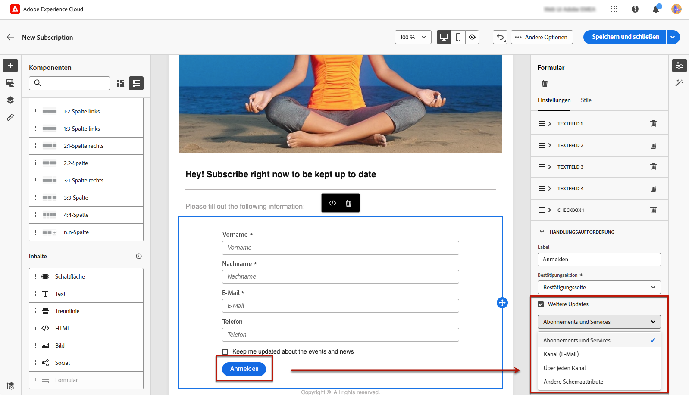{zoomable="yes"}

1. Wählen Sie die Option **[!UICONTROL Dienst über URL]** aus, damit die Landingpage für mehrere Dienste verwendet werden kann, wodurch sie dynamisch wird. Definieren Sie, ob Benutzende bei der Formularübermittlung angemeldet oder abgemeldet werden sollen.

   >[!AVAILABILITY]
   >
   >Diese Funktion ist nur eingeschränkt verfügbar. Sie ist Kundinnen und Kunden vorbehalten, die **von Adobe Campaign Standard zu Adobe Campaign v8** migrieren, und kann nicht in anderen Umgebungen bereitgestellt werden.

   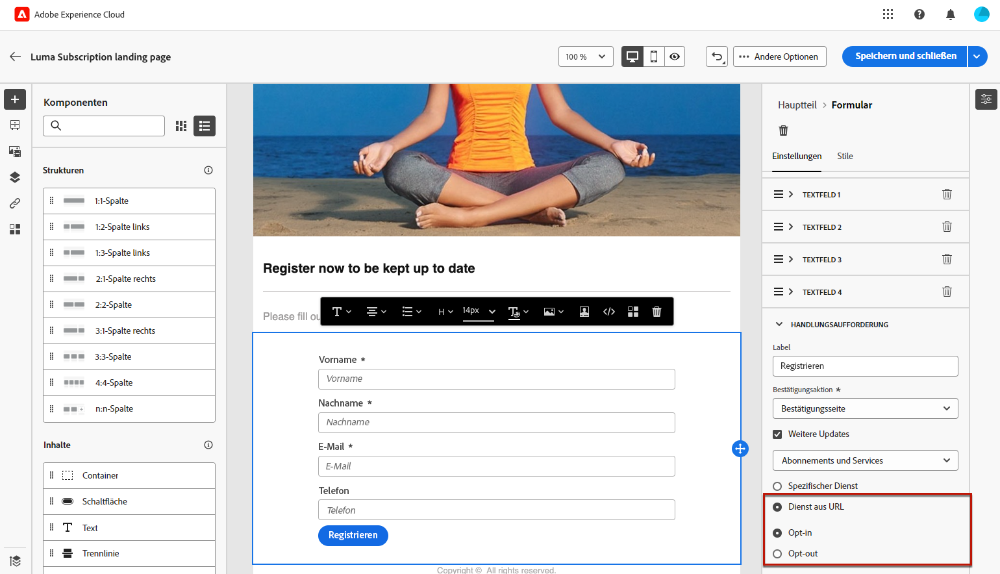{zoomable="yes"}

   Wenn Sie beim Entwerfen einer E-Mail einen Link vom Typ **[!UICONTROL Landingpage]** zu dieser Landingpage definieren, können Sie einen beliebigen Dienst aus der Liste auswählen. Sie können dann bei der Definition anderer Links zu dieser Landingpage andere Dienste auswählen. [Weitere Informationen zum Einfügen von Links](../email/message-tracking.md)

   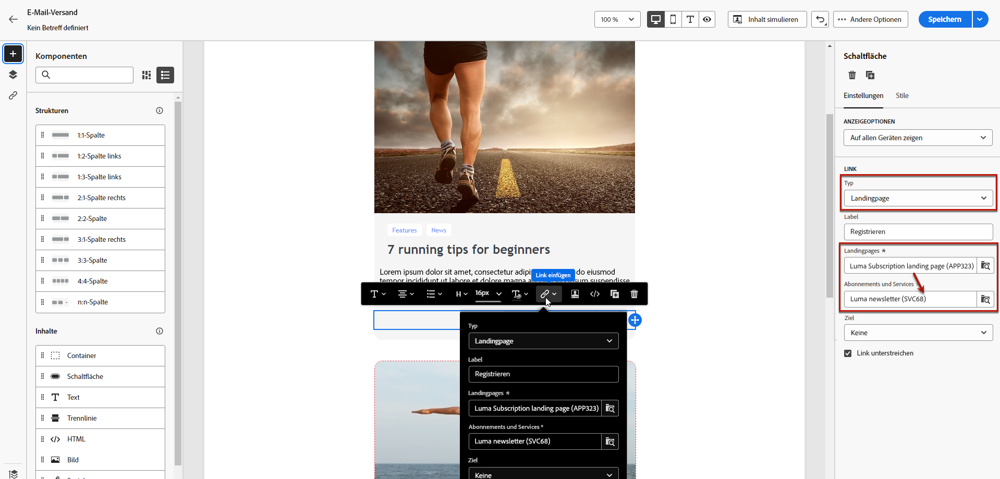{zoomable="yes"}

1. Sie können eine Nachricht beim Einreichen der Landingpage senden. [Weitere Informationen finden Sie hier](#lp-message)

### Senden einer Nachricht nach der Einreichung {#lp-message}

>[!AVAILABILITY]
>
>Diese Funktion ist nur eingeschränkt verfügbar. Sie ist Kundinnen und Kunden vorbehalten, die **von Adobe Campaign Standard zu Adobe Campaign v8** migrieren, und kann nicht in anderen Umgebungen bereitgestellt werden.

Gehen Sie wie folgt vor, um nach dem Senden einer Landingpage automatisch eine Bestätigungsnachricht zu senden:

1. Aktivieren Sie im Abschnitt **[!UICONTROL HANDLUNGSAUFFORDERUNG]** die Option **[!UICONTROL Bestätigungs-E-Mail senden]**.

1. Wählen Sie in der dazugehörigen Dropdown-Liste die zu sendende Transaktionsnachrichtenvorlage aus.

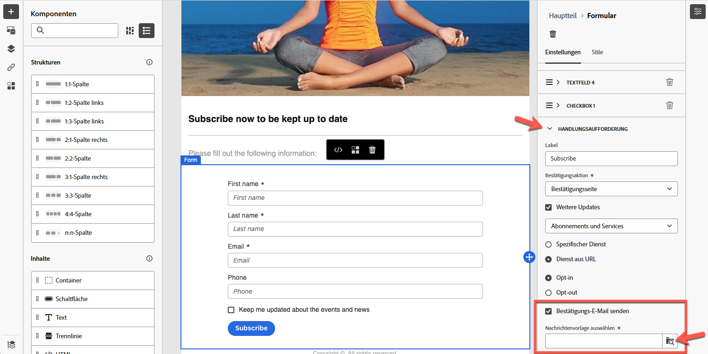{zoomable="yes"}

## Definieren der Formularstile für die Landingpage {#lp-form-styles}

1. Um die Stile Ihres Formularkomponenteninhalts zu ändern, können Sie jederzeit zur Registerkarte **[!UICONTROL Stil]** wechseln.

1. Der Abschnitt **[!UICONTROL Textfeld]** wird standardmäßig erweitert. Er ermöglicht es Ihnen, das Erscheinungsbild des Textfelds zu bearbeiten, z. B. die Schriftart für Titel, die Position der Titel, die Hintergrundfarbe des Felds oder des Feldrands.

   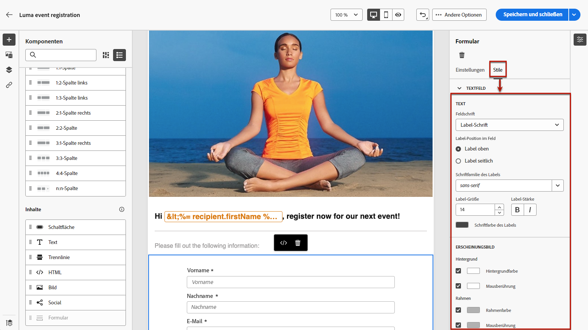{zoomable="yes"}

1. Klappen Sie den Abschnitt **[!UICONTROL Kontrollkästchen]** aus, um das Erscheinungsbild der Kontrollkästchen und des entsprechenden Texts zu definieren. Sie können beispielsweise die Schriftfamilie, die Schriftgröße und die Rahmenfarbe des Kontrollkästchens anpassen.

   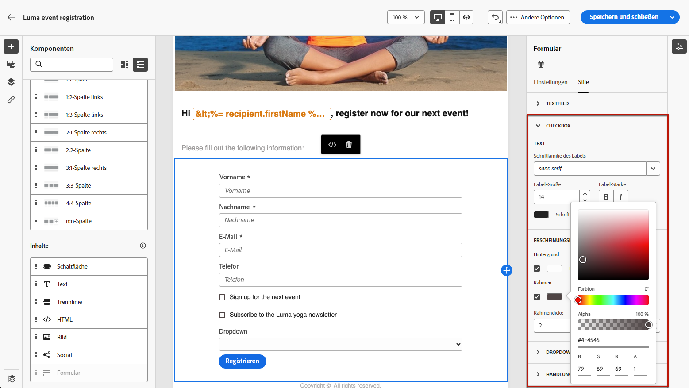{zoomable="yes"}

1. Erweitern und bearbeiten Sie alle anderen Abschnitte, die anderen von Ihnen zum Formular hinzugefügten Feldern entsprechen (Optionsfeld, Dropdown-Liste, Datum und Uhrzeit usw.)

1. Erweitern Sie den Abschnitt **[!UICONTROL Handlungsaufforderung]**, um das Erscheinungsbild der Schaltfläche im Komponentenformular zu ändern. Sie können beispielsweise die Schriftart ändern, einen Rahmen hinzufügen, die Beschriftungsfarbe beim Bewegen des Mauszeigers bearbeiten oder die Ausrichtung der Schaltfläche anpassen.

   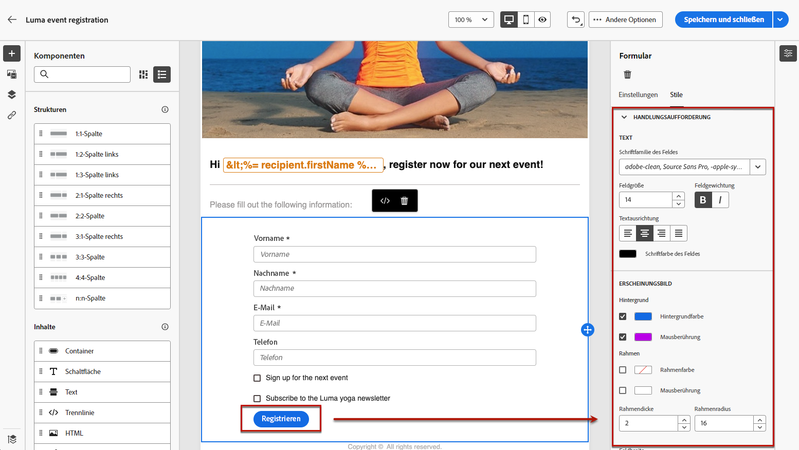{zoomable="yes"}

   Sie können eine Vorschau einiger Ihrer Einstellungen anzeigen, z. B. die Farbe der Schaltflächenbeschriftung beim Bewegen des Mauszeigers, indem Sie die Schaltfläche **[!UICONTROL Inhalt simulieren]** verwenden. [Weitere Informationen](create-lp.md#test-landing-page)

1. Speichern Sie Ihre Änderungen.
