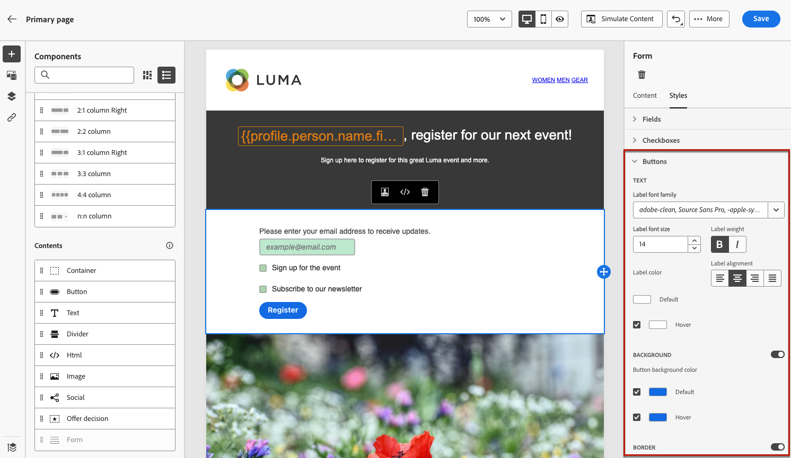

# Definieren des Inhalts für die Landingpage {#lp-content}

>[!CONTEXTUALHELP]
>id="ac_lp_components"
>title="Verwenden von Inhaltskomponenten"
>abstract="Inhaltskomponenten sind leere Platzhalter für Inhalte, mit denen Sie das Layout einer Landingpage gestalten können. Verwenden Sie die Formularkomponente, um bestimmte Inhalte zu definieren, über die Benutzerinnen und Benutzer ihre Auswahl auswählen und übermitteln können."

Wenn Sie den Inhalt einer beliebigen Seite Ihrer Landingpage bearbeiten, ist er bereits vorausgefüllt.

Die primäre Seite ist die Seite, die den Benutzenden sofort angezeigt wird, nachdem sie auf den Link zu Ihrer Landingpage geklickt haben, z. B. über eine E-Mail oder eine Website. Die primäre Seite ist bereits mit der [Landingpage-spezifischen Formularkomponente](#use-form-component) ausgefüllt, damit Benutzende ihre Auswahl treffen und übermitteln können. Sie können auch [Landingpage-spezifische Stile](#lp-form-styles) festlegen.

Um den Inhalt Ihrer Landingpage weiter zu gestalten, können Sie dieselben Komponenten wie für eine E-Mail verwenden. [Weitere Informationen](../email/content-components.md#add-content-components)

<!--
The content of the **[!UICONTROL Confirmation]**, **[!UICONTROL Error]** and **[!UICONTROL Expiration]** pages is also pre-filled. Edit them as needed.

Set the subscription form to the appropriate fields from the database to make sure it will work correctly.

The landing page default fields are already there for the selected template.

>[!NOTE]
>
>You can also create a click-through landing page without a **[!UICONTROL Form]** component. In that case, the landing page will be displayed to users, but they will not be required to submit any form. This can be useful if you only want to showcase a landing page without requiring any action from your recipients such as opt-in or opt out, or want to provide information that doesn't require user input.

Using the landing page content designer, you can also leverage contextual data coming from the primary page in a subpage. [Learn more](#use-primary-page-context)-->

## Verwenden von Formularkomponenten {#use-form-component}

>[!CONTEXTUALHELP]
>id="ac_lp_formfield"
>title="Festlegen der Formularkomponentenfelder"
>abstract="Definieren Sie, wie die Empfängerinnen und Empfänger ihre Auswahl auf Ihrer Landingpage sehen und übermitteln."

>[!CONTEXTUALHELP]
>id="acw_landingpages_calltoaction"
>title="Was passiert, wenn auf die Schaltfläche geklickt wird"
>abstract="Definieren Sie, was passieren soll, wenn Benutzende das Landingpage-Formular übermitteln."

Um bestimmte Inhalte zu definieren, mit denen Benutzende ihre Auswahl auf Ihrer Landingpage festlegen und übermitteln können, verwenden Sie die **[!UICONTROL Formularkomponente]**. Gehen Sie dazu wie folgt vor.

1. Die Landingpage-spezifische **[!UICONTROL Formularkomponente]** wird bereits auf der Arbeitsfläche für die ausgewählte Vorlage angezeigt.

   >[!NOTE]
   >
   >Die **[!UICONTROL Formularkomponente]** kann nur einmal auf derselben Seite verwendet werden.

1. Wählen Sie sie aus. Die Registerkarte **[!UICONTROL Formularinhalt]** in der rechten Palette wird angezeigt, damit Sie die verschiedenen Felder des Formulars bearbeiten können.

   

   >[!NOTE]
   >
   >Sie können jederzeit zur Registerkarte **[!UICONTROL Stile]** wechseln, um die Stile Ihres Formularkomponenteninhalts zu bearbeiten. [Weitere Informationen](#lp-form-styles)

1. Erweitern Sie das erste Textfeld. Sie können im Abschnitt **[!UICONTROL Textfeld 1]** den Feldtyp, das Datenbankfeld, den Titel und den Text bearbeiten, der im Feld angezeigt wird, bevor jemand das Feld ausfüllt.

   

1. Aktivieren Sie bei Bedarf die Option **[!UICONTROL Formularfeld zum Pflichtfeld machen]**. In diesem Fall kann das Formular der Landingpage nur gesendet werden, wenn der Benutzer dieses Feld ausgefüllt hat.

   >[!NOTE]
   >
   >Wenn ein Pflichtfeld nicht ausgefüllt wurde, erscheint eine Fehlermeldung, wenn der Benutzer das Formular sendet.

1. Fügen Sie ein Kontrollkästchen hinzu. Wählen Sie aus, ob mit diesem Kontrollkästchen ein Dienst oder ein Feld aus der Datenbank aktualisiert werden soll.

   

   Definieren Sie, ob dieses Kontrollkästchen Benutzenden das An- oder Abmelden ermöglicht. Wählen Sie aus den beiden folgenden Optionen aus:

   * **[!UICONTROL Anmelden wenn aktiviert]**: Benutzende müssen das Kontrollkästchen zum Einverständnis aktivieren (Opt-in).
   * **[!UICONTROL Abmelden wenn aktiviert]**: Benutzende müssen das Kontrollkästchen aktivieren, um ihr Einverständnis zu entfernen (Opt-out).

1. Sie können beliebig viele Textfelder und/oder Kontrollkästchen löschen und hinzufügen.

1. Nachdem Sie alle gewünschten Kontrollkästchen und/oder Textfelder hinzugefügt haben, klicken Sie auf **[!UICONTROL Handlungsaufforderung]** um den entsprechenden Abschnitt zu erweitern. Damit können Sie das Verhalten der Schaltfläche in der **[!UICONTROL Formularkomponente]** festlegen.

   

1. Definieren Sie, was beim Klicken auf die Schaltfläche passieren soll:

   * **[!UICONTROL Bestätigungsseite]**: Die Person wird zur **[!UICONTROL Bestätigungsseite]** weitergeleitet, die für die aktuelle Landingpage festgelegt ist.

   * **[!UICONTROL Umleitungs-URL]**: Geben Sie die URL der Seite ein, zu der die Benutzenden umgeleitet werden sollen.

1. Wenn Sie beim Senden des Formulars zusätzliche Aktualisierungen vornehmen möchten, wählen Sie **[!UICONTROL Zusätzliche Aktualisierungen]** und anschließend **[!UICONTROL Opt-in]** bzw. **[!UICONTROL Opt-out]** aus, und definieren Sie, ob Sie eine Abonnementliste, den Kanal oder nur die verwendete E-Mail-Adresse aktualisieren möchten.

   

1. Speichern Sie den Inhalt, um zu den [Eigenschaften der Landingpage](create-lp.md) zurückzukehren.

## Definieren der Formularstile für die Landingpage {#lp-form-styles}

1. Um die Stile Ihres Formularkomponenteninhalts zu ändern, können Sie jederzeit zur Registerkarte **[!UICONTROL Stil]** wechseln.

   

1. Der Abschnitt **[!UICONTROL Felder]** wird standardmäßig ausgeklappt und ermöglicht es Ihnen, das Erscheinungsbild des Textfelds zu bearbeiten, z. B. die Schriftart für Titel und Platzhalter, die Position der Titel, die Hintergrundfarbe des Felds oder des Feldrands.

   

1. Klappen Sie den Abschnitt **[!UICONTROL Kontrollkästchen]** aus, um das Erscheinungsbild der Kontrollkästchen und des entsprechenden Texts zu definieren. Sie können beispielsweise die Schriftfamilie, die Schriftgröße oder die Rahmenfarbe des Kontrollkästchens anpassen.

   

1. Erweitern Sie den Abschnitt **[!UICONTROL Schaltflächen]**, um das Erscheinungsbild der Schaltfläche im Komponentenformular zu ändern. Sie können beispielsweise die Schriftart ändern, einen Rahmen hinzufügen, die Beschriftungsfarbe beim Bewegen des Mauszeigers bearbeiten oder die Ausrichtung der Schaltfläche anpassen.

   

   Sie können eine Vorschau einiger Ihrer Einstellungen anzeigen, z. B. die Farbe der Schaltflächenbeschriftung beim Bewegen des Mauszeigers, indem Sie die Schaltfläche **[!UICONTROL Inhalt simulieren]** verwenden. Weitere Informationen zum Testen von Landingpages finden Sie [hier](create-lp.md#test-landing-page).

1. Erweitern Sie den Abschnitt **[!UICONTROL Formular-Layout]**, um die Layout-Einstellungen wie die Hintergrundfarbe, den Abstand oder den Rand zu bearbeiten.

   

<!--
1. Expand the **[!UICONTROL Form error]** section to adjust the display of the error message that displays in case a problem occurs. Check the corresponding option to preview the error text on the form.

    -->

