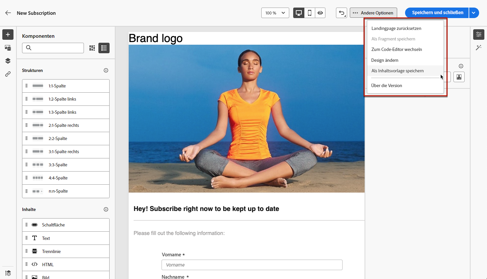
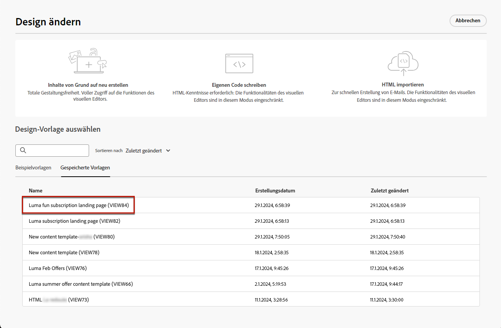
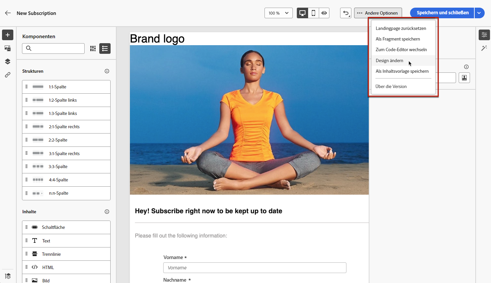
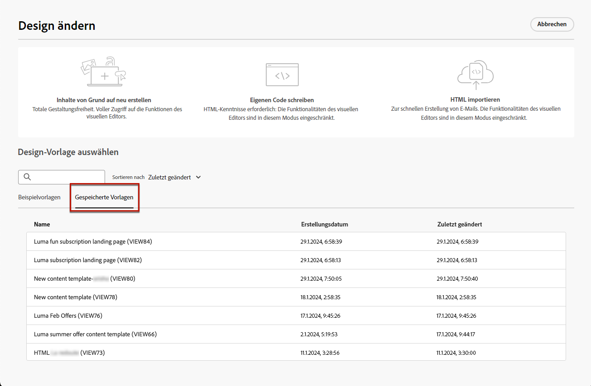
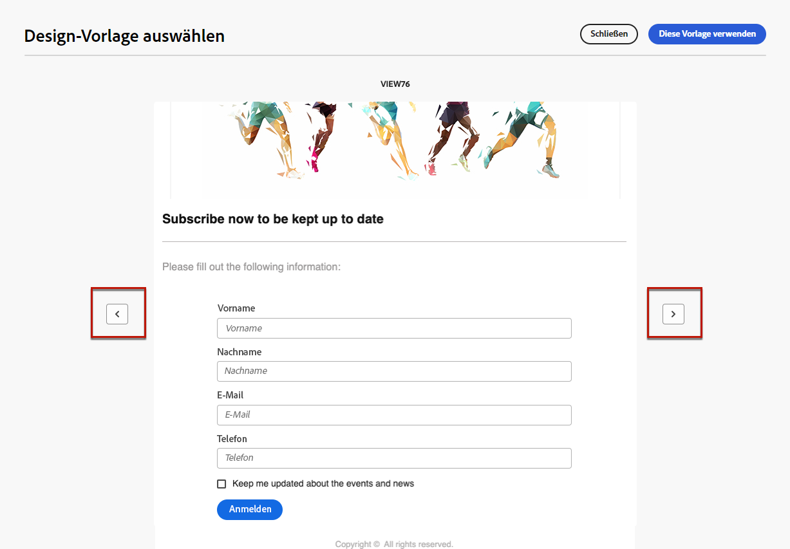

# Arbeiten mit Landingpage-Inhaltsvorlagen {#work-with-templates}

## Speichern einer Seite als Vorlage {#save-as-template}

Nachdem Sie Ihren [Landingpage-Inhalt](lp-content.md) erstellt haben, können Sie ihn zur späteren Wiederverwendung speichern. Gehen Sie dazu wie folgt vor:

1. Klicken Sie auf die Schaltfläche **[!UICONTROL Mehr]** oben rechts auf dem Bildschirm.

1. Wählen Sie im Dropdown-Menü **[!UICONTROL Als Inhaltsvorlage speichern]** aus.

   {zoomable=&quot;yes&quot;}

1. Fügen Sie dieser Vorlage einen Namen hinzu.

1. Klicken Sie auf **[!UICONTROL Speichern]**.

Wenn Sie das nächste Mal eine Landingpage erstellen, können Sie diese Vorlage verwenden, um Ihren Inhalt zusammenzustellen. Im folgenden [Abschnitt](#use-saved-template) erfahren Sie mehr dazu.

{zoomable=&quot;yes&quot;}

## Verwenden einer gespeicherten Vorlage {#use-saved-template}

<!--Not for GA?-->

1. Klicken Sie beim Bearbeiten des Inhalts einer Landingpage auf die Schaltfläche **[!UICONTROL Mehr]** und wählen Sie **[!UICONTROL Design ändern]** aus.

   {zoomable=&quot;yes&quot;}

1. Bestätigen Sie Ihre Auswahl.

   >[!NOTE]
   >
   >Diese Aktion löscht den aktuellen Inhalt und ersetzt ihn durch den aus der neuen Vorlage.

1. Die Liste aller zuvor gespeicherten Vorlagen wird auf der Registerkarte **[!UICONTROL Gespeicherte Vorlagen]** angezeigt. Sie können sie nach **[!UICONTROL Namen]**, **[!UICONTROL Zuletzt geändert]** und **[!UICONTROL Zuletzt erstellt]** sortieren.

   {zoomable=&quot;yes&quot;}

1. Wählen Sie die gewünschte Vorlage aus der Liste aus. Nachdem Sie eine Vorlage ausgewählt haben, können Sie mit den Rechts- und Links-Pfeiltasten zwischen allen gespeicherten Vorlagen navigieren.

   {zoomable=&quot;yes&quot;}

1. Klicken Sie auf **[!UICONTROL Diese Vorlage verwenden]**.

1. Bearbeiten Sie Ihren Inhalt wie gewünscht mit dem Landingpage-Designer.

<!--Primary page templates and subpage templates are managed separately, meaning that you cannot use a primary page template to create a subpage, and vice versa. TBC in Web user interface-->
