# Landingpage verwenden {#lp-use-cases}

>[!CONTEXTUALHELP]
>id="acw_landingpages_url"
>title="URL mit Vorsicht kopieren"
>abstract="Um Ihre Landingpage vollständig zu testen oder zu nutzen, können Sie diesen Link nicht direkt in einen Webbrowser oder in Ihre Sendungen kopieren und einfügen. Verwenden Sie stattdessen die **Inhalt simulieren** , um sie zu testen, und führen Sie die in der Dokumentation beschriebenen Schritte aus, um Ihre Landingpage ordnungsgemäß zu nutzen."

Um Ihre Landingpage richtig zu nutzen, sollten Sie sie als Link in einem Versand mit der entsprechenden Option referenzieren.

>[!CAUTION]
>
>Um Ihre Landingpage vollständig zu nutzen, können Sie den im Dashboard des veröffentlichten Versands angezeigten Link nicht direkt in Ihre Sendungen oder auf eine Webseite kopieren und einfügen.

Im [!DNL Adobe Campaign Web] In der Benutzeroberfläche stehen Ihnen vier vordefinierte Vorlagen zur Verfügung, mit denen Sie verschiedene Anwendungsfälle implementieren können. Die wichtigsten Schritte bleiben jedoch gleich und werden im Folgenden beschrieben.

1. [Landingpage erstellen](create-lp.md#create-landing-page) und wählen Sie je nach Anwendungsfall die gewünschte Vorlage aus.

1. Definieren Sie die Eigenschaften und Einstellungen der Landingpage.

   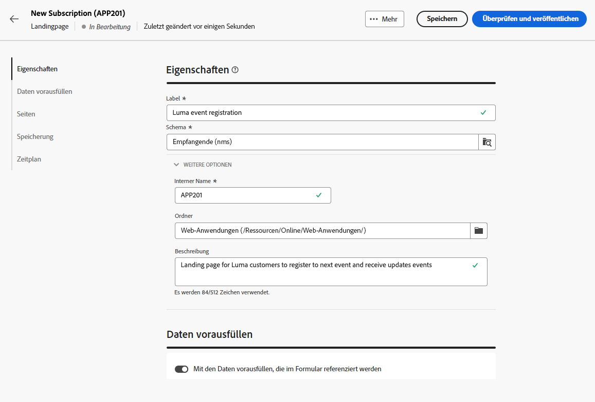{zoomable=&quot;yes&quot;}

1. Wählen Sie je nach Fall die **[!UICONTROL Akquise]**, **[!UICONTROL Abonnement]**, **[!UICONTROL Abmeldung]** oder **[!UICONTROL Blockierungsliste]** Seite.

1. Der Inhalt der Seite wird angezeigt. Wählen Sie den dem Landingpage-Formular entsprechenden Teil aus.

   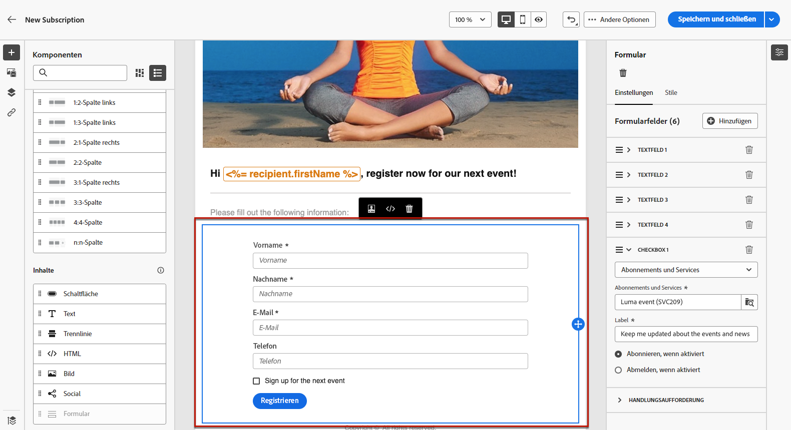{zoomable=&quot;yes&quot;}

1. Bearbeiten Sie den Inhalt entsprechend der ausgewählten Vorlage:

   * [Akquise](#lp-acquisition)
   * [Anmeldung](#lp-subscription)
   * [Abmeldung](#lp-unsubscription)
   * [Blockierungsliste](#lp-denylist)

1. Ändern Sie den Rest Ihres Inhalts nach Bedarf, speichern Sie Ihre Änderungen und schließen Sie sie.

1. Bearbeiten Sie die **[!UICONTROL Bestätigung]** sowie die **[!UICONTROL Fehler]** und **[!UICONTROL Ablauf]** Seiten. Die **[!UICONTROL Bestätigung]** -Seite wird Ihren Empfängern angezeigt, sobald sie das Formular übermitteln.

   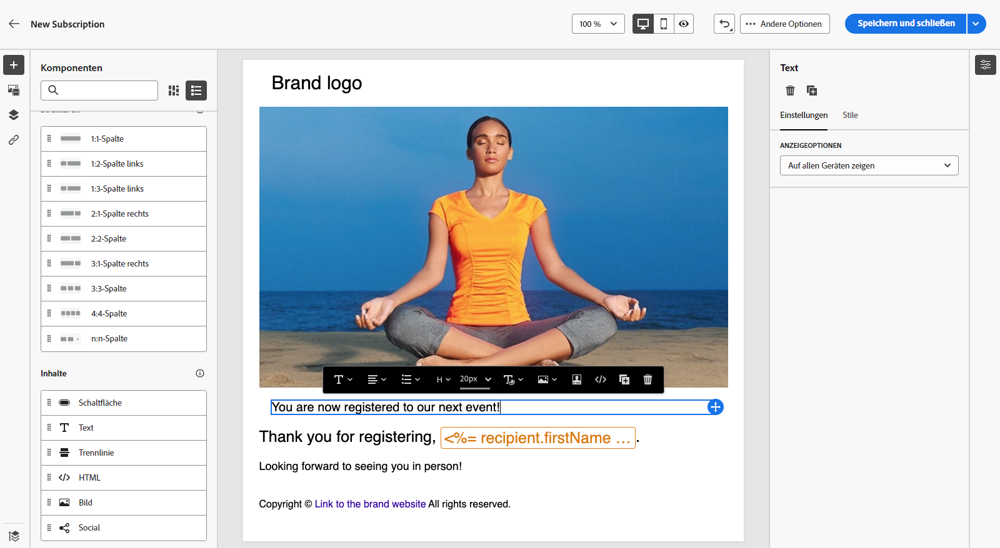{zoomable=&quot;yes&quot;}

1. [Test](create-lp.md#test-landing-page) und [publish](create-lp.md#publish-landing-page) Ihre Landingpage.

1. Erstellen Sie eine [email](../email/create-email.md) -Versand, um den Traffic zur Landingpage zu lenken.

1. [Fügen Sie einen Link](../email/message-tracking.md#insert-links) in Ihren Nachrichteninhalt ein. Auswählen **[!UICONTROL Landingpage]** als **[!UICONTROL Link-Typ]** und wählen Sie die erstellte Landingpage aus.

   {zoomable=&quot;yes&quot;}

   >[!NOTE]
   >
   >Um Ihre Nachricht senden zu können, darf die ausgewählte Landingpage noch nicht abgelaufen sein. [Weitere Informationen](create-lp.md#create-landing-page)

Wenn Ihre Empfänger die E-Mail erhalten und auf den Link zur Landingpage klicken und das Formular senden,

* Sie werden zur Bestätigungsseite weitergeleitet.

* Jede andere Aktion, die auf Ihrer Landingpage definiert ist, wird angewendet. Beispielsweise werden Benutzer von Ihrem Dienst abonniert oder erhalten keine weiteren Nachrichten von Ihnen.

Im Folgenden finden Sie einige Beispiele für die Verwendung von [!DNL Adobe Campaign] Landingpages in den verschiedenen Anwendungsfällen verwenden.

## Profilakquise {#lp-acquisition}

Die erste Vorlage ermöglicht das Hinzufügen oder Aktualisieren eines Profils zur Campaign-Datenbank.

1. Wann [Landingpage erstellen](create-lp.md#create-landing-page), wählen Sie die **[!UICONTROL Akquise]** Vorlage.

1. Wählen Sie in den Eigenschaften der Landingpage die **[!UICONTROL Vorausfüllen mit den im Formular referenzierten Daten]** -Option, um alle vorhandenen Informationen aus dem Profil vorab zu laden und das Erstellen von Duplikaten zu vermeiden.

1. Wählen Sie die **[!UICONTROL Akquise]** Seite, um den Inhalt zu bearbeiten.

1. Bearbeiten Sie die Textfelder nach Bedarf entsprechend den Informationen, die Sie für Ihre Profile sammeln möchten.

1. Außerdem können Sie ein Kontrollkästchen hinzufügen, mit dem Ihre Kunden eingeladen werden, sich für Ihren Newsletter-Dienst anzumelden. [Erfahren Sie, wie Sie einen Dienst erstellen](../audience/manage-services.md)

   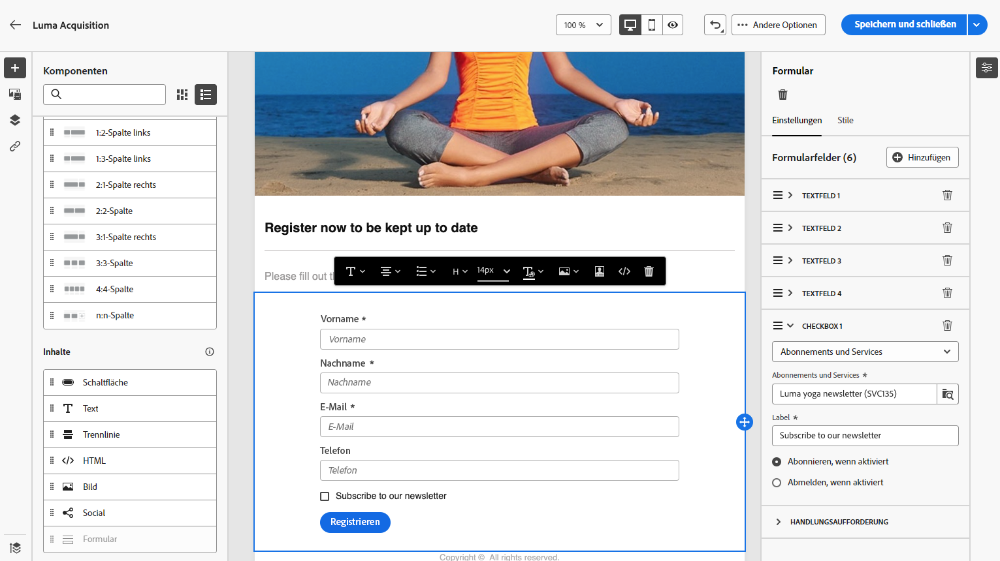{zoomable=&quot;yes&quot;}

1. Passen Sie Ihren Inhalt nach Bedarf an und speichern Sie Ihre Änderungen.

1. Überprüfen und [publish](create-lp.md#publish-landing-page) Ihre Landingpage.

1. Erstellen Sie eine [email](../email/create-email.md) und [Link hinzufügen](../email/message-tracking.md#insert-links) zu Ihrer Landingpage hinzufügen.

Wenn Ihre Empfänger nach dem Erhalt der E-Mail auf den Link zur Landingpage klicken und das Formular übermitteln, wird ihr Profil zur Campaign-Datenbank hinzugefügt oder mit den von ihnen angegebenen Informationen aktualisiert.

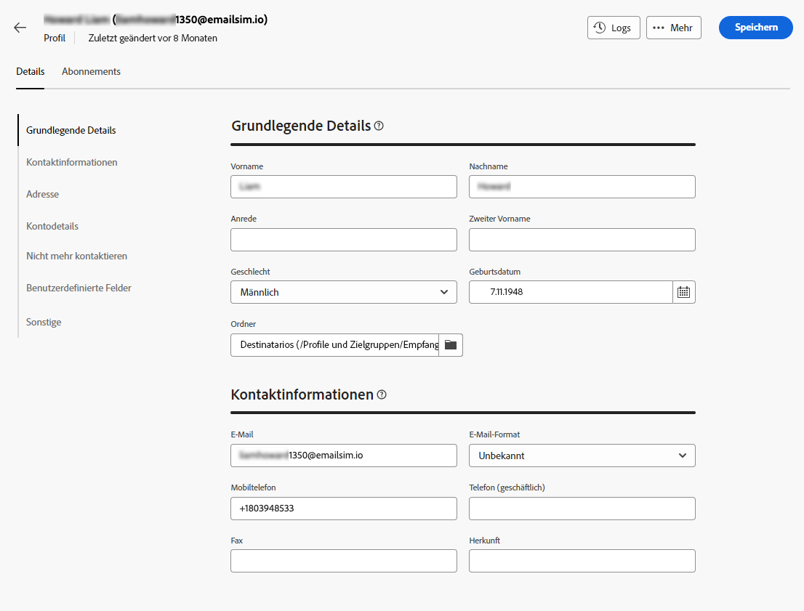{zoomable=&quot;yes&quot;}

Wenn sie sich für den Erhalt Ihres Newsletters entschieden haben, werden sie für den entsprechenden Dienst angemeldet.

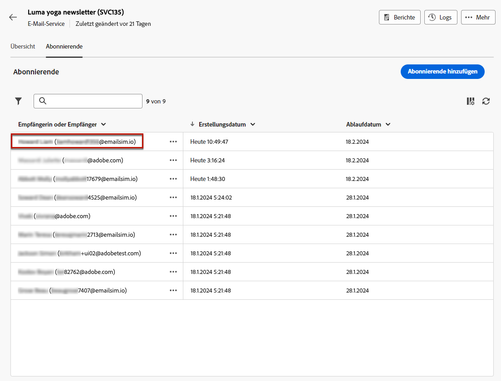{zoomable=&quot;yes&quot;}

## Abonnement für einen Dienst {#lp-subscription}

Einer der häufigsten Anwendungsfälle besteht darin, über eine Landingpage Ihre Kundinnen und Kunden einzuladen, einen [Dienst zu abonnieren](../audience/manage-services.md) (z. B. einen Newsletter oder eine Veranstaltung). Gehen Sie dazu wie folgt vor.

<!--For example, let's say you organize an event next month and you want to launch an event registration campaign. To do this, you're going to send an email including a link to a landing page that will enable your recipients to register for this event. The users who register will be added to the subscription list that you created for this purpose.-->

1. Erstellen Sie zunächst eine Bestätigungsvorlage für Benutzer, die Ihr Ereignis abonnieren, damit Sie diese bei der Erstellung des Dienstes einfach auswählen können. [Weitere Informationen](../audience/manage-services.md#create-confirmation-message)

   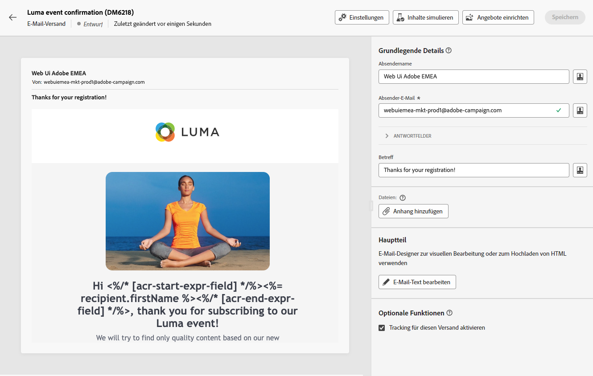{zoomable=&quot;yes&quot;}

1. Erstellen Sie einen Anmeldedienst, der die registrierten Benutzer für Ihr Ereignis speichert. [Erfahren Sie, wie Sie einen Dienst erstellen](../audience/manage-services.md)

1. Wählen Sie die Vorlage aus, die Sie als Bestätigungs-E-Mail erstellt haben, die die Benutzer beim Abonnieren erhalten.

   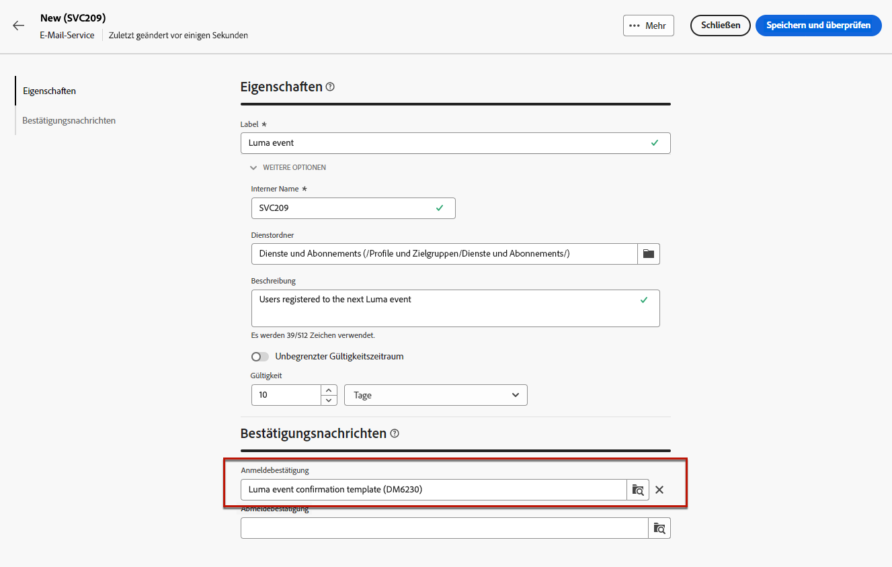{zoomable=&quot;yes&quot;}

1. [Landingpage erstellen](create-lp.md#create-landing-page) , damit sich Ihre Empfänger für Ihr Ereignis registrieren können. Wählen Sie die **[!UICONTROL Abonnement]** Vorlage.

1. Wählen Sie die **[!UICONTROL Abonnement]** Seite, um den Inhalt zu bearbeiten.

1. Der Inhalt der Seite wird angezeigt. Wählen Sie den dem Landingpage-Formular entsprechenden Teil aus und erweitern Sie die **[!UICONTROL Kontrollkästchen 1]** Abschnitt.

1. Im **[!UICONTROL Abonnements und Dienste]** auswählen, wählen Sie den Dienst aus, den Sie für Ihr Ereignis erstellt haben. Lassen Sie die **[!UICONTROL Anmelden, falls aktiviert]** aktiviert ist.

   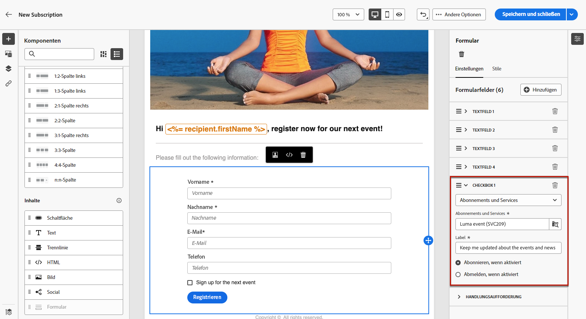{zoomable=&quot;yes&quot;}
<!--
1. You can add an additional checkbox to offer subscription to your newsletter for example.-->

1. Passen Sie Ihren Inhalt nach Bedarf an und speichern Sie Ihre Änderungen.

1. Überprüfen und [publish](create-lp.md#publish-landing-page) Ihre Landingpage.

1. Erstellen Sie eine [email](../email/create-email.md) und [Link hinzufügen](../email/message-tracking.md#insert-links) um den Traffic zur Anmelde-Landingpage zu leiten.

1. Gestalten Sie die E-Mail so, dass die Registrierung jetzt für Ihr Ereignis geöffnet ist.

Wenn Ihre Empfänger nach dem Erhalt der E-Mail auf den Link zur Landingpage klicken und das Formular übermitteln, werden sie zur Bestätigungsseite weitergeleitet und auf die Abonnementliste gesetzt.

## Abmeldung {#lp-unsubscription}

Sie können Ihren Kunden über eine Landingpage die Möglichkeit geben, sich von einem Dienst abzumelden.

1. Stellen Sie sicher, dass Sie eine Bestätigungsvorlage für Benutzer erstellt haben, die sich von Ihrem Dienst abmelden, damit Sie diese bei der Erstellung des Dienstes einfach auswählen können. [Weitere Informationen](../audience/manage-services.md#create-confirmation-message)

1. In der [Abonnement-Dienst](../audience/manage-services.md)wählen Sie die Vorlage aus, die Sie als Bestätigungs-E-Mail erstellt haben, die die Benutzer bei der Abmeldung erhalten.

1. [Landingpage erstellen](create-lp.md#create-landing-page). Wählen Sie die **[!UICONTROL Abmeldung]** Vorlage.

1. Wählen Sie die **[!UICONTROL Abmeldung]** Seite, um den Inhalt zu bearbeiten.

1. Der Inhalt der Seite wird angezeigt. Wählen Sie den dem Landingpage-Formular entsprechenden Teil aus.

1. Sie können eine **[!UICONTROL Kontrollkästchen]** wählen Sie den Dienst aus und wählen Sie die **[!UICONTROL Abmeldung bei aktivierter Option]** -Option.

   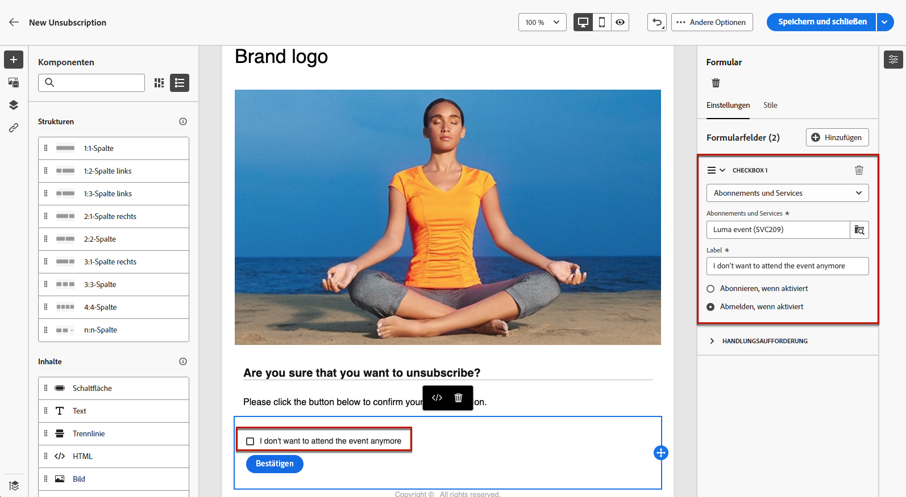{zoomable=&quot;yes&quot;}

1. Sie können auch die **[!UICONTROL Aktionsaufruf]** und wählen Sie **[!UICONTROL Zusätzliche Aktualisierungen]** -Option. Wählen Sie den Dienst aus und aktivieren Sie die **[!UICONTROL Opt-out]** -Option.

   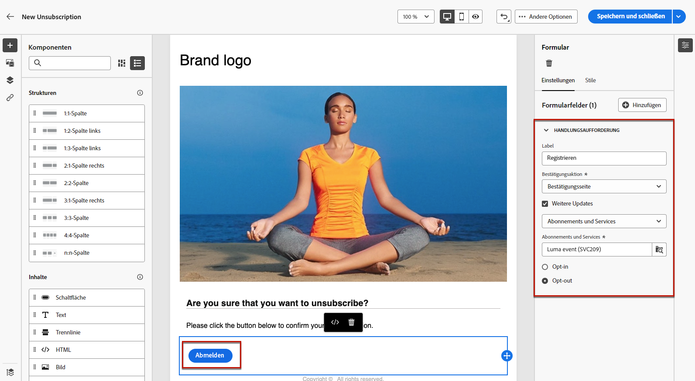{zoomable=&quot;yes&quot;}

1. Passen Sie Ihren Inhalt nach Bedarf an und speichern Sie Ihre Änderungen.

1. Überprüfen und [publish](create-lp.md#publish-landing-page) Ihre Landingpage.

1. Erstellen Sie eine [email](../email/create-email.md) und [Link hinzufügen](../email/message-tracking.md#insert-links) zur Landingpage hinzufügen.

Wenn Ihre Empfänger nach dem Erhalt der E-Mail auf den Link zur Landingpage klicken und das Formular übermitteln, werden sie zur Bestätigungsseite für die Abmeldung weitergeleitet und aus dem entsprechenden Abonnementdienst entfernt.

## Blockierungsliste {#lp-denylist}

Es ist gesetzlich vorgeschrieben, Empfängerinnen und Empfängern die Möglichkeit zu geben, sich vom Erhalt von Nachrichten einer Marke abzumelden. Daher müssen Sie immer eine **Abmelde-Link** in jeder E-Mail, die an Empfänger gesendet wird. Durch Klicken auf diesen Link werden die Empfängerinnen und Empfänger zu einer Landingpage weitergeleitet, die eine Schaltfläche enthält, über die sich die Abbestellung bestätigen lässt.

Sie können eine **[!UICONTROL Blockierungsliste]** Landingpage, über die sich Benutzer von allen Sendungen abmelden können.

1. Wann [Landingpage erstellen](create-lp.md#create-landing-page), wählen Sie die **[!UICONTROL Blockierungsliste]** Vorlage.

1. Wählen Sie die **[!UICONTROL Blockierungsliste]** Seite, um den Inhalt zu bearbeiten.

1. Erweitern Sie die **[!UICONTROL Aktionsaufruf]** und wählen Sie **[!UICONTROL Zusätzliche Aktualisierungen]** -Option.

1. Wählen Sie aus der entsprechenden Dropdownliste **[!UICONTROL Kanal (E-Mail)]** , damit sich Ihre Empfänger nur von der E-Mail-Kommunikation abmelden können. Sie können auch **[!UICONTROL Nach Kanal]** für die Auswahl aller Nachrichten auf allen Kanälen.

   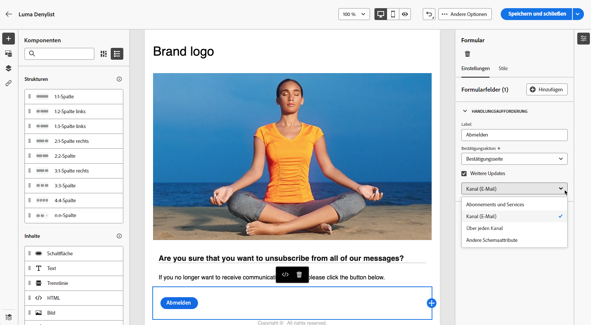{zoomable=&quot;yes&quot;}

1. Passen Sie Ihren Inhalt nach Bedarf an und speichern Sie Ihre Änderungen.

1. Überprüfen und [publish](create-lp.md#publish-landing-page) Ihre Landingpage.

1. Erstellen Sie eine [email](../email/create-email.md) und [Link hinzufügen](../email/message-tracking.md#insert-links) auf Ihre Landingpage klicken, damit sich Benutzer vom Erhalt von Nachrichten abmelden können.

Wenn Ihre Empfänger nach dem Erhalt der E-Mail auf den Link zur Landingpage klicken und das Formular übermitteln, werden sie zur Bestätigungsseite der Blockierungsliste weitergeleitet und ihr Profil wird mit den von ihnen bereitgestellten Informationen aktualisiert.

Um zu überprüfen, ob die Auswahl des entsprechenden Profils aktualisiert wurde, navigieren Sie zum **[!UICONTROL Profile]** und wählen Sie dieses Profil aus.

Wenn Sie beispielsweise die Variable **[!UICONTROL Kanal (E-Mail)]** in Ihrer Landingpage die Option **[!UICONTROL No longer contact by email]** aktiviert ist.

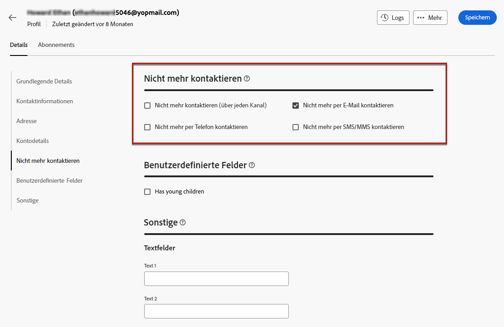{zoomable=&quot;yes&quot;}

Dieses Profil erhält keine E-Mail-Nachrichten von Ihrer Marke, es sei denn, es hat sich erneut angemeldet.

