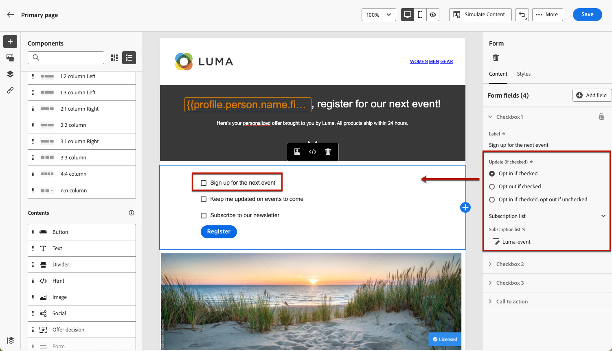
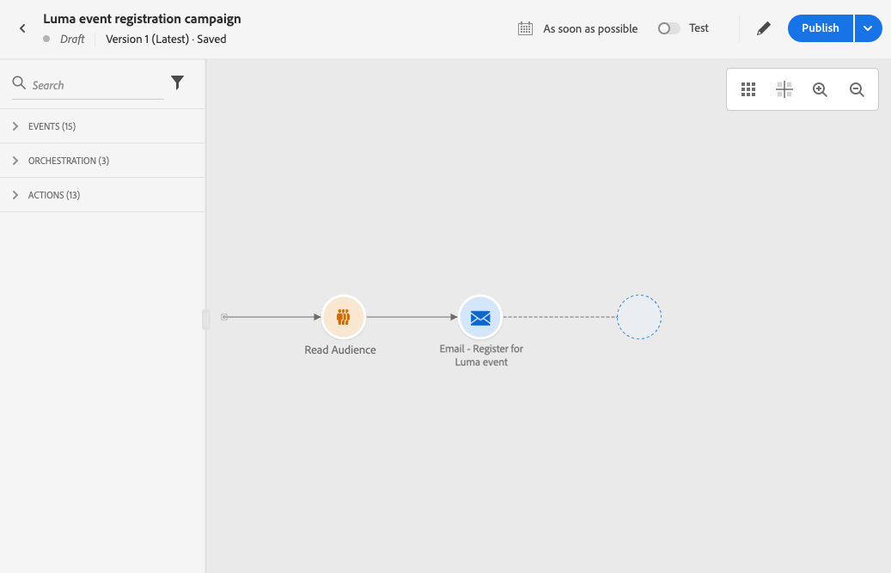
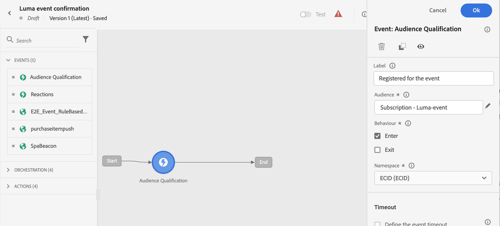
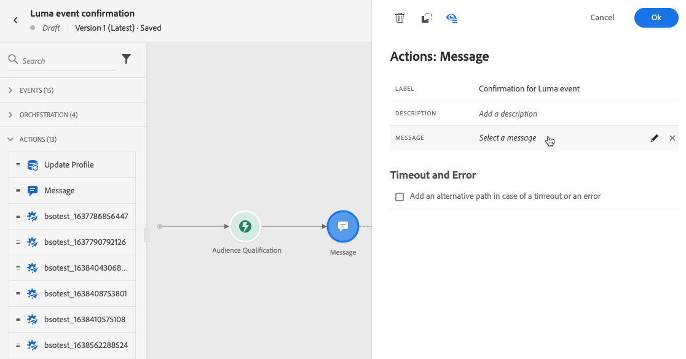
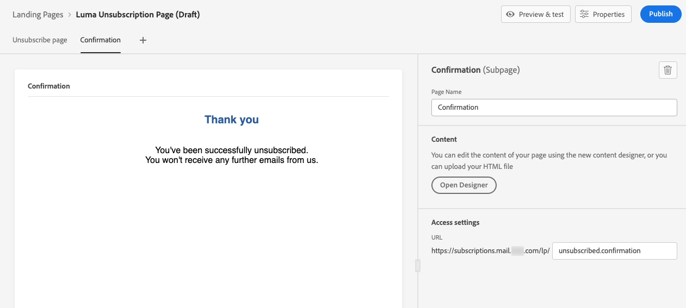
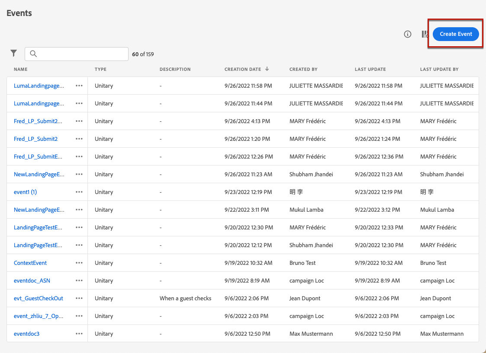

# Landingpage – Anwendungsfälle {#lp-use-cases}

Im Folgenden finden Sie einige Beispiele für die Verwendung von Landingpages in [!DNL Journey Optimizer], damit sich Ihre Kundinnen und Kunden für den Empfang bestimmter oder aller Ihrer Nachrichten an- bzw. abmelden können.

## Abonnement für einen Dienst {#subscription-to-a-service}

Einer der häufigsten Anwendungsfälle besteht darin, über eine Landingpage Ihre Kundinnen und Kunden einzuladen, einen [Dienst zu abonnieren](subscription-list.md) (z. B. einen Newsletter oder eine Veranstaltung). Die wichtigsten Schritte sind im unten stehenden Diagramm dargestellt:

Angenommen, Sie organisieren im nächsten Monat eine Veranstaltung und möchten eine Kampagne zur Registrierung für die Veranstaltung starten<!--to keep your customers that are interested updated on that event-->. Dazu senden Sie eine E-Mail mit einem Link zu einer Landingpage, über die sich Ihre Empfängerinnen und Empfänger für diese Veranstaltung registrieren können. Die Benutzenden, die sich registrieren, werden zur Abonnement-Liste hinzugefügt, die Sie zu diesem Zweck erstellt haben.

### Einrichten einer Landingpage {#set-up-lp}

1. Erstellen Sie die Abonnement-Liste der Registrierung für die Veranstaltung, in der die registrierten Benutzenden gespeichert werden. [Hier](subscription-list.md#define-subscription-list) erfahren Sie, wie Sie eine Abonnement-Liste erstellen.

   

1. [Erstellen Sie eine Landingpage](create-lp.md), damit sich Ihre Empfängerinnen und Empfänger für Ihre Veranstaltung registrieren können.

   

1. Konfigurieren Sie die [primäre Landingpage](create-lp.md#configure-primary-page) für die Registrierung.

1. Beim Entwerfen der [Landingpage-Inhalte](design-lp.md) wählen Sie die von Ihnen erstellte Abonnement-Liste aus, um sie mit den Profilen zu aktualisieren, die das Kontrollkästchen für die Registrierung aktiviert haben.

   

1. Erstellen Sie eine Dankeseite, die Ihren Empfängerinnen und Empfängern angezeigt wird, sobald sie das Registrierungsformular übermitteln. [Hier](create-lp.md#configure-subpages) erfahren Sie, wie Sie Landing-Subpages konfigurieren.

   

1. [Veröffentlichen](create-lp.md#publish) Sie die Landingpage.

1. Fügen Sie in einer [Journey](../building-journeys/journey.md) eine **E-Mail**-Aktivität hinzu, um den Traffic zur Landingpage für die Registrierung zu leiten.

   

1. [Entwerfen Sie eine E-Mail](../email/get-started-email-design.md), um anzukündigen, dass die Registrierung für Ihre Veranstaltung jetzt geöffnet ist.

1. [Fügen Sie einen Link](../email/message-tracking.md#insert-links) in Ihren Nachrichteninhalt ein. Wählen Sie **[!UICONTROL Landingpage]** als **[!UICONTROL Link-Typ]** aus und wählen Sie die [Landingpage](create-lp.md#configure-primary-page) aus, die Sie für die Registrierung erstellt haben.

   

   >[!NOTE]
   >
   >Um Ihre Nachricht senden zu können, darf die ausgewählte Landingpage noch nicht abgelaufen sein. [In diesem Abschnitt](create-lp.md#configure-primary-page) erfahren Sie, wie Sie das Ablaufdatum aktualisieren können.

   Wenn Ihre Empfängerinnen und Empfänger nach dem Erhalt der E-Mail auf den Link zur Landingpage klicken, werden sie zur Dankeseite weitergeleitet und auf die Abonnement-Liste gesetzt.

### Senden einer Bestätigungs-E-Mail {#send-confirmation-email}

Zusätzlich können Sie eine Bestätigungs-E-Mail an die Empfängerinnen und Empfänger senden, die sich für Ihre Veranstaltung registriert haben. Gehen Sie dazu wie folgt vor.

1. Erstellen Sie eine weitere [Journey](../building-journeys/journey.md). Sie können dies direkt über die Landingpage tun, indem Sie auf die Schaltfläche **[!UICONTROL Journey erstellen]** klicken. [Weitere Informationen](create-lp.md#configure-primary-page)

   

1. Erweitern Sie die Kategorie **[!UICONTROL Ereignisse]** und legen Sie eine Aktivität vom Typ **[!UICONTROL Zielgruppenqualifizierung]** auf Ihrer Arbeitsfläche ab. [Weitere Informationen](../building-journeys/audience-qualification-events.md)

1. Klicken Sie auf das Feld **[!UICONTROL Zielgruppe]** und wählen Sie die von Ihnen erstellte Abonnement-Liste aus.

   

1. Fügen Sie eine Bestätigungs-E-Mail Ihrer Wahl hinzu und senden Sie sie über die Journey.

   

Alle Benutzenden, die sich für Ihre Veranstaltung registriert haben, erhalten die Bestätigungs-E-Mail.

<!--The event registration's subscription list tracks the profiles who registered and you can send them targeted event updates.-->

## Abbestellen {#opt-out}

Damit Ihre Empfängerinnen und Empfänger Ihre Nachrichten abbestelllen können, können Sie in Ihre E-Mails einen Link zu einer Landingpage für die Abwahl einfügen.

In [diesem Abschnitt](../privacy/opt-out.md) erfahren Sie mehr über die Verwaltung der Zustimmung Ihrer Empfängerinnen und Empfänger und darüber, warum dies wichtig ist.

### Verwaltung der Abbestellungen {#opt-out-management}

Es ist gesetzlich vorgeschrieben, Empfängerinnen und Empfängern die Möglichkeit zu geben, sich vom Erhalt von Nachrichten einer Marke abzumelden. Weitere Informationen zu den geltenden Rechtsvorschriften finden Sie in der [Experience Platform-Dokumentation](https://experienceleague.adobe.com/docs/experience-platform/privacy/regulations/overview.html?lang=de#regulations){target="_blank"}.

Daher müssen Sie immer einen **Abmelde-Link** in jede an Empfängerinnen und Empfänger gesendete E-Mail aufnehmen:

* Durch Klicken auf diesen Link werden die Empfängerinnen und Empfänger zu einer Landingpage weitergeleitet, die eine Schaltfläche enthält, über die sich die Abbestellung bestätigen lässt.
* Wenn jemand auf die Schaltfläche zum Abbestellen klickt, werden die Profildaten mit diesen Informationen aktualisiert.

### Konfigurieren der Abbestellung {#configure-opt-out}

Gehen Sie wie folgt vor, um Empfängerinnen und Empfängern einer E-Mail zu ermöglichen, sich über eine Landingpage von Ihren Nachrichten abzumelden.

1. Erstellen Sie die Landingpage. [Weitere Informationen](create-lp.md)

1. Definieren Sie die primäre Seite. [Weitere Informationen](create-lp.md#configure-primary-page)

1. [Entwerfen](design-lp.md) Sie den Inhalt der primären Seite: Verwenden Sie die spezifische **[!UICONTROL Formular]**-Komponente für die Landingpage, definieren Sie ein Kontrollkästchen zum **[!UICONTROL Abbestellen]** und wählen Sie aus, dass **[!UICONTROL Kanal (E-Mail)]** aktualisiert wird: Das Profil, das das Abbestellungsfeld auf Ihrer Landingpage ankreuzt, wird von allen Ihren Nachrichten ausgeschlossen.

   

   <!--You can also build your own landing page and host it on the third-party system of your choice.-->

1. Fügen Sie eine [Unterseite](create-lp.md#configure-subpages) zur Bestätigung hinzu, die den Benutzenden angezeigt wird, die das Formular senden.

   

   >[!NOTE]
   >
   >Vergewissern Sie sich, dass Sie auf die Unterseite im Abschnitt **[!UICONTROL Handlungsaufforderung]** der **[!UICONTROL Formular]**-Komponente der primären Seite referenzieren. [Weitere Informationen](design-lp.md)

1. Nachdem Sie den Inhalt Ihrer Seiten konfiguriert und definiert haben, [veröffentlichen](create-lp.md#publish) Sie die Landingpage.

1. Erstellen Sie eine [E-Mail-Nachricht](../email/get-started-email-design.md) in einer Journey.

1. Wählen Sie einen Text in Ihrem Inhalt aus und [fügen](../email/message-tracking.md#insert-links) Sie mithilfe der kontextbezogenen Symbolleiste einen Link ein. Sie können auch einen Link auf einer Schaltfläche verwenden.

1. Wählen Sie **[!UICONTROL Landingpage]** aus der Dropdown-Liste **[!UICONTROL Link-Typ]** aus und wählen Sie die [Landingpage](create-lp.md#configure-primary-page) aus, die Sie für die Abbestellung erstellt haben.

   

   >[!NOTE]
   >
   >Um Ihre Nachricht senden zu können, darf die ausgewählte Landingpage noch nicht abgelaufen sein. [In diesem Abschnitt](create-lp.md#configure-primary-page) erfahren Sie, wie Sie das Ablaufdatum aktualisieren können.

1. Veröffentlichen Sie die Journey und führen Sie sie aus. [Weitere Informationen](../building-journeys/journey.md).

1. Wenn Empfängerinnen und Empfänger nach Erhalt der Nachricht auf den Abbestellungs-Link in der E-Mail klicken, wird Ihre Landingpage angezeigt.

   

   Wenn Empfängerinnen und Empfänger das Kästchen aktivieren und das Formular senden:

   * Die abgemeldeten Empfängerinnen und Empfänger werden zum Bestätigungsbildschirm weitergeleitet.

   * Die Profildaten werden aktualisiert und sie erhalten keine Nachrichten mehr von Ihrer Marke, es sei denn, sie melden sich erneut an.

Um zu überprüfen, ob die Auswahl des entsprechenden Profils aktualisiert wurde, wechseln Sie zu Experience Platform und greifen Sie auf das Profil zu, indem Sie einen Identity-Namespace und einen entsprechenden Identitätswert auswählen. Weitere Informationen finden Sie in der [Dokumentation zu Experience Platform](https://experienceleague.adobe.com/docs/experience-platform/profile/ui/user-guide.html?lang=de#getting-started){target="_blank"}.

Auf der Registerkarte **[!UICONTROL Attribute]** können Sie sehen, dass der Wert für **[!UICONTROL Auswahl]** in **[!UICONTROL Nein]** geändert wurde.

Die Abbestellungsinformationen werden im **Datensatz des Dienstes für das Einverständnis** gespeichert. [Erfahren Sie mehr über Datensätze](../data/get-started-datasets.md)

>[!NOTE]
>
>Wenn die Zusammenführungsmethode für Ihre standardmäßige [Adobe Experience Platform](https://experienceleague.adobe.com/docs/experience-platform/profile/home.html?lang=de){target="_blank"} **[!UICONTROL Profiles]** merge policy is **[!UICONTROL Dataset Precedence]**, make sure to enable the **[!UICONTROL AJO Consent Service Dataset]** and to prioritize it in the merge policy. [Learn more](https://experienceleague.adobe.com/docs/experience-platform/profile/merge-policies/ui-guide.html?lang=de#dataset-precedence-profile){target="_blank"}
>
>Selbst wenn diesem Datensatz keine Teilsendungen hinzugefügt wurden, enthält er weiterhin die Anmelde-/Abbestellungsinformationen.

<!--

### Other ways to opt out

You can also enable your recipients to unsubscribe whithout using landing pages.

* **One-click opt-out**

    You can add a one-click opt-out link into your email content. This will enable your recipients to quickly unsubscribe from your communications, without being redirected to a landing page where they need to confirm opting out. [Learn more](../privacy/opt-out.md#one-click-opt-out-link)

* **Unsubscribe link in header**

    If the recipients' email client supports displaying an unsubscribe link in the email header, emails sent with [!DNL Journey Optimizer] automatically include this link. [Learn more](../privacy/opt-out.md#unsubscribe-header)

////////

## Leverage landing page submission event {#leverage-lp-event}

You can use information that was submitted on a landing page to send communications to your customers. For example, if a user subscribes to a given subscription list, you can leverage that information to send an email recommending other subscription lists to that user.

To do this, you need to create an event containing the landing page submission information and use it in a journey. Follow the steps below.

1. Go to **[!UICONTROL Administration]** > **[!UICONTROL Configurations]**, and in the **[!UICONTROL Events]** section, select **[!UICONTROL Manage]**.

    

1. The list of events displays. Select **[!UICONTROL Create Event]**.

    

1. The event configuration pane opens on the right side of the screen. Configure a rule-based unitary event. [Learn more](../event/about-creating.md)

1. Define the schema: select **[!UICONTROL AJO Email Tracking Experience Event Schema v.1]** (available by default in [!DNL Journey Optimizer]).

    

1. In the **[!UICONTROL Fields]** section, select the following elements:

    * **[!UICONTROL _experience]** > **[!UICONTROL customerJourneyManagement]** > **[!UICONTROL messageInteraction]** > **[!UICONTROL Interaction Type]**
    
    * **[!UICONTROL _experience]** > **[!UICONTROL customerJourneyManagement]** > **[!UICONTROL messageInteraction]** > **[!UICONTROL Landing Page Details]** > **[!UICONTROL Landing Page ID]**

    

1. Click inside the **[!UICONTROL Event ID condition]** field. Using the simple expression editor, define the condition for the **[!UICONTROL Interaction Type]** and **[!UICONTROL Landing Page ID]** fields. This will be used by the system to identify the events that will trigger your journey.

    

    >[!NOTE]
    >
    >To find the landing page ID, you can insert the landing page as a link into an email and select the source code from the contextual toolbar to display the landing page information.
    >
    >

1. Save your changes.

1. Create a [journey](../building-journeys/journey.md). You can do it directly from the landing page by clicking the **[!UICONTROL Create journey]** button. Learn more [here](create-lp.md#configure-primary-page)

    

1. In the journey, unfold the **[!UICONTROL Events]** category and drop the event that you created into the canvas. Learn more [here](../building-journeys/audience-qualification-events.md)

    

1. Unfold the **[!UICONTROL Actions]** category and drop an email action into the canvas.

    

///How do you use the information from the event to send an email to the users? -->
