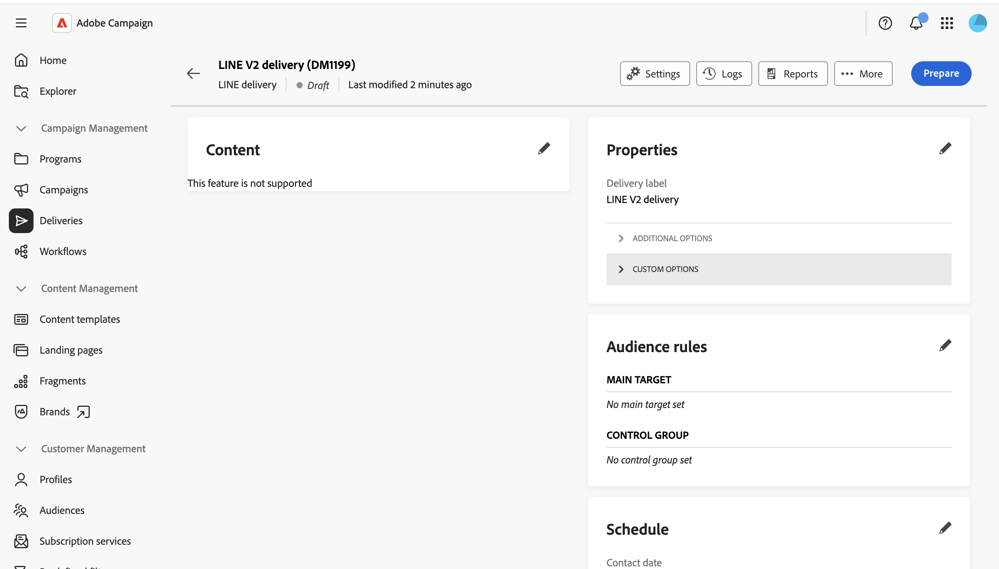

# Senden einer LINE-Nachricht {#send-line}

Sie können LINE-Nachrichten mithilfe von Text-, Bild- oder Videoinhalten erstellen und an Ihre Abonnentinnen und Abonnenten senden. LINE-Sendungen können als eigenständige Sendungen erstellt oder einem Workflow hinzugefügt werden.

Diese Seite führt Sie durch die Erstellung eines eigenständigen LINE-Versands. Die gleichen Schritte gelten jedoch für die Konfiguration einer LINE-Kanalaktivität in einem Workflow.

>[!IMPORTANT]
>
>Die Nachrichtenvorschau wird derzeit für LINE-Sendungen nicht unterstützt. Überprüfen Sie Ihren Inhalt vor dem Senden sorgfältig im Editor, da Sie die gerenderte Nachricht nicht zuvor in der Vorschau anzeigen können.

## Erstellen eines LINE-Versands {#create-line-delivery}

1. Wählen Sie das Menü **[!UICONTROL Sendungen]** aus und klicken Sie auf die Schaltfläche **[!UICONTROL Versand erstellen]**.

1. Wählen Sie **[!UICONTROL LINE]** und wählen Sie eine Versandvorlage aus, z. B. die standardmäßige Versandvorlage **[!UICONTROL LINE V2]**. [Weitere Informationen zu Vorlagen](../msg/delivery-template.md).

   

1. Klicken Sie **[!UICONTROL Versand erstellen]**, um den Konfigurationsbildschirm des Versands zu bestätigen und anzuzeigen.

1. Geben Sie **[!UICONTROL (Titel]** für den Versand ein und definieren Sie bei Bedarf zusätzliche oder benutzerdefinierte Optionen. [Weitere Informationen](../push/create-push.md#configure-push-settings).

   

## Auswählen der Zielgruppe {#audience}

1. Klicken Sie auf die Schaltfläche **[!UICONTROL Zielgruppe auswählen]**, um eine vorhandene Zielgruppe anzusprechen oder eine eigene zu erstellen. Die Zielgruppenbestimmung für LINE-Sendungen basiert auf **[!UICONTROL Besucherabonnements]**. [Weitere Informationen zu Zielgruppen](../audience/about-recipients.md).

1. Schalten Sie die Option **[!UICONTROL Kontrollgruppe aktivieren]** ein, um eine Kontrollgruppe einzurichten und die Wirkung Ihres Versands zu messen. Nachrichten werden nicht an diese Kontrollgruppe gesendet, sodass Sie das Verhalten der Population, die die Nachricht erhalten hat, mit dem Verhalten der Kontakte vergleichen können, die die Nachricht nicht erhalten haben. [Weitere Informationen](../audience/control-group.md)

## Definieren des Inhalts {#content}

Klicken Sie auf **[!UICONTROL Inhalt bearbeiten]**.

Der LINE-Inhaltseditor wird angezeigt.

Ein LINE-Versand kann bis zu fünf Nachrichten enthalten. Klicken Sie **[!UICONTROL Nachricht hinzufügen]**, um dem Versand eine weitere Nachricht hinzuzufügen, oder **[!UICONTROL Nachricht entfernen]**, um eine zu löschen.

Sofern verfügbar, können Sie den Personalisierungseditor verwenden, um dynamische Inhalte einzufügen. [Weitere Informationen](../personalization/personalize.md).

Jede Nachricht verwendet einen der folgenden Nachrichtentypen.

>[!NOTE]
>
>Es werden nur Bild- und Video-URLs unterstützt. Das Hochladen einer lokalen Datei ist nicht verfügbar, was dem Verhalten der Client-Konsole entspricht.

### Textnachrichten {#text-message}

Eine Textnachricht ist eine einfache Nachricht, die in Textform gesendet wird. Geben Sie einfach die Nachricht in das entsprechende Feld ein und verwenden Sie bei Bedarf Personalisierungsfelder.

### Bildnachricht {#image-message}

Mit einer Bildnachricht können Sie ein Bild senden, das optional in anklickbare Bereiche unterteilt ist, wobei jede Region mit einer anderen URL verknüpft ist.

* **[!UICONTROL Personalisiertes Bild]**: Dynamisches Definieren des Bildes pro Empfänger.
* **[!UICONTROL Bild-URL]**: Geben Sie die URL Ihres Bildes an. Die empfohlene Größe ist 1040 x 1040 px. Aktivieren Sie **[!UICONTROL Bilder nach Bildschirmgröße des Geräts definieren]**, um verschiedene Bildauflösungen bereitzustellen, die für verschiedene Bildschirmgrößen optimiert sind.
* **[!UICONTROL Alternativtext]**: obligatorischer Alternativtext, der angezeigt wird, wenn das Bild nicht geladen werden kann.
* **[!UICONTROL Links]**: Wählen Sie ein Layout aus, um Ihr Bild in einen oder mehrere anklickbare Bereiche zu unterteilen, und weisen Sie dann jeder Region eine URL zu.

### Video-Nachricht {#video-message}

Mit einer Videonachricht können Sie ein Video an Ihre Empfänger senden.

* **[!UICONTROL Video-URL]**: die URL Ihres Videos. Es wird nur das MP4-Format unterstützt.
* **[!UICONTROL URL des Vorschaubilds]**: Die URL eines Bildes, das angezeigt wird, bevor das Video wiedergegeben wird.

## Planen und senden {#schedule-send}

1. Klicken Sie nach der Definition des Inhalts auf **Speichern** und anschließend auf das Rücksymbol, um zum Bildschirm für die Versandkonfiguration zurückzukehren.

1. Aktivieren Sie **[!UICONTROL Zeitplan aktivieren]**, um die Nachrichten an einem bestimmten Datum und zu einer bestimmten Uhrzeit zu senden. [Weitere Informationen](../msg/create-deliveries.md#gs-schedule).

   

1. Sobald Ihr Inhalt fertig ist, klicken Sie auf **[!UICONTROL Überprüfen und senden]**. Dadurch wird das Versand-Dashboard geöffnet.

   

1. Klicken Sie **[!UICONTROL Vorbereiten]** und bestätigen Sie dann. Wenn Fehler auftreten, beheben Sie diese und klicken Sie erneut **[!UICONTROL Vorbereiten]**.

1. Klicken Sie **[!UICONTROL Senden]**. Sie können dann die Ergebnisse der Einstiegspunkte für **[!UICONTROL Versand]** Berichte **[!UICONTROL und]** Protokolle“ verfolgen.
