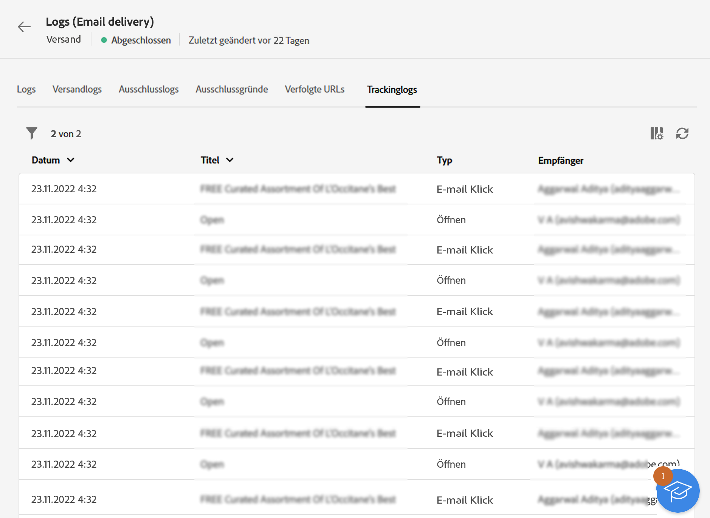

# Überwachen von Versandlogs {#delivery-logs}

>[!CONTEXTUALHELP]
>id="acw_deliveries_email_preparation_logs"
>title="Versandlogs"
>abstract="TBC"

Nach der Vorbereitung und dem Versand einer E-Mail können Sie mithilfe der Versandlogs sicherstellen, dass kein Fehler vorliegt. Diese Logs können direkt über das Nachrichten-Dashboard aufgerufen werden. In ihnen werden Details zum Versand dargestellt und Sie erfahren, welche Zielgruppe warum ausgeschlossen wurde, und erhalten Tracking-Informationen wie z. B. Öffnungen und Klicks.

Um die Logs anzuzeigen, rufen Sie Ihr Versand-Dashboard auf und klicken Sie auf die Schaltfläche **Protokolle**.

Mehrere Optionen sind verfügbar:

## Logs

Die Registerkarte **Protokolle** enthält alle mit dem Versand und den Testsendungen verbundenen Nachrichten. Eventuelle Fehler oder Warnmeldungen werden durch spezifische Symbole hervorgehoben.

Alle Validierungsschritte, Warnungen und Fehler werden aufgelistet. Farbige Symbole zeigen den Nachrichtentyp an:

* Das blaue Symbol steht für eine informative Nachricht.
* Das gelbe Symbol steht für einen nicht kritischen Verarbeitungsfehler.
* Das rote Symbol steht für einen kritischen Fehler, der die Durchführung des Versands verhindert.

## Sendungen

Der Tab **Versandlogs** zeigt die Liste der einzelnen Nachrichten eines Versands. sowie deren Status an. Für jeden einzelnen Empfänger können Sie anhand des Status das Ergebnis des Versands verfolgen.

## Ausschlüsse

Die Registerkarte **Ausschlusslogs** zeigt die Liste aller aus der Zielgruppe ausgeschlossenen Nachrichten an und den Grund für den fehlgeschlagenen Versand.

## Ausschlussgründe

Die Registerkarte **Ausschlussgründe** zeigt das Volumen (die Anzahl) der Nachrichten an, die aus der Zielgruppe ausgeschlossen wurden.

## Getrackte URLs

Die Registerkarte **Getrackte URLs** gibt Auskunft über die in der gesendeten Nachricht enthaltenen URLs, ihren Typ sowie ihre Quell-URLs.

## Tracking

In der Registerkarte **Tracking** wird der Tracking-Verlauf für den jeweiligen Versand angezeigt. Hier werden die Tracking-Informationen zu allen von Adobe Campaign gesendeten Nachrichten aufgeführt, d. h. zu allen getrackten URLs.

>[!NOTE]
>
>Sollte das Tracking für einen Versand nicht aktiviert worden sein, wird diese Registerkarte nicht angezeigt.

