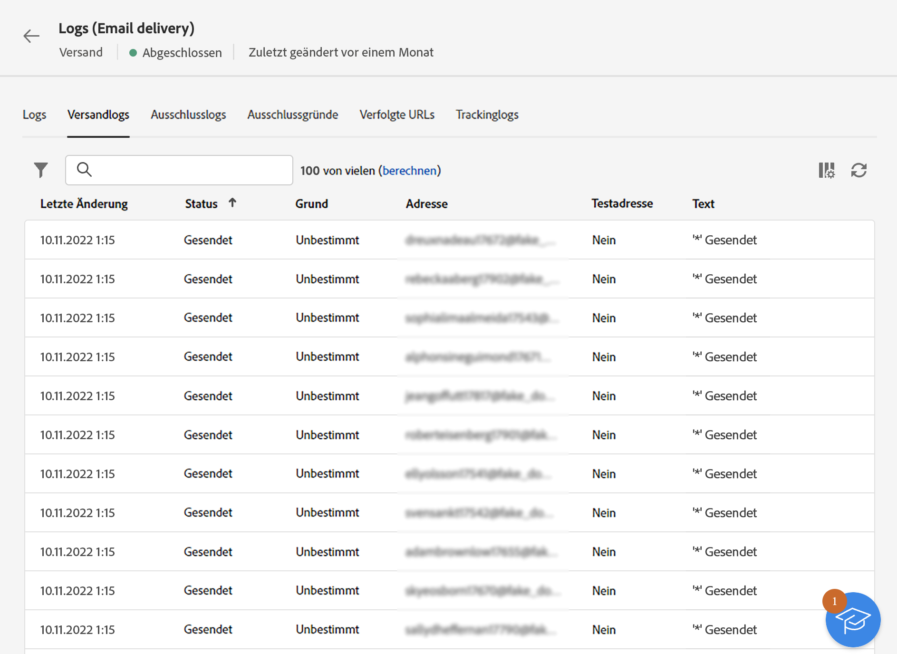

# Überwachen von Versandlogs {#delivery-logs}

>[!CONTEXTUALHELP]
>id="acw_deliveries_email_preparation_logs"
>title="Versandlogs"
>abstract="Die Versandlogs zeigen die Details des Versands an. Sie zeigen die Details des Versands, welche Zielgruppe ausgeschlossen wurde und warum, sowie die Tracking-Informationen wie Öffnungen und Klicks."

Nachdem der Versand vorbereitet wurde und Sie auf die Schaltfläche **Senden** geklickt haben, navigieren Sie zu den Versandlogs, um die Warnungen, Fehler, Status, Ausschlüsse und Tracking-Daten zu überprüfen. Diese Logs können direkt über das Nachrichten-Dashboard aufgerufen werden. Sie zeigen die Details des Versands, welche Zielgruppe ausgeschlossen wurde und warum, sowie die Tracking-Informationen wie Öffnungen und Klicks.

Um die Logs anzuzeigen, rufen Sie Ihr Versand-Dashboard auf und klicken Sie auf die Schaltfläche **Protokolle**.

Folgende Registerkarten stehen zur Verfügung:

* [Logs](#logs-tab)
* [Sendungen](#deliveries-tab)
* [Ausschlüsse](#exclusion-tab)
* [Ausschlussgründe](#exclusion-causes)
* [Getrackte URLs](#tracked-urls)
* [Tracking](#tracking)

## Logs {#logs-tab}

Die Registerkarte **Protokolle** enthält alle mit dem Versand und den Testsendungen verbundenen Nachrichten. Eventuelle Fehler oder Warnmeldungen werden durch spezifische Symbole hervorgehoben.

Alle Validierungsschritte, Warnungen und Fehler werden aufgelistet. Farbige Symbole zeigen den Nachrichtentyp an:

* Das blaue Symbol steht für eine informative Nachricht.
* Das gelbe Symbol steht für einen nicht kritischen Verarbeitungsfehler.
* Das rote Symbol steht für einen kritischen Fehler, der die Durchführung des Versands verhindert. Kritische Fehler müssen behoben sein, damit der Versand durchgeführt werden kann.

{zoomable="yes"}

## Sendungen {#deliveries-tab}

Der Tab **Versandlogs** zeigt die Liste der einzelnen Nachrichten eines Versands. Hier wird die Liste der gesendeten Nachrichten und deren Status gespeichert. Für jeden einzelnen Empfänger können Sie anhand des Status das Ergebnis des Versands verfolgen.

{zoomable="yes"}

## Ausschlüsse {#exclusion-tab}

Die Registerkarte **Ausschlusslogs** zeigt die Liste aller aus der Zielgruppe ausgeschlossenen Nachrichten an und den Grund für den fehlgeschlagenen Versand.

{zoomable="yes"}

## Ausschlussgründe {#exclusion-causes-tab}

Die Registerkarte **Ausschlussgründe** zeigt für jede mögliche Ursache die Anzahl der Nachrichten an, die von der Zielgruppe ausgeschlossen wurden.

{zoomable="yes"}

## Getrackte URLs {#tracked-urls-tab}

Die Registerkarte **Getrackte URLs** gruppiert die in den gesendeten Nachrichten enthaltenen URLs, ihren URL-Typ sowie ihre Quell-URL.

{zoomable="yes"}

## Tracking {#tracking-tab}

Auf der Registerkarte **Tracking** wird der Tracking-Verlauf für den vorliegenden Versand angezeigt. Auf dieser Registerkarte werden Tracking-Daten zu den gesendeten Nachrichten angezeigt, einschließlich aller URLs, die von Adobe Campaign getrackt werden.

{zoomable="yes"}

>[!NOTE]
>
>Wenn das Tracking für einen Versand nicht aktiviert ist, wird diese Registerkarte nicht angezeigt.