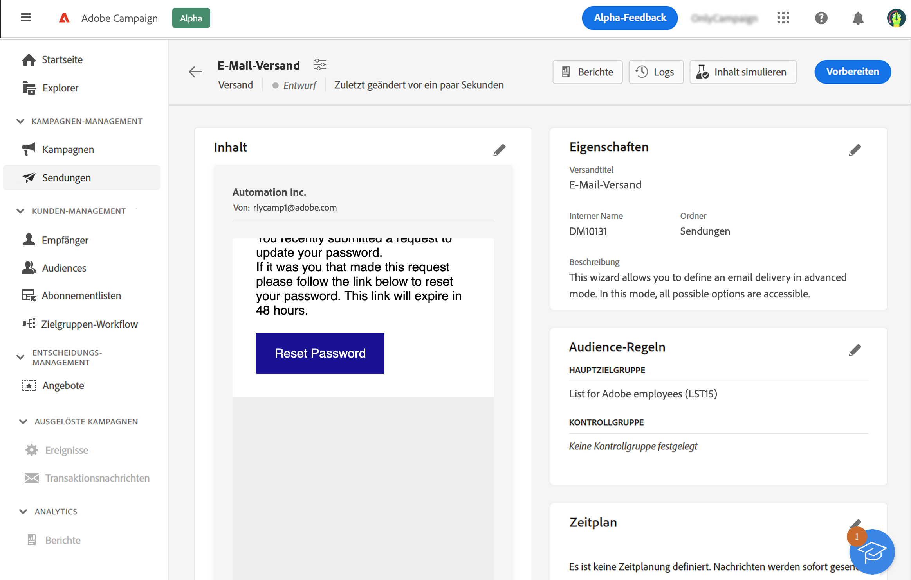
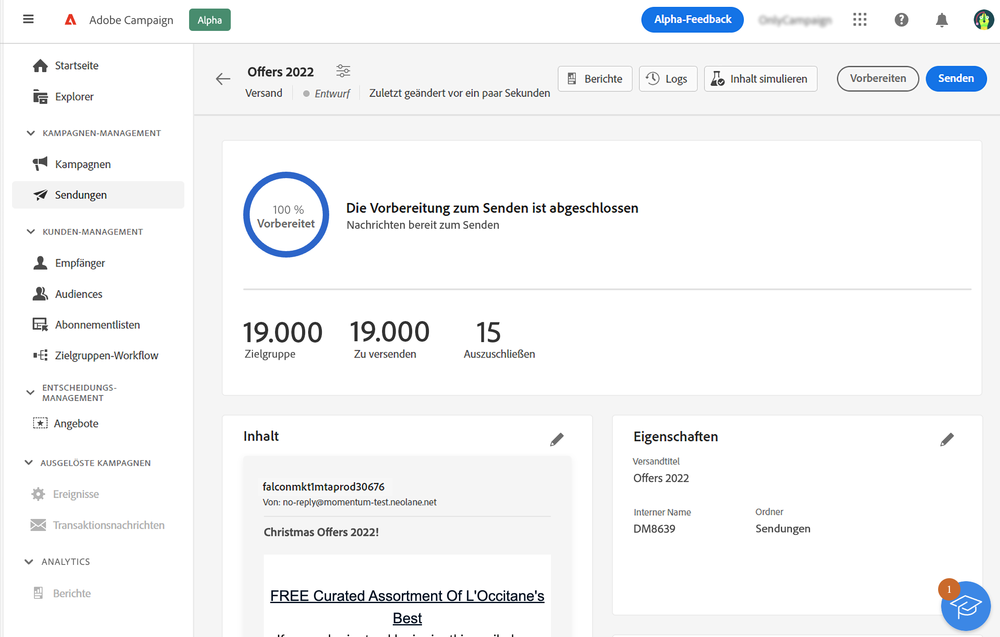
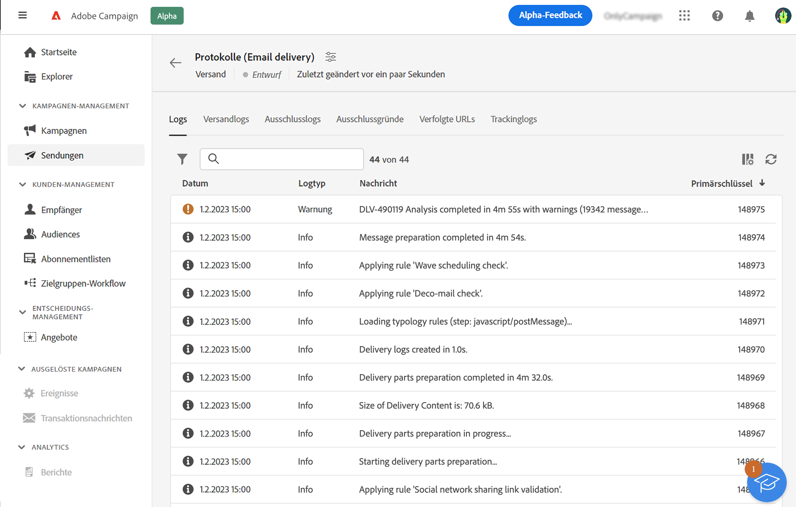
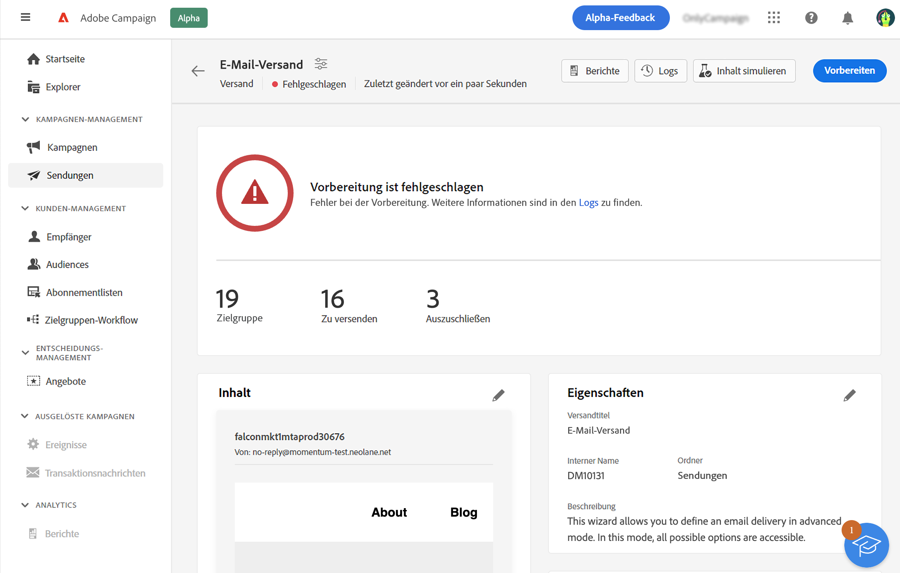
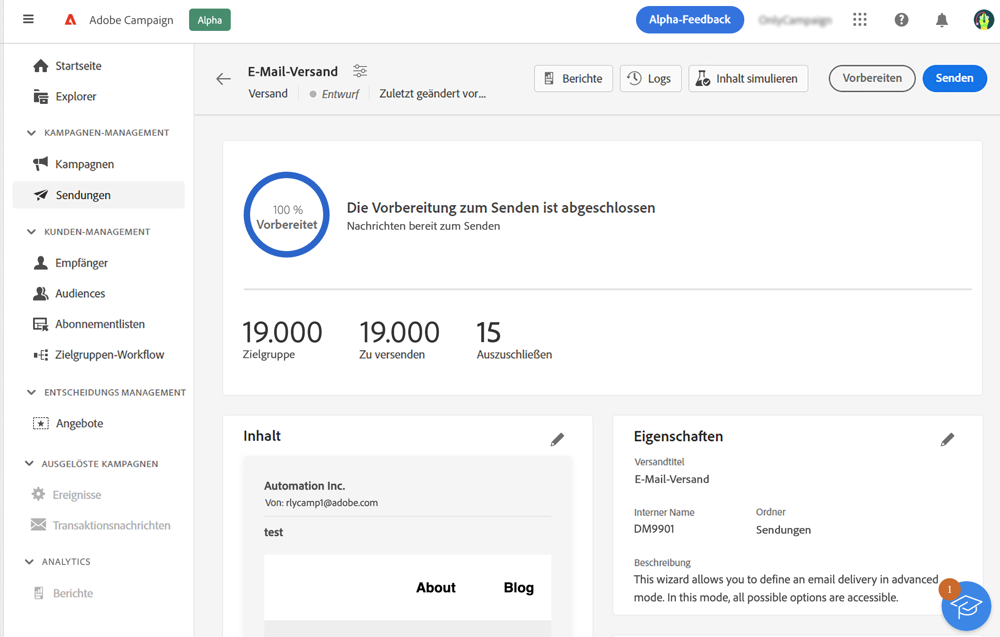
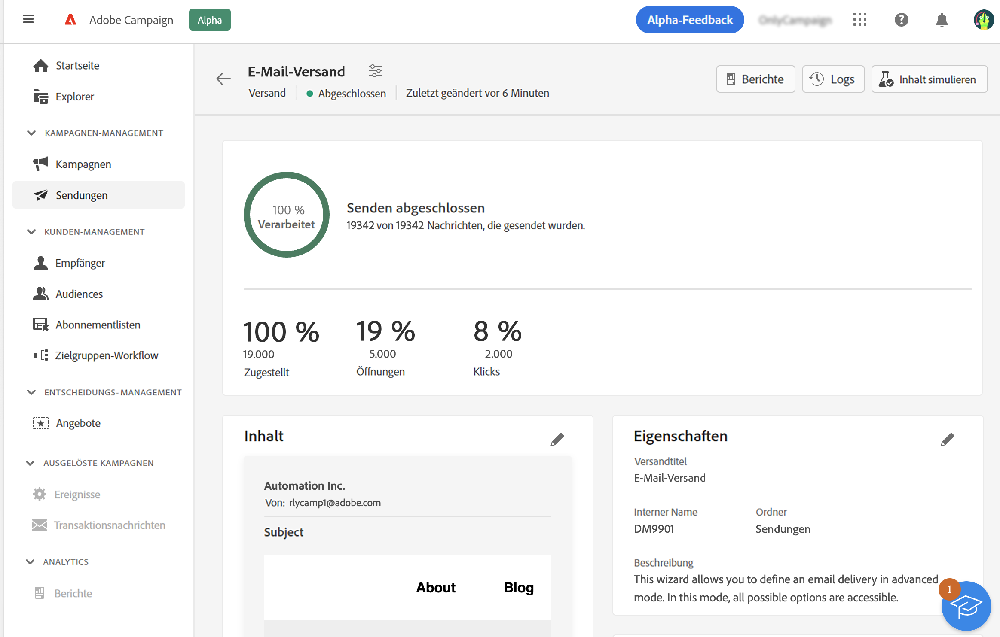

# Vorbereiten und Senden einer E-Mail {#prepare-send}

>[!CONTEXTUALHELP]
>id="acw_homepage_card5"
>title="Vorbereiten und Senden einer E-Mail"
>abstract="Erfahren Sie, wie Sie Ihre E-Mail vorbereiten und Versand-KPIs nutzen."

<!--

	show how to prepare and send the email + the live kpis in the dashboard

like acc when preparation, target calculated then send
real time KPIs, not in AJO. similar to ACS.
exclusion logs, causes
-->

<!--
send also KPIs
-->

## Versandvorbereitung{#prepare}

Wenn Sie Inhalt, Audience und Zeitplan definiert haben, können Sie Ihre Nachricht vorbereiten. Während der Vorbereitung wird die Zielpopulation berechnet und der Nachrichteninhalt für jedes Profil in der Zielgruppe erzeugt. Nachdem die Vorbereitung abgeschlossen ist, können die Nachrichten entweder sofort oder am geplanten Datum und zur geplanten Uhrzeit gesendet werden. Die bei der Analyse verwendeten Validierungsregeln werden im Abschnitt [Dokumentation zu Campaign Classic v7](https://experienceleague.adobe.com/docs/campaign-classic/using/sending-messages/key-steps-when-creating-a-delivery/steps-validating-the-delivery.html?lang=de#validation-process-with-typologies){target="_blank"}.

Gehen Sie dazu wie folgt vor:

1. Klicken Sie im Versand-Dashboard oben rechts auf die Schaltfläche **Vorbereiten** und bestätigen Sie den Vorgang.

   

   Der Vorbereitungsfortschritt wird angezeigt. Abhängig von der Größe der Ziel-Population kann dieser Vorgang einige Zeit in Anspruch nehmen.

   >[!NOTE]
   >
   >Sie können die Vorbereitung jederzeit mit der Schaltfläche **Vorbereitung stoppen** anhalten. Dies ist mit keinerlei Risiko verbunden, da in dieser Phase keine Nachrichten gesendet werden. Je nach Größe der Zielgruppe kann die Dauer der Versandvorbereitung variieren.

1. Wenn die Vorbereitung abgeschlossen ist, überprüfen Sie die KPIs. Wenn die Anzahl zu sendender Nachrichten nicht Ihren Erwartungen entspricht, ändern Sie Ihre Audience und starten Sie die Vorbereitung erneut.

   

   Im Folgenden werden die verschiedenen KPIs angezeigt:

   * **Targeting**: Anzahl der Zielgruppenempfänger
   * **Zu versenden**: die Anzahl der zu sendenden Nachrichten
   * **Auszuschließen**: Anzahl der Nachrichten, die durch eine Typologieregel ausgeschlossen werden

1. Klicken Sie auf die Schaltfläche **Protokolle** und vergewissern Sie sich, dass kein Fehler vorliegt. Die letzte Log-Nachricht zeigt eventuelle Fehler und deren Anzahl an. Weiterführende Informationen hierzu finden Sie in diesem [Abschnitt](delivery-logs.md).

   

Wenn bei der Vorbereitung ein kritischer Fehler erkannt wird, der den Versand verhindert, wird der Vorbereitungsstatus im Versand-Dashboard als fehlgeschlagen angezeigt.

Wenn Sie nach der Vorbereitung Änderungen an Ihrem Versand vornehmen möchten, müssen Sie die Vorbereitung erneut starten, damit diese Änderungen berücksichtigt werden.

Nachdem die Vorbereitung fehlerfrei abgeschlossen wurde, kann Ihre Nachricht gesendet werden. Weiterführende Informationen hierzu finden Sie in diesem [Abschnitt](#send).

## Senden einer Nachricht{#send}

Nachdem die Vorbereitung abgeschlossen ist, können Sie Ihre Nachricht senden. Dieser Schritt ist nur für Nachrichten erforderlich, die sofort gesendet werden. Wenn die Nachricht terminiert ist, wird sie zum festgelegten Datum gesendet.

Führen Sie folgende Schritte aus:

1. Klicken Sie im Versand-Dashboard oben rechts auf die Schaltfläche **Senden** und bestätigen Sie den Vorgang.

   

1. Der Versandfortschritt wird angezeigt. Überprüfen Sie die angezeigten KPIs. Sie können auch die Protokolle überprüfen. Weiterführende Informationen hierzu finden Sie in diesem [Abschnitt](delivery-logs.md).

   

   Im Folgenden werden die verschiedenen KPIs angezeigt:

   * **Zugestellt**: die Anzahl der erfolgreich zugestellten Nachrichten. Der angezeigte Prozentsatz basiert auf der Gesamtzahl der gesendeten Nachrichten.
   * **Öffnungen**: die Anzahl der geöffneten Nachrichten. Der angezeigte Prozentsatz ist das Verhältnis zwischen der Anzahl unterschiedlicher Öffnungen und der Anzahl der zugestellten Nachrichten.
   * **Klicks**: die Anzahl der Empfangenden, die mindestens einmal auf die E-Mail geklickt haben. Der angezeigte Prozentsatz ist das Verhältnis zwischen der Anzahl unterschiedlicher Klicks und der Anzahl der zugestellten Nachrichten.

   >[!NOTE]
   >
   >Die **Öffnungen** und **Klicks** Indikatoren werden nach 5 Minuten aktualisiert.

   Sie können den Versand jederzeit anhalten und später fortsetzen. Wenn Sie den Versand während des Versands stoppen, können Sie den Versand nicht fortsetzen.
