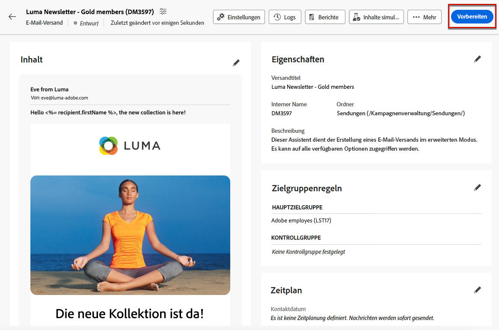
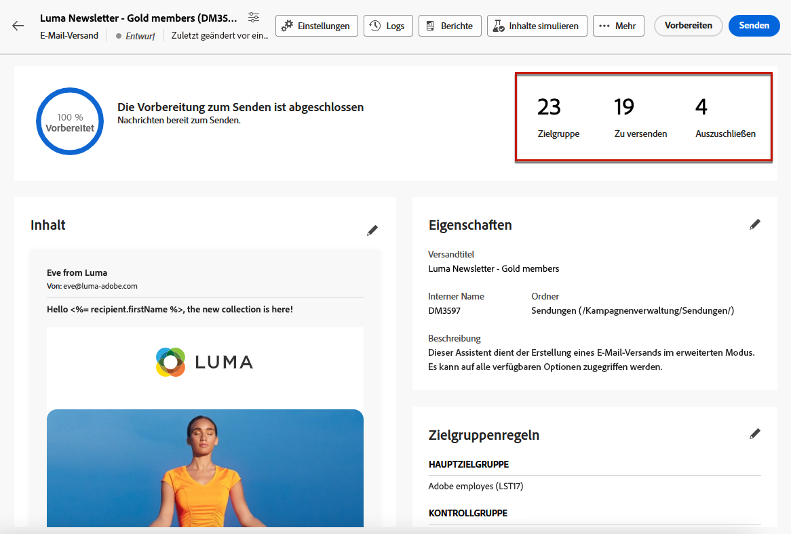
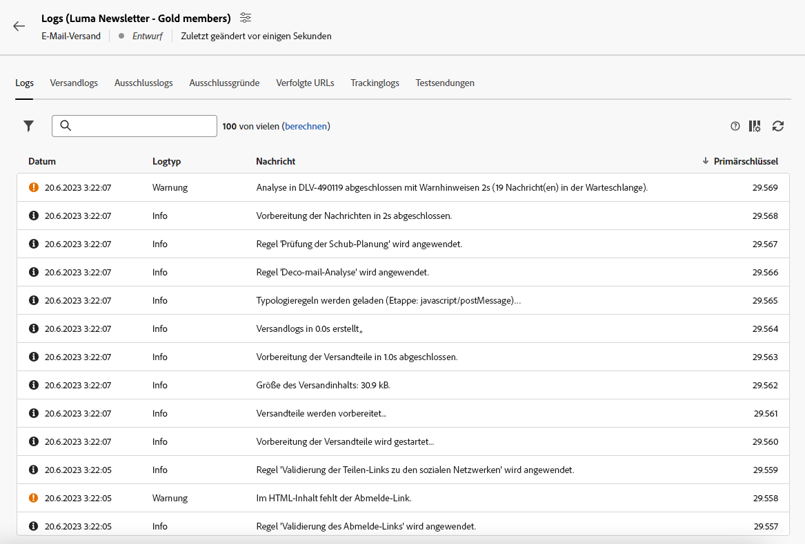

# Vorbereiten und Senden einer E-Mail {#prepare-send}

## Versandvorbereitung {#prepare}

Wenn Sie [Inhalt](../email/edit-content.md), [Zielgruppe](../audience/add-audience.md) und [Zeitplan](../msg/gs-messages.md#schedule-the-delivery-sending-gs-schedule) definiert haben, können Sie den E-Mail-Versand vorbereiten.

Während der Versandvorbereitung wird die Zielpopulation berechnet und der Nachrichteninhalt für jedes Profil in der Zielgruppe erzeugt. Nachdem die Vorbereitung abgeschlossen ist, können die Nachrichten entweder sofort oder am geplanten Datum und zur geplanten Uhrzeit gesendet werden.

Die bei der Versandvorbereitung verwendeten Validierungsregeln sind in der [Dokumentation zu Campaign v8 (Client-Konsole)](https://experienceleague.adobe.com/docs/campaign/campaign-v8/send/emails/send.html?lang=de){target="_blank"} beschrieben.

Die wichtigsten Schritte zur Versandvorbereitung sind unten aufgeführt.

1. Klicken Sie im Versand-Dashboard auf **[!UICONTROL Überprüfen und senden]**.

   {zoomable="yes"}

1. Klicken Sie oben rechts auf die Schaltfläche **[!UICONTROL Vorbereiten]** und bestätigen Sie den Vorgang.

   {zoomable="yes"}

   >[!NOTE]
   >
   >Wenn Sie den Versand planen und die Option **[!UICONTROL Bestätigung vor dem Senden aktivieren]** deaktivieren, werden die Vorbereitungs- und Versandschritte unter der Schaltfläche **[!UICONTROL Vorbereiten und senden]** gruppiert. [Weitere Informationen zur Planung](../msg/gs-deliveries.md#gs-schedule)

1. Der Vorbereitungsfortschritt wird angezeigt. Abhängig von der Größe der Ziel-Population kann dieser Vorgang einige Zeit in Anspruch nehmen.

   Sie können die Vorbereitung jederzeit mit der Schaltfläche **[!UICONTROL Vorbereitung stoppen]** anhalten.

   {zoomable="yes"}

   >[!NOTE]
   >Dies ist mit keinerlei Risiko verbunden, da in dieser Phase keine Nachrichten gesendet werden. Das Starten oder Anhalten dieses Vorgangs ist mit keinerlei Auswirkungen verbunden.

1. Wenn die Vorbereitung abgeschlossen ist, überprüfen Sie die KPIs. Wenn die Anzahl zu sendender Nachrichten nicht Ihren Erwartungen entspricht, ändern Sie Ihre Zielgruppe und starten Sie die Vorbereitung neu.

   {zoomable="yes"}

   Im Folgenden werden die verschiedenen KPIs angezeigt:

   * **[!UICONTROL Zielgruppe]**: Anzahl der Zielgruppenempfängerinnen und -empfänger.
   * **[!UICONTROL Zu versenden]**: die Anzahl der zu sendenden Nachrichten.
   * **[!UICONTROL Auszuschließen]**[: Anzahl der Nachrichten, die durch eine Typologieregel ausgeschlossen werden](../advanced-settings/delivery-settings.md#typology).

1. Klicken Sie auf die Schaltfläche **[!UICONTROL Logs]** und vergewissern Sie sich, dass keine Fehler vorliegen. Die letzte Log-Nachricht zeigt eventuelle Fehler und deren Anzahl an. [Weitere Informationen](delivery-logs.md)

   {zoomable="yes"}

1. Wenn bei der Vorbereitung ein kritischer Fehler erkannt wird, der den Versand verhindert, wird der Vorbereitungsstatus im Versand-Dashboard als fehlgeschlagen angezeigt.

   {zoomable="yes"}

1. Wenn Sie nach der Vorbereitung Änderungen am Versand vornehmen möchten, starten Sie die Vorbereitung neu, damit diese Änderungen berücksichtigt werden.

Nachdem die Vorbereitung fehlerfrei abgeschlossen wurde, kann Ihre Nachricht gesendet werden.

## Senden einer Nachricht {#send}

Nach abgeschlossener [Vorbereitung](#prepare) können Sie Ihre E-Mail senden.

Eine geplante Nachricht wird zum definierten Zeitpunkt gesendet. [Weitere Informationen zur Planung](../msg/gs-deliveries.md#gs-schedule)

### Sofortiges Senden {#send-immediately}

Gehen Sie wie folgt vor, um eine E-Mail sofort zu senden.

1. Klicken Sie im Versand-Dashboard oben rechts auf die Schaltfläche **[!UICONTROL Senden]**.

   {zoomable="yes"}

1. Bestätigen Sie diese Aktion, um die Nachricht sofort an die Hauptzielgruppe zu senden.

1. Der Versandfortschritt wird angezeigt.

### Planen Sie den Versand {#schedule-the-send}

Gehen Sie wie folgt vor, wenn Sie den Versand Ihrer E-Mail für einen späteren Zeitpunkt planen möchten.

1. Bevor Sie auf die Schaltfläche **[!UICONTROL Überprüfen und senden]** klicken, stellen Sie sicher, dass Sie einen Zeitplan für Ihre E-Mail definiert haben. [Weitere Informationen zur Planung](../msg/gs-deliveries.md#gs-schedule)

1. Klicken Sie im Versand-Dashboard oben rechts auf die Schaltfläche **[!UICONTROL Nach Zeitplan senden]**.

   {zoomable="yes"}

1. Klicken Sie auf **[!UICONTROL Senden bestätigen]**. Der Versand erfolgt zum geplanten Datum an die Hauptzielgruppe.

   >[!NOTE]
   >
   >Wenn Sie die Option **[!UICONTROL Bestätigung vor dem Senden aktivieren]** deaktivieren, werden die Vorbereitungs- und Versandschritte unter der Schaltfläche **[!UICONTROL Vorbereiten und senden]** gruppiert. [Weitere Informationen zur Planung](../msg/gs-deliveries.md#gs-schedule)

## Anhalten oder Beenden des Sendevorgangs {#pause-stop-sending}

Unabhängig davon, ob es sich um einen geplanten oder ungeplanten Versand handelt<!--TBC-->, können während des Sendevorgangs immer zwei Aktionen ausgeführt werden:

* Klicken Sie auf **[!UICONTROL Senden anhalten]**, um den Nachrichtenversand zu unterbrechen. Sie können den Sendevorgang jederzeit fortsetzen.

* Klicken Sie auf **[!UICONTROL Senden beenden]**, um den Sendevorgang sofort abzubrechen. Vorbereitung und Sendevorgang können nicht fortgesetzt werden.

{zoomable="yes"}

## Überprüfen der KPIs {#check-kpis}

>[!CONTEXTUALHELP]
>id="acw_deliveries_email_metrics_delivered"
>title="Zugestellt"
>abstract="Die Anzahl der erfolgreich zugestellten Nachrichten. Dieser Indikator wird alle 5 Minuten aktualisiert. Der angezeigte Prozentsatz bezieht sich auf die Gesamtzahl der gesendeten Nachrichten."
>additional-url="https://experienceleague.adobe.com/de/docs/campaign-web/v8/reports/kpis" text="Grundlegendes zu KPIs"

>[!CONTEXTUALHELP]
>id="acw_deliveries_email_metrics_opens"
>title="Öffnungen"
>abstract="Die Anzahl der geöffneten Nachrichten. Dieser Indikator wird alle 5 Minuten aktualisiert. Der angezeigte Prozentsatz ist das Verhältnis zwischen der Anzahl der Einzelöffnungen und der Anzahl der zugestellten Nachrichten."
>additional-url="https://experienceleague.adobe.com/de/docs/campaign-web/v8/reports/kpis" text="Grundlegendes zu KPIs"

>[!CONTEXTUALHELP]
>id="acw_deliveries_email_metrics_clicks"
>title="Klicks"
>abstract="Die Anzahl der Empfangenden, die mindestens einmal auf die E-Mail geklickt haben. Dieser Indikator wird alle 5 Minuten aktualisiert. Der angezeigte Prozentsatz ist das Verhältnis der Anzahl der eindeutigen Klicks im Vergleich zur Anzahl der zugestellten Nachrichten."
>additional-url="https://experienceleague.adobe.com/de/docs/campaign-web/v8/reports/kpis" text="Grundlegendes zu KPIs"

>[!CONTEXTUALHELP]
>id="acw_deliveries_email_metrics_sent"
>title="Gesendet"
>abstract="Gesamtzahl der während der Versandanalyse verarbeiteten Nachrichten."
>additional-url="https://experienceleague.adobe.com/de/docs/campaign-web/v8/reports/kpis" text="Grundlegendes zu KPIs"

>[!CONTEXTUALHELP]
>id="acw_deliveries_email_metrics_errors"
>title="Fehler"
>abstract="Gesamtzahl der beim Versand und bei der automatischen Rücksendung kumulierten Fehler im Verhältnis zur Gesamtzahl der gesendeten Nachrichten."
>additional-url="https://experienceleague.adobe.com/de/docs/campaign-web/v8/reports/kpis" text="Grundlegendes zu KPIs"

Nach abgeschlossenem Sendevorgang können Sie die angezeigten KPIs überprüfen:

{zoomable="yes"}

* **[!UICONTROL Gesendet]**: die Anzahl der zugestellten Nachrichten. Der angezeigte Prozentsatz bezieht sich auf die Gesamtzahl der zuzustellenden Nachrichten.

* **[!UICONTROL Zugestellt]**: die Anzahl der erfolgreich zugestellten Nachrichten. Der angezeigte Prozentsatz bezieht sich auf die Gesamtzahl der gesendeten Nachrichten.

* **[!UICONTROL Öffnungen]**: die Anzahl der geöffneten Nachrichten. Der angezeigte Prozentsatz entspricht der Anzahl der einzelnen Öffnungen im Vergleich mit der Anzahl der zugestellten Nachrichten.

* **[!UICONTROL Klicks]**: die Anzahl der Empfängerinnen und Empfänger, die mindestens einmal auf die E-Mail geklickt haben. Der angezeigte Prozentsatz entspricht der Anzahl der einzelnen Klicks im Vergleich mit der Anzahl der zugestellten Nachrichten.

* **[!UICONTROL Fehler]**: die Anzahl der E-Mails mit Fehlerstatus. Der angezeigte Prozentsatz bezieht sich auf die Gesamtzahl der gesendeten Nachrichten.

>[!NOTE]
>
>Alle Indikatoren werden alle fünf Minuten nach dem Versandstart aktualisiert. Die Indikatoren für die Versandvorbereitung entsprechen der Echtzeit.

Weitere Informationen über KPIs finden Sie auf [dieser Seite](../reporting/kpis.md).

Sie können auch die Protokolle überprüfen. [Weitere Informationen](delivery-logs.md)