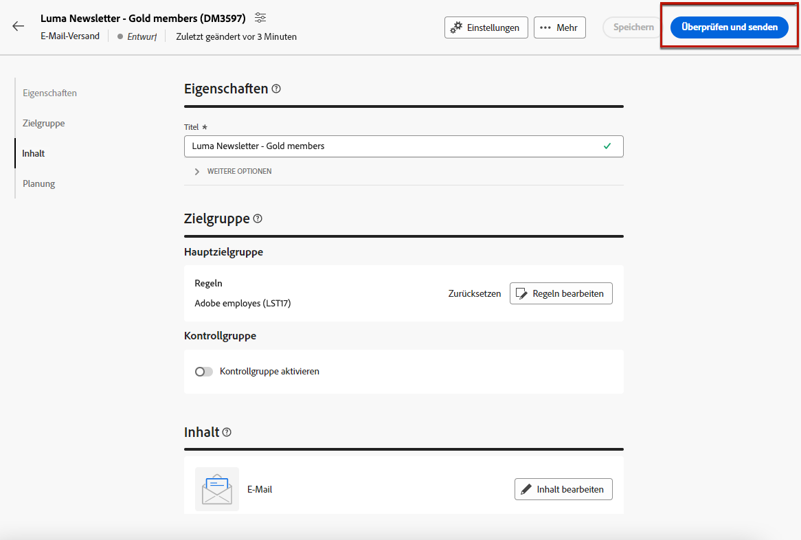
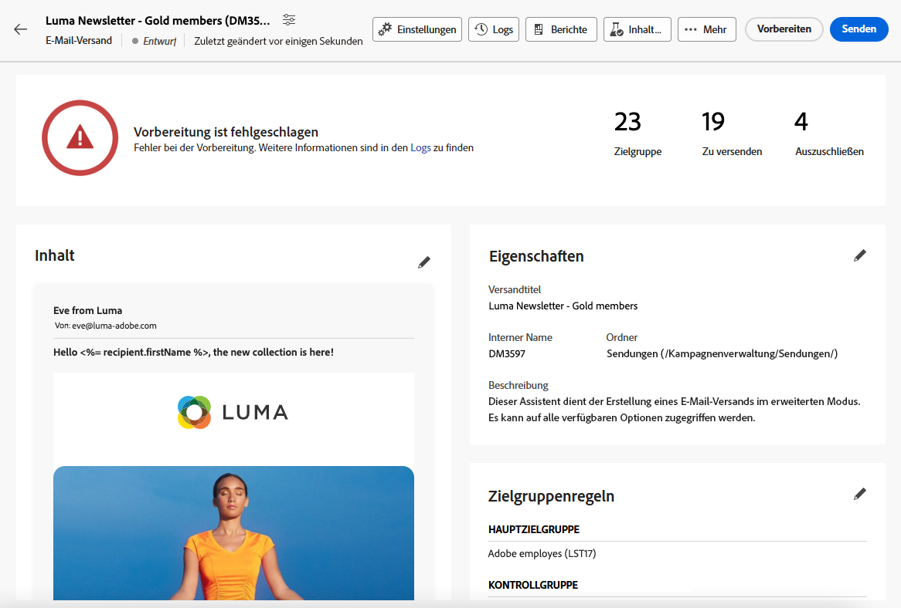
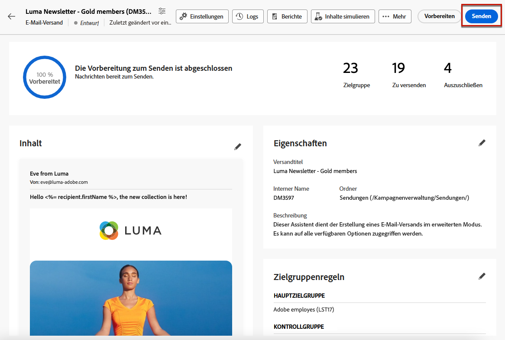

# Vorbereiten und Senden einer E-Mail {#prepare-send}

## Versandvorbereitung {#prepare}

Wenn Sie Ihre [content](../content/edit-content.md), [audience](../audience/add-audience.md) und planen, sind Sie bereit, Ihren E-Mail-Versand vorzubereiten.

Während der Vorbereitung wird die Zielpopulation berechnet und der Nachrichteninhalt für jedes Profil in der Zielgruppe erzeugt. Nachdem die Vorbereitung abgeschlossen ist, können die Nachrichten entweder sofort oder am geplanten Datum und zur geplanten Uhrzeit gesendet werden.

Die bei der Versandvorbereitung verwendeten Validierungsregeln sind in der Dokumentation zur [Campaign v8-Konsole](https://experienceleague.adobe.com/docs/campaign/campaign-v8/campaigns/send/validate/delivery-analysis.html?lang=de){target="_blank"} beschrieben.

Die wichtigsten Schritte zur Versandvorbereitung sind unten aufgeführt.

1. Klicken Sie im Versand-Dashboard auf **[!UICONTROL Überprüfen und Senden]**.

   

1. Klicken Sie auf **[!UICONTROL Vorbereiten]** -Schaltfläche oben rechts klicken und bestätigen.

   

   >[!NOTE]
   >
   >Wenn Sie Ihren Versand geplant und die **[!UICONTROL Vor dem Senden Bestätigung aktivieren]** -Option, werden die Vorbereitungs- und Versandschritte unter der **[!UICONTROL Vorbereiten und Senden]** Schaltfläche. [Weitere Informationen zur Planung](../email/create-email.md#schedule)

1. Der Vorbereitungsfortschritt wird angezeigt. Abhängig von der Größe der Ziel-Population kann dieser Vorgang einige Zeit in Anspruch nehmen.

   Sie können die Vorbereitung jederzeit mit der Schaltfläche **[!UICONTROL Vorbereitung stoppen]** anhalten.

   

   >[!NOTE]
   >Dies ist mit keinerlei Risiko verbunden, da in dieser Phase keine Nachrichten gesendet werden. Je nach Größe der Zielgruppe kann die Dauer der Versandvorbereitung variieren.

1. Wenn die Vorbereitung abgeschlossen ist, überprüfen Sie die KPIs. Wenn die Anzahl zu sendender Nachrichten nicht Ihren Erwartungen entspricht, ändern Sie Ihre Audience und starten Sie die Vorbereitung erneut.

   

   Im Folgenden werden die verschiedenen KPIs angezeigt:

   * **[!UICONTROL Targeting]**: Anzahl der Zielgruppenempfänger.
   * **[!UICONTROL Zu versenden]**: die Anzahl der zu sendenden Nachrichten.
   * **[!UICONTROL Auszuschließen]**[: Anzahl der Nachrichten, die durch eine Typologieregel ausgeschlossen werden](../advanced-settings/delivery-settings.md#typology).

1. Klicken Sie auf die Schaltfläche **[!UICONTROL Protokolle]** und vergewissern Sie sich, dass kein Fehler vorliegt. Die letzte Log-Nachricht zeigt eventuelle Fehler und deren Anzahl an. [Weitere Informationen](delivery-logs.md)

   

1. Wenn bei der Vorbereitung ein kritischer Fehler erkannt wird, der den Versand verhindert, wird der Vorbereitungsstatus im Versand-Dashboard als fehlgeschlagen angezeigt.

   

1. Wenn Sie nach der Vorbereitung Änderungen an Ihrem Versand vornehmen, müssen Sie die Vorbereitung neu starten, damit diese Änderungen berücksichtigt werden.

Nachdem die Vorbereitung fehlerfrei abgeschlossen wurde, kann Ihre Nachricht gesendet werden.

## Senden einer Nachricht {#send}

>[!CONTEXTUALHELP]
>id="acw_deliveries_email_metrics_delivered"
>title="Zugestellt"
>abstract="Die Anzahl der erfolgreich zugestellten Nachrichten. Dieser Indikator wird alle 5 Minuten aktualisiert. Der angezeigte Prozentsatz bezieht sich auf die Gesamtzahl der gesendeten Nachrichten."

>[!CONTEXTUALHELP]
>id="acw_deliveries_email_metrics_opens"
>title="Öffnungen"
>abstract="Die Anzahl der geöffneten Nachrichten. Dieser Indikator wird alle 5 Minuten aktualisiert. Der angezeigte Prozentsatz ist das Verhältnis zwischen der Anzahl der Einzelöffnungen und der Anzahl der zugestellten Nachrichten."

>[!CONTEXTUALHELP]
>id="acw_deliveries_email_metrics_clicks"
>title="Klicks"
>abstract="Die Anzahl der Empfangenden, die mindestens einmal auf die E-Mail geklickt haben. Dieser Indikator wird alle 5 Minuten aktualisiert. Der angezeigte Prozentsatz ist das Verhältnis der Anzahl der eindeutigen Klicks im Vergleich zur Anzahl der zugestellten Nachrichten."

Einmal [Vorbereitung](#prepare) abgeschlossen ist, können Sie nun Ihre E-Mail senden.

Wenn die Nachricht terminiert ist, wird sie zum definierten Zeitpunkt gesendet. [Weitere Informationen](#schedule-the-send)

### Sofort senden {#send-immediately}

Gehen Sie wie folgt vor, um eine E-Mail sofort zu senden.

1. Klicken Sie im Versand-Dashboard auf die **[!UICONTROL Senden]** in der oberen rechten Ecke.

   

1. Bestätigen Sie diese Aktion, um die Nachricht sofort an die Hauptzielgruppe zu senden.

1. Der Versandfortschritt wird angezeigt.

### Planen Sie den Versand {#schedule-the-send}

Wenn Sie den Versand Ihrer E-Mail zu einem späteren Zeitpunkt geplant haben, gehen Sie wie folgt vor:

1. Bevor Sie die **[!UICONTROL Überprüfen und Senden]** auf, stellen Sie sicher, dass Sie einen Zeitplan für Ihre E-Mail definiert haben. [Weitere Informationen](../email/create-email.md#schedule)

1. Klicken Sie im Versand-Dashboard auf die **[!UICONTROL Senden als geplante Schaltfläche]** in der oberen rechten Ecke.

   

1. Klicken **[!UICONTROL Versand bestätigen]**. Der Versand erfolgt am geplanten Datum an die Hauptzielgruppe.

   >[!NOTE]
   >
   >Wenn Sie die **[!UICONTROL Vor dem Senden Bestätigung aktivieren]** -Option, werden die Vorbereitungs- und Versandschritte unter der **[!UICONTROL Vorbereiten und Senden]** Schaltfläche. [Weitere Informationen zur Planung](../email/create-email.md#schedule)

## Anhalten oder Anhalten des Versands {#pause-stop-sending}

Unabhängig davon, ob der Versand geplant ist oder nicht, können während des Versandvorgangs zwei Aktionen ausgeführt werden:

* Klicken **[!UICONTROL Versand anhalten]** um den Versand der Nachrichten zu unterbrechen. Sie können den Versand jederzeit fortsetzen.

* Klicken **[!UICONTROL Versand beenden]** , um den Versand sofort zu unterbrechen. Die Vorbereitung und der Versand können nicht fortgesetzt werden.

## Überprüfen der KPIs {#check-kpis}

Nach Abschluss des Versands können Sie die angezeigten KPIs überprüfen:

* **[!UICONTROL Gesendet]**: die Anzahl der zugestellten Nachrichten. Der angezeigte Prozentsatz basiert auf der Gesamtzahl der zu sendenden Nachrichten.

* **[!UICONTROL Zugestellt]**: die Anzahl der erfolgreich zugestellten Nachrichten. Der angezeigte Prozentsatz bezieht sich auf die Gesamtzahl der gesendeten Nachrichten.

* **[!UICONTROL Öffnungen]**: die Anzahl der geöffneten Nachrichten. Der angezeigte Prozentsatz ist die Anzahl unterschiedlicher Öffnungen in Bezug auf die Anzahl der zugestellten Nachrichten.

* **[!UICONTROL Klicks]**: die Anzahl der Empfänger, die mindestens einmal in der E-Mail geklickt haben. Der angezeigte Prozentsatz ist die Anzahl unterschiedlicher Klicks in Bezug auf die Anzahl der zugestellten Nachrichten.

* **[!UICONTROL Fehler]**: die Anzahl der E-Mails mit dem Fehlerstatus. Der angezeigte Prozentsatz bezieht sich auf die Gesamtzahl der gesendeten Nachrichten.

>[!NOTE]
>
>Alle Indikatoren werden alle 5 Minuten nach dem Versandstart aktualisiert. Die Indikatoren für die Versandvorbereitung sind in Echtzeit.

Sie können auch die Protokolle überprüfen. [Weitere Informationen](delivery-logs.md)