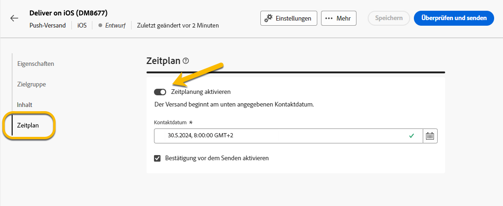
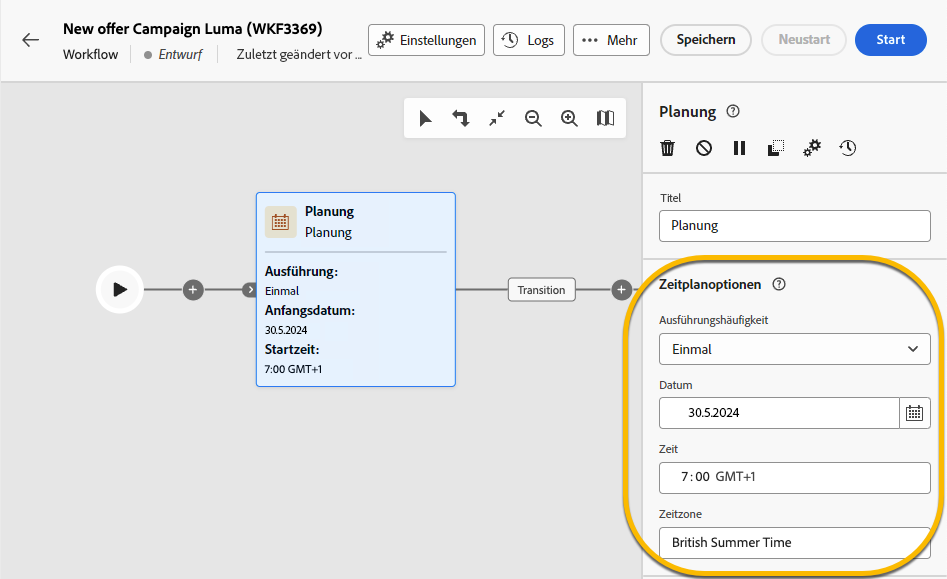

# Planen des Sendevorgangs eines Versands {#schedule-sending}

Sie können den Sendevorgang eines Versands planen. Die Schritte dazu hängen davon ab, ob es sich um einen eigenständigen (einmaligen) Versand handelt oder ob Sie im Rahmen eines Kampagnen-Workflows arbeiten.

## Eigenständiger Versand

Bei eigenständigen Sendungen können Sie Datum und Uhrzeit direkt im Versand planen.
Nachfolgend finden Sie Beispiele für jeden Versandtyp: E-Mail, SMS, Push-Benachrichtigung.

### E-Mail {#schedule-email-standalone}

Gehen Sie wie folgt vor, um den Sendevorgang eines E-Mail-Versands zu planen.

1. Aktivieren Sie im Abschnitt **[!UICONTROL Zeitplan]** der Versandeigenschaften das Kontrollkästchen **[!UICONTROL Zeitplanung aktivieren]**.

1. Legen Sie das gewünschte Datum und die Uhrzeit für den Versand fest und klicken Sie auf die Schaltfläche **[!UICONTROL Überprüfen und senden]**.

   {zoomable="yes"}

>[!NOTE]
>
>Standardmäßig ist die Option **[!UICONTROL Bestätigung vor dem Senden aktivieren]** aktiviert. Für diese Option müssen Sie das Senden bestätigen, bevor der Versand zum geplanten Zeitpunkt gesendet wird. Wenn Sie den Versand **automatisch** zum geplanten Zeitpunkt durchführen lassen möchten, müssen Sie diese Option deaktivieren.
>

1. Überprüfen Sie, ob der Zeitplan korrekt ist, und klicken Sie auf die Schaltfläche **[!UICONTROL Vorbereiten]**.

{zoomable="yes"}

1. Sobald die Vorbereitung abgeschlossen ist, können Nachrichten gesendet werden. Die folgenden Schlüsselmetriken für den Versand werden angezeigt: Gesamtzielpopulation, Anzahl der zu sendenden Nachrichten und Anzahl der ausgeschlossenen Empfängerinnen und Empfänger. Klicken Sie auf die Schaltfläche **[!UICONTROL Nach Zeitplan senden]**, um zu bestätigen, dass der Versand am geplanten Datum und zur geplanten Uhrzeit an die Hauptzielgruppe erfolgen soll.

{zoomable="yes"}

### SMS

Um einen SMS-Versand für ein bestimmtes Datum und eine bestimmte Uhrzeit zu planen, gehen Sie genauso vor wie bei E-Mail-Sendungen, [wie oben beschrieben](#schedule-email-standalone).

{zoomable="yes"}

Sie können auch prüfen, ob der Zeitplan berücksichtigt wird:

{zoomable="yes"}

### Push-Benachrichtigung

Um einen eigenständigen Push-Versand für ein bestimmtes Datum und eine bestimmte Uhrzeit zu planen, gehen Sie genauso vor wie bei E-Mail-Sendungen, [wie oben beschrieben](#schedule-email-standalone).

{zoomable="yes"}

Sie können auch prüfen, ob der Zeitplan berücksichtigt wird:

{zoomable="yes"}

### Eigenständiger Versand in einer Kampagne

Sie können ohne Workflow einen eigenständigen Versand innerhalb einer Kampagne erstellen. Sie können das Datum und die Uhrzeit für diesen Versand wie oben beschrieben festlegen.
Die Kampagne kann über einen Zeitplan mit Start- und Enddatum verfügen. Dieser Zeitplan hat keine Auswirkungen auf Ihren Versandzeitplan.

{zoomable="yes"}

## Planen eines Versands in einem Kampagnen-Workflow

Im Zusammenhang mit einem Kampagnen-Workflow gilt es als **Best Practice**, die Aktivität **[!UICONTROL Planung]** zu verwenden, um ein Datum und eine Uhrzeit festzulegen, zu der der Workflow mit dem Sendevorgang des Versands gestartet wird. [Weitere Informationen zur Planung](../workflows/activities/scheduler.md)

{zoomable="yes"}

Sie müssen das Datum und die Uhrzeit in der Aktivität **[!UICONTROL Planung]** konfigurieren.

{zoomable="yes"}

>[!NOTE]
>
>Wenn Sie die Aktivität **[!UICONTROL Planung]** verwenden, um den Sendevorgang Ihres Versands in einem Workflow festzulegen, **aktivieren Sie nicht** den Umschalter **[!UICONTROL Zeitplanung aktivieren]** in den Aktivitätseinstellungen **[!UICONTROL Versand]**. Ihr Versand wird automatisch durchgeführt.
>

Wenn Sie in den Aktivitätseinstellungen **[!UICONTROL Versand]** den Umschalter **[!UICONTROL Zeitplanung aktivieren]** aktivieren und dort ein Datum und eine Uhrzeit festlegen, wartet der Versand darauf, zu diesem Datum und zu dieser Uhrzeit durchgeführt zu werden. Das bedeutet, dass die Zielgruppe im Falle einer Verzögerung zwischen dem Start des Workflows und dem Datum des Versands möglicherweise nicht auf dem neuesten Stand ist.
