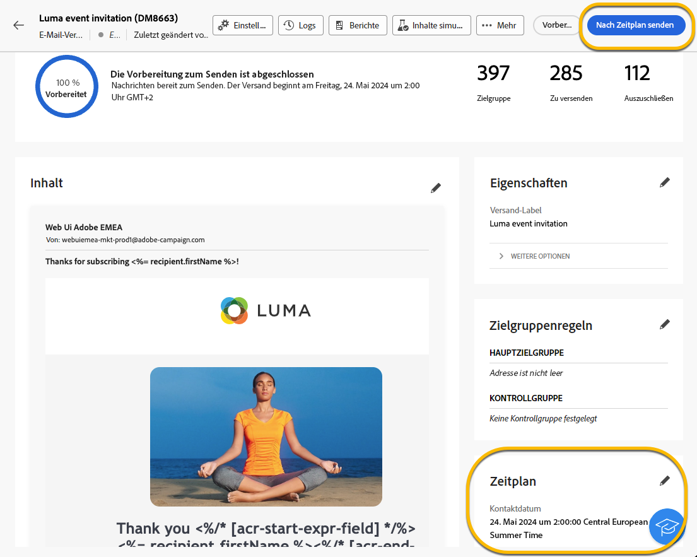
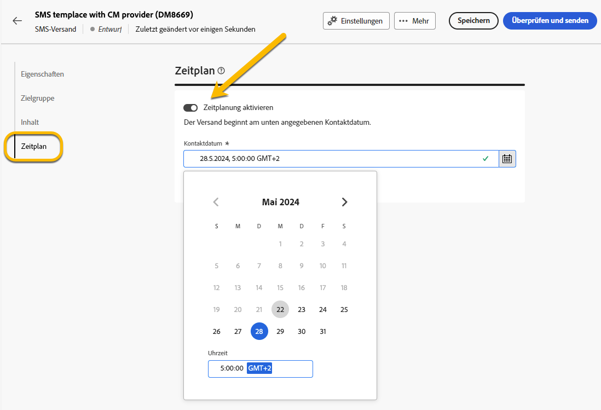
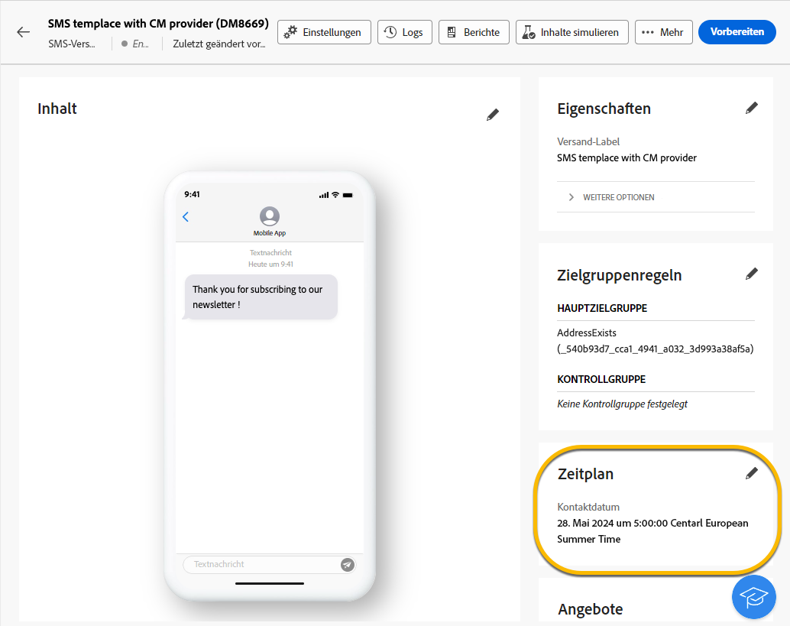
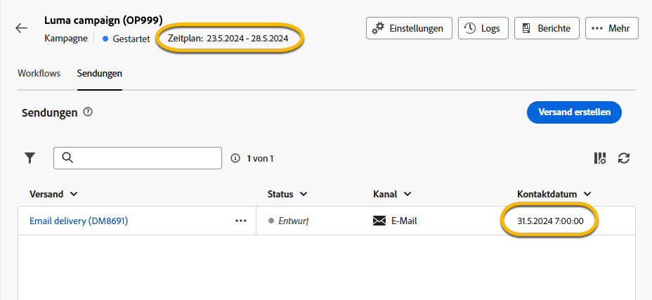

# Planen des Sendevorgangs eines Versands {#schedule-sending}

Sie können den Sendevorgang eines Versands planen. Die Schritte hängen davon ab, ob es sich um einen eigenständigen (einmaligen) Versand handelt oder ob Sie im Rahmen eines Kampagnen-Workflows arbeiten.

## Eigenständiger Versand

Planen Sie bei eigenständigen Sendungen Datum und Uhrzeit direkt im Versand. Nachfolgend finden Sie Beispiele für jeden Versandtyp: E-Mail, SMS und Push-Benachrichtigung.

### E-Mail {#schedule-email-standalone}

Gehen Sie wie folgt vor, um die Durchführung eines E-Mail-Versands zu planen:

1. Aktivieren Sie im Abschnitt **[!UICONTROL Zeitplan]** der Versandeigenschaften das Kontrollkästchen **[!UICONTROL Zeitplanung aktivieren]**.

1. Legen Sie das gewünschte Datum und die gewünschte Uhrzeit für den Versand fest und klicken Sie auf die Schaltfläche **[!UICONTROL Überprüfen und senden]**.

   {zoomable="yes"}

>[!NOTE]
>
>Standardmäßig ist die Option **[!UICONTROL Bestätigung vor dem Senden aktivieren]** aktiviert. Für diese Option müssen Sie das Senden bestätigen, bevor der Versand zum geplanten Zeitpunkt gesendet wird. Deaktivieren Sie diese Option, wenn Sie den Versand automatisch zum geplanten Zeitpunkt durchführen lassen möchten.
>

1. Überprüfen Sie, ob der Zeitplan korrekt ist, und klicken Sie auf die Schaltfläche **[!UICONTROL Vorbereiten]**.

{zoomable="yes"}

1. Sobald die Vorbereitung abgeschlossen ist, können Nachrichten gesendet werden. Es werden Schlüsselmetriken für den Versand angezeigt, z. B. die Gesamtzielpopulation, die Anzahl der zu sendenden Nachrichten und die Anzahl der ausgeschlossenen Empfängerinnen und Empfänger. Klicken Sie auf die Schaltfläche **[!UICONTROL Nach Zeitplan senden]**, um zu bestätigen, dass der Versand am geplanten Datum und zur geplanten Uhrzeit an die Hauptzielgruppe erfolgt.

{zoomable="yes"}

### SMS

Gehen Sie so wie bei E-Mail-Sendungen vor, um den SMS-Versand für ein bestimmtes Datum und eine bestimmte Uhrzeit zu planen. [Siehe oben](#schedule-email-standalone).

{zoomable="yes"}

Sie können auch überprüfen, ob der Zeitplan angewendet wird:

{zoomable="yes"}

### Push-Benachrichtigung

Gehen Sie so wie bei E-Mail-Sendungen vor, um einen eigenständigen Push-Versand für ein bestimmtes Datum und eine bestimmte Uhrzeit zu planen. [Siehe oben](#schedule-email-standalone).

{zoomable="yes"}

Sie können auch überprüfen, ob der Zeitplan angewendet wird:

{zoomable="yes"}

### Eigenständiger Versand in einer Kampagne

Sie können ohne Workflow einen eigenständigen Versand innerhalb einer Kampagne erstellen. Legen Sie das Datum und die Uhrzeit für diesen Versand wie oben beschrieben fest. Die Kampagne kann über einen eigenen Zeitplan mit Start- und Enddatum verfügen. Dieser Zeitplan hat keine Auswirkungen auf Ihren Versandzeitplan.

{zoomable="yes"}

## Planen eines Versands in einem Kampagnen-Workflow

Im Zusammenhang mit einem Kampagnen-Workflow gilt es als Best Practice, die Aktivität **[!UICONTROL Planung]** zu verwenden, um ein Datum und eine Uhrzeit für den Workflow-Start festzulegen, wozu die Durchführung des Versands gehört. [Erfahren Sie mehr über die Planung](../workflows/activities/scheduler.md).

{zoomable="yes"}

Konfigurieren Sie das Datum und die Uhrzeit in der Aktivität **[!UICONTROL Planung]**.

{zoomable="yes"}

>[!NOTE]
>
>Wenn Sie die Aktivität **[!UICONTROL Planung]** verwenden, um den Sendevorgang Ihres Versands in einem Workflow festzulegen, aktivieren Sie nicht den Umschalter **[!UICONTROL Zeitplanung aktivieren]** in den Aktivitätseinstellungen **[!UICONTROL Versand]**. Ihr Versand wird automatisch durchgeführt.
>

Wenn Sie in den Aktivitätseinstellungen **[!UICONTROL Versand]** den Umschalter **[!UICONTROL Zeitplanung aktivieren]** aktivieren und dort ein Datum und eine Uhrzeit festlegen, wird für die Durchführung des Versands auf dieses Datum und diese Uhrzeit gewartet. Bei einer Verzögerung zwischen dem Startdatum des Workflows und dem Versanddatum ist die Zielgruppe also möglicherweise nicht auf dem neuesten Stand.