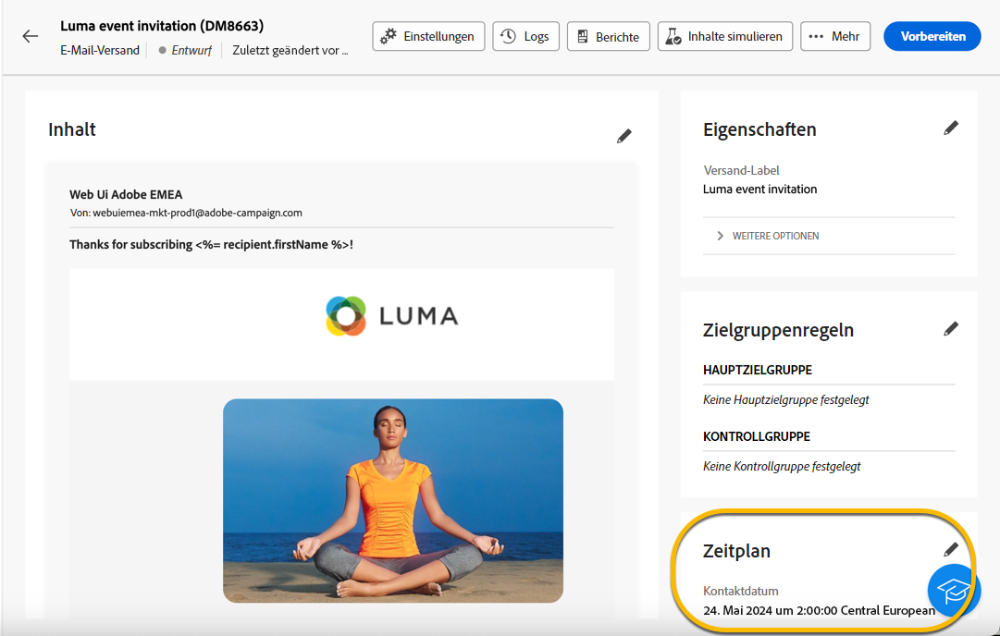

# Versand planen {#schedule-sending}

Sie können den Versand eines Versands planen. Die Schritte dazu hängen davon ab, ob es sich um einen Einzelversand (einmaligen Versand) handelt oder ob Sie im Rahmen eines Kampagnen-Workflows arbeiten.

## Eigenständiger Versand

Bei eigenständigen Sendungen können Sie Datum und Uhrzeit direkt im Versand planen.
Nachfolgend finden Sie Beispiele für jeden Versandtyp : E-Mail, SMS, Push-Benachrichtigung.

### E-Mail {#schedule-email-standalone}

Gehen Sie wie folgt vor, um den Versand einer E-Mail zu planen:

1. Im **[!UICONTROL Zeitplan]** in den Versandeigenschaften, aktivieren Sie die Option **[!UICONTROL Aktivieren der Planung]** Umschalten

1. Legen Sie das gewünschte Datum und die gewünschte Uhrzeit für den Versand fest und klicken Sie auf **[!UICONTROL Überprüfen und Senden]** Schaltfläche.

   {zoomable="yes"}

>[!NOTE]
>
>Standardmäßig ist die Option **[!UICONTROL Bestätigung vor dem Senden aktivieren]** aktiviert. Für diese Option müssen Sie das Senden bestätigen, bevor der Versand zum geplanten Zeitpunkt gesendet wird. Wenn Sie **Versand automatisch durchführen** Sie müssen diese Option am geplanten Datum und zur geplanten Uhrzeit deaktivieren.
>

1. Überprüfen Sie, ob der Zeitplan korrekt ist, und klicken Sie auf **[!UICONTROL Vorbereiten]** Schaltfläche.

{zoomable="yes"}

1. Sobald die Vorbereitung abgeschlossen ist, können Nachrichten gesendet werden. Schlüsselmetriken für den Versand werden angezeigt: Gesamtzielpopulation, Anzahl zu sendender Nachrichten, Anzahl der ausgeschlossenen Empfänger. Klicken Sie auf **[!UICONTROL Senden als geplant]** -Schaltfläche, um zu bestätigen, dass der Versand am geplanten Datum und zur geplanten Uhrzeit an die Hauptzielgruppe durchgeführt werden kann.

{zoomable="yes"}

### SMS

Um Ihren SMS-Versand auf ein bestimmtes Datum und eine bestimmte Uhrzeit zu planen, sind die gleichen Schritte wie bei E-Mail-Sendungen, [siehe oben](#schedule-email-standalone).

{zoomable="yes"}

Sie können auch prüfen, ob der Zeitplan berücksichtigt wird:

{zoomable="yes"}

### Push-Benachrichtigung

Um einen eigenständigen Push-Versand an ein bestimmtes Datum und eine bestimmte Uhrzeit zu planen, sind die Schritte dieselben wie für E-Mail-Sendungen. [siehe oben](#schedule-email-standalone).

{zoomable="yes"}

Sie können auch prüfen, ob der Zeitplan berücksichtigt wird:

{zoomable="yes"}

### Einzelversand in einer Kampagne

Sie können einen Einzelversand innerhalb einer Kampagne ohne Workflow erstellen. Sie können den Datums- und Uhrzeitplan für diesen Versand wie oben beschrieben einrichten.
Die Kampagne kann ihren Zeitplan mit einem Start- und einem Enddatum haben. Dieser Zeitplan stört nicht Ihren Versandzeitplan.

{zoomable="yes"}

## Versand im Kampagnen-Workflow planen

Im Rahmen eines Kampagnen-Workflows wird die **Best Practice** verwendet die **[!UICONTROL Planung]** -Aktivität, um ein Datum und eine Uhrzeit anzuwenden, zu dem der Workflow mit dem Versand gestartet wird. [Weitere Informationen zur Planung](../workflows/activities/scheduler.md)

{zoomable="yes"}

Sie müssen Datum und Uhrzeit in der Variablen **[!UICONTROL Planung]** -Aktivität.

{zoomable="yes"}

>[!NOTE]
>
>Wenn Sie **[!UICONTROL Planung]** Aktivität zum Planen des Versands in einem Workflow, **nicht aktivieren** die **[!UICONTROL Aktivieren der Planung]** Umschalten in der **[!UICONTROL Versand]** Aktivitätseinstellungen. Ihr Versand wird automatisch durchgeführt.
>

Wenn Sie die **[!UICONTROL Aktivieren der Planung]** Umschalten in der **[!UICONTROL Versand]** Aktivitätseinstellungen sowie ein Datum und eine Uhrzeit einrichten, wartet der Versand an diesem Datum und zu dieser Uhrzeit. Das bedeutet, dass die Audience im Falle einer Verzögerung zwischen dem Start des Workflows und dem Datum des Versands möglicherweise nicht auf dem neuesten Stand ist.

