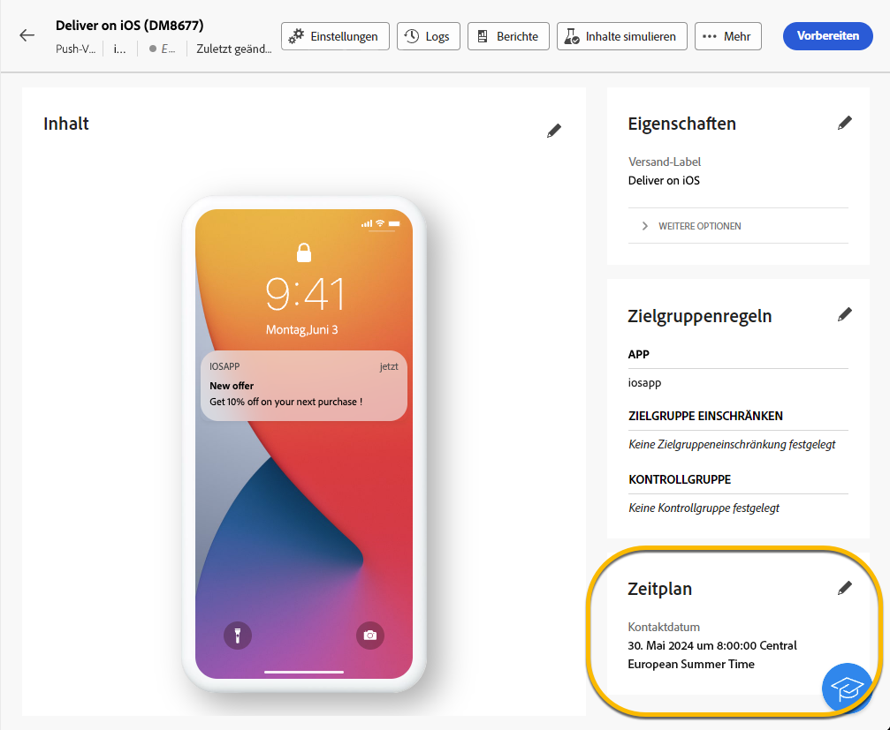

# Planen des Sendevorgangs eines Versands {#schedule-sending}

Sie können den Sendevorgang eines Versands planen. Die Schritte hängen davon ab, ob es sich um einen eigenständigen (einmaligen) Versand handelt oder ob Sie im Kontext eines Kampagnen-Workflows arbeiten.

## Eigenständiger Versand

Planen Sie für eigenständige Sendungen Datum und Uhrzeit direkt im Versand. Nachfolgend finden Sie Beispiele für jeden Versand-Typ: E-Mail, SMS und Push-Benachrichtigung.

### E-Mail {#schedule-email-standalone}

Gehen Sie wie folgt vor, um den Versand eines E-Mail-Versands zu planen:

1. Aktivieren **[!UICONTROL im Abschnitt &quot;]**&quot; Ihrer Versandeigenschaften den Umschalter **[!UICONTROL Zeitplan aktivieren]**.

1. Legen Sie das gewünschte Datum und die gewünschte Uhrzeit für den Versand fest und klicken Sie auf die Schaltfläche **[!UICONTROL Überprüfen und senden]**.

   {zoomable="yes"}

>[!NOTE]
>
>Standardmäßig ist die Option **[!UICONTROL Bestätigung vor dem Senden aktivieren]** aktiviert. Für diese Option müssen Sie das Senden bestätigen, bevor der Versand zum geplanten Zeitpunkt gesendet wird. Wenn der Versand automatisch zum geplanten Zeitpunkt durchgeführt werden soll, deaktivieren Sie diese Option.
>

1. Vergewissern Sie sich, dass der Zeitplan korrekt ist, und klicken Sie auf die Schaltfläche **[!UICONTROL Vorbereiten]**.

{zoomable="yes"}

1. Sobald die Vorbereitung abgeschlossen ist, können Nachrichten gesendet werden. Es werden Schlüsselmetriken für den Versand angezeigt, einschließlich der Gesamtzielgruppe, der Anzahl der zu versendenden Nachrichten und der Anzahl der ausgeschlossenen Empfänger. Klicken Sie auf **[!UICONTROL Nach Zeitplan senden]**, um zu bestätigen, dass der Versand am geplanten Datum und zur geplanten Uhrzeit an die Hauptzielgruppe gesendet wird.

{zoomable="yes"}

### SMS

Gehen Sie wie bei E-Mail-Sendungen vor, um den SMS-Versand für ein bestimmtes Datum und eine bestimmte Uhrzeit zu planen. [Siehe oben](#schedule-email-standalone).

{zoomable="yes"}

Sie können auch überprüfen, ob der Zeitplan angewendet wurde:

{zoomable="yes"}

### Push-Benachrichtigung

Gehen Sie wie bei E-Mail-Sendungen vor, um einen eigenständigen Push-Versand für ein bestimmtes Datum und eine bestimmte Uhrzeit zu planen. [Siehe oben](#schedule-email-standalone).

{zoomable="yes"}

Sie können auch überprüfen, ob der Zeitplan angewendet wurde:

{zoomable="yes"}

### Eigenständiger Versand in einer Kampagne

Sie können ohne Workflow einen eigenständigen Versand innerhalb einer Kampagne erstellen. Richten Sie den Zeitplan für Datum und Uhrzeit für diesen Versand wie oben beschrieben ein. Die Kampagne kann einen eigenen Zeitplan haben, einschließlich eines Anfangs- und eines Enddatums. Dieser Zeitplan beeinträchtigt Ihren Versandzeitplan nicht.

{zoomable="yes"}

## Planen eines Versands in einem Kampagnen-Workflow

Im Rahmen eines Kampagnen-Workflows wird empfohlen, mithilfe der Aktivität **[!UICONTROL Planung]** ein Datum und eine Uhrzeit für den Start des Workflows festzulegen, wozu auch der Versand gehört. [Weitere Informationen zur Planung](../workflows/activities/scheduler.md).

{zoomable="yes"}

Konfigurieren Sie Datum und Uhrzeit in der Aktivität **[!UICONTROL Planung]** .

{zoomable="yes"}

>[!NOTE]
>
>Wenn Sie die Aktivität **[!UICONTROL Planung]** zum Planen des Versands Ihres Versands in einem Workflow verwenden, aktivieren Sie nicht den Umschalter **[!UICONTROL Planung aktivieren]** in den Aktivitätseinstellungen **[!UICONTROL Versand]**. Ihr Versand erfolgt automatisch.
>

Wenn Sie den Umschalter **[!UICONTROL Planung aktivieren]** in den Aktivitätseinstellungen **[!UICONTROL Versand]** aktivieren und dort ein Datum und eine Uhrzeit einrichten, wartet der Versand auf den Versand zu diesem Datum und dieser Uhrzeit. Wenn also eine Verzögerung zwischen dem Startdatum des Workflows und dem Versanddatum auftritt, ist die Zielgruppe möglicherweise nicht auf dem neuesten Stand.