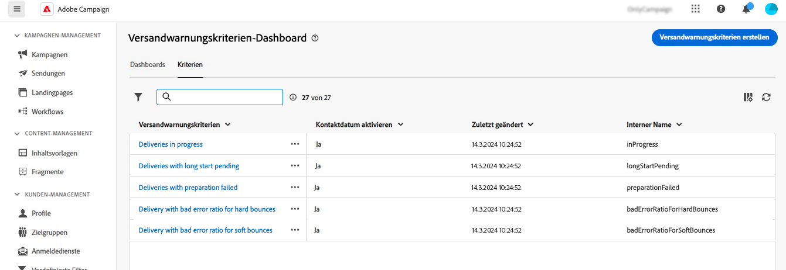
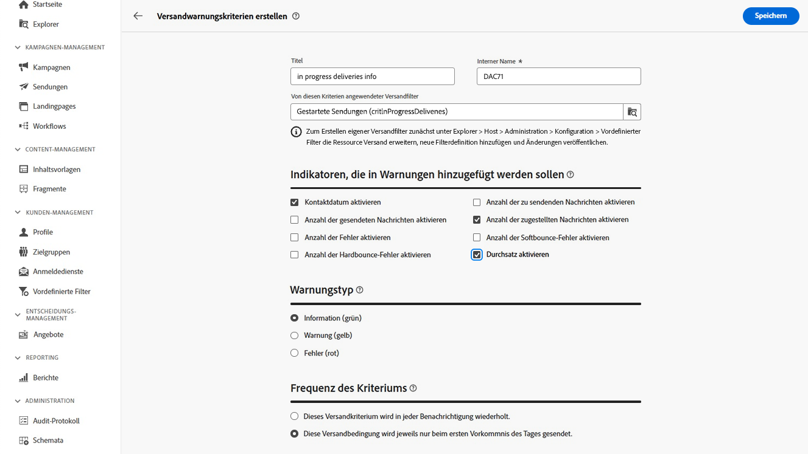

# Versandwarnungskriterien {#delivery-alerting-criteria}

>[!CONTEXTUALHELP]
>id="acw_delivery_alerting_criteria"
>title="Dashboard für Versandwarnungskriterien"
>abstract="Die Campaign Web-Benutzeroberfläche bietet vordefinierte Warnungskriterien (Sendungen mit geringem Durchsatz oder Sendungen, deren Vorbereitung fehlgeschlagen ist), die Sie Ihrem Dashboard hinzufügen können. Sie können auch eigene Kriterien erstellen, die Ihren Anforderungen entsprechen."

Die Web-Benutzeroberfläche von Campaign bietet vordefinierte Warnungskriterien, zum Beispiel Sendungen mit geringem Durchsatz oder Sendungen, deren Vorbereitung fehlgeschlagen ist, die Sie Ihrem Dashboard hinzufügen können. Sie können auch eigene Kriterien erstellen, die Ihren Anforderungen entsprechen.

Sie können über das Menü **Versandwarnung** im linken Navigationsbereich auf der Registerkarte **Kriterien** auf die Warnungskriterien zugreifen.

>[!AVAILABILITY]
>
>Diese Funktion ist nur eingeschränkt verfügbar. Sie ist Kundinnen und Kunden vorbehalten, die **von Adobe Campaign Standard zu Adobe Campaign v8** migrieren, und kann nicht in anderen Umgebungen bereitgestellt werden.

## Vordefinierte Warnungskriterien {#ootb-criteria}

Vordefinierte Warnungskriterien sind in der Campaign Web-Benutzeroberfläche verfügbar. Diese Kriterien decken eine Reihe von Szenarien ab, die unten aufgeführt sind:

* **Versandfehler**: Alle in einem bestimmten Zeitraum geplanten Sendungen mit einem Fehler als Status.
* **Sendungen mit fehlgeschlagener Vorbereitung**: Alle in einem bestimmten Zeitraum geänderten Sendungen, deren Vorbereitung (Zielgruppenberechnung und Inhaltserstellung) fehlgeschlagen ist.
* **Versand mit zu hoher Softbounce-Fehlerrate**: Alle in einem bestimmten Zeitraum geplanten Sendungen, deren Status zumindest „In Bearbeitung“ lautet und deren Softbounce-Fehlerrate über dem festgelegten Prozentsatz liegt.
* **Versand mit zu hoher Hardbounce-Fehlerrate**: Alle in einem bestimmten Zeitraum geplanten Sendungen, deren Status zumindest „In Bearbeitung“ lautet und deren Hardbounce-Fehlerrate über dem festgelegten Prozentsatz liegt.
* **Sendungen mit lange ausstehendem Start**: Alle in einem bestimmten Zeitraum geplanten Sendungen, die sich länger als die definierte Dauer im Status „Start ausstehend“ befinden. „Start ausstehend“ bedeutet, dass die Nachrichten vom System noch nicht berücksichtigt wurden.
* **Sendungen mit geringem Durchsatz**: Alle Sendungen, deren Start länger als die definierte Dauer zurückliegt, die einen niedrigeren als den definierten Prozentsatz an verarbeiteten Nachrichten aufweisen oder deren Durchsatz unter einem definierten Wert liegt.
* **Gestartete Sendungen**: Alle in einem bestimmten Zeitraum geplanten Sendungen, deren Status „In Bearbeitung“ lautet.

>[!NOTE]
>
>Für die oben genannten Kriterien werden auf alle Parameter Standardwerte angewendet. Diese Werte können im Abschnitt **Kriterienparameter** des Versandwarnungs-Dashboards, in dem sie verwendet werden, angepasst werden. [Erfahren Sie, wie Sie mit Dashboards arbeiten.](../msg/delivery-alerting-dashboards.md)

## Erstellen eines Warnungskriteriums {#criteria}

>[!CONTEXTUALHELP]
>id="acw_delivery_alerting_criteria_create"
>title="Erstellen eines Versandwarnungskriteriums"
>abstract="Neben den von Adobe Campaign bereitgestellten vordefinierten Warnungskriterien können Sie auch eigene Kriterien erstellen, die Ihren Anforderungen entsprechen."

>[!CONTEXTUALHELP]
>id="acw_delivery_alerting_criteria_create_indicators"
>title="Indikatoren, die in Warnungen hinzugefügt werden sollen"
>abstract="Wählen Sie die Indikatoren aus, die im Bereich „Details“ der E-Mail-Warnungen als Spalten angezeigt werden sollen."

>[!CONTEXTUALHELP]
>id="acw_delivery_alerting_criteria_create_alert"
>title="Warnungstyp"
>abstract="Geben Sie den **Warnungstyp** für das Kriterium ein, d. h. das Label und die Farbe, die neben dem Versandkriterium im Abschnitt „Zusammenfassung“ der Warnungen angezeigt werden sollen."

>[!CONTEXTUALHELP]
>id="acw_delivery_alerting_criteria_create_frequency"
>title="Frequenz des Kriteriums"
>abstract="Steuern Sie die Häufigkeit der Warnungen pro Tag für jeden Versand, der das Kriterium erfüllt."

Gehen Sie wie folgt vor, um ein neues Kriterium zu erstellen:

1. Navigieren Sie im linken Navigationsbereich zum Menü **Versandwarnung** und wählen Sie die Registerkarte **Kriterien** aus.
1. Klicken Sie auf die Schaltfläche **Versandwarnungskriterien erstellen**.
1. Geben Sie einen Titel für das Kriterium an. Der interne Name wird automatisch ausgefüllt und schreibgeschützt.
1. Mit dem **von diesen Kriterien angewendeten Versandfilter** können Sie den Umfang des Kriteriums durch Anwendung eines vordefinierten Filters verfeinern.

   Im unten abgebildeten Beispiel wurde der Filter **Versand gestartet (critInProgressDeliveries)** ausgewählt, d. h., das Kriterium berücksichtigt nur Sendungen mit dem Status „Gestartet“.

   

   >[!NOTE]
   >
   >Wenn keiner der vordefinierten Filter Ihren Anforderungen entspricht, können Sie eigene Filter im Menü **Kunden-Management** > **Vordefinierte Filter** erstellen. [Weitere Informationen](../get-started/predefined-filters.md)
   >
   >Dieser Vorgang sollte nur von erfahrenen Benutzenden durchgeführt werden.

1. Wählen Sie im Abschnitt **Indikatoren, die in Warnungen hinzugefügt werden sollen** die Indikatoren aus, die im Bereich „Details“ der E-Mail-Warnungen als Spalten angezeigt werden sollen.

1. Geben Sie den **Warnungstyp** für das Kriterium ein, d. h. den Titel und die Farbe, die neben dem Versandkriterium im Abschnitt „Zusammenfassung“ der Warnungen angezeigt werden sollen.

1. Im Abschnitt **Bedingungsfrequenz** können Sie die Häufigkeit von Warnungen pro Tag für jeden Versand steuern, der das Kriterium erfüllt:

   * **Dieses Versandkriterium wird in jeder Benachrichtigung wiederholt**: Zeigt einen Versand, der das Kriterium erfüllt, in jeder E-Mail-Warnung des Tages an.
   * **Dieses Versandkriterium wird nur beim ersten Auftreten des Tages gesendet**: Zeigt einen Versand, der das Kriterium erfüllt, nur im ersten Bericht des Tages an, aber wiederholt dies nicht in nachfolgenden E-Mail-Warnungen.