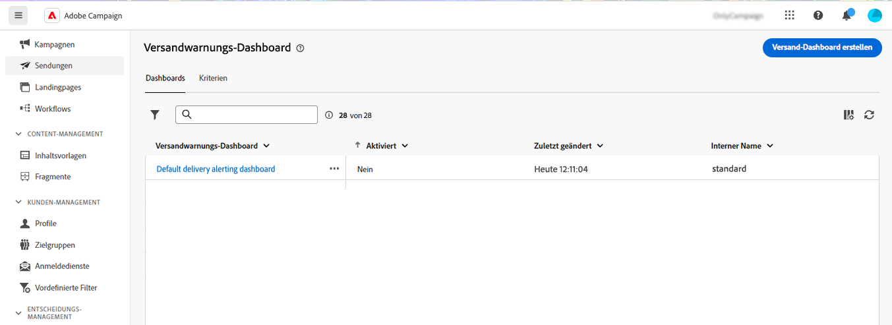
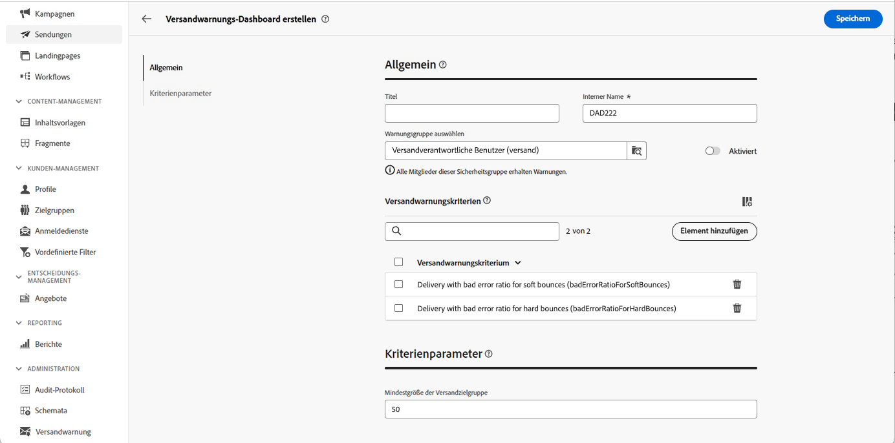
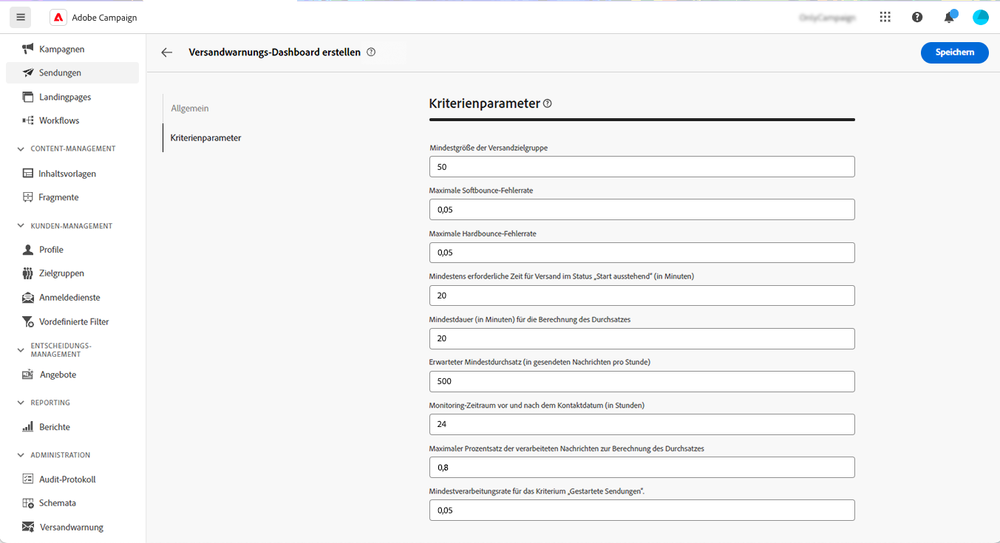
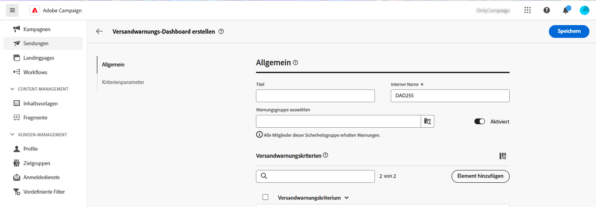
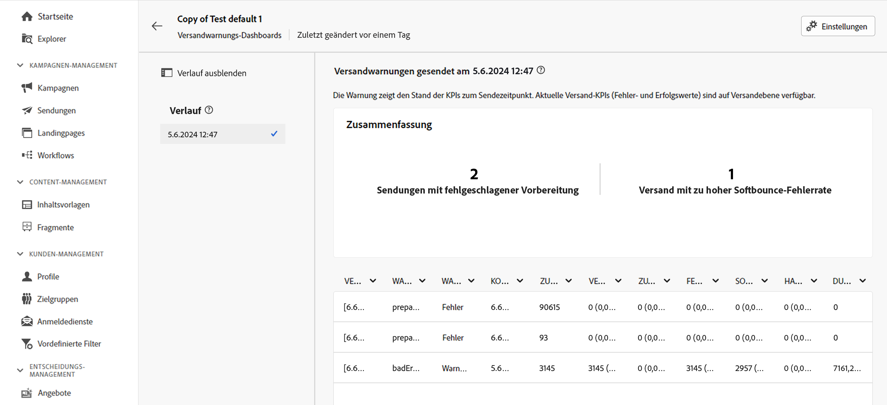

# Versandwarnungs-Dashboards {#delivery-alerting-dashboards}

>[!CONTEXTUALHELP]
>id="acw_delivery_alerting_dashboards"
>title="Versandwarnungs-Dashboards"
>abstract="Bei Versandwarnungen handelt es sich um ein System zum Warnungs-Management, über das Benutzergruppen automatisch E-Mail-Benachrichtigungen mit Informationen zu ihren Versandausführungen erhalten.  In Versandwarnungs-Dashboards können Sie festlegen, wer E-Mail-Warnungen erhalten soll, die Warnungskriterien zum Senden dieser Warnungen auswählen und konfigurieren sowie auf den Verlauf aller gesendeten Benachrichtigungen zugreifen."

In Versandwarnungs-Dashboards können Sie festlegen, wer E-Mail-Warnungen erhalten soll, die Warnungskriterien zum Senden dieser Warnungen auswählen und konfigurieren sowie auf den Verlauf aller gesendeten Benachrichtigungen zugreifen.  Zugriff darauf erhalten Sie über das Menü **Versandwarnung** im linken Navigationsbereich, und zwar durch die Registerkarte **Dashboards**.

>[!AVAILABILITY]
>
>Diese Funktion ist nur eingeschränkt verfügbar. Sie ist Kundinnen und Kunden vorbehalten, die **von Adobe Campaign Standard zu Adobe Campaign v8** migrieren, und kann nicht in anderen Umgebungen bereitgestellt werden.

## Erstellen eines Versand-Dashboards {#dashboards}

>[!CONTEXTUALHELP]
>id="acw_delery_alerting_dashboard_create"
>title="Erstellen eines Versandwarnungs-Dashboards"
>abstract="Durch die Erstellung eines Versandwarnungs-Dashboards können Sie festlegen, wer E-Mail-Warnungen erhalten soll, die Warnungskriterien zum Senden dieser Warnungen auswählen und konfigurieren sowie auf den Verlauf aller gesendeten Benachrichtigungen zugreifen."

>[!CONTEXTUALHELP]
>id="acw_delivery_alerting_create_general"
>title="Allgemeine Parameter für eine Versandwarnung"
>abstract="Legen Sie die allgemeinen Eigenschaften des Versandwarnungs-Dashboards fest. Im Feld **Warnungsgruppe auswählen** können Sie die **Benutzergruppe** angeben, die die von diesem Dashboard gesendeten Warnungen erhalten soll."

>[!CONTEXTUALHELP]
>id="acw_delivery_alerting_create_criteria_add"
>title="Versandwarnungskriterien"
>abstract="Fügen Sie in diesem Abschnitt Kriterien hinzu, mit denen Sie Warnungen über dieses Dashboard senden möchten. Wählen Sie aus vordefinierten Kriterien oder erstellen Sie eigene Kriterien, um sie an bestimmte Anforderungen anzupassen."

>[!CONTEXTUALHELP]
>id="acw_delivery_alerting_create_criteria_parameters"
>title="Kriterienparameter"
>abstract="Kriterien verfügen über Standardparameter, die definieren, wie sie angewendet werden sollen. Sie können diese Werte entsprechend Ihren Anforderungen in diesem Abschnitt ändern."

Gehen Sie wie folgt vor, um ein Versand-Dashboard zu erstellen:

1. Navigieren Sie zum Menü **Versandwarnung** im linken Navigationsbereich und klicken Sie auf **Versand-Dashboard erstellen**.

   

1. Benennen Sie Ihr Dashboard im Feld **Titel**. Das Feld **Interner Name** wird automatisch ausgefüllt und schreibgeschützt.

1. Geben Sie im Feld **Warnungsgruppe auswählen** die **Benutzergruppe** an, um die von diesem Dashboard gesendeten Warnungen zu erhalten. Alle Mitglieder der ausgewählten Benutzergruppe erhalten die Warnungen.

   Weitere Informationen zu Berechtigungen und Benutzergruppen finden Sie in der [Dokumentation zu Adobe Campaign v8 (Konsole)](https://experienceleague.adobe.com/de/docs/campaign/campaign-v8/admin/permissions/gs-permissions){target="_blank"}.

1. Fügen Sie im Abschnitt **Versandwarnungskriterien** Kriterien hinzu, die Sie zum Senden von Warnungen verwenden möchten. Wählen Sie aus vordefinierten Kriterien oder erstellen Sie eigene Kriterien, um sie an bestimmte Anforderungen anzupassen. [Erfahren Sie, wie Sie mit Kriterien arbeiten](../msg/delivery-alerting-criteria.md)

1. Kriterien verfügen über Standardparameterwerte, die definieren, wie sie angewendet werden sollen. Sie können diese Werte im Abschnitt **Kriterienparameter** Ihren Anforderungen entsprechend ändern.

   

   Zum Beispiel ist der Kriterienparameter **Mindestgröße der Versandzielgruppe** standardmäßig auf 50 gesetzt, d. h. ein Versand wird nur dann in die von diesem Dashboard gesendete Warnung aufgenommen, wenn er mindestens 50 Profile anspricht. Sie können diesen Parameter ändern, wenn Sie Sendungen einbeziehen möchten, die weniger als 50 Profile ansprechen.

   Erweitern Sie den folgenden Abschnitt, um weitere Informationen zu den einzelnen Kriterienparametern zu erhalten:

   +++Verfügbare Kriterienparameter

   * **Mindestgröße der Versandzielgruppe**: Wenn Sie in diesem Feld beispielsweise 100 eingeben, wird eine Benachrichtigung nur für Sendungen gesendet, deren Zielgruppe mindestens 100 Empfänger umfasst. Dieser Parameter gilt für alle Bedingungen.
   * **Monitoring-Zeitraum vor und nach dem Kontaktdatum (in Stunden)**: Anzahl der Stunden vor und nach der aktuellen Zeit. Berücksichtigt werden nur Sendungen, deren Kontaktdatum in diesem Zeitraum liegt. Dieser Parameter gilt für alle Bedingungen. Standardmäßig ist der Wert dieses Feldes mit 24 Stunden festgelegt.
   * **Maximale Softbounce-Fehlerrate**: Eine Benachrichtigung wird für alle Sendungen gesendet, deren Softbounce-Fehlerrate über dem definierten Wert liegt. Standardmäßig ist der Wert dieses Feldes auf 0,05 (5 %) festgelegt.
   * **Maximale Hardbounce-Fehlerrate**: Eine Benachrichtigung wird für alle Sendungen gesendet, deren Hardbounce-Fehlerrate über dem definierten Wert liegt. Standardmäßig ist der Wert dieses Feldes auf 0,05 (5 %) festgelegt.
   * **Mindestzeitschwelle für einen Versand im Status „Start ausstehend“ (in Minuten)**: Es wird eine Benachrichtigung für alle Sendungen gesendet, deren Status „Start ausstehend“ länger als die in diesem Feld angegebene Dauer ist. Der Status „Start ausstehend“ bedeutet, dass die Nachrichten noch nicht vom System berücksichtigt wurden.
   * **Mindestdauer (in Minuten) für die Berechnung des Durchsatzes**: Nur Sendungen, deren Dauer länger ist als der spezifizierte Wert (mit Status „Gestartet“), werden für die Bedingung „Sendungen mit geringem Durchsatz“ berücksichtigt.
   * **Maximaler Prozentsatz verarbeiteter Nachrichten zur Berechnung des Durchsatzes**: Nur Sendungen mit einem Prozentsatz an verarbeiteten Nachrichten, der unter dem definierten Wert liegt, werden für die Bedingung „Sendungen mit geringem Durchsatz“ berücksichtigt.
   * **Erwarteter Mindestdurchsatz (in gesendeten Nachrichten pro Stunde)**: Nur Sendungen mit einem Durchsatz, der unter dem festgelegten Wert liegt, werden für die Bedingung „Sendungen mit geringem Durchsatz“ berücksichtigt.
   * **Für Versandbedingung &#39;Gestartet&#39; erforderliche Mindest-Verarbeitungsrate**: Nur Sendungen mit einem Prozentsatz an verarbeiteten Nachrichten, der über dem festgelegten Wert liegt, werden berücksichtigt.

+++

1. Warnungs-Dashboards sind standardmäßig deaktiviert, d. h., mit diesem Dashboard verknüpfte E-Mail-Warnungen werden nicht gesendet. Um das Dashboard sofort zu aktivieren, schalten Sie die Option **Aktiviert** im Abschnitt **Allgemein** neben dem Feld für die Warnungsgruppenauswahl ein.

   Sie können das Dashboard auch speichern und später aktivieren.

   

1. Um das Warnungs-Dashboard zu speichern, klicken Sie auf die Schaltfläche **Speichern**.

Das Warnungs-Dashboard wird mit leeren Daten geöffnet. Wenn Sie bereit sind, es zu aktivieren und Benachrichtigungen zu senden, klicken Sie auf die Schaltfläche **Einstellungen** und schalten Sie die Option **Aktiviert** ein, wenn Sie dies noch nicht getan haben.

Immer wenn jetzt ein Versand die von Ihnen in diesem Dashboard definierten Kriterien erfüllt, wird eine Warnung an die angegebene Benutzergruppe gesendet.

## Verwalten von Warnungs-Dashboards

>[!CONTEXTUALHELP]
>id="acw_delivery_alerting_dashboard_alerts"
>title="Gesendete Versandwarnungen"
>abstract="In diesem Abschnitt können Sie Informationen zu den zuletzt gesendeten Warnungen visualisieren."

>[!CONTEXTUALHELP]
>id="acw_delivery_alerting_dashboard_history"
>title="Verlauf der Versandwarnungen"
>abstract="Der Bereich **Verlauf** enthält alle Warnungen, die von diesem Dashboard gesendet wurden. Klicken Sie auf ein Element, um auf die entsprechenden Warnungen zuzugreifen, die zu dem jeweiligen Zeitpunkt gesendet wurden."

Alle erstellten Warnungs-Dashboards sind über das Menü **Versandwarnung** auf der Registerkarte **Dashboards** zugänglich.

Sie können ein Dashboard über die Schaltfläche **Mehr Aktionen** neben seinem Namen duplizieren oder löschen.

Um auf die detaillierte Ansicht eines Dashboards zuzugreifen, klicken Sie in der Liste auf dessen Namen. Auf diesem Bildschirm können Sie die zuletzt gesendete Warnung visualisieren. Alle gesendeten Warnungen werden im linken Bereich aufgelistet. Klicken Sie auf ein Element, um auf die entsprechenden Warnungen zuzugreifen, die zu dem jeweiligen Zeitpunkt gesendet wurden.

Um das Dashboard zu bearbeiten, klicken Sie auf die Schaltfläche **Einstellungen** in der oberen rechten Ecke und nehmen Sie die gewünschten Änderungen vor.