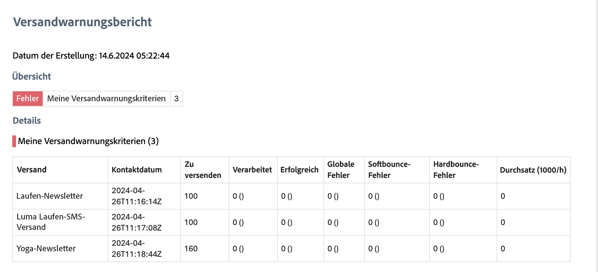

# Erste Schritte mit Versandwarnungen {#gs-delivery-alerting}

>[!CONTEXTUALHELP]
>id="acw_homepage_welcome_rn4"
>title="Versandwarnung"
>abstract="Versandwarnungen sind jetzt in Campaign verfügbar. Bei dieser Funktion handelt es sich um ein System zur Verwaltung von Warnhinweisen, mit dem Benutzergruppen automatisch E-Mail-Benachrichtigungen mit Informationen zu ihren Versandausführungen erhalten können."
>additional-url="https://experienceleague.adobe.com/docs/campaign-web/v8/release-notes/release-notes.html?lang=de" text="Siehe Versionshinweise"

Bei Versandwarnungen handelt es sich um ein System zum Warnungs-Management, über das Benutzergruppen automatisch E-Mail-Benachrichtigungen mit Informationen zu ihren Versandausführungen erhalten.  Empfängerinnen und Empfänger können die von Adobe Campaign verarbeiteten Sendungen überwachen und entsprechende Maßnahmen treffen, wenn Fehler auftreten.

Benachrichtigungen können basierend auf bestimmten Warnungskriterien angepasst werden, die über die Web-Benutzeroberfläche von Adobe Campaign definiert werden.

Weiterführende Informationen zur Verwaltung von fehlgeschlagenen Sendungen finden Sie in der [Dokumentation zu Adobe Campaign v8 (Konsole)](https://experienceleague.adobe.com/de/docs/campaign/campaign-v8/send/failures/delivery-failures#send){target="_blank"}

## Inhalt der E-Mail-Benachrichtigung {#content}

E-Mail-Benachrichtigungen enthalten die folgenden Abschnitte:

* **Zusammenfassung**: Zeigt die Anzahl der Sendungen an, die den von Ihnen definierten Kriterien entsprechen, mit den Titeln und Farben für jedes Kriterium.
* **Details**: Führt alle für das Dashboard definierten Versandkriterien und die entsprechenden Sendungen für jedes Kriterium auf.

## Einrichten von Versandwarnungen {#set-up}

Zur Unterstützung bei der Einrichtung dieser Warnungen können Sie über die Campaign Web-Benutzeroberfläche Folgendes erstellen und verwalten:

* **Versandwarnungs-Dashboards**: Geben Sie Empfängerinnen und Empfänger an, legen Sie Warnungskriterien fest, die in das Dashboard aufgenommen werden sollen, und greifen Sie auf den Verlauf der gesendeten Warnungen zu. [Erfahren Sie, wie Sie mit Dashboards arbeiten](../msg/delivery-alerting-dashboards.md)
* **Versandwarnungskriterien**: Die Campaign Web-Benutzeroberfläche bietet vordefinierte Warnungskriterien (Sendungen mit geringem Durchsatz oder Sendungen, deren Vorbereitung fehlgeschlagen ist), die Sie Ihrem Dashboard hinzufügen können. Sie können auch eigene Kriterien erstellen, die Ihren Anforderungen entsprechen. [Erfahren Sie, wie Sie mit Kriterien arbeiten](../msg/delivery-alerting-criteria.md)

Angenommen, Sie möchten Benutzende mit Administratorrechten nur über fehlgeschlagene Sendungen benachrichtigen und Marketing-Benutzende über Sendungen mit einer hohen Softbounce-Fehlerrate informieren. Erstellen Sie dazu zwei separate Dashboards mit den entsprechenden Kriterien für jede Empfängergruppe.

>[!NOTE]
>
>Um Dashboards und Warnungskriterien öffnen und konfigurieren zu können, müssen Sie über **Administratorrechte** verfügen oder der Sicherheitsgruppe **Versand-Supervisoren** angehören. Standardmäßige Benutzerinnen und Benutzer können nicht auf Dashboards in der Adobe Campaign-Benutzeroberfläche zugreifen, aber Benachrichtigungen zu Warnungen empfangen. [Erfahren Sie mehr über Zugriff und Berechtigungen](../get-started/permissions.md)
