# Arbeiten mit Versandvorlagen {#work-with-delivery-templates}

>[!CONTEXTUALHELP]
>id="acw_delivery_template_for_campaign"
>title="Versandvorlagen"
>abstract="Verwenden Sie Versandvorlagen, um das kreative Erscheinungsbild zu standardisieren und so Kampagnen schneller ausführen und starten zu können"

Für einen beschleunigten und verbesserten Designprozess können Sie Versandvorlagen erstellen, um benutzerdefinierte Inhalte und Einstellungen in allen Ihren Kampagnen einfach wiederzuverwenden. Diese Funktion ermöglicht es Ihnen, das kreative Look-and-Feel zu standardisieren, um Kampagnen schneller durchführen und starten zu können.

Eine Vorlage kann Folgendes enthalten:

* [Typologien](../advanced-settings/delivery-settings.md#typology),
* Die Absenderadresse,
* Eine [Zielgruppe](../audience/about-audiences.md), einschließlich [Kontrollgruppen](../audience/control-group.md),
* Benutzerdefinierte [Inhalte](../content/edit-content.md),
* [Personalisierte Felder](../personalization/personalize.md) und [bedingte Inhalte](../personalization/conditions.md),
* Links zu [Mirrorseite](../content/mirror-page.md) und Abmeldung [links](../content/message-tracking.md),
* Andere Versandeigenschaften, z. B. die Gültigkeit der Ressource, die Parameter für erneute Versuche oder die Quarantäneeinstellungen.

>[!NOTE]
>
>Versandvorlagen unterscheiden sich von [E-Mail-Inhaltsvorlagen](../content/email-templates.md), mit denen Sie nur den Inhalt Ihrer Nachrichten wiederverwenden können.

## Auf Versandvorlagen zugreifen und diese verwalten {#access-manage-templates}

>[!CONTEXTUALHELP]
>id="acw_delivery_templates"
>title="Arbeiten mit Versandvorlagen"
>abstract="Verwenden Sie Versandvorlagen, um Ihre bestehenden Sendungen mühelos zu erstellen und für die zukünftige Verwendung zu speichern."
>additional-url="https://experienceleague.adobe.com/docs/campaign-web/v8/msg/delivery-template.html?lang=de#copy-an-existing-template" text="Duplizieren einer bestehenden Vorlage"
>additional-url="https://experienceleague.adobe.com/docs/campaign-web/v8/msg/delivery-template.html?lang=de#convert-an-existing-delivery" text="Konvertieren eines Versands in eine Vorlage"

Um auf die Liste der Inhaltsvorlagen zuzugreifen, wählen Sie **[!UICONTROL Kampagnenverwaltung]** > **[!UICONTROL Sendungen]** aus dem linken Menü und wechseln Sie zur Registerkarte **Vorlagen**.

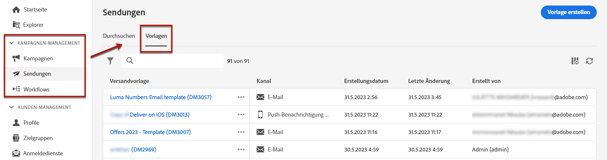

Es werden alle Vorlagen angezeigt, die in der aktuellen Umgebung [erstellt wurden](#create-a-delivery-template).

Sie können Inhaltsvorlagen nach Kanälen und Ordnern filtern. Sie können auch erweiterte Filter festlegen, indem Sie eine Regel mit Versandattributen erstellen. [Erfahren Sie mehr über den Regel-Builder](../audience/segment-builder.md)

Um eine Vorlage zu bearbeiten, klicken Sie in der Liste auf das gewünschte Element. Von dort aus:

* Können Sie den Inhalt, die Eigenschaften, die Zielgruppe und alle damit verbundenen Angebote ändern.
* Können Sie Ihre Vorlage auch testen. [Weitere Informationen](#test-template)

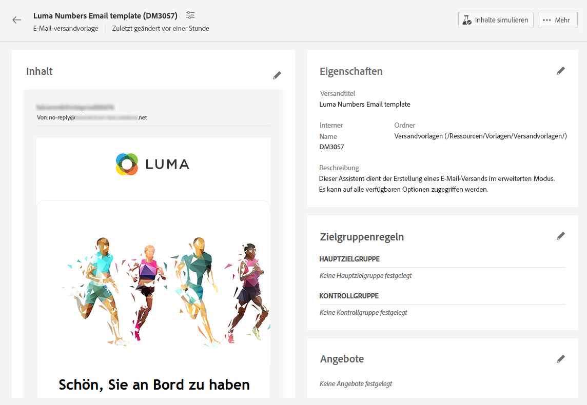

Zum Löschen oder [Duplizieren](#copy-an-existing-template) eine Vorlage, wählen Sie die entsprechende Aktion aus dem Menü **[!UICONTROL Mehr Aktionen]**, entweder über das Menü **[!UICONTROL Vorlagenliste]** oder von einem Bildschirm zur Vorlagenbearbeitung aus.

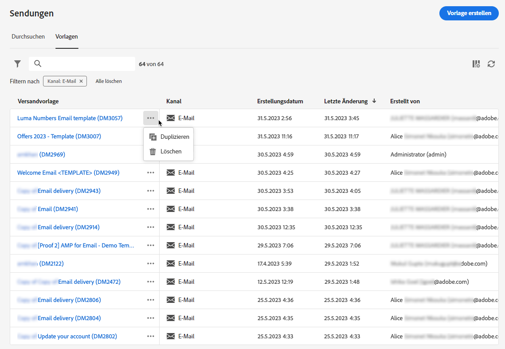

>[!NOTE]
>
>Wenn eine Vorlage bearbeitet oder gelöscht wird, sind die mit dieser Vorlage bereits erstellten Sendungen nicht betroffen.

## Erstellen einer Versandvorlage {#create-a-delivery-template}

Um eine Versandvorlage zu erstellen, haben Sie folgende Möglichkeiten:
* Duplizieren einer vorhandenen Vorlage: [Weitere Infos](#copy-an-existing-template)
* Konvertieren eines bestehenden Versands in eine Vorlage: [Weitere Infos](#convert-an-existing-delivery)
* Erstellen einer neuen Versandvorlage: [Weitere Infos](#create-a-new-template)

### Vorhandene Versandvorlage duplizieren {#copy-an-existing-template}

Campaign verfügt über eine Reihe integrierter Vorlagen für jeden Kanal: E-Mail, Push und SMS. Die einfachste Möglichkeit, eine Versandvorlage zu erstellen, besteht darin, eine integrierte Vorlage zu duplizieren und anzupassen.

>[!NOTE]
>
>Sie können auch jede benutzerdefinierte Vorlage duplizieren.

Gehen Sie wie folgt vor, um eine Versandvorlage zu duplizieren:

1. Navigieren Sie über das Menü **Sendungen** auf der linken Seite zur Registerkarte **Vorlagen**. [Weitere Informationen](#access-manage-templates)
1. Klicken Sie auf die Schaltfläche **[!UICONTROL Mehr Aktionen]** rechts neben dem gewünschten Vorlagennamen und wählen Sie **[!UICONTROL Duplizieren]**.

   Sie können auch eine Vorlage aus der Liste auswählen und diese Option im Bildschirm zur Vorlagenbearbeitung auswählen.

1. Bestätigen Sie die Duplizierung.

   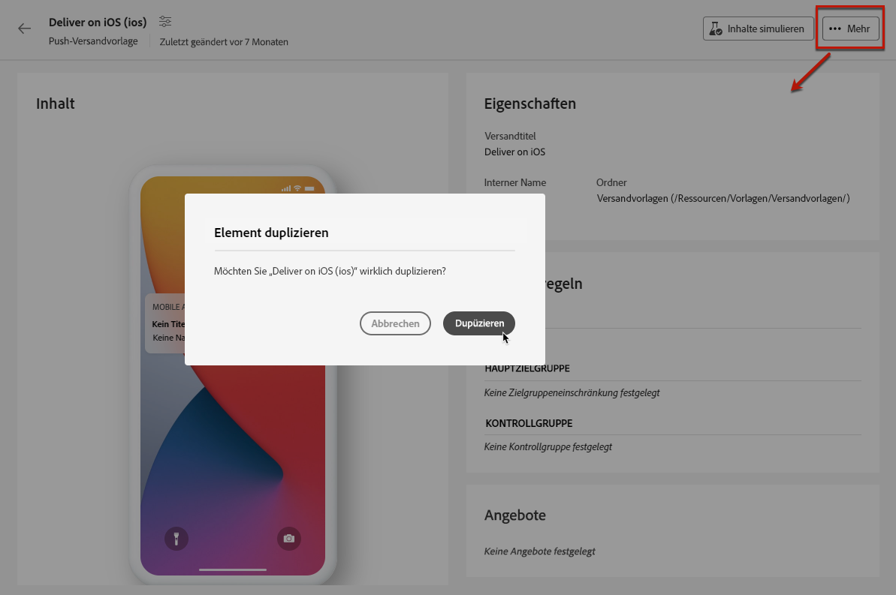

1. Das Dashboard der neuen Vorlage wird nun im mittleren Bereich des Bildschirms geöffnet. Bearbeiten Sie die Vorlageneinstellungen nach Bedarf.

   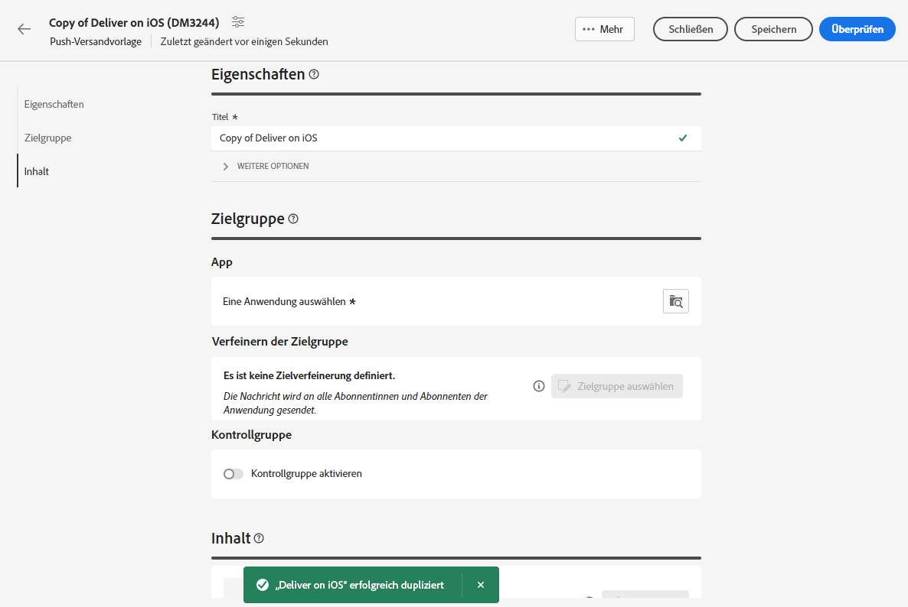

1. Klicken Sie auf die Schaltfläche **[!UICONTROL Überprüfen]** zum Speichern und Überprüfen Ihrer Vorlage. Sie können weiterhin alle Einstellungen bearbeiten, löschen und duplizieren.

   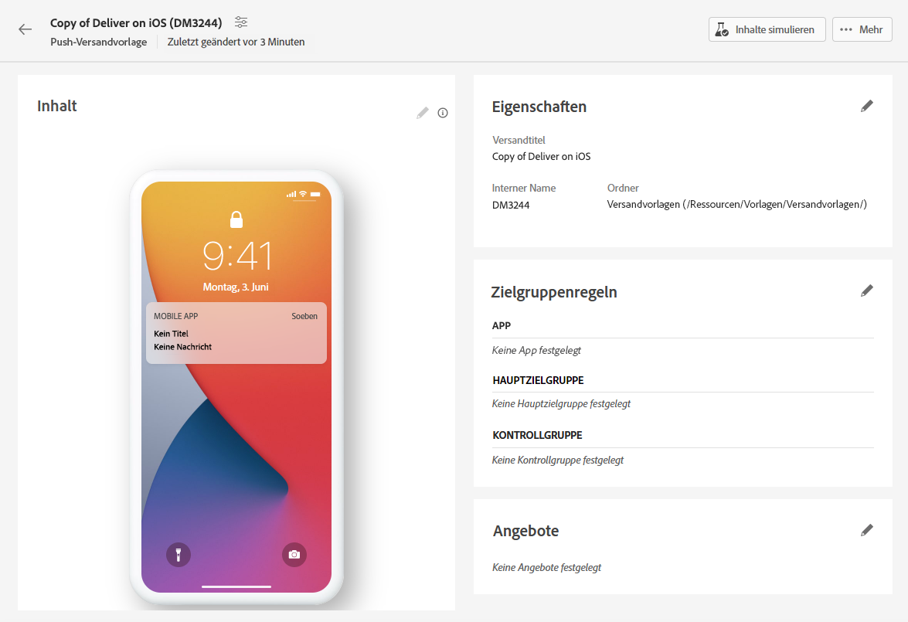

1. Testen Sie bei Bedarf das Rendering der Vorlagen. [Weitere Informationen](#test-template)

Die neue Vorlage wird der Liste [**Vorlagen** hinzugefügt](#access-manage-templates). Sie können sie jetzt bei der Erstellung eines neuen Versands auswählen.

### Konvertieren eines Versands in eine Vorlage {#convert-an-existing-delivery}

Jeder Versand kann in eine Vorlage für zukünftige, wiederholte Versandaktionen umgewandelt werden.

Um einen Versand als Vorlage zu speichern, gehen Sie wie folgt vor:

1. Navigieren Sie zum Menü **[!UICONTROL Kampagnenverwaltung]** > **[!UICONTROL Sendungen]**.
1. Klicken Sie auf der Registerkarte **[!UICONTROL Durchsuchen]** auf die Schaltfläche **[!UICONTROL Mehr Aktionen]** rechts neben dem Namen des gewünschten Versands und wählen Sie **[!UICONTROL Als Vorlage kopieren]**.

   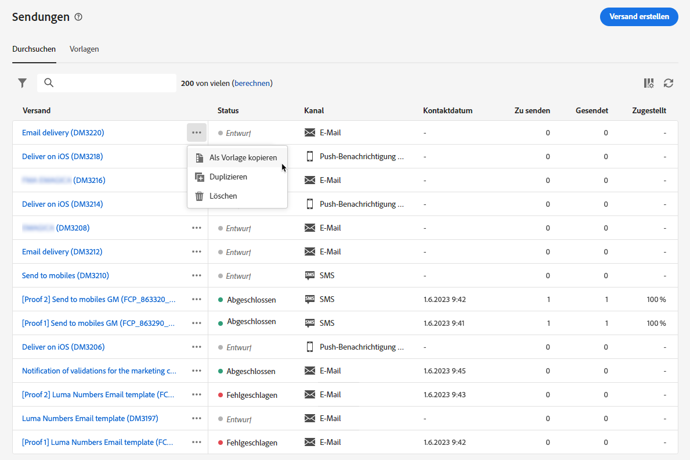

1. Bestätigen Sie die Duplizierung.

1. Das Dashboard der neuen Vorlage wird nun im mittleren Bereich des Bildschirms geöffnet. Bearbeiten Sie die Vorlageneinstellungen nach Bedarf.

1. Klicken Sie auf die Schaltfläche **[!UICONTROL Überprüfen]** zum Speichern und Überprüfen Ihrer Vorlage. Sie können weiterhin alle Einstellungen bearbeiten, löschen und duplizieren.

1. Testen Sie bei Bedarf das Rendering der Vorlagen. [Weitere Informationen](#test-template)

Die neue Vorlage wird der Liste [**Vorlagen** hinzugefügt](#access-manage-templates). Sie können sie jetzt bei der Erstellung eines neuen Versands auswählen.

### Neue Versandvorlage erstellen {#create-a-new-template}

>[!NOTE]
>
>Zur Vermeidung von Konfigurationsfehlern wird empfohlen, keine neuen Vorlagen zu erstellen, sondern [eine integrierte Vorlage zu duplizieren](#copy-an-existing-template) und die Eigenschaften je nach Bedarf anzupassen.

Gehen Sie wie folgt vor, um eine Versandvorlage von Grund auf zu konfigurieren:

1. Navigieren Sie über das Menü **Sendungen** auf der linken Seite zur Registerkarte **Vorlagen**. [Weitere Informationen](#access-manage-templates)
1. Klicken Sie auf die Schaltfläche **[!UICONTROL Vorlage erstellen]**.

   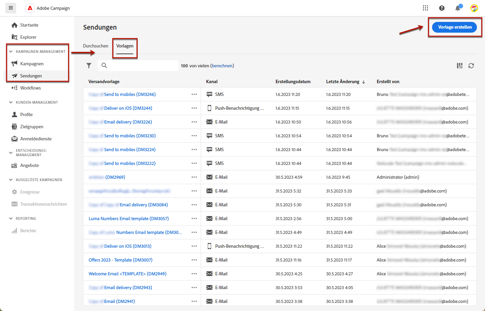

1. Wählen Sie den Kanal aus, den Sie für Ihre Vorlage verwenden möchten.
1. Standardmäßig wird die integrierte Versandvorlage für diesen Kanal verwendet, um Sie bei der Erstellung Ihrer eigenen Vorlage zu unterstützen. Verwenden Sie die dedizierte Schaltfläche rechts neben dem ausgewählten Kanal, um bei Bedarf eine andere Vorlage auszuwählen.

   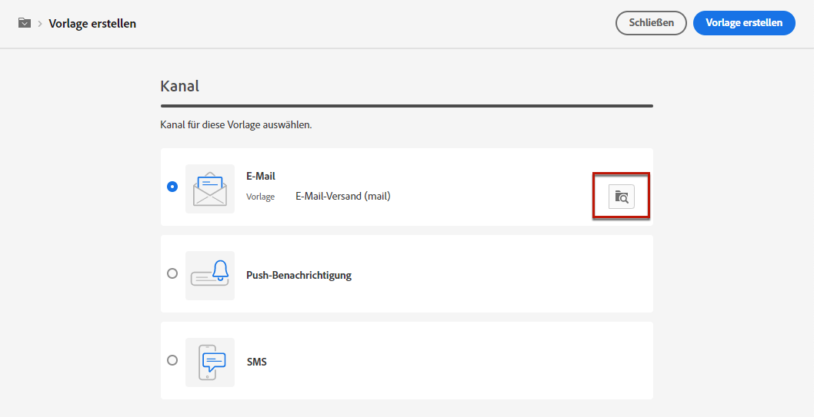

1. Klicken Sie erneut auf die Schaltfläche **[!UICONTROL Vorlage erstellen]**.

1. Definieren Sie die Vorlageneigenschaften, die [Zielgruppe](../audience/add-audience.md) und den Inhalt je nach ausgewähltem Kanal.

   >[!NOTE]
   >
   >In den folgenden Abschnitten erfahren Sie mehr über Versandkanäle und darüber, wie Sie entsprechende Inhalte erstellen:
   >
   > * [E-Mail-Kanal](../email/create-email.md)
   > * [Push-Benachrichtigungs-Kanal](../push/gs-push.md)
   > * [SMS-Kanal](../sms/create-sms.md)

1. Für E-Mail-Vorlagen sind darüber hinaus erweiterte Einstellungen wie Typologieregeln und Zielgruppen-Mappings über die **[!UICONTROL Einstellungen]** Schaltfläche oben rechts im Bildschirm. [Weitere Informationen](../advanced-settings/delivery-settings.md)

1. Klicken Sie auf die Schaltfläche **[!UICONTROL Überprüfen]** zum Speichern und Überprüfen Ihrer Vorlage. Sie können weiterhin alle Einstellungen bearbeiten, löschen und duplizieren.

1. Testen Sie bei Bedarf das Rendering der Vorlagen. [Weitere Informationen](#test-template)

Die neue Vorlage wird der Liste [**Vorlagen** hinzugefügt](#access-manage-templates). Sie können sie jetzt bei der Erstellung eines neuen Versands auswählen.

## Testen einer Versandvorlage {#test-template}

Sie können das Rendering einer beliebigen Versandvorlage testen, unabhängig davon, ob diese von Grund auf neu oder aus einem existierenden Inhalt erstellt wurde. Gehen Sie dazu wie folgt vor.

1. Wechseln Sie über das Menü **[!UICONTROL Kampagnenverwaltung]** > **[!UICONTROL Sendungen]** zur Registerkarte **Vorlagen** und wählen Sie eine Vorlage aus. [Weitere Informationen](#access-manage-templates)

1. Klicken Sie auf **[!UICONTROL Inhalt simulieren]** rechts oben auf dem Bildschirm.

   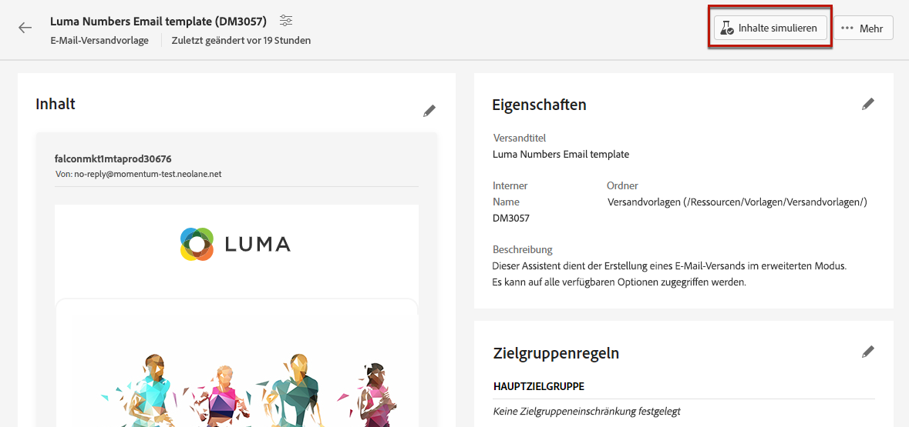

1. Wählen Sie ein oder mehrere Testprofile aus, um Ihr E-Mail-Rendering zu überprüfen. Sie können auch echte Profile aus Ihrer Datenbank auswählen.

1. Wechseln Sie zwischen den verschiedenen Profilen, um eine personalisierte Darstellung der Nachricht entsprechend dem ausgewählten Profil zu erhalten.

   <!--[Learn more on test profiles](../preview-test/test-deliveries.md#recipients)-->

   Sie können auch den Zoom-Faktor anpassen und die Desktop- oder Mobilansicht auswählen.

   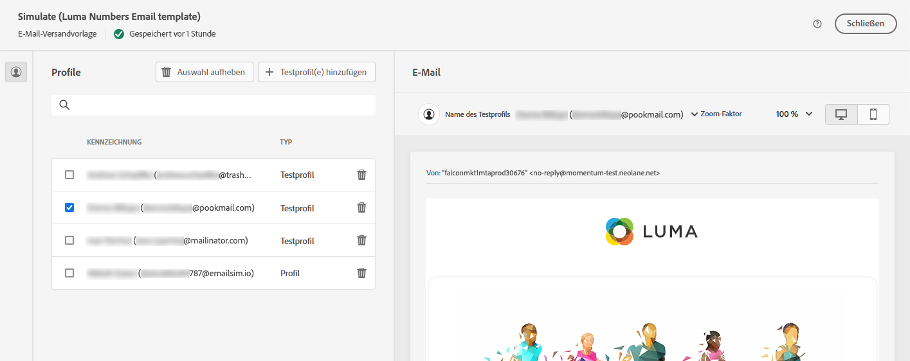

1. Schließen Sie das Fenster, um zum Bildschirm für die Vorlagenbearbeitung zurückzukehren.

>[!NOTE]
>
>Sie können in einer Versandvorlage kein E-Mail-Rendering verwenden und keine Testsendungen durchführen.

* [Weitere Informationen zur Vorschau von E-Mail-Inhalten](../preview-test/preview-content.md)

* [Weitere Informationen zur Vorschau von SMS-Inhalten](../sms/content-sms.md)

* [Weitere Informationen zur Vorschau von Push-Inhalten](../push/gs-push.md)

