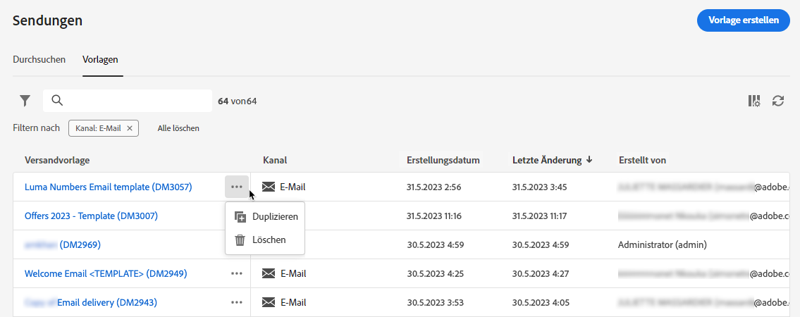
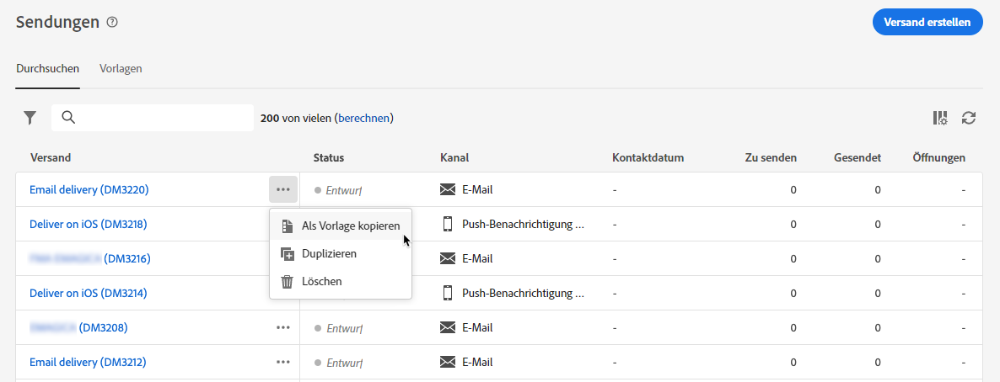
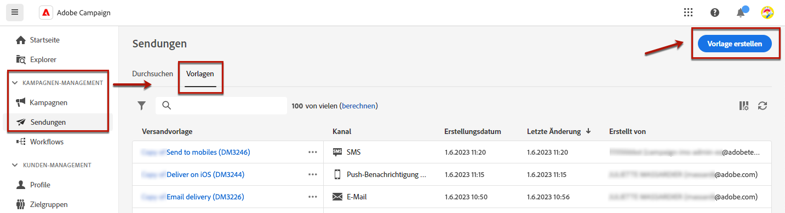

# Arbeiten mit Versandvorlagen {#work-with-delivery-templates}

Für einen beschleunigten und verbesserten Designprozess können Sie Versandvorlagen erstellen, um benutzerdefinierte Inhalte in allen Ihren Kampagnen einfach wiederzuverwenden. Mit dieser Funktion können Sie das kreative Erscheinungsbild standardisieren, um Kampagnen schneller ausführen und starten zu können.

Eine Vorlage kann Folgendes enthalten:

* [Typologien](../advanced-settings/delivery-settings.md#typology)
* Absenderadresse
* Ein [audience](../audience/about-audiences.md), einschließlich [Kontrollgruppen](../audience/control-group.md)
* Benutzerdefiniert [content](../content/edit-content.md)
* [Personalisierte Felder](../personalization/personalize.md) und [Bedingter Inhalt](../personalization/conditions.md)
* Links zu [Mirrorseite](../content/mirror-page.md) und Abmeldung [links](../content/message-tracking.md)
* Andere Versandeigenschaften, z. B. die Gültigkeit der Ressource, die Parameter für erneute Versuche oder die Quarantäneeinstellungen.

## Zugreifen auf und Verwalten von Vorlagen {#access-manage-templates}

>[!CONTEXTUALHELP]
>id="acw_delivery_templates"
>title="Arbeiten mit Versandvorlagen"
>abstract="Verwenden Sie Versandvorlagen, um Ihre bestehenden Sendungen mühelos für die zukünftige Verwendung zu erstellen und zu speichern."
>additional-url="https://experienceleague.adobe.com/docs/campaign-web/v8/msg/delivery-template.html#copy-an-existing-template" text="Duplizieren einer bestehenden Vorlage"
>additional-url="https://experienceleague.adobe.com/docs/campaign-web/v8/msg/delivery-template.html#convert-an-existing-delivery" text="Konvertieren eines Versands in eine Vorlage"

Um auf die Liste der Inhaltsvorlagen zuzugreifen, wählen Sie **[!UICONTROL Campaign Management]** > **[!UICONTROL Sendungen]** aus dem linken Menü und navigieren Sie zum **Vorlagen** Registerkarte.

Alle Vorlagen, die [created](#create-a-delivery-template) in der aktuellen Umgebung angezeigt.

Sie können Inhaltsvorlagen nach Kanälen und Ordnern filtern. Sie können auch erweiterte Filter festlegen, indem Sie eine Regel mithilfe von Versandattributen erstellen. [Weitere Informationen zum Regel-Builder](../audience/segment-builder.md)

Um eine Vorlage zu bearbeiten, klicken Sie in der Liste auf das gewünschte Element. Von dort aus:

* Sie können den Inhalt, die Eigenschaften, die Zielgruppe und alle damit verbundenen Angebote ändern.
* Sie können Ihre Vorlage auch testen. [Weitere Informationen](#test-template)

Löschen oder [Duplikat](#copy-an-existing-template) eine Vorlage, wählen Sie die entsprechende Aktion aus der **[!UICONTROL Mehr Aktionen]** Menü, entweder über das Menü **[!UICONTROL Vorlagen]** Liste oder von einem Vorlagenbearbeitungsbildschirm aus.

>[!NOTE]
>
>Wenn eine Vorlage bearbeitet oder gelöscht wird, sind die mit dieser Vorlage erstellten Sendungen nicht betroffen.

## Erstellen einer Vorlage {#create-a-delivery-template}

Um eine Versandvorlage zu erstellen, haben Sie folgende Möglichkeiten:
* Vorhandene Vorlage duplizieren - [Weitere Infos](#copy-an-existing-template)
* Einen bestehenden Versand in eine Vorlage konvertieren - [Weitere Infos](#convert-an-existing-delivery)
* Erstellen Sie eine neue Versandvorlage - [Weitere Infos](#create-a-new-template)

### Duplizieren einer bestehenden Vorlage {#copy-an-existing-template}

Campaign verfügt über eine Reihe integrierter Vorlagen für jeden Kanal: E-Mail, Push, SMS. Die einfachste Möglichkeit, eine Versandvorlage zu erstellen, besteht darin, eine integrierte Vorlage zu duplizieren und anzupassen.

>[!NOTE]
>
>Sie können auch jede benutzerdefinierte Vorlage duplizieren.

Gehen Sie wie folgt vor, um eine Versandvorlage zu duplizieren:

1. Navigieren Sie zum **Vorlagen** auf der Registerkarte **Sendungen** Menü links. [Weitere Informationen](#access-manage-templates)
1. Klicken Sie auf **[!UICONTROL Mehr Aktionen]** rechts neben dem gewünschten Vorlagennamen und wählen Sie  **[!UICONTROL Duplizieren]**.

   Sie können auch eine Vorlage aus der Liste auswählen und diese Option im Bildschirm zur Vorlagenbearbeitung auswählen.

1. Duplizierung bestätigen.

   

1. Das neue Vorlagen-Dashboard wird im mittleren Bereich des Bildschirms geöffnet. Bearbeiten Sie die Vorlageneinstellungen nach Bedarf.

   

1. Klicken Sie auf **[!UICONTROL Überprüfen]** zum Speichern und Überprüfen Ihrer Vorlage. Sie können weiterhin alle Einstellungen bearbeiten, löschen und duplizieren.

   

1. Testen Sie bei Bedarf das Vorlagen-Rendering. [Weitere Informationen](#test-template)

Die neue Vorlage wird der [**Vorlagen** Liste](#access-manage-templates). Sie können sie jetzt bei der Erstellung eines neuen Versands auswählen.

### Konvertieren eines Versands in eine Vorlage {#convert-an-existing-delivery}

Jeder Versand kann für künftige wiederholte Versandaktionen in eine Vorlage umgewandelt werden.

Gehen Sie wie folgt vor, um einen Versand als Vorlage zu speichern:

1. Navigieren Sie zu **[!UICONTROL Kampagnenverwaltung]** > **[!UICONTROL Sendungen]** Menü.
1. Aus dem **[!UICONTROL Durchsuchen]** klicken Sie auf die **[!UICONTROL Mehr Aktionen]** auf der rechten Seite des gewünschten Versandnamens und wählen Sie **[!UICONTROL Als Vorlage kopieren]**.

   

1. Duplizierung bestätigen.

1. Das neue Vorlagen-Dashboard wird im mittleren Bereich des Bildschirms geöffnet. Bearbeiten Sie die Vorlageneinstellungen nach Bedarf.

1. Klicken Sie auf **[!UICONTROL Überprüfen]** zum Speichern und Überprüfen Ihrer Vorlage. Sie können weiterhin alle Einstellungen bearbeiten, löschen und duplizieren.

1. Testen Sie bei Bedarf das Vorlagen-Rendering. [Weitere Informationen](#test-template)

Die neue Vorlage wird der [**Vorlagen** Liste](#access-manage-templates). Sie können sie jetzt bei der Erstellung eines neuen Versands auswählen.

### Erstellen einer neuen Vorlage {#create-a-new-template}

>[!NOTE]
>
>Zur Vermeidung von Konfigurationsfehlern wird empfohlen, keine neuen Vorlagen zu erstellen, sondern [eine integrierte Vorlage zu duplizieren](#copy-an-existing-template) und die Eigenschaften je nach Bedarf anzupassen.

Gehen Sie wie folgt vor, um eine Versandvorlage von Grund auf zu konfigurieren:

1. Navigieren Sie zum **Vorlagen** auf der Registerkarte **Sendungen** Menü links. [Weitere Informationen](#access-manage-templates)
1. Klicken Sie auf **[!UICONTROL Vorlage erstellen]** Schaltfläche.

   

1. Wählen Sie den Kanal aus, den Sie für Ihre Vorlage verwenden möchten.
1. Die integrierte Versandvorlage für diesen Kanal wird standardmäßig verwendet, um Sie bei der Erstellung Ihrer eigenen Vorlage zu unterstützen. Verwenden Sie die dedizierte Schaltfläche rechts neben dem ausgewählten Kanal, um bei Bedarf eine andere Vorlage auszuwählen.

   

1. Klicken Sie auf **[!UICONTROL Vorlage erstellen]** erneut.

1. Definieren Sie die Vorlageneigenschaften, [audience](../audience/add-audience.md) und Inhalt abhängig vom ausgewählten Kanal.

   >[!NOTE]
   >
   >In den folgenden Abschnitten erfahren Sie mehr über Versandkanäle und wie Sie entsprechende Inhalte erstellen:
   >
   > * [E-Mail-Kanal](../email/create-email.md)
   > * [Push-Benachrichtigungskanal](../push/gs-push.md)
   > * [SMS-Kanal](../sms/create-sms.md)

1. Klicken Sie auf **[!UICONTROL Überprüfen]** zum Speichern und Überprüfen Ihrer Vorlage. Sie können weiterhin alle Einstellungen bearbeiten, löschen und duplizieren.

1. Testen Sie bei Bedarf das Vorlagen-Rendering. [Weitere Informationen](#test-template)

Die neue Vorlage wird der [**Vorlagen** Liste](#access-manage-templates). Sie können sie jetzt bei der Erstellung eines neuen Versands auswählen.

## Versandvorlage testen {#test-template}

Sie können das Rendering einer beliebigen Versandvorlage testen, unabhängig davon, ob diese von Grund auf neu oder aus einem existierenden Inhalt erstellt wurde. Gehen Sie dazu wie folgt vor.

1. Navigieren Sie zum **Vorlagen** durch die **[!UICONTROL Kampagnenverwaltung]** > **[!UICONTROL Sendungen]** und wählen Sie eine beliebige Vorlage aus. [Weitere Informationen](#access-manage-templates)

1. Klicken Sie auf **[!UICONTROL Inhalt simulieren]** rechts oben auf dem Bildschirm.

   

1. Wählen Sie ein oder mehrere Testprofile aus, um Ihr E-Mail-Rendering zu überprüfen. Sie können auch echte Profile aus Ihrer Datenbank auswählen.

1. Zwischen den verschiedenen Profilen wechseln, um eine personalisierte Darstellung der Nachricht entsprechend dem ausgewählten Profil zu erhalten.

   <!--[Learn moreon test profiles](../preview-test/proofs.md#recipients)-->

   Sie können auch den Zoomfaktor anpassen und die Desktop- oder Mobilansicht auswählen.

   

1. Schließen Sie das Fenster, um zum Bildschirm zur Vorlagenbearbeitung zurückzukehren.

>[!NOTE]
>
>Sie können in einer Versandvorlage kein E-Mail-Rendering verwenden oder keine Testsendungen durchführen.

* [Weitere Informationen zur Vorschau von E-Mail-Inhalten](../preview-test/preview-content.md)

* [Weiterführende Informationen zur Vorschau von SMS-Inhalten](../sms/content-sms.md)

* [Weitere Informationen zur Vorschau von Push-Inhalten](../push/gs-push.md)

