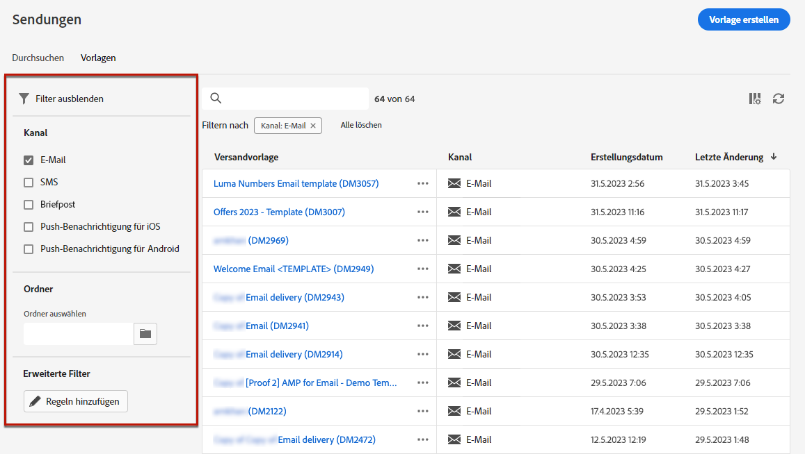
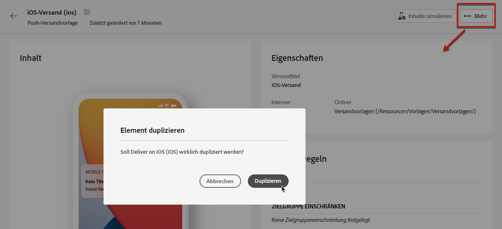

# Verwenden von Versandvorlagen {#work-with-delivery-templates}

>[!CONTEXTUALHELP]
>id="acw_delivery_template_for_campaign"
>title="Versandvorlagen"
>abstract="Erstellen Sie Versandvorlagen, um benutzerdefinierte Inhalte und Einstellungen in Ihren Kampagnen wiederzuverwenden und so den Design-Prozess zu beschleunigen und zu verbessern. Diese Funktion standardisiert das kreative Look-and-Feel, wodurch Kampagnen schneller gestartet und ausgeführt werden können."

Erstellen Sie Versandvorlagen, um benutzerdefinierte Inhalte und Einstellungen in Ihren Kampagnen wiederzuverwenden und so den Design-Prozess zu beschleunigen und zu verbessern. Diese Funktion standardisiert das kreative Look-and-Feel, wodurch Kampagnen schneller gestartet und ausgeführt werden können.

Eine Vorlage enthält:

* Den **Ordner** und den **Ausführungsordner** der Vorlage. Der Ordner ist der Speicherort, an dem die Versandvorlage gespeichert wird. Der Ausführungsordner ist der Ordner, in dem die Sendungen gespeichert werden, die auf dieser Vorlage basieren.
* [Typologien](../advanced-settings/delivery-settings.md#typology),
* die Absenderadresse,
* eine [Zielgruppe](../audience/about-recipients.md), einschließlich [Kontrollgruppen](../audience/control-group.md),
* benutzerdefinierte [Inhalte](../email/edit-content.md),
* [personalisierte Felder](../personalization/personalize.md) und [bedingte Inhalte](../personalization/conditions.md),
* Links zur [Mirrorseite](../email/mirror-page.md) und [Links](../email/message-tracking.md) zur Abmeldung,
* Andere Versandeigenschaften, z. B. die Gültigkeit der Ressource, die Parameter für erneute Zustellversuche oder die Quarantäneeinstellungen.

>[!NOTE]
>
>Versandvorlagen unterscheiden sich von [Inhaltsvorlagen](../content/create-email-templates.md) darin, dass Sie in letzteren nur den Inhalt Ihrer E-Mails wiederverwenden und Inhalte nur anhand einer der vordefinierten E-Mail-Mustervorlagen erstellen können

## Aufrufen und Verwalten von Versandvorlagen {#access-manage-templates}

>[!CONTEXTUALHELP]
>id="acw_delivery_templates"
>title="Arbeiten mit Versandvorlagen"
>abstract="Verwenden Sie Versandvorlagen, um Versandeinstellungen zu erstellen und zu speichern, damit Sie sie in zukünftigen Kampagnen verwenden können. Erstellen Sie Versandvorlagen von Grund auf neu, duplizieren Sie existierende Vorlagen oder konvertieren Sie einen Versand in eine Vorlage."

Um auf die Liste der Inhaltsvorlagen zuzugreifen, wählen Sie aus dem linken Menü **[!UICONTROL Kampagnenverwaltung]** > **[!UICONTROL Sendungen]** und wechseln Sie zur Registerkarte **Vorlagen**.

{zoomable="yes"}

Es werden alle in der aktuellen Umgebung erstellten Vorlagen angezeigt.

Sie können Inhaltsvorlagen nach Kanälen und Ordnern filtern. Sie können auch erweiterte Filter festlegen, indem Sie eine Regel mit Versandattributen erstellen. [Weitere Informationen über den Abfrage-Modeler](../audience/../query/query-modeler-overview.md)

{zoomable="yes"}

Um eine Vorlage zu bearbeiten, klicken Sie in der Liste auf das gewünschte Element. Von dort aus:

* Ändern Sie den Inhalt, die Eigenschaften, die Zielgruppe und alle damit verbundenen Angebote.
* Testen Sie Ihre Vorlage. [Weitere Informationen](#test-template)

{zoomable="yes"}

Zum Löschen oder [Duplizieren](#copy-an-existing-template) einer Vorlage wählen Sie die entsprechende Aktion aus dem Menü **[!UICONTROL Mehr Aktionen]**, entweder über das Menü **[!UICONTROL Vorlagenliste]** oder von einem Bildschirm zur Vorlagenbearbeitung aus.

{zoomable="yes"}

>[!NOTE]
>
>Wenn eine Vorlage bearbeitet oder gelöscht wird, sind die mit dieser Vorlage bereits erstellten Sendungen nicht betroffen.

## Erstellen einer Versandvorlage {#create-a-delivery-template}

Um eine Versandvorlage zu erstellen, haben Sie folgende Möglichkeiten:

* Duplizieren einer vorhandenen Vorlage: [Weitere Infos](#copy-an-existing-template)
* Konvertieren eines bestehenden Versands in eine Vorlage: [Weitere Infos](#convert-an-existing-delivery)
* Erstellen einer neuen Versandvorlage: [Weitere Infos](#create-a-new-template)

### Duplizieren einer vorhandene Versandvorlage {#copy-an-existing-template}

Campaign umfasst eine Reihe integrierter Vorlagen für jeden Kanal: E-Mail, Push und SMS. Die einfachste Möglichkeit, eine Versandvorlage zu erstellen, besteht darin, eine integrierte Vorlage zu duplizieren und anzupassen.

>[!NOTE]
>
>Sie können auch jede benutzerdefinierte Vorlage duplizieren.

Gehen Sie wie folgt vor, um eine Versandvorlage zu duplizieren:

1. Navigieren Sie über das Menü **Sendungen** auf der linken Seite zur Registerkarte **Vorlagen**. [Weitere Informationen](#access-manage-templates)
1. Klicken Sie auf die Schaltfläche **[!UICONTROL Mehr Aktionen]** rechts neben dem gewünschten Vorlagennamen und wählen Sie **[!UICONTROL Duplizieren]**.

   Sie können auch eine Vorlage aus der Liste auswählen und diese Option im Bildschirm zur Vorlagenbearbeitung auswählen.

1. Bestätigen Sie die Duplizierung.

   {zoomable="yes"}

1. Das Dashboard der neuen Vorlage wird nun im mittleren Bereich des Bildschirms geöffnet. Bearbeiten Sie die Vorlageneinstellungen nach Bedarf.

   {zoomable="yes"}

1. Klicken Sie auf die Schaltfläche **[!UICONTROL Überprüfen]** zum Speichern und Überprüfen Ihrer Vorlage. Sie können weiterhin alle Einstellungen bearbeiten, löschen und duplizieren.

   {zoomable="yes"}

1. Testen Sie bei Bedarf das Rendering der Vorlagen. [Weitere Informationen](#test-template)

Die neue Vorlage wird der Liste [**Vorlagen** hinzugefügt](#access-manage-templates). Sie können sie jetzt bei der Erstellung eines neuen Versands auswählen.

### Konvertieren eines Versands in eine Vorlage {#convert-an-existing-delivery}

Jeder Versand kann in eine Vorlage für zukünftige, wiederholte Versandaktionen umgewandelt werden.

Um einen Versand als Vorlage zu speichern, gehen Sie wie folgt vor:

1. Navigieren Sie zum Menü **[!UICONTROL Kampagnenverwaltung]** > **[!UICONTROL Sendungen]**.
1. Klicken Sie auf der Registerkarte **[!UICONTROL Durchsuchen]** auf die Schaltfläche **[!UICONTROL Mehr Aktionen]** rechts neben dem Namen des gewünschten Versands und wählen Sie **[!UICONTROL Als Vorlage kopieren]** aus.

   {zoomable="yes"}

   Sie können auch eine Vorlage aus der Liste auswählen und diese Option im Bildschirm zur Vorlagenbearbeitung auswählen.

1. Bestätigen Sie die Duplizierung.

1. Das Dashboard der neuen Vorlage wird nun im mittleren Bereich des Bildschirms geöffnet. Bearbeiten Sie die Vorlageneinstellungen nach Bedarf.

1. Klicken Sie auf die Schaltfläche **[!UICONTROL Überprüfen]** zum Speichern und Überprüfen Ihrer Vorlage. Sie können weiterhin alle Einstellungen bearbeiten, löschen und duplizieren.

1. Testen Sie bei Bedarf das Rendering der Vorlagen. [Weitere Informationen](#test-template)

Die neue Vorlage wird der Liste [**Vorlagen** hinzugefügt](#access-manage-templates). Sie können sie jetzt bei der Erstellung eines neuen Versands auswählen.

### Erstellen einer neuen Versandvorlage {#create-a-new-template}

>[!NOTE]
>
>Zur Vermeidung von Konfigurationsfehlern empfiehlt Adobe, keine neuen Vorlagen zu erstellen, sondern [eine integrierte Vorlage zu duplizieren](#copy-an-existing-template) und die Eigenschaften je nach Bedarf anzupassen.

Gehen Sie wie folgt vor, um eine Versandvorlage von Grund auf zu konfigurieren:

1. Navigieren Sie über das Menü **Sendungen** auf der linken Seite zur Registerkarte **Vorlagen**. [Weitere Informationen](#access-manage-templates)
1. Klicken Sie auf die Schaltfläche **[!UICONTROL Vorlage erstellen]**.

   {zoomable="yes"}

1. Wählen Sie den Kanal aus, den Sie für Ihre Vorlage verwenden möchten.
1. Standardmäßig wird die integrierte Versandvorlage für diesen Kanal verwendet, um Sie bei der Erstellung Ihrer eigenen Vorlage zu unterstützen. Verwenden Sie die dedizierte Schaltfläche rechts neben dem ausgewählten Kanal, um bei Bedarf eine andere Vorlage auszuwählen.

   {zoomable="yes"}

1. Klicken Sie erneut auf die Schaltfläche **[!UICONTROL Vorlage erstellen]**.

1. Definieren Sie die Vorlageneigenschaften, die [Zielgruppe](../audience/add-audience.md) und den Inhalt je nach ausgewähltem Kanal.

   >[!NOTE]
   >
   >In den folgenden Abschnitten erfahren Sie mehr über Versandkanäle und darüber, wie Sie entsprechende Inhalte erstellen:
   >
   > * [E-Mail-Kanal](../email/create-email.md)
   > * [Push-Benachrichtigungs-Kanal](../push/gs-push.md)
   > * [SMS-Kanal](../sms/create-sms.md)

1. Darüber hinaus können sind für E-Mail-Vorlagen erweiterte Einstellungen wie Typologieregeln und Zielgruppen-Mappings über die Schaltfläche **[!UICONTROL Einstellungen]** oben rechts im Bildschirm zugänglich. [Weitere Informationen](../advanced-settings/delivery-settings.md)

1. Klicken Sie auf die Schaltfläche **[!UICONTROL Überprüfen]** zum Speichern und Überprüfen Ihrer Vorlage. Sie können weiterhin alle Einstellungen bearbeiten, löschen und duplizieren.

1. Testen Sie bei Bedarf das Rendering der Vorlagen. [Weitere Informationen](#test-template)

Die neue Vorlage wird der Liste [**Vorlagen** hinzugefügt](#access-manage-templates). Sie können sie jetzt bei der Erstellung eines neuen Versands auswählen.

## Testen einer Versandvorlage {#test-template}

Sie können das Rendering einer beliebigen Versandvorlage testen, unabhängig davon, ob diese von Grund auf neu oder aus einem existierenden Inhalt erstellt wurde. Gehen Sie dazu wie folgt vor:

1. Wechseln Sie über das Menü **[!UICONTROL Kampagnenverwaltung]** > **[!UICONTROL Sendungen]** zur Registerkarte **Vorlagen** und wählen Sie eine Vorlage aus. [Weitere Informationen](#access-manage-templates)

1. Klicken Sie oben rechts auf dem Bildschirm auf die Schaltfläche **[!UICONTROL Inhalte simulieren]**.

   {zoomable="yes"}

1. Wählen Sie ein oder mehrere Testprofile aus, um Ihr E-Mail-Rendering zu überprüfen. Sie können auch echte Profile aus Ihrer Datenbank auswählen. [Weitere Informationen zu Testprofilen](../audience/test-profiles.md)

1. Wechseln Sie zwischen den verschiedenen Profilen, um eine personalisierte Darstellung der Nachricht entsprechend dem ausgewählten Profil zu erhalten. Sie können auch den Zoomfaktor anpassen und die Desktop- oder Mobilansicht auswählen.

[Weitere Informationen zur Vorschau von Inhalten](../preview-test/preview-content.md)

   {zoomable="yes"}

1. Schließen Sie das Fenster, um zum Bildschirm für die Vorlagenbearbeitung zurückzukehren.

>[!NOTE]
>
>Sie können in einer Versandvorlage kein E-Mail-Rendering verwenden und keine Testsendungen durchführen.