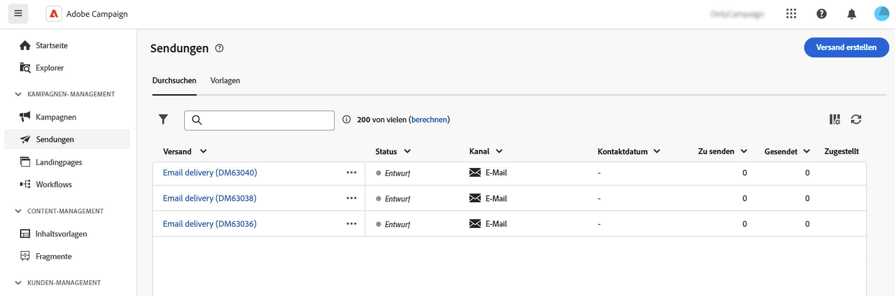
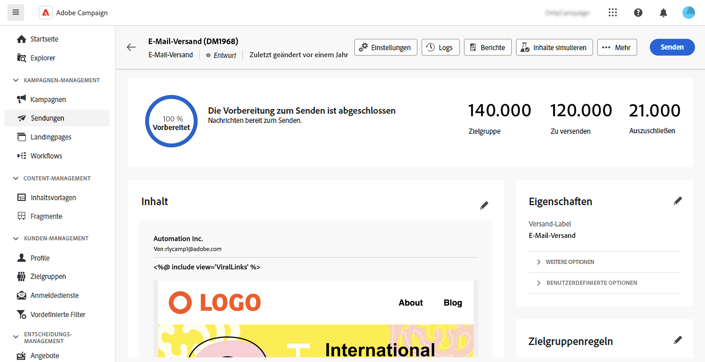
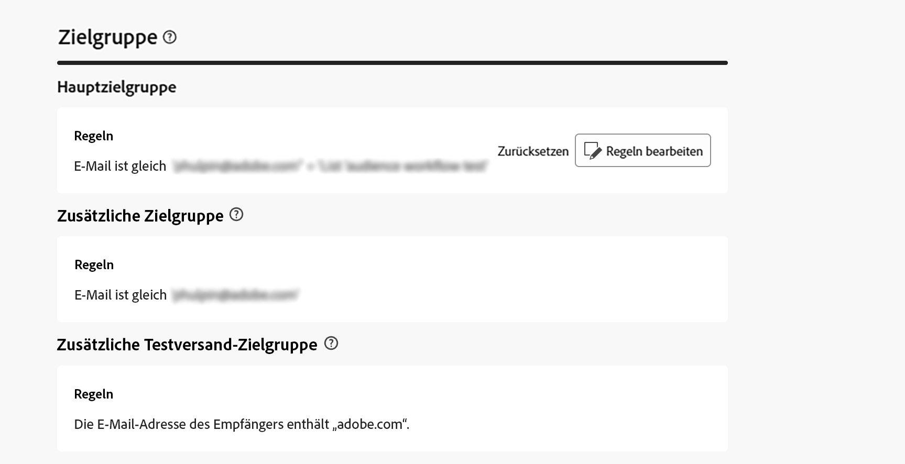

# Zugreifen auf Sendungen {#work-with-deliveries}

>[!CONTEXTUALHELP]
>id="acw_deliveries_list"
>title="Sendungen"
>abstract="Ein Versand ist eine Kommunikation, die an eine Zielgruppe auf einem bestimmten Kanal gesendet wird: E-Mail, SMS oder Push. Auf diesem Bildschirm können vorhandene Sendungen bearbeitet, dupliziert und gelöscht werden. Außerdem können Berichte zu abgeschlossenen Sendungen angezeigt werden. Auf die Schaltfläche **Versand erstellen** klicken, um einen neuen Versand hinzuzufügen."

## Zugreifen auf Sendungen {#access}

>[!CONTEXTUALHELP]
>id="acw_deliveries_additional_target"
>title="Zusätzliche Zielgruppe"
>abstract="Diese Regeln können nur in der Client-Konsole geändert werden."

Auf Sendungen kann über das Menü **[!UICONTROL Sendungen]** im linken Navigationsbereich zugegriffen werden. In dieser Liste werden alle Sendungen angezeigt, die entweder über die Client-Konsole oder die Web-Benutzeroberfläche erstellt wurden. Auf diesem Bildschirm können Sie alle bestehenden Sendungen überwachen, sie duplizieren oder löschen oder neue Sendungen erstellen.

Um einen Versand zu öffnen, klicken Sie in der Liste auf dessen Namen. Der Versand wird geöffnet und ermöglicht die Durchführung verschiedener Aktionen, z. B. die Bearbeitung der Parameter, die Überprüfung der Ausführung oder die Überwachung der Leistung mithilfe spezieller Berichte.

>[!NOTE]
>
>Wenn Sie einen in der Client-Konsole erstellten Versand öffnen, wird möglicherweise der Abschnitt **[!UICONTROL Zusätzliche Zielgruppe]** für die Zielgruppe angezeigt. Dies bedeutet, dass für diesen Versand mehrere Zielgruppen konfiguriert wurden. Diese Parameter können nur in der Konsole geändert werden.
>
>{zoomable="yes"}

## Duplizieren eines Versands {#delivery-duplicate}

Sie können eine Kopie eines bestehenden Versands entweder in der Versandliste oder im Versand-Dashboard erstellen.

Um einen Versand aus der Liste der Sendungen zu duplizieren, gehen Sie wie folgt vor:

1. Klicken Sie auf die Schaltfläche mit den drei Punkten rechts neben dem Namen des zu duplizierenden Versands.
1. Wählen Sie **[!UICONTROL Duplizieren]** aus.
1. Duplizierung bestätigen. Das Dashboard des neuen Versands wird im mittleren Bereich des Bildschirms geöffnet.

Gehen Sie wie folgt vor, um einen Versand über sein Dashboard zu duplizieren:

1. Öffnen Sie den Versand und klicken Sie auf die Schaltfläche **[!UICONTROL …]** im oberen Bereich des Bildschirms.
1. Wählen Sie **[!UICONTROL Duplizieren]** aus.
1. Duplizierung bestätigen. Der neue Versand ersetzt den aktuellen Versand im mittleren Bereich des Bildschirms.

## Löschen eines Versands {#delivery-delete}

Sendungen werden aus der Versandliste gelöscht, entweder aus dem Haupteintrag des Versands in der linken Leiste oder aus der Versandliste einer Kampagne.

Gehen Sie wie folgt vor, um einen Versand aus der Liste der Sendungen zu löschen:

1. Klicken Sie auf die Schaltfläche mit den drei Punkten rechts neben dem Namen des zu löschenden Versands.
1. Wählen Sie **[!UICONTROL Löschen]** aus.
1. Bestätigen Sie den Löschvorgang.

Alle Sendungen sind in diesen Listen verfügbar, Sendungen, die in einem Workflow erstellt wurden, können dort jedoch nicht gelöscht werden. Um einen im Rahmen eines Workflows erstellten Versand zu löschen, löschen Sie die Versandaktivität aus dem Workflow.

Gehen Sie wie folgt vor, um einen Versand aus einem Workflow zu löschen:

1. Versandaktivität auswählen.
1. Klicken Sie **[!UICONTROL rechten Bedienfeld auf]** Löschen“.
1. Bestätigen Sie den Löschvorgang. Wenn der Versand untergeordnete Knoten hat, löschen Sie diese ebenfalls oder behalten Sie sie bei.

