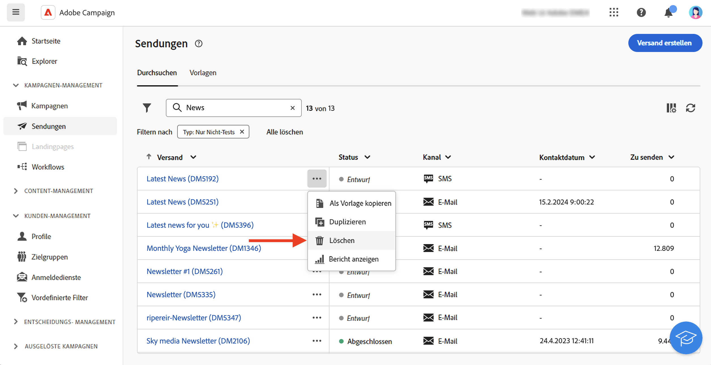

# Arbeiten mit Sendungen {#work-with-deliveries}

>[!CONTEXTUALHELP]
>id="acw_deliveries_list"
>title="Sendungen"
>abstract="Ein Versand ist eine Kommunikation, die an eine Zielgruppe über einen bestimmten Kanal gesendet wird: E-Mail, SMS oder Push-Benachrichtigung. Auf diesem Bildschirm können vorhandene Sendungen bearbeitet, dupliziert und gelöscht werden. Außerdem können Berichte zu abgeschlossenen Sendungen angezeigt werden. Auf die Schaltfläche **Versand erstellen** klicken, um einen neuen Versand hinzuzufügen."

## Erstellen eines Versands {#create-delivery}

Sie können eigenständige Sendungen über das linke Menü **[!UICONTROL Sendungen]** oder im Kontext eines Workflows erstellen, egal ob er in einer Kampagne enthalten ist oder nicht.

Auf den folgenden Registerkarten erfahren Sie, wie Sie einen Versand erstellen:

>[!BEGINTABS]

>[!TAB Erstellen eines eigenständigen Versands]

Gehen Sie wie folgt vor, um einen eigenständigen Versand zu erstellen:

1. Navigieren Sie zum Menü **[!UICONTROL Sendungen]** im linken Navigationsmenü und klicken Sie auf die Schaltfläche **[!UICONTROL Versand erstellen]**.

   {zoomable="yes"}

1. Wählen Sie einen Kanal für den Versand aus. 
1. Definieren Sie die Versandzielgruppe sowohl für die Hauptzielgruppe als auch für die Kontrollgruppe. [Weitere Informationen zu Zielgruppen](../audience/about-recipients.md).

   {zoomable="yes"}{width="70%" align="left"}

1. Definieren Sie den Nachrichteninhalt. Weitere Informationen zu Versandkanälen und zum Definieren von Versandinhalten finden Sie in den folgenden Abschnitten:

   * [E-Mail-Kanal](../email/create-email.md)
   * [Push-Benachrichtigungs-Kanal](../push/gs-push.md)
   * [SMS-Kanal](../sms/create-sms.md)

1. (Optional) Definieren Sie den [Zeitplan](#gs-schedule) für den Versand. Wenn kein Zeitplan definiert ist, werden Nachrichten sofort nach dem Klicken auf die Schaltfläche **[!UICONTROL Senden]** gesendet.
1. Klicken Sie auf die Schaltfläche **[!UICONTROL Überprüfen und senden]**, um Ihre Einstellungen zu überprüfen.
1. Verwenden Sie die Schaltfläche **[!UICONTROL Inhalt simulieren]**, um Ihren Versand und die Personalisierungseinstellungen zu testen. Weitere Informationen zur Simulation von Nachrichten finden Sie in [diesem Abschnitt](../preview-test/preview-test.md).
1. Klicken Sie auf die Schaltfläche **[!UICONTROL Vorbereiten]**, um die Zielgruppen-Population zu berechnen und die Nachrichten zu erstellen. Der Vorbereitungsschritt kann einige Minuten dauern. Nach Abschluss der Vorbereitung sind die Nachrichten versandbereit. Im Falle eines Fehlers können Sie zu den **Protokollen** navigieren, um Benachrichtigungen und Warnungen einzusehen.
1. Überprüfen Sie die Ergebnisse und klicken Sie auf die Schaltfläche **[!UICONTROL Senden]**, um mit dem Senden von Nachrichten zu beginnen.
1. Sobald Nachrichten gesendet wurden, gehen Sie zum Abschnitt **Berichte**, um auf Schlüsselmetriken zuzugreifen. Weitere Informationen zu Versandberichten finden Sie in [diesem Abschnitt](../reporting/delivery-reports.md).

>[!TAB Erstellen eines Versands in einem Workflow]

Gehen Sie wie folgt vor, um einen Versand in einem Workflow zu erstellen:

1. Erstellen Sie einen neuen Workflow oder öffnen Sie einen vorhandenen. [Erfahren Sie mehr über Workflows](../workflows/gs-workflow-creation.md#gs-workflow-steps)
1. Fügen Sie eine Aktivität [**[!UICONTROL Zielgruppe erstellen]**](../workflows/activities/build-audience.md) hinzu und konfigurieren Sie sie. 
1. Klicken Sie auf das `+`-Symbol und wählen Sie eine Versandaktivität aus: **[!UICONTROL E-Mail]**, **[!UICONTROL SMS]**, **[!UICONTROL Push-Benachrichtigung (Android)]** oder **[!UICONTROL Push-Benachrichtigung (iOS)]**. In [diesem Abschnitt](../workflows/activities/channels.md) erfahren Sie mehr über die Versandkanalaktivitäten in einem Workflow und darüber, wie Sie Versandinhalte definieren.

   {zoomable="yes"}

1. Starten Sie den Workflow und überprüfen Sie die Protokolle.

Sie können Sendungen auch in einer Kampagne hinzufügen, ohne einen Workflow zu erstellen. Navigieren Sie dazu zur Registerkarte **[!UICONTROL Sendungen]** Ihrer Kampagne und klicken Sie auf die Schaltfläche **[!UICONTROL Versand erstellen]**.

{zoomable="yes"}

Die Konfigurationsschritte ähneln den Schritten für eigenständige Sendungen.

Weiterführende Informationen zur Konfiguration einer Kampagne und zur Verwaltung von Sendungen einer Kampagne finden Sie in [diesem Abschnitt](../campaigns/gs-campaigns.md).

>[!ENDTABS]

## Hinzufügen von Personalisierung {#personalization}

Nachrichten, die von Adobe Campaign versendet werden, können auf verschiedene Weise personalisiert werden. [Weitere Informationen zu Personalisierungsfunktionen](../personalization/gs-personalization.md)

Verwenden Sie Campaign, um dynamische Inhalte zu erstellen und personalisierte Nachrichten zu versenden. Personalisierungsfunktionen können kombiniert werden, um Ihre Nachrichten zu verbessern und ein individuelles Benutzererlebnis zu schaffen.

Sie können den Nachrichteninhalt wie folgt personalisieren:

* Einfügen von dynamischen **Personalisierungsfeldern**

  Personalisierungsfelder werden für die oberste Ebene der Nachrichtenpersonalisierung verwendet. Sie können jedes in der Datenbank verfügbare Feld aus dem Personalisierungseditor auswählen. Für einen Versand können Sie jedes Feld auswählen, das sich auf die Empfängerin oder den Empfänger, die Nachricht oder den Versand bezieht. Diese Personalisierungsattribute können in die Betreffzeile oder in den Text Ihrer Nachrichten eingefügt werden. [Weitere Informationen](../personalization/personalize.md)

* Vordefinierte **Ausdrucksfragmente einfügen**

  Campaign enthält eine Reihe von Ausdrucksfragmenten, die ein bestimmtes Rendering enthalten, das Sie in Ihre Sendungen einfügen können. Sie können zum Beispiel ein Logo, eine Grußbotschaft oder einen Link zur Mirrorseite der Nachricht hinzufügen. Ausdrucksfragmente sind in einem dedizierten Eintrag im Personalisierungs-Editor verfügbar. Darüber hinaus können Sie Ihre eigenen Ausdrucksfragmente entsprechend Ihren Anforderungen erstellen. [Erfahren Sie, wie Sie Ausdrucksfragmente verwenden](../content/use-expression-fragments.md)

* Erstellen **bedingter Inhalte**

  Konfigurieren Sie bedingte Inhalte, um beispielsweise eine dynamische Personalisierung basierend auf dem Empfängerprofil hinzuzufügen. Textblöcke und/oder Bilder werden eingefügt, wenn eine bestimmte Bedingung erfüllt ist. [Weitere Informationen](../personalization/conditions.md)

* Hinzufügen von **personalisierten Angeboten**

  Fügen Sie je nach Empfängerstandort, aktuellem Wetter oder letzter Bestellung personalisierte Angebote in Ihren Nachrichteninhalt ein. [Weitere Informationen](../msg/offers.md)

## Anzeigen einer Vorschau und Testen Ihrer Sendungen

Nachdem der Nachrichteninhalt definiert wurde, können Sie eine Vorschau davon anzeigen, um das Rendering Ihrer Nachrichten zu steuern, und die Personalisierungseinstellungen mit Testprofilen überprüfen. [Weitere Informationen](../preview-test/preview-test.md)

## Planen des Versandzeitpunkts {#gs-schedule}

>[!CONTEXTUALHELP]
>id="acw_deliveries_email_schedule"
>title="Festlegen eines Kontaktdatums und einer Kontaktzeit"
>abstract="Das Datum und die genaue Uhrzeit für den Versand festlegen. Die Auswahl des günstigsten Zeitpunkts für die Werbenachricht führt zur Maximierung der Öffnungsraten."

Sie können für das Senden Ihrer Nachrichten das Datum und die genaue Uhrzeit festlegen. Die Auswahl des günstigsten Zeitpunkts für die Werbenachricht führt zur Maximierung der Öffnungsraten.

Um einen Versand zeitlich zu planen, öffnen Sie den Versand und navigieren Sie zum Abschnitt **[!UICONTROL Zeitplan]**. Verwenden Sie den Umschalter **[!UICONTROL Zeitplanung aktivieren]**, um dies zu aktivieren, und legen Sie das gewünschte Datum und die gewünschte Uhrzeit für den Versand fest. Nach dem Versand beginnt der eigentliche Versand am von Ihnen definierten Kontaktdatum.

{zoomable="yes"}

Standardmäßig ist die Option **[!UICONTROL Bestätigung vor dem Senden aktivieren]** aktiviert. Für diese Option müssen Sie das Senden bestätigen, bevor der Versand zum geplanten Zeitpunkt gesendet wird. Wenn Sie den Versand automatisch zum geplanten Zeitpunkt durchführen lassen möchten, können Sie diese Option deaktivieren.

Erfahren Sie Schritte für die Durchführung eines zeitlich geplanten Versands in [diesem Abschnitt](../monitor/prepare-send.md#schedule-the-send).

## Überwachung und Trackinglogs {#gs-tracking-logs}

Die Überwachung Ihrer Sendungen nach deren Versand ist ein wichtiger Schritt, um sicherzustellen, dass Ihre Marketing-Kampagnen effizient sind und Ihre Kundschaft auch erreichen.

Sie können nach dem Versand überwachen sowie nachvollziehen, wie Zustellungsfehler und Quarantänen gehandhabt werden.

Weitere Informationen zu den Überwachungs- und Tracking-Funktionen finden Sie in [diesem Abschnitt](../reporting/gs-reports.md).

## Duplizieren eines Versands {#delivery-duplicate}

Sie können eine Kopie eines bestehenden Versands entweder in der Versandliste oder im Versand-Dashboard erstellen.

Um einen Versand aus der Liste der Sendungen zu duplizieren, gehen Sie wie folgt vor:

1. Klicken Sie auf die Schaltfläche mit den drei Punkten rechts neben dem Namen des zu duplizierenden Versands.
1. Wählen Sie **[!UICONTROL Duplizieren]** aus.
1. Nachdem Sie die Duplizierung bestätigt haben, wird das Dashboard des neuen Versands im mittleren Bereich des Bildschirms geöffnet.

Gehen Sie wie folgt vor, um einen Versand über sein Dashboard zu duplizieren:

1. Öffnen Sie den Versand und klicken Sie auf die Schaltfläche **[!UICONTROL Mehr…]** im oberen Bereich des Bildschirms.
1. Wählen Sie **[!UICONTROL Duplizieren]** aus.
1. Nachdem Sie die Duplizierung bestätigt haben, ersetzt der neue Versand den aktuellen Versand im mittleren Bereich des Bildschirms.

## Löschen eines Versands {#delivery-delete}

Sendungen werden aus der Versandliste gelöscht: entweder aus dem Haupteintrag des Versands in der linken Leiste oder aus der Versandliste einer Kampagne.

Gehen Sie wie folgt vor, um einen Versand aus der Liste der Sendungen zu löschen:

1. Klicken Sie auf die Schaltfläche mit den drei Punkten rechts neben dem Namen des zu duplizierenden Versands.
1. Wählen Sie  **[!UICONTROL Löschen]**.
1. Bestätigen Sie den Löschvorgang.

Alle Sendungen sind in diesen Listen verfügbar, Sendungen, die in einem Workflow erstellt wurden, können dort jedoch nicht gelöscht werden. Um einen im Rahmen eines Workflows erstellten Versand zu löschen, ist die Löschung der Versandaktivität aus dem Workflow erforderlich.

Gehen Sie wie folgt vor, um einen Versand aus einem Workflow zu löschen:

1. Wählen Sie die Versandaktivität aus.
1. Klicken Sie auf das Symbol **[!UICONTROL Löschen]** im rechten Panel.
1. Bestätigen Sie den Löschvorgang. Wenn der Versand untergeordnete Knoten hat, haben Sie die Wahl, diese ebenfalls zu löschen oder sie beizubehalten.

