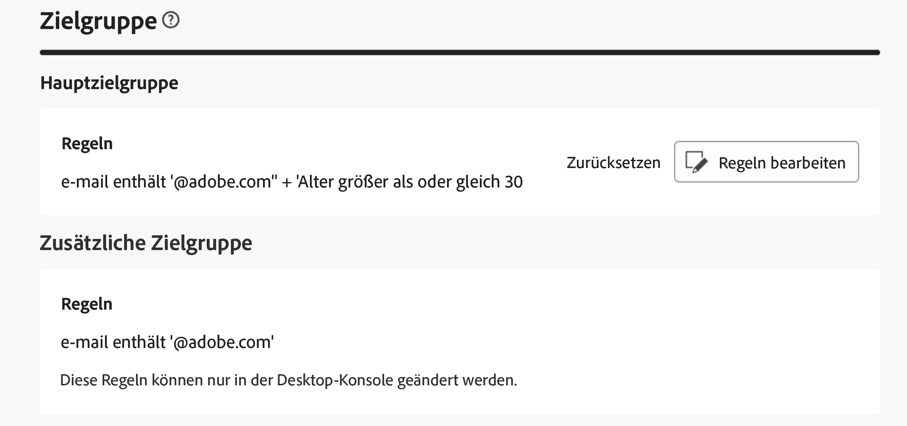
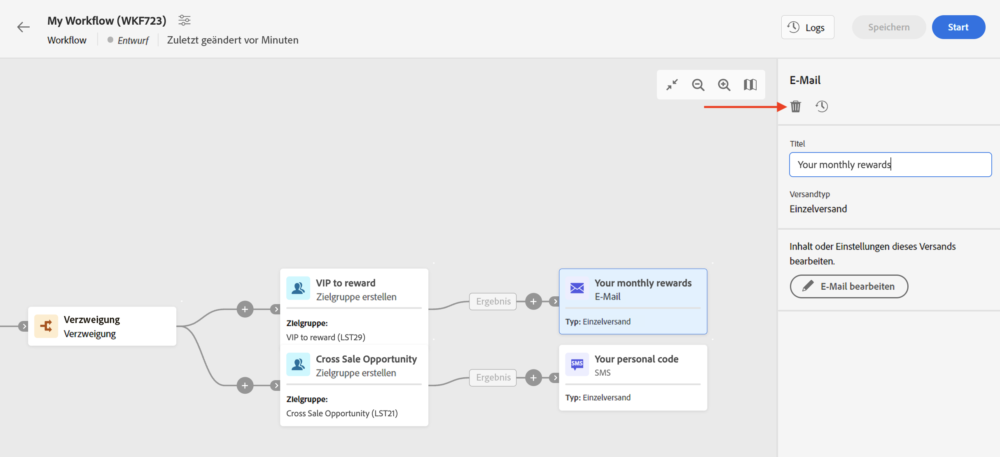

# Zugreifen auf Sendungen {#work-with-deliveries}

>[!CONTEXTUALHELP]
>id="acw_deliveries_list"
>title="Sendungen"
>abstract="Ein Versand ist eine Kommunikation, die an eine Zielgruppe über einen bestimmten Kanal gesendet wird: E-Mail, SMS oder Push-Benachrichtigung. Auf diesem Bildschirm können vorhandene Sendungen bearbeitet, dupliziert und gelöscht werden. Außerdem können Berichte zu abgeschlossenen Sendungen angezeigt werden. Auf die Schaltfläche **Versand erstellen** klicken, um einen neuen Versand hinzuzufügen."

## Zugreifen auf Sendungen {#access}

>[!CONTEXTUALHELP]
>id="acw_deliveries_additional_target"
>title="Zusätzliche Zielgruppe"
>abstract="Diese Regeln können nur in der Client-Konsole geändert werden."

Auf Sendungen kann über das Menü **[!UICONTROL Sendungen]** im linken Navigationsbereich zugegriffen werden. In dieser Liste werden alle Sendungen angezeigt, die entweder über die Client-Konsole oder über die Web-Benutzeroberfläche erstellt wurden. Auf diesem Bildschirm können Sie alle bestehenden Sendungen überwachen, sie duplizieren oder löschen oder neue Sendungen erstellen.

Um einen Versand zu öffnen, klicken Sie in der Liste auf dessen Namen. Der Versand wird geöffnet und Sie können verschiedene Aktionen durchführen, z. B. die Parameter bearbeiten, die Ausführung überprüfen oder die Leistung mithilfe dedizierter Berichte überwachen.

>[!NOTE]
>
>Wenn Sie einen in der Client-Konsole erstellten Versand öffnen, wird möglicherweise der Abschnitt **[!UICONTROL Zusätzliche Zielgruppe]** für die Zielgruppe angezeigt. Dies bedeutet, dass für diesen Versand mehrere Zielgruppen konfiguriert wurden. Diese Parameter können nur in der Konsole geändert werden.
>
>{zoomable="yes"}

## Duplizieren eines Versands {#delivery-duplicate}

Sie können eine Kopie eines bestehenden Versands entweder in der Versandliste oder im Versand-Dashboard erstellen.

Um einen Versand aus der Liste der Sendungen zu duplizieren, gehen Sie wie folgt vor:

1. Klicken Sie auf die Schaltfläche mit den drei Punkten rechts neben dem Namen des zu duplizierenden Versands.
1. Wählen Sie **[!UICONTROL Duplizieren]** aus.
1. Nachdem Sie die Duplizierung bestätigt haben, wird das Dashboard des neuen Versands im mittleren Bereich des Bildschirms geöffnet.

Gehen Sie wie folgt vor, um einen Versand über sein Dashboard zu duplizieren:

1. Öffnen Sie den Versand und klicken Sie auf die Schaltfläche **[!UICONTROL Mehr…]** im oberen Bereich des Bildschirms.
1. Wählen Sie **[!UICONTROL Duplizieren]** aus.
1. Nachdem Sie die Duplizierung bestätigt haben, ersetzt der neue Versand den aktuellen Versand im mittleren Bereich des Bildschirms.

## Löschen eines Versands {#delivery-delete}

Sendungen werden aus der Versandliste gelöscht: entweder aus dem Haupteintrag des Versands in der linken Leiste oder aus der Versandliste einer Kampagne.

Gehen Sie wie folgt vor, um einen Versand aus der Liste der Sendungen zu löschen:

1. Klicken Sie auf die Schaltfläche mit den drei Punkten rechts neben dem Namen des zu duplizierenden Versands.
1. Wählen Sie  **[!UICONTROL Löschen]**.
1. Bestätigen Sie den Löschvorgang.

Alle Sendungen sind in diesen Listen verfügbar, Sendungen, die in einem Workflow erstellt wurden, können dort jedoch nicht gelöscht werden. Um einen im Rahmen eines Workflows erstellten Versand zu löschen, ist die Löschung der Versandaktivität aus dem Workflow erforderlich.

Gehen Sie wie folgt vor, um einen Versand aus einem Workflow zu löschen:

1. Wählen Sie die Versandaktivität aus.
1. Klicken Sie auf das Symbol **[!UICONTROL Löschen]** im rechten Panel.
1. Bestätigen Sie den Löschvorgang. Wenn der Versand untergeordnete Knoten hat, haben Sie die Wahl, diese ebenfalls zu löschen oder sie beizubehalten.

