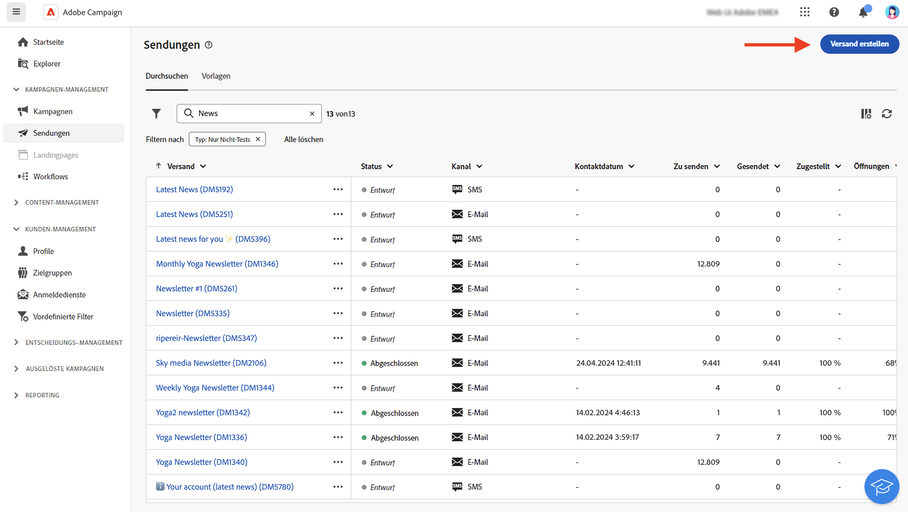
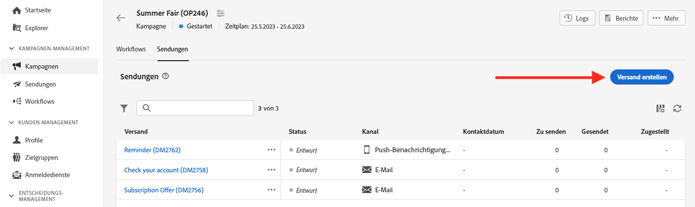
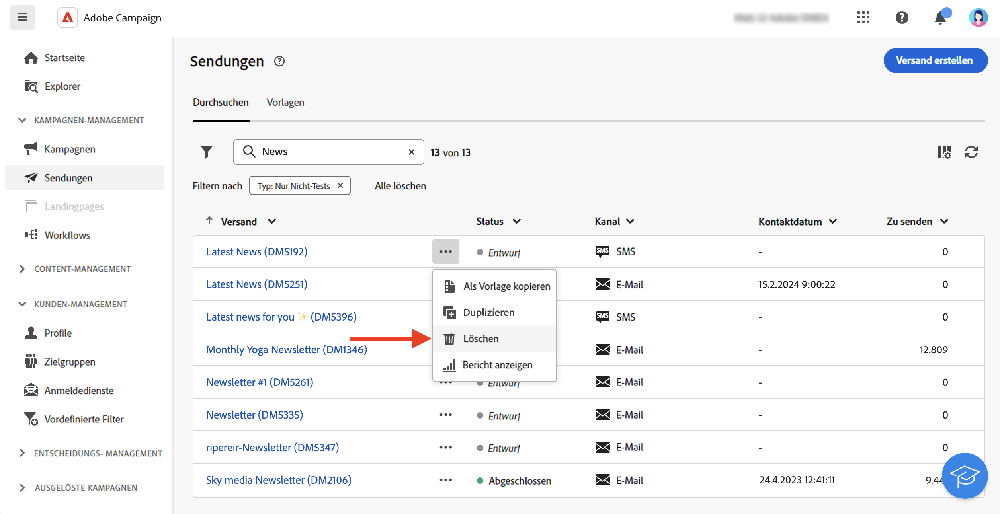
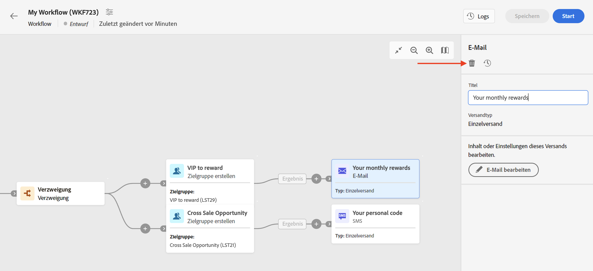

# Erste Schritte mit Nachrichten{#gs-messages}

>[!CONTEXTUALHELP]
>id="acw_deliveries_list"
>title="Sendungen"
>abstract="Ein Versand ist eine Marketing-Kommunikation, die an eine Audience über einen bestimmten Kanal gesendet wird: E-Mail, SMS oder Push-Benachrichtigung. In Ihrer Versandliste können Sie vorhandene Sendungen bearbeiten und ihren Status, ihr Kontakt- und Änderungsdatum sowie ihre KPIs überprüfen. Klicken Sie auf die Schaltfläche „Versand erstellen“, um einen neuen Versand hinzuzufügen. Wählen Sie einen Versand aus, um dessen Inhalt, Zeitplan, Zielgruppe und Details anzuzeigen."

Mit Adobe Campaign können Sie Cross-Channel-Kampagnen einschließlich E-Mails, SMS und Push-Benachrichtigungen senden und deren Effektivität mithilfe verschiedener dedizierter Berichte messen.

Diese Nachrichten werden mittels Sendungen entworfen und gesendet und können für jede Empfängerin und jeden Empfänger personalisiert werden. Diese Sendungen können einzeln oder im Rahmen einer Marketing-Kampagne durchgeführt werden.

Adobe Campaign v8 enthält die folgenden Versandkanäle: E-Mail, SMS und Mobile Apps.

<table style="table-layout:fixed">
    <tr style="border: 0;">
    <td>
    
    
<a href="../email/create-email.md"><strong>Erstellen von E-Mails</strong>
    

    

    </td>
    <td>
    
    

    <a href="../push/gs-push.md"><strong>Erstellen von Push-Benachrichtigungen</strong></a>
    

    

    </td>
    <td>
    
    

    <a href="../sms/create-sms.md"><strong>Erstellen von SMS-Nachrichten</strong></a>
    

    

    </td>
    </tr>
    </table>

## Erstellen eines Versands {#create-delivery}

Sie können eigenständige Sendungen über das linke Menü **[!UICONTROL Sendungen]** erstellen oder Sendungen im Kontext einer Marketing-Kampagne über das linke Menü **[!UICONTROL Kampagnen]** erstellen.

Auf den folgenden Registerkarten erfahren Sie, wie Sie einen Versand erstellen:

>[!BEGINTABS]

>[!TAB Erstellen eines eigenständigen Versands]

Gehen Sie wie folgt vor, um einen eigenständigen Versand zu erstellen:

1. Navigieren Sie zum Menü **[!UICONTROL Sendungen]** im linken Navigationsmenü und klicken Sie auf die Schaltfläche **[!UICONTROL Versand erstellen]**.

   

1. Wählen Sie einen Kanal für den Versand aus. Weitere Informationen zu Versandkanälen und zum Definieren von Versandinhalten finden Sie in den folgenden Abschnitten:

   * [E-Mail-Kanal](../email/create-email.md)
   * [Push-Benachrichtigungs-Kanal](../push/gs-push.md)
   * [SMS-Kanal](../sms/create-sms.md)

1. Definieren Sie die Versandzielgruppe sowohl für die Hauptzielgruppe als auch für die Kontrollgruppe. Weitere Informationen zu Zielgruppen finden Sie in [diesem Abschnitt](../audience/about-audiences.md).
1. Definieren des Nachrichteninhalts.
1. (optional) Versand definieren [Zeitplan](#gs-schedule). Wenn kein Zeitplan definiert ist, werden Nachrichten sofort nach dem Klicken auf die Schaltfläche **[!UICONTROL Senden]** gesendet.
1. Klicken Sie auf die Schaltfläche **[!UICONTROL Überprüfen und senden]**, um Ihre Einstellungen zu überprüfen.
1. Verwenden Sie die Schaltfläche **[!UICONTROL Inhalt simulieren]**, um Ihren Versand und die Personalisierungseinstellungen zu testen. Weitere Informationen zur Simulation von Nachrichten finden Sie in [diesem Abschnitt](../preview-test/preview-test.md).
1. Klicken Sie auf die Schaltfläche **[!UICONTROL Vorbereiten]**, um die Zielgruppen-Population zu berechnen und die Nachrichten zu erstellen. Der Vorbereitungsschritt kann einige Minuten dauern. Nach Abschluss der Vorbereitung sind die Nachrichten versandbereit. Im Falle eines Fehlers können Sie zu den **Protokollen** navigieren, um Benachrichtigungen und Warnungen einzusehen.
1. Überprüfen Sie die Ergebnisse und klicken Sie auf die Schaltfläche **[!UICONTROL Senden]**, um mit dem Senden von Nachrichten zu beginnen.
1. Sobald Nachrichten gesendet wurden, gehen Sie zum Abschnitt **Berichte**, um auf Schlüsselmetriken zuzugreifen. Weitere Informationen zu Versandberichten finden Sie in [diesem Abschnitt](../reporting/delivery-reports.md).

>[!TAB Erstellen eines Versands in einer Kampagne]

Gehen Sie wie folgt vor, um einen Versand in einer Kampagne zu erstellen:

1. Erstellen Sie eine neue Kampagne oder öffnen Sie eine vorhandene Kampagne. Erfahren Sie mehr über [Marketing-Kampagnen](../campaigns/gs-campaigns.md).
1. Erstellen Sie einen Workflow oder öffnen Sie einen vorhandenen Workflow.
1. Fügen Sie die Aktivität **[!UICONTROL Zielgruppe aufbauen]** hinzu, konfigurieren Sie sie und klicken Sie auf die Schaltfläche `+`.

   

   Die Aktivität **[!UICONTROL Zielgruppe aufbauen]** wird in [diesem Abschnitt](../workflows/activities/build-audience.md) detailliert beschrieben.

1. Wählen Sie eine Versandaktivität aus: **[!UICONTROL E-Mail]**, **[!UICONTROL SMS]**, **[!UICONTROL Push-Benachrichtigung (Android)]** oder **[!UICONTROL Push-Benachrichtigung (iOS)]**. Erfahren Sie in [diesem Abschnitt](../workflows/activities/about-activities.md#channel) mehr über die Versandkanalaktivitäten in einem Workflow und darüber, wie Sie Versandinhalte definieren.
1. Starten Sie den Workflow und überprüfen Sie die Protokolle.

Sie können Sendungen auch in einer Kampagne hinzufügen, ohne einen Workflow zu erstellen. Navigieren Sie dazu zur Registerkarte **[!UICONTROL Sendungen]** Ihrer Kampagne und klicken Sie auf die Schaltfläche **[!UICONTROL Versand erstellen]**.

Die Konfigurationsschritte ähneln den Schritten für eigenständige Sendungen.

Weiterführende Informationen zur Konfiguration einer Kampagne und zur Verwaltung von Sendungen einer Kampagne finden Sie in [diesem Abschnitt](../campaigns/gs-campaigns.md).

>[!ENDTABS]

## Hinzufügen von Personalisierung{#personalization}

Nachrichten, die von Adobe Campaign versendet werden, können auf verschiedene Weise personalisiert werden. [Weitere Informationen zu Personalisierungsfunktionen](../personalization/gs-personalization.md).

Verwenden Sie Campaign, um dynamische Inhalte zu erstellen und personalisierte Nachrichten zu versenden. Personalisierungsfunktionen können kombiniert werden, um Ihre Nachrichten zu verbessern und ein individuelles Benutzererlebnis zu schaffen.

Sie können den Nachrichteninhalt wie folgt personalisieren:

* Einfügen von dynamischen **Personalisierungsfeldern**

  Personalisierungsfelder werden für die oberste Ebene der Nachrichtenpersonalisierung verwendet. Sie können jedes in der Datenbank verfügbare Feld aus dem Personalisierungseditor auswählen. Für einen Versand können Sie jedes Feld auswählen, das sich auf die Empfängerin oder den Empfänger, die Nachricht oder den Versand bezieht. Diese Personalisierungsattribute können in die Betreffzeile oder in den Text Ihrer Nachrichten eingefügt werden. [Weitere Informationen](../personalization/personalize.md)

* Einfügen von vordefinierten **Inhaltsbausteinen**

  Campaign verfügt über eine Reihe von Gestaltungsbausteinen, die ein bestimmtes Rendering enthalten, das Sie in Ihre Sendungen einfügen können. Sie können zum Beispiel ein Logo, eine Grußbotschaft oder einen Link zur Mirror-Seite der Nachricht hinzufügen. Inhaltsbausteine sind über einen eigenen Eintrag im Personalisierungseditor verfügbar. [Weitere Informationen](../personalization/personalize.md#ootb-content-blocks)

* Erstellen **bedingter Inhalte**

  Konfigurieren Sie bedingte Inhalte, um beispielsweise eine dynamische Personalisierung basierend auf dem Empfängerprofil hinzuzufügen. Textblöcke und/oder Bilder werden eingefügt, wenn eine bestimmte Bedingung erfüllt ist. [Weitere Informationen](../personalization/conditions.md)

* Hinzufügen von **personalisierten Angeboten**

  Fügen Sie je nach Empfängerstandort, aktuellem Wetter oder letzter Bestellung personalisierte Angebote in Ihren Nachrichteninhalt ein.

## Anzeigen einer Vorschau und Testen Ihrer Sendungen

Nachdem der Nachrichteninhalt definiert wurde, können Sie eine Vorschau davon anzeigen, um das Rendering Ihrer Nachrichten zu steuern, und die Personalisierungseinstellungen mit Testprofilen überprüfen. [Weitere Informationen](../preview-test/preview-test.md)

## Planen des Versandzeitpunkts {#gs-schedule}

>[!CONTEXTUALHELP]
>id="acw_deliveries_email_schedule"
>title="Terminieren des Versands"
>abstract="Definieren Sie das Datum und die genaue Uhrzeit für den Nachrichtenversand. Indem Sie den günstigsten Zeitpunkt für Ihre Werbenachricht wählen, maximieren Sie die Öffnungsraten."

Sie können das Datum und die genaue Uhrzeit des Nachrichtenversands festlegen. Indem Sie den günstigsten Zeitpunkt für Ihre Werbenachricht wählen, maximieren Sie die Öffnungsraten.

Um den Versand eines Versands zu planen, öffnen Sie den Versand und navigieren Sie zum **Zeitplan** Abschnitt. Verwenden Sie die **[!UICONTROL Aktivieren der Planung]** aktivieren und das gewünschte Datum und die gewünschte Uhrzeit für den Versand festlegen. Nach dem Versand beginnt der eigentliche Versand am von Ihnen definierten Kontaktdatum.

Standardmäßig ist die Option **[!UICONTROL Bestätigung vor dem Senden aktivieren]** aktiviert. Für diese Option müssen Sie den Versand bestätigen, bevor der Versand zum geplanten Zeitpunkt durchgeführt wird. Wenn Sie den Versand am geplanten Datum und zur geplanten Uhrzeit automatisch durchführen müssen, können Sie diese Option deaktivieren.

Erfahren Sie, wie Sie einen geplanten Versand in [diesem Abschnitt](../monitor/prepare-send.md#schedule-the-send).

## Überwachung und Trackinglogs {#gs-tracking-logs}

Die Überwachung Ihrer Sendungen nach deren Versand ist ein wichtiger Schritt, um sicherzustellen, dass Ihre Marketing-Kampagnen effizient sind und Ihre Kundschaft auch erreichen.

Sie können nach dem Versand überwachen sowie nachvollziehen, wie Zustellungsfehler und Quarantänen gehandhabt werden.

Weitere Informationen zu den Überwachungs- und Tracking-Funktionen finden Sie in [diesem Abschnitt](../reporting/gs-reports.md).

## Duplizieren eines Versands {#delivery-duplicate}

Sie können eine Kopie eines bestehenden Versands entweder in der Versandliste oder im Versand-Dashboard erstellen.

Um einen Versand aus der Liste der Sendungen zu duplizieren, gehen Sie wie folgt vor:

1. Klicken Sie auf die Schaltfläche mit den drei Punkten rechts neben dem Namen des zu duplizierenden Versands.
1. Wählen Sie **[!UICONTROL Duplizieren]** aus.
1. Nachdem Sie die Duplizierung bestätigt haben, wird das Dashboard des neuen Versands im mittleren Bereich des Bildschirms geöffnet.

Gehen Sie wie folgt vor, um einen Versand über sein Dashboard zu duplizieren:

1. Öffnen Sie den Versand und klicken Sie auf die Schaltfläche **[!UICONTROL Mehr…]** im oberen Bereich des Bildschirms.
1. Wählen Sie **[!UICONTROL Duplizieren]** aus.
1. Nachdem Sie die Duplizierung bestätigt haben, ersetzt der neue Versand den aktuellen Versand im mittleren Bereich des Bildschirms.

## Löschen eines Versands {#delivery-delete}

Sendungen werden aus der Versandliste gelöscht: entweder aus dem Haupteintrag des Versands in der linken Leiste oder aus der Versandliste einer Kampagne.

Gehen Sie wie folgt vor, um einen Versand aus der Liste der Sendungen zu löschen:

1. Klicken Sie auf die Schaltfläche mit den drei Punkten rechts neben dem Namen des zu duplizierenden Versands.
1. Wählen Sie  **[!UICONTROL Löschen]**.
1. Bestätigen Sie den Löschvorgang.

Alle Sendungen sind in diesen Listen verfügbar, Sendungen, die in einem Workflow erstellt wurden, können dort jedoch nicht gelöscht werden. Um einen im Rahmen eines Workflows erstellten Versand zu löschen, ist die Löschung der Versandaktivität aus dem Workflow erforderlich.

Gehen Sie wie folgt vor, um einen Versand aus einem Workflow zu löschen:

1. Wählen Sie die Versandaktivität aus.
1. Klicken Sie auf das Symbol **[!UICONTROL Löschen]** im rechten Panel.
1. Bestätigen Sie den Löschvorgang. Wenn der Versand untergeordnete Knoten hat, haben Sie die Wahl, diese ebenfalls zu löschen oder sie beizubehalten.

